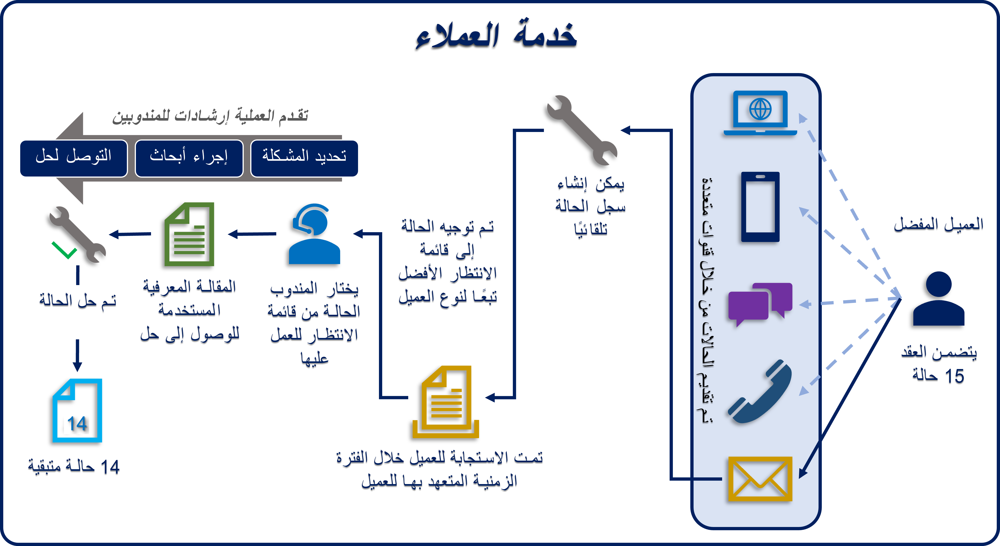

Microsoft Dynamics 365 for Customer Service يُقدّم مجموعة واسعة من الميزات المتعلقة بإدارة الحالة، لمساعدة المؤسسات في خدمة عملائها بعدة طرق، وذلك اعتماداً على احتياجات العملاء، ونموذج خدمة المؤسسة، وعوامل أخرى.

بدايةً، دعنا نفحص الحالات بمزيد من التفصيل.

## ما تعريف الحالة؟

تُمثل الحالة عادةً موقفاً أو حادثاً يقوم العميل بالإبلاغ عنه ويتطلب حلاً له. الحالات مُصممة لتتبع العملية من الاستقبال الأولي لحادث ما، مروراً بعملية الإصلاح، حتى الوصول إلى الحل النهائي. من وجهة نظر خدمة العملاء، يمكن تُمثّيل الحالة من عدة عناصر. فيما يلي بعض الأمثلة الشائعة:

- **أسئلة:** قد يكون لدى العميل سؤال محدد حول منتج أو خدمة. على سبيل المثال، يتصل أحد العملاء بمندوب دعم لطلب معلومات حول سياسة تأمين المؤسسة، مثل المبالغ المخصومة أو الفوائد.
- **الطلبات:** قد يكون لدى العميل طلب محدد، مثل حاجته لمزيد من المعلومات أو نوع من الإجراءات. على سبيل المثال، يتصل أحد العملاء بمؤسسة ما ليطلب قُدوم شخص ما لفحص الممتلكات.
- **مشكلة:** قد يواجه العميل مشكلة ضرورية الإصلاح، مثل مطالبة الضمان أو نزاع بشأن الفواتير أو عيب في أحد المنتجات. على سبيل المثال، يتصل أحد العملاء بمركز دعم بسبب خطأ في فاتورة خطة بيانات الجوال الخاصة به.

تتضمن خدمة العملاء على العديد من المكونات التي تعمل معاً لتوفير حل شامل لإدارة الحالات والذي لا يساعد فقط في تحديد الحالات ولكن أيضاً يوجه كل حالة إلى المندوب الأنسب الذي يمكنه تقديم التوجيه وحل الحالة. فيما يلي بعض المكونات الأكثر استخداماً:

- **الحالات:** تُمثل الحالة حادثة خدمة واحدة. بمعنى آخر، إنه يُمثل أي شيء، في سياق تفاعل العميل، يتطلب نوعاً من الدقة أو الإجابة. يمكن ربط حالات متعددة بعميل واحد في أي وقت.
- **الأنشطة:** يُمثل النشاط عادةً تفاعلاً مع عميل، مثل مكالمة هاتفية. قد ترتبط الحالة الواحدة بعدة أنشطة.
- **الاستحقاقات:** تحدد الاستحقاقات مقدار خدمات الدعم التي يحق للعميل الحصول عليها. انظر إليهم كعقود دعم.
- **مقالات معرفية:** قاعدة المعارف هي مستودع للمقالات المعلوماتية التي تساعد ممثلي خدمة العملاء في حل الحالات.
- **صفوف الانتظار:** صف الانتظار هو مكان لتنظيم وتخزين الأنشطة والحالات التي تنتظر المعالجة.
- **SLAs:** SLAs هي طريقة لتتبع وتحديد ما يجب أن يحدث عند فتح حالة، مثل الوقت الذي يجب أن يستغرقه الرد على العميل.
- **قواعد إنشاء السجلات وتحديثها:** يمكن تطبيق قواعد إنشاء السجل وتحديثه على أنواع أنشطة مختلفة لإنشاء سجلات Dynamics 365 تلقائياً.
- **قواعد التحويل:** يتم تطبيق قواعد التحويل لتوجيه الحالات تلقائياً إلى صف انتظار أو مستخدم معين.
- **سير إجراءات العمل:** يمثل سير إجراءات العمل عملية إرشادية لها مراحل وخطوات مختلفة يتم استخدامها لحل عنصر معين، مثل حالة.

لنلقِ نظرة على مثال يُوضح كيف تعمل كل هذه المكونات معاً لتوفير حل شامل.

في هذا المثال، العميل هو عميل ذهبي. يُحدد سجل الاستحقاق المرتبط بهذا العميل الذهبي أنه يحق له فتح 15 حالة مع المؤسسة.

- يمكن للعميل فتح هذه الحالات من عدة قنوات، منها الهاتف أو تطبيق الهاتف أو الوسائط الاجتماعية أو البريد الإلكتروني. (في هذا المثال، أرسل العميل بريداً إلكترونياً.)
- بعد استلام البريد الإلكتروني الخاص بالعميل، تُحدد قواعد إنشاء السجلات من أرسل البريد الإلكتروني ومحتواه. تُستخدم هذه المعلومات لإنشاء حالة جديدة في التطبيق.
- بعد إنشاء الحالة، تقوم قاعدة التحويل تلقائياً بتوجيه الحالة إلى صف انتظار العملاء الذهبية. تُحدد اتفاقية مستوى الخدمة (SLA) وجوب إجراء الاتصال الأولي مع العميل في غضون 15 دقيقة.
- يأخذ مندوب الدعم الذي لديه حق الوصول إلى صف الانتظار الذهبية الحالة من صف الانتظار للعمل عليها. هذا المندوب مسؤول الآن عن حل الحالة.
- يتم استخدام مسار عملية حل الحالة لتوجيه المندوب خلال عملية الحل.
- عندما يعثر المندوب على مقالة معرفية قد توفر حلاً للحالة، ومن ثم يُرسل المقالة بالبريد الإلكتروني إلى العميل، ويحل الحالة.
- يتم تحديث سجل استحقاق العميل ليعكس حقيقة أن 14 حالة لا تزال قيد استحقاق العميل.

خلال الجزء المتبقي من هذه الوحدة النمطية، سنفحص بمزيد من التفصيل، كيفية التعامل مع الحالات في Dynamics 365. على سبيل المثال، ستتعلم كيفية إنشاء الحالات وإدارة عبء الحالات والعمل مع سبب الحالة الانتقالية. ستتعرف أيضاً على سيناريوهات إنشاء الحالة تلقائياً.
