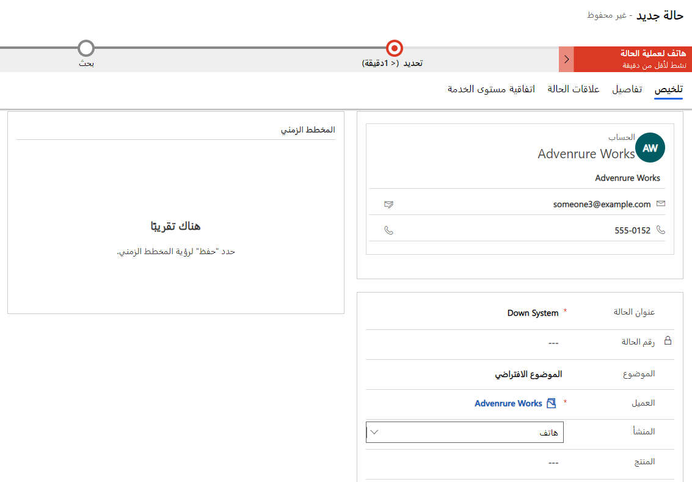
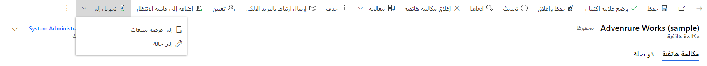
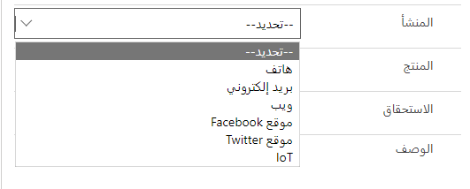

يمكن إنشاء الحالات بطرق متعددة في Microsoft Dynamics 365، لاستيعاب السيناريوهات المختلفة التي قد تتلقى مؤسستك حالات منها. على سبيل المثال، يمكن إنشاء الحالات تلقائياً، استناداً إلى التفاعل على وسائل التواصل الاجتماعي، أو يمكن للمندوبين إنشاؤها يدوياً في أثناء استقبالهم مكالمة من شخص ما. ويمكن حتى أن يتم إنشاؤها من خلال مدخل الخدمة الذاتية. عند تنفيذ استراتيجية إدارة الحالات، من المهم مراعاة كافة السيناريوهات التي قد تدعمها مؤسستك.

في Dynamics 365، يمكن استخدام الحالات وإدخالها في النظام بعدة طرق، اعتماداً على الاحتياجات المحددة للمؤسسة (على سبيل المثال، من خلال مدخل الخدمة الذاتية). وفي معظم الأحيان، رغم أن الحالات التي يتم إنشاؤها يدوياً أو عن طريق تحويل نشاط.

## إنشاء حالة يدوية

في كثير من الحالات، يجب إدخال الحالات يدوياً بواسطة مندوب خدمة. عندما يقوم المندوب بإدخال الحالة، يستخدم المعلومات ذات الصلة، مثل العميل ونقطة الاتصال والمشكلة وما إلى ذلك. هناك طريقتان أساسيتان لإنشاء الحالات بطريقة يدوية. 

### صفحة الحالة

صفحة **الحالة** هي الطريقة الأكثر استخداماً لإدخال الحالة في Dynamics 365. عند إدخال حالة، يحدد المندوب الذي يقوم بإدخالها تفاصيل حول الحالة، مثل عنوان الحالة والعميل وأصل الحالة وما إلى ذلك.

تحتوي صفحة **الحالة** على كافة الحقول المتوفرة للحالة وتوفر وصولاً سريعاً إلى السجلات ذات الصلة، مثل المقالات المعرفية. كما توفر صفحة **الحالة** وصولاً إلى سير إجراءات العمل النشطة التي تستخدمها الحالة. لا تتوفر العديد من العناصر (المخطط الزمني مثلاً) والوصول إلى السجلات ذات الصلة حتى يتم حفظ الحالة للمرة الأولى.

> [!NOTE]
> يلزم توفير حقلي عنوان الحالة والعميل، ويجب تعبئتهما قبل حفظ سجل الحالة.

### إنشاء سريع: مربع حوار الحالة

مربع حوار **إنشاء سريع: حالة** هو إصدار مقتطع من صفحة **الحالة**. يحتوي فقط على أهم الحقول لكيان الحالة. يتم استخدام مربع الحوار هذا لإدخال معلومات الحالة بسرعة لتوفير الوقت. يمكنك أيضاً استخدام مربع الحوار هذا عند إنشاء حالة في سياق سجل آخر. على سبيل المثال، إذا قمت بإضافة حالة مباشرة من حساب في Dynamics 365، فستستخدم مربع الحوار **إنشاء سريع: حالة**.

يمكن الوصول إلى مربعات الحوار **إنشاء سريع** من شريط التنقل العلوي في التطبيق أو من اللوحة ذات الصلة أو شبكة فرعية مرفقة في سجل أصلي. رغم أن مربع حوار **إنشاء سريع** غير متوفر افتراضياً لكل كيان، إلا أنه متوفر لكيان الحالة. لذلك، عند إضافة حالة من سجل ذي صلة، يمكنك استخدام مربع حوار **إنشاء سريع: حالة**.

## تحويل سجلات الأنشطة إلى حالات

في بعض الأحيان، قد تكون الحالة نتيجة لنشاط مثل رسالة بريد إلكتروني أو مكالمة هاتفية أو مهمة. على سبيل المثال، قد يتلقى مندوب الدعم طلب بريد إلكتروني للخدمة بطريقة مباشرة من أحد العملاء. في هذه الحالات، يمكنك تحويل الأنشطة مباشرة إلى سجلات حالات Dynamics 365. يتم استخدام قواعد إنشاء السجلات وتحديثها في Dynamics 365 لتحويل أنشطة معينة تلقائياً إلى سجلات Dynamics 365. يمكن إجراء هذا التحويل يدوياً في سجل فردي.

> [!NOTE]
> و ستغطي الوحدة الآتية الإنشاء التلقائي للحالات من سجلات الأنشطة.

بطريقة مبتكرة، يمكن تحويل الأنواع الآتية من أنشطة Dynamics 365 إلى حالات:

- المواعيد  
- الاستجابات للحملات
- رسائل البريد الإلكتروني
- الفاكسات 
- الخطابات
- المكالمات الهاتفية
- أنشطة الخدمة
- المهام
- الأنشطة الاجتماعية

أي أنشطة مخصصة تم إنشاؤها لمؤسسة يمكن أيضاً تحويلها إلى الحالات. على سبيل المثال، قد تنشئ مؤسسة نشاطاً مخصصاً يسمى *رسائل SMS* المستخدم للتعامل مع الرسائل النصية. ويمكن كذلك تحويل هذه الأنشطة إلى حالات.

من داخل نشاط معين، حدد زر **تحويل إلى** في شريط الأوامر. بعد ذلك، يمكنك تحديد ما إذا كنت تريد تحويل النشاط إلى فرصة أو حالة.

بعد تحديدك **إلى حالة**، تظهر صفحة **تحويل إلى حالة**. توفر هذه الصفحة المزيد من المعلومات وتتيح لك القيام بأشياء مثل إغلاق النشاط عند انتهائه.

## اعتبارات القناة

نظراً إلى أن العديد من الوسائل متاحة لتفاعل العملاء، توفر المؤسسات الكثير من القنوات التي يمكن للعملاء إرسال حالات دعم منها. يمكن للقناة التي يتم إرسال حالة منها التأثير في كيفية توجيه الحالة أو عقد دعم العملاء الذي تطبق الحالة عليه. نظراً إلى أن هذه المعلومات قد تكون مهمة، يتيح لك Dynamics 365 تحديد القناة المحددة التي تم تلقي حالة منها، مباشرة في سجل الحالة.

> [!NOTE]
> بطريقة مبتكرة، يتضمن Dynamics 365 قنوات *الهاتف* و *البريد الإلكتروني* و *الويب* و *Facebook* و *Twitter‎* و *IoT*. ولكن بسبب أن معظم المؤسسات لديها احتياجات مختلفة فيما يتعلق بالقنوات، من الممكن إضافة المزيد من القنوات.

> [!VIDEO https://www.microsoft.com/videoplayer/embed/RE2IQYA]

للاطلاع على المزيد حول إنشاء الحالة، راجع [إنشاء حالة](/dynamics365/customer-engagement/customer-service/user-guide-customer-service#create-and-manage-a-case)وإدارتها.
