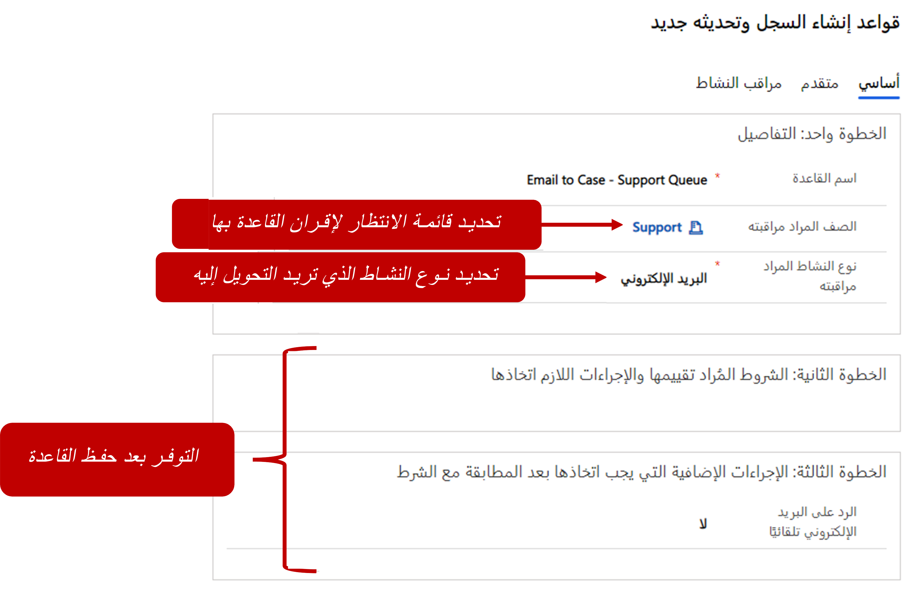

غالباً ما تفضل المؤسسات إنشاء الحالات تلقائياً في حالات محددة. على سبيل المثال، قد يكون لدى مؤسستك اسم مستعار للبريد الإلكتروني مثل `support@microsoft.com` الذي تستخدمه لطلبات الدعم. بالنسبة لأي طلبات بريد إلكتروني يتم إرسالها إلى هذا الاسم المستعار، يجب إنشاء الحالات تلقائياً في Microsoft Dynamics 365 وربطها بالعميل الذي أرسل الرسالة الإلكترونية.

توفر قواعد إنشاء السجلات وتحديثها تلقائياً في Dynamics 365 أساساً لاستهلاك المعلومات من قنوات مختلفة، وتناولها كأنشطة Dynamics 365 مثل رسائل الرسالة الإلكترونية أو الأنشطة الاجتماعية، وإنشاء سجلات Dynamics 365 المناسبة تلقائياً. تعرض الصورة التالية المفهوم الأساسي.

> [!div class="mx-imgBorder"]
> 

عند التعامل مع **مركز خدمة العملاء‬**، يمكنك الوصول إلى قواعد إنشاء السجلات وتحديثها تلقائياً من منطقة **إدارة الخدمات** في Dynamics 365. 

> [!div class="mx-imgBorder"]
> 

في منطقة **إدارة الخدمات**، حدد **إنشاء السجل التلقائي وقواعد التحديث**. عند إنشاء قاعدة، يجب تعريف نوع مصدر نشاط لها. بطريقة مبتكرة، يمكن تحويل الأنواع الآتية من أنشطة Dynamics 365 إلى حالات:

- المواعيد
- الاستجابات للحملات
- رسائل الرسالة الإلكترونية
- الفاكسات
- الخطابات
- المكالمات الهاتفية
- أنشطة الخدمة
- المهام
- الأنشطة الاجتماعية

يمكن أيضاً تحويل أي أنشطة مخصصة يتم إنشاؤها لمؤسسة باستخدام قواعد الإنشاء.

بالإضافة إلى تعريف نوع المصدر، يمكنك تعريف قائمة انتظار معينة ستراقبها القاعدة للعناصر من هذا النوع. لذلك، يمكنك تعريف قواعد متعددة لنوع مصدر واحد مثل الرسالة الإلكترونية، ولكن يمكن لكل قاعدة مراقبة قائمة انتظار مختلفة.

على الرغم من أنه يمكنك إنشاء قواعد متعددة لنوع مصدر واحد، إلا أنه من المهم تذكر أنه يمكنك الحصول على قاعدة نشطة واحدة فقط لنفس نوع المصدر وقائمة الانتظار في أي وقت.

على سبيل المثال، بالنسبة لقائمة انتظار تسمى *الدعم*، قمت بتعريف قاعدة نشطة تسمى *الرسالة الإلكترونية إلى الحالة* التي تحتوي على نوع مصدر من *رسائل الرسالة الإلكترونية*. إذا قمت بإنشاء قاعدة أخرى تسمى *‎الرسالة الإلكترونية إلى الحالة 2* التي تحتوي أيضاً على نوع مصدر من *رسائل الرسالة الإلكترونية*، سيتم تعطيل قاعدة *الرسالة الإلكترونية إلى الحالة* عند محاولة تنشيط *الرسالة الإلكترونية إلى الحالة 2*.

> [!div class="mx-imgBorder"]
> 

يحدث نفس الشيء إذا كان لديك قاعدتين غير مرتبطين بأي قائمة انتظار محددة، ولكنهما تحتويان على نفس نوع المصدر. كن على علم بهذا السلوك أثناء تصميم القواعد.

اعتماداً على نوع المصدر، يمكن تغيير شروط إضافية لتحديد متى سيتم إنشاء سجل. فيما يلي الخيارات عند تعيين نوع المصدر إلى *رسائل الرسالة الإلكترونية*:

- **إنشاء سجلات للبريد الإلكتروني من مرسلين مجهولين:** يمكن إنشاء الحالات التي تأتي من عناوين الرسالة الإلكترونية غير المرفقة بحساب أو جهة اتصال Dynamics 365 تلقائياً.
- **إنشاء حالة في حالة وجود استحقاق صالح للعميل:** يجب وجود سجل استحقاق صالح للعميل الذي أرسل الرسالة الإلكترونية. لا يتحقق هذا الشرط من تفاصيل الاستحقاق. فهو يتحقق فقط من وجود استحقاق. إذا كان لدى العميل العديد من الاستحقاقات، سيتم إنشاء سجل.
- **إنشاء حالات للأنشطة المقترنة بحالة تم حلها:** يتحقق هذا الشرط مما إذا كان الرسالة الإلكترونية مرتبطاً بحالة تم حلها مؤخراً، وما إذا كان يجب التعامل معه كحالة جديدة.
 
> [!div class="mx-imgBorder"]
> 

تمثل هذه القائمة الخيارات المتوفرة لرسائل الرسالة الإلكترونية فقط. نوصي بالتحقق من الخيارات المتاحة لأنواع الأنشطة الأخرى، مثل *الأنشطة الاجتماعية*. هناك أيضاً خيار لتحديد خصائص قناة إضافية. يمكن أن يكون هذا الخيار مفيداً عندما تريد استخراج تفاصيل إضافية من شيء مثل منشور على وسائل التواصل الاجتماعي واستخدام هذه التفاصيل لملء الحقول في السجل الذي تم إنشاؤه حديثاً.

> [!div class="mx-imgBorder"]
> 

بعد تحديد تفاصيل القاعدة، يجب حفظها قبل أن تتمكن من تحديد تفاصيل الإنشاء والتحديث. التفاصيل هي القواعد الفعلية التي يتم تقييمها وتطبيقها، استناداً إلى المعلومات الموجودة في النشاط الذي تم تلقيه. يمكن تحديد عناصر قاعدة متعددة لقاعدة واحدة.

على سبيل المثال، قد تحتوي قاعدة *الرسالة الإلكترونية إلى الحالة* على عناصر القاعدة الثلاثة التالية:

- **عنصر القاعدة 1:** تحقق مما إذا كان حساب المرسل في Dynamics 365 عميلاً ذهبياً. إذا كان الأمر كذلك، قم بإنشاء حالة خدمة ذات مستوى ذهبي للعميل الذي له أصل *الرسالة الإلكترونية*.
- **عنصر القاعدة 2:** تحقق مما إذا كان حساب المرسل في Dynamics 365 عميلاً فضياً. إذا كان الأمر كذلك، قم بإنشاء حالة خدمة ذات مستوى فضي للعميل الذي له أصل *الرسالة الإلكترونية*.
- **عنصر القاعدة 3:** إنشاء حالة لم يتم تعريف مستوى خدمة لها ويكون أصلها *الرسالة الإلكترونية*.

يتكون كل عنصر قاعدة من الشروط والإجراءات. يجب توفير اسم لعنصر القاعدة وحفظه قبل توفر الشروط والإجراءات.

## الشروط

يمكن للشروط تقييم محتويات معينة في النشاط الذي يتم تحويله إلى سجل Dynamics 365، أو في السجلات المرتبطة به. على سبيل المثال، قد يحدد الشرط أنه يجب النظر إلى سجل الحساب أو جهة الاتصال المقترن بمرسل الرسالة الإلكترونية. يمكن للشرط بعد ذلك التحقق مما إذا كان حقل مستوى الخدمة للحساب (**حقل مخصص**) قد تم تعيينه إلى *ذهبي*. توفر هذه الوظيفة مرونة أكبر، لأنه يمكن أيضاً استخدام البيانات ذات الصلة من Dynamics 365 كمعيار، بالإضافة إلى محتويات رسائل الرسالة الإلكترونية.

> [!div class="mx-imgBorder"]
> 

يمكن تحديد عناصر متعددة في شرط واحد، ويمكن تحديد عناصر الشرط كشروط AND أو OR.

## الإجراءات‬

الإجراءات لها قسمين. 

- **السجل المراد إنشاؤه**: تحديد نوع السجل الذي تريد إنشائه. يجب تعيين هذه القيمة إلى **الحالة**. سيتم إنشاء حالة إذا تم استيفاء الشروط المحددة للنشاط.  

- **تكوين في Microsoft Power Automate**: الإنشاء الفعلي لسجل الحالة قيد المعالجة بواسطة **Microsoft Power Automate**.  يفتح تطبيق **Power Automate** في علامة تبويب جديدة، حيث يمكنك تكوين المعايير التي يجب تقييمها لنشاط الرسالة الإلكترونية. لمعرفة المزيد حول استخدام **Power Automate**، راجع الوثائق الخاصة بـ [Power Automate.](/power-automate/getting-started)

  > [!div class="mx-imgBorder"]
  > 

## كيفية تطبيق عناصر القاعدة

يتم التحقق من عناصر القاعدة بالترتيب المحدد في القاعدة. بعد أن تعثر القاعدة على عنصر قاعدة مطابق، تطبق عنصر القاعدة هذا وتتوقف عن التحقق من وجود تطابقات إضافية. يمكنك التحكم في ترتيب التحقق من عناصر القاعدة. لذلك، من الأفضل وضع القواعد الأكثر تحديداً أولاً والعمل في طريقك إلى الأسفل من هناك.

> [!div class="mx-imgBorder"]
> 

بعد تنشيط قاعدة، تبدأ في تعريف الحالات لأنشطة الرسالة الإلكترونية التي يتم إرسالها إلى قائمة انتظار معينة.

لمزيد من المعلومات حول إنشاء السجل تلقائياً وتحديث القواعد، راجع [إعداد القواعد لإنشاء السجلات أو تحديثها تلقائياً](/dynamics365/customer-engagement/customer-service/set-up-rules-to-automatically-create-or-update-records).
