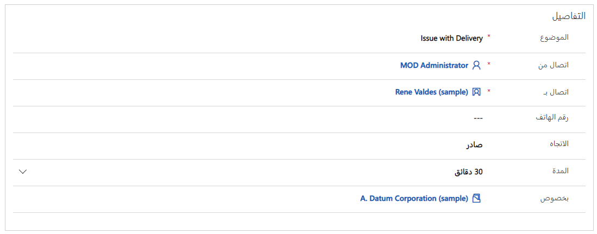
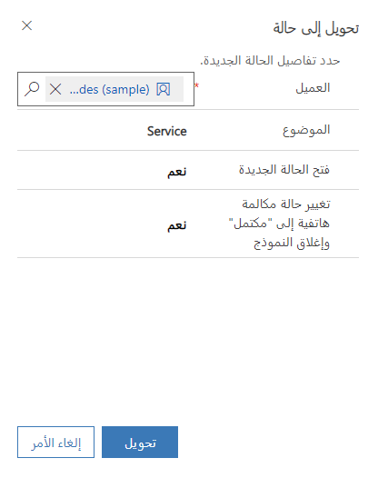

## التمرين: إنشاء الحالات وحلها

### قبل أن نبدأ:

تعمل التمارين على نحو أفضل عندما يكون لديك بعض البيانات النموذجية للعمل بها. اعتماداً على البيئة التي تعمل بها، قد ترغب في تثبيت بعض البيانات النموذجية للمساعدة في التمارين. يوفر Dynamics 365 القدرة على إضافة بيانات نموذجية حسب الحاجة. إذا لم تتوفر لدى البيئة التي تعمل بها أية بيانات نموذجية مثبتة، فاتبع الخطوات التالية لتثبيت البيانات النموذجية في بيئتك.

### تمكين البيانات النموذجية -- الخطوات التفصيلية:

1. لإضافة بيانات نموذجية، افتح Dynamics 365 Customer Service ثم انقر فوق محدّد القائمة المنسدلة الموجود إلى جانب Dynamics 365 ثم انقر فوق Dynamics 365 -- مخصص.
2. من شريط التنقل، انتقل إلى إعدادات > إدارة البيانات
3. حدد البيانات النموذجية. 
4. انقر فوق زر "تثبيت البيانات النموذجية".
5. أغلق نافذة "البيانات النموذجية".

### نظرة عامة على التمرين

يُمكّن Dynamics 365 Customer Service المؤسسة من خدمة عملائها بطرق عديدة اعتماداً على الاحتياجات المحددة للعميل، ونموذج خدمة المؤسسات والعوامل المحددة الأخرى. تُعد قدرات إدارة الحالات واحدة من السمات الرئيسية لحل خدمة العملاء.

## الأهداف التعليمية

في نهاية هذه التمارين، ستتمكن من تحقيق الأهداف التالية:

-   إنشاء سجلات حالة في Dynamics 365.
-   تحويل أنشطة Dynamics 365 إلى سجلات حالة.
-   حل سجلات الحالة.

### السيناريو

أنت تحظى بالعمل في شركة توفر الدعم لمكتب المساعدة لعملائها. اتصلت واحدة من عملائك، تُدعى Rene Valdes، مؤخراً وأبلغتك أن هناك مشكلة مع التسليم الذي تلقته مؤخراً. ولأنك ممثل خدمة العملاء (CSR)، تلقيت هذه المكالمة الهاتفية وأدركت أنه يجب تسجيلها على أنها حالة. تحتاج إلى تحويل المكالمة إلى سجل حالات Dynamics 365 ثم ستعمل من خلاله لإكمال الحالة.

### الخطوات عالية المستوى:

-   إنشاء حالة يدوياً باستخدام مركز خدمة العملاء.
-   إنشاء نشاط مكالمة هاتفية.
-   تحويل النشاط إلى حالة.
-   حل الحالة.

### الخطوات التفصيلية:

#### إنشاء نشاط مكالمة هاتفية:

1. إذا لزم الأمر، في شريط تنقل التطبيق الرئيسي، انقر فوق محدد القائمة المنسدلة بجانب Dynamics 365، ثم انقر فوق مركز خدمة العملاء.
2. انقر فوق رمز "الخريطة"، أسفل عنوان "عملي"، وحدد الأنشطة.
3. في شريط الأوامر، انقر فوق زر "مكالمة هاتفية". 
4. يُمكنك إنشاء "مكالمة هاتفية" على النحو التالي:
- الموضوع: مشكلة في التسليم
- اتصال من: "اسم المستخدم الخاص بك"
- الاتصال بـ: Rene Valdes (إذا كان لديك مجموعة بيانات مختلفة، اختر جهة اتصال موجودة في قائمتك)
- الاتجاه: صادر
- بخصوص: A. Datum Corporation

5. يجب أن تكون مكالمتك الهاتفية الجديدة مثل الصورة أدناه:

6. انقر فوق زر "حفظ" لحفظ المكالمة الهاتفية وتركها مفتوحة.

#### تحويل نشاط المكالمة الهاتفية إلى حالة:

1. في شريط الأوامر، انقر فوق زر "التحويل إلى".
2. من القائمة التي تظهر، حدد الخيار "إلى الحالة". 
3. في نافذة "التحويل إلى حالة"، حدد الخيارات التالية:
- العميل: A. Datum Corporation
- الموضوع: تقديم \> الخدمات
- فتح الحالة الجديدة: نعم
- تغيير حالة المهمة إلى مكتمل وإغلاق النموذج: نعم

4. انقر فوق "تحويل". 
5. حدد مرحلة "التعريف" في الهاتف إلى "معالجة الحالة"، ثم تعيين جهة الاتصال إلى Rene Valdes.

#### حل الحالة:

1.  في شريط أوامر نماذج الحالات، انقر فوق زر "حل الحالة".
2.  في مربع حوار "حل الحالة"، حدد المعلومات المتوفرة لنوع الحل.
3.  في مربع "الدقة"، اكتب العميل المطلوب مراسلته عبر البريد الإلكتروني.
4.  في القائمة المنسدلة "وقت الفوترة"، حدد 15 دقيقة ثم انقر فوق "حل".

#### إعادة تنشيط الحالة وتعديلها وحلها.

1.  انقر فوق رمز "المفتاح" في خريطة الموقع، للانتقال إلى الحالات.
2.  انقر فوق سهم القائمة المنسدلة بجوار "الحالات النشطة". حدد طريقة عرض "الحالات التي تم حلها".
3.   من طريقة عرض "الحالات التي تم حلها"، حدد المشكلة في حالة "التسليم" التي نجحت في حلها للتو.
4.  في "شريط قوائم الحالات"، انقر فوق إعادة تنشيط حالة.
5.  في القسم "ذو صلة"، حدّد رمز Knowledge Base Search.
6. حدد "مقالة" من اقتراحات المقالات وانقر فوق رمز "الرابط".

7. في مرحلة "البحث" في حقل "الحالات المشابهة"، انقر فوق بحث.
8. في حقل من الهاتف إلى معالجة الحالة، انقر فوق "المرحلة التالية" إلى أن تصبح في مرحلة "الحل".
9. في مرحلة "الحل"، انقر فوق "إنهاء".
10. في شريط أوامر نماذج الحالات، انقر فوق زر "حل الحالة".
11. في نافذة "إيجاد حل للحالة"، داخل حقل "الحل"، اكتب "التحدث إلى العميل" وأرسل جزءاً جديداً.
12. في "وقت الفوترة"، اكتب "ساعة واحدة".
13. انقر فوق "حل" لحل الحالة.
