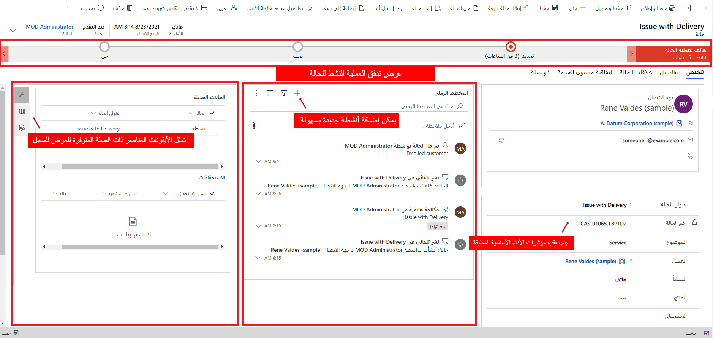

عندما يعمل المندوبون على حل مشاكل العملاء، من المهم أن يكون لديهم جميع الأدوات اللازمة لحل المشكلة من موقع واحد.  يؤثر عدم وجود هذه المعلومات بشكل كبير على كفاءة المندوب بصفة عامة. ويمكن أن يكون ذلك محبطاً للعميل الذي يتعين عليه الانتظار بينما يتنقل المندوب من مكان إلى آخر للحصول على ما يحتاج إليه.  أكثر الطرق فاعلية لضمان توفّر الأدوات اللازمة للمندوبين هو تزويدهم بما يحتاجون إليه من الحالة التي يعملون عليها مباشرةً.    

قد يتضمن ذلك تزويد المندوب بإمكانية الوصول إلى ما يلي:
- قائمة بالمهام التي يجب إنجازها قبل أن تتوفر إمكانية حل المشكلة المرتبطة بالحالة.
- الوصول إلى قاعدة معارف المؤسسات للمساعدة في حل المشكلة.
- سجلّ سياقي كامل لما تم إنجازه في هذه الحالة.
    
الوصول إلى مشاكل مشابهة أخرى يمكن استخدامها للمساعدة في عملية الحل.  

من داخل نموذج الحالة، يمكنهم الاطلاع على معلومات عامة حول الحالة، مثل عنوان الحالة والعميل وتفاصيل SLA ذات الصلة وأنشطة الحالة ذات الصلة وغيرها من البيانات ذات الصلة.  تشمل بعض المعلومات الرئيسية التي يمكن أن يستخدمها المندوبون في عملهم ما يلي: 

- **الجدول الزمني**: عرض أنشطة الحالة ذات الصلة.  استناداً إلى أحد نماذج خدمة المؤسسات، يقوم عدد كبير من المؤسسات بتعقب إجمالي الوقت الذي يقضيه المندوبون في العمل على أنشطة مقترنة بالحالة لتحديد مقدار الوقت الذي ستتم إضافته إلى فاتورة العميل.  
    - على سبيل المثال، إذا أجرى أحد المندوبين ثلاث مكالمات هاتفية، وامتدت كلٌ منها لفترة 15 دقيقة، فقد يتم إنشاء فاتورة للعميل بإجمالي 45 دقيقة. 

- **ذو صلة**: يعرض القسم "ذو صلة" المعلومات ذات الصلة التي قد تكون مرتبطة بالحالة (مثل مقالة معرفية) أو مرتبطة بالعميل الذي تقترن به الحالة (مثل عقود الدعم ذات الصلة أو حالات ذات صلة).  
    -   تُعرض أيقونة مقابلة لكل نوع من العناصر ذات الصلة في اللوحة ذات الصلة لتسهيل عملية التبديل بين العناصر ذات الصلة.  

- **عمليات سير إجراءات العمل**: تمثّل العمليات الموجهة المستخدمة لتوجيه مندوبي الخدمة إلى حل كامل للمشكلة المرتبطة بالحالة.  
    - قد يكون لدى كيان الحالة عمليات متعددة للأعمال متاحة ويمكن التبديل إليها اعتماداً على تفاصيل معيّنة في الحالة، مثل نوع الحالة أو أصلها أو غير ذلك من العوامل المرتبطة بالأعمال.

> [!div class="mx-imgBorder"]
> 

 
