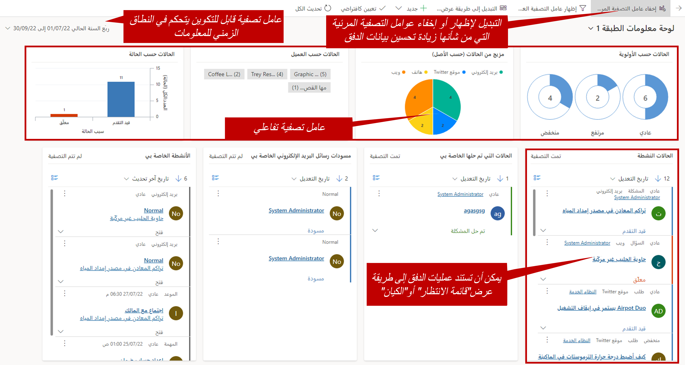
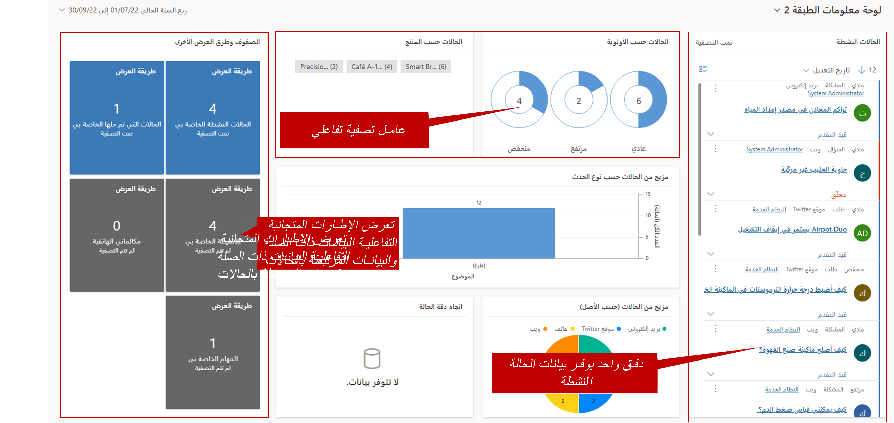
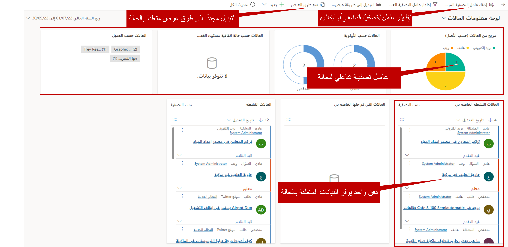

تم تصميم تطبيق مركز خدمة العملاء في Microsoft Dynamics 365باستخدام واجهة Dynamics 365 الموحدة. لا يسهّل مركز خدمة العملاء على ممثلي خدمة العملاء العمل مع حالاتهم وإدارتها في التطبيق فحسب، بل يساعد أيضاً في ضمان حصول جميع الممثلين على تجربة المستخدم نفسها، بغض النظر عن النظام الأساسي الذي يستخدمونه: الهاتف، الجهاز اللوحي، أو الكمبيوتر الشخصي.

يوفر مركز خدمة العملاء إمكانية الوصول إلى سلسلة من لوحات المعلومات التفاعلية المصممة لتسهيل التعرّف على عدد الحالات، بالإضافة إلى الوصول إلى الكيانات المحددة المستخدمة لإدارة أنشطة خدمة العملاء.  ويمكن للمندوبين الوصول إليها من شريط تنقل التطبيق الرئيسي أو عن طريق الانتقال إلى الشاشة الرئيسية للتطبيقات.  

تُسهّل لوحات المعلومات على المستخدمين استهلاك البيانات والعمل معها.  على سبيل المثال، قد يحتاج مندوب دعم إلى الوصول إلى الحالات في قوائم انتظار متعددة مثل قوائم انتظار الدعم الذهبية والفضية.  يحتاج المندوب نفسه أيضاً إلى الاطلاع على الحالات المخصصة له والأنشطة التي يحتاج إلى إكمالها. هذه أربعة مجالات مختلفة من التطبيق قد يحتاجون إلى الانتقال إليها.  ومع ذلك، باستخدام لوحة معلومات واحدة، يمكن للمندوب رؤية البيانات والتفاعل معها بسهولة من جميع هذه المواقع الأربعة دون الحاجة إلى مغادرة الشاشة.   

عند تشغيل مركز خدمة العملاء لأول مرة، سيرى المندوبون سلسلة من لوحات المعلومات.  العديد من لوحات المعلومات هذه هي نفسها التي كانت متاحة بشكل تقليدي في Dynamics 365.  بالإضافة إلى ذلك، سيتمكن المندوبون من العمل مع لوحات المعلومات التفاعلية الفريدة لمركز خدمة العملاء.  
يتوفر نوعان من لوحات المعلومات التفاعلية:

- لوحات المعلومات متعددة الدفق
- لوحات المعلومات أحادية الدفق

**لوحات المعلومات متعددة الدفق** تعرض لوحة المعلومات متعددة الدفق البيانات في الوقت الحقيقي عبر العديد من عمليات دفق البيانات. تستند البيانات الموجودة في دفق ما إلى طريقة العرض لكيان ما أو قائمة انتظار، مثل الأنشطة الخاصة بي أو الحالات الخاصة بي أو الحالات في قائمة انتظار الأعمال المصرفية. وبينما يحتوي الدفق دائماً على معلومات حول كيان واحد فقط، فإن كل دفق على لوحة المعلومات قد يحتوي على معلومات حول كيان مختلف.  

على سبيل المثال، قد ترغب في تعقب كل من الحالات والحسابات في موقع مركزي.  نظراً لأن الدفق يمكن أن يحتوي فقط على بيانات من كيان واحد، فلا يمكنك تعقب كليهما في دفق واحد.  ومع ذلك، يمكنك تعقب الحالات في دفق واحد والحسابات في دفق آخر.  يمكن عرض كلا عمليتي الدفق على لوحة المعلومات.   

يمكن أيضاً تكوين لوحة معلومات متعددة الدفق لعرض عمليات الدفق بناءً على الكيان نفسه أيضاً.  على سبيل المثال، يمكن أن يكون لديك لوحة معلومات تحتوي على دفق واحد يعرض الحالات النشطة لمندوب ما، وآخر يحتوي على الحالات التي فتحت هذا الأسبوع.  يحتوي مركز خدمة العملاء الجاهز للاستخدام على لوحة معلومات متعددة الدفق تسمى لوحة معلومات الطبقة 1.  

**لوحة المعلومات أحادية الدفق** تعرض لوحات المعلومات أحادية الدفق البيانات في الوقت الحقيقي عبر دفق واحد استناداً إلى طريقة عرض أو قائمة انتظار، على سبيل المثال الحالات النشطة.  ترتبط جميع المخططات على لوحة المعلومات بدفق البيانات.   بالإضافة إلى ذلك، تحتوي لوحة المعلومات أحادية الدفق على إطارات متجانبة.  يتم وضع الإطارات المتجانبة على الجانب الأيمن من لوحة المعلومات ويتم إظهارها دائماً.  تعد لوحات المعلومات أحادية الدفق مفيدة للمستخدمين الذين يحتاجون إلى مراقبة حالات أقل، ولكنها أكثر تعقيداً أو تصعيداً في طريقة عرض أو قائمة انتظار واحدة.  يحتوي مركز خدمة العملاء الجاهز للاستخدام على لوحة معلومات أحادية الدفق تسمى لوحة معلومات الطبقة 2.  

## لوحة معلومات الطبقة 1

توفر لوحة معلومات الطبقة 1 العديد من "عمليات الدفق" التي تتيح لك التعامل مع الحالات والعناصر ذات الصلة، مثل الأنشطة أو البريد الإلكتروني. باستخدام عوامل التصفية المرئية، يمكنك عرض مخططات تفاعلية تُتيح لك تصفية حالة ما بناءً على معايير محددة. بهذه الطريقة، يمكنك العثور على أنسب الحالات التي يعمل عليها المندوبون.

تتيح لك عوامل تصفية التاريخ تغيير النطاق الزمني للمعلومات التي يعرضها المندوبون. تتوفر عدة نطاقات محددة مسبقاً للاختيار من بينها، ويمكنك أيضاً تحديد نطاقات مخصصة.

## لوحة معلومات الطبقة 2

عندما يرغب المندوبون في التعمق أكثر في الحالات، فيمكنهم استخدام لوحة معلومات الطبقة 2. بدلاً من إظهار عمليات دفق متعددة قد تكون لكيانات متعددة، فإنها تعرض دفقاً واحداً يعتمد على الحالات النشطة. تتضمن أيضاً العديد من الإطارات المتجانبة والمخططات التفاعلية للعمل مع بيانات الحالة.

كما هو الحال في لوحة معلومات الطبقة 1، يمكن استخدام المخططات كعوامل تصفية تفاعلية للتعمق في أنواع معينة من الحالات. بالإضافة إلى ذلك، تقوم الإطارات المتجانبة التفاعلية بتجميع البيانات ذات الصلة المرتبطة بالحالات معاً. يمكنك استخدام الإطارات المتجانبة لعرض السجلات المحددة المضمنة في الإطارات المتجانبة.

## لوحات المعلومات الخاصة بالكيان

ميزة أخرى لمركز خدمة العملاء هي القدرة على العمل مع لوحات المعلومات الخاصة بالكيان.  لوحات المعلومات الخاصة بالكيان هي فقط ما يصفه الاسم؛ إنها لوحات معلومات متعددة الدفق تعرض عمليات دفق البيانات المتعلقة بكيان واحد مثل الحالات.  

عندما ينتقل المندوبون إلى كيان الحالة، سيرون قائمة بالحالات النشطة الخاصة بهم.  يوجد في شريط الأوامر خيار لفتح لوحات المعلومات.  سيؤدي هذا إلى فتح لوحة معلومات الحالة.  من داخل لوحة معلومات الحالة، يمكن للمندوبين تحديد زر **إظهار عامل التصفية المرئي** لعرض عامل التصفية المرئي للحالة لتصفية بيانات الحالة.  يتيح ذلك لهم القيام بعناصر أكثر تحديداً من شأنها أن تساعد في تحديد الحالات المناسبة للعمل معها.  يمكن للمندوبين التبديل مجدداً إلى عرض قائمة الكيانات في أي وقت، عن طريق تحديد زر **فتح طرق العرض** على لوحة المعلومات.  

