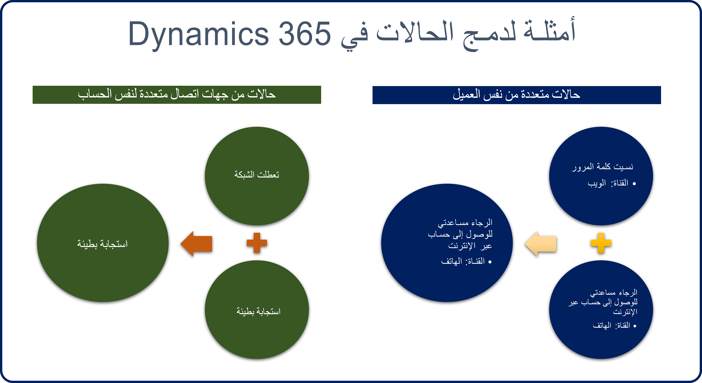

لنتعرف على كيفية استخدام هذه الميزات في حل حالة أرسلها أحد العملاء.

> [!div class="mx-imgBorder"]
> 

Nancy Anderson هي عميلة تعمل في شركة تُدعى Adventure Works. تتصل بمرسِل مركزي للإبلاغ عن مشكلة تواجهها الشركة. يُنشئ المُرسِل نشاط مكالمة هاتفية للمشكلة في Dynamics 365.

ويعمل مندوب دعم العملاء على فتح المكالمة الهاتفية وتحويلها إلى حالة جديدة في Dynamics 365.

> [!NOTE]
> نظراً لأن الحالة بدأت كمكالمة هاتفية، يتم تشغيل سير إجراءات عمل *الهاتف إلى الحالة*. ويتألف سير العمل هذا من ثلاث مراحل هي: *التحديد*، و *البحث*، و *الحل*.

- **التحديد:** يحدد المندوب المشكلة والمعلومات ذات الصلة.

    - يتصل المندوب بـ Nancy، التي أبلغت عن المشكلة، ويحدد معلومات مثل العميل، وجهة الاتصال، والمشكلة.
    - يتم إنشاء نشاط مكالمة هاتفية يصف ما تم إنجازه ومقدار الوقت الذي قضاه المندوب على الهاتف مع Nancy (15 دقيقة في هذا المثال).
    - يتم رفع الحالة إلى المرحلة التالية.

- **البحث:** يبحث المندوب في المشكلة ويحاول إيجاد حل.

    - يقضي المندوب 30 دقيقة في البحث والعمل على حل مشكلة Nancy.
    - يجد المندوب حلاً للمشكلة في مقالة معرفية موجودة في قاعدة المعارف.
    - يرسل المندوب المقالة إلى Nancy عبر الرسالة الإلكترونية ويربطها بالحالة بوصفها الحل.
    - يتم إنشاء مهمة تصف ما تم إنجازه والمدة التي استغرقتها (إجمالي 30 دقيقة في هذا المثال).

- **الحل:** يغلق المندوب الحالة على أنها محلولة.

    - يتصل المندوب بـ Nancy لضمان أن الحل المقترح قد أصلح المشكلة. يقضي المندوب 15 دقيقة على الهاتف معها.
    - يتم إغلاق الحالة على أنها محلولة.
    - يتم تجميع الوقت الإجمالي لجميع الأنشطة ليعكس مقدار الوقت المستغرق في هذه المشكلة (إجمالي ساعة واحدة في هذا المثال).

للاطلاع على مزيد من المعلومات عن تطبيق مركز خدمة العملاء، راجِع [دليل المستخدم (مركز خدمة العملاء)](/dynamics365/customer-engagement/customer-service/user-guide-customer-service-hub).

للاطلاع على معلومات أكثر عن أنشطة الحالة، راجِع [إضافة نشاط إلى حالة](/dynamics365/customer-engagement/customer-service/user-guide-customer-service#add-an-activity-to-a-case).

## الحالات الأصل/التابعة

في بعض الأحيان، قد يتم إنشاء حالات متعددة ترتبط جميعها بالحالة الرئيسية نفسها. وخارج الإطار التقليدي المألوف، يُتاح لك من خلال Dynamics 365 إنشاء الحالات الأصل/التابعة باستخدام بنية التدرج الهرمي للحالة الخاصة بها. فمثلاً، تعمل لصالح شركة برامج أصدرت للتو تحديثاً لأحد تطبيقات البرامج لديها. ولكن التحديث يحتوي على خطأ. قد يتم إنشاء حالات متعددة نظراً لأن العديد من مختلف العملاء قد يتصلون للإبلاغ عن المشكلة. يمكنك من خلال استخدام التدرجات الهرمية للحالات إقران كل الحالات المُبلَغ عنها بحالة رئيسية واحدة. وعند إصلاح الخطأ في الحالة الرئيسية (الأصل)، يمكن أيضاً أن تصبح كل الحالات التابعة محلولة ومُقفلة في الوقت نفسه.

تعرض الصورة التالية بعض الأمثلة على كيفية استخدام التدرجات الهرمية للحالات في مؤسسة لدعم العملاء.

> [!div class="mx-imgBorder"]
> 

### معلومات مهمة عن التدرج الهرمي للحالات

- لا يمكن إقران أكثر من 100 حالة تابعة بحالة رئيسية واحدة (أصل). وإذا كنت بحاجة إلى أكثر من 100 حالة تابعة، فقد تضطر إلى إنشاء تدرج هرمي مخصَّص للحالات يدوياً.
- يُدعم مستوى واحد فقط من التدرج الهرمي.

    - يمكن إنشاء تعيينات حقل الحالة لملء الحقول في سجلات الحالات التابعة تلقائياً.
    - لا ينطبق التعيين إلا عند إنشاء سجل حالة تابعة في سياق حالة أصل.
    - لا تُبقي تعيينات حقل الحالة السجلات متزامنة.

- تدعم ميزة التدرج الهرمي للحالة ثلاثة خيارات إغلاق متتالية عند إغلاق حالة أصل:

> [!NOTE]
> يمكن تحديد خيار واحد فقط لكل مؤسسة.
> **بلا:** إقفال الحالة الأصل ليس له أي تأثير على الحالات التابعة. ومن ثمَّ يجب إقفال الحالات التابعة كل على حدة.
> **إقفال كل الحالات التابعة عند إقفال الأصل:** تُقفَل أي حالات تابعة مفتوحة تلقائياً عند إقفال الحالة الأصل.
> **عدم السماح بإقفال حالة أصل إلى أن يتم إقفال كل الحالات التابعة:** يجب إقفال كل الحالات التابعة قبل إقفال الحالة الأصل.

يمكن لمسؤولي/مخصِّصي النظام تحديد إعدادات مؤسسة ما للحالات الأصل/التابعة من خلال الانتقال إلى **إعدادات** \> **إدارة الخدمة** وتحديد إعدادات الحالات الأصل والتابعة.

للاطلاع على معلومات أكثر عن الحالات الأصل والتابعة، راجِع[إنشاء الحالات الأصل والتابعة وإدارتها](/dynamics365/customer-engagement/customer-service/user-guide-customer-service#create-and-manage-parent-and-child-cases).

## دمج الحالات

في بعض السيناريوهات الشائعة، قد يُبلغ عميل أو أكثر عن حالة واحدة عدة مرات. فمثلاً، يفتح أحد العملاء حالة عبر مدخل ويب ويبلغ بأنه لا يمكنه تسجيل الدخول لأنه نسي كلمة مروره. ويتصل العميل نفسه في وقت لاحق بمكتب المساعدة لديك للإبلاغ عن أنه يعاني مشكلات في تسجيل الدخول. يمكن أن تتأثر عمليات تحميل الحالات للمندوبين؛ نظراً لأنه قد يتم فتح حالات متعددة للعنصر نفسه. كما يمكن أن تتأثر مؤشرات الأداء الرئيسية (KPI) التي تتعقبها المؤسسة لSLAs.

في هذه السيناريوهات، يمكن استخدام ميزة دمج الحالات في Dynamics 365 لدمج الحالات المنفصلة في سجل حالة رئيسية واحدة.

تعرض الصورة التالية بعض حالات الاستخدام المحتملة لهذه الميزة.

> [!div class="mx-imgBorder"]
> 

### اعتبارات إضافية لدمج الحالات

- تدعم ميزة دمج الحالات في Dynamics 365 دمج حالتين نشطتين أو أكثر. ويمكن دمج 10 حالات كحد أقصى في إجراء واحد.

- يمكن وضع علامة على حالة واحدة على أنها الحالة الأساسية.

    - الحالة الأساسية ستكون نشطة.
    - سيتم إلغاء جميع الحالات الأخرى.
    - سيتم جعل كل الأنشطة والملاحظات والمرفقات المقترنة بكل الحالات في الدمج أصلاً من جديد إلى الحالة الأساسية.

- بعد دمج الحالات، لا يمكن التراجع عن الدمج.

تتوفر إمكانية دمج ما يصل إلى 10 حالات فقط من خلال واجهة المستخدم (UI). يجب على المطورين ممن هم بحاجة إلى دمج الحالات برمجياً استخدام نفس رسالة عدة تطوير البرامج (SDK) الخاصة بالدمج المتوفرة لعمليات دمج الحسابات وجهات الاتصال. تتيح هذه الرسالة دمج سجلين كحد أقصى في كل مرة.

> [!NOTE]
> تتم عمليات دمج السجلات البرمجية خارج نطاق هذه الوحدة.

> [!VIDEO https://www.microsoft.com/videoplayer/embed/RE2IM1e]

للاطلاع على معلومات أكثر عن دمج الحالات، راجِع [دمج الحالات المشابهة](/dynamics365/customer-engagement/customer-service/user-guide-customer-service#merge-similar-cases).
