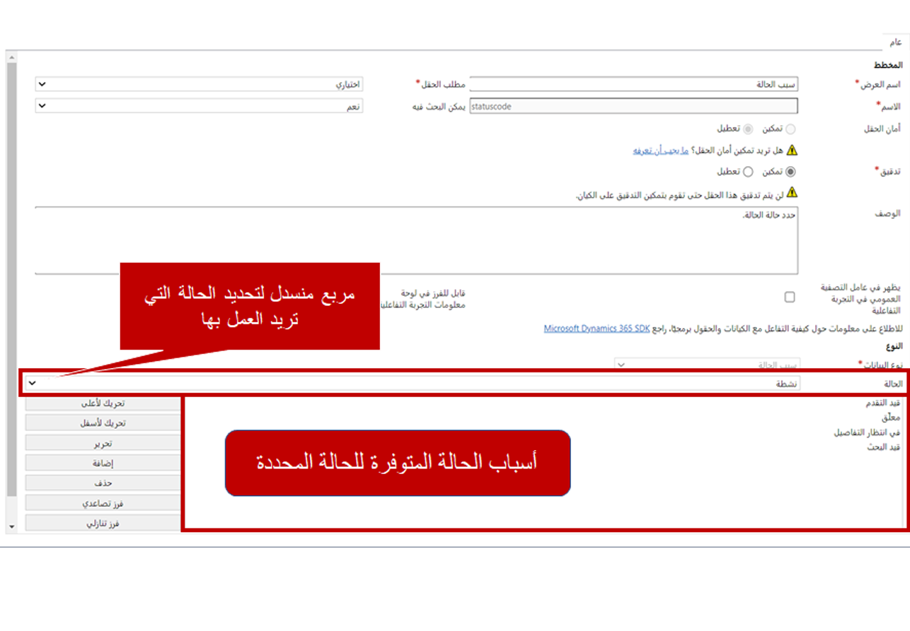
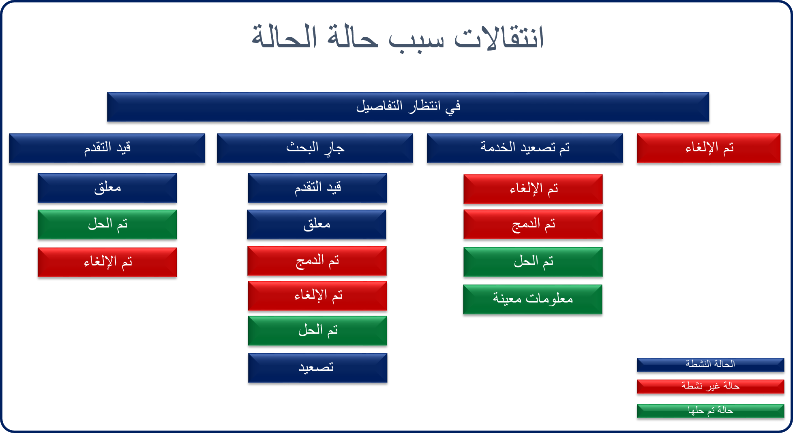
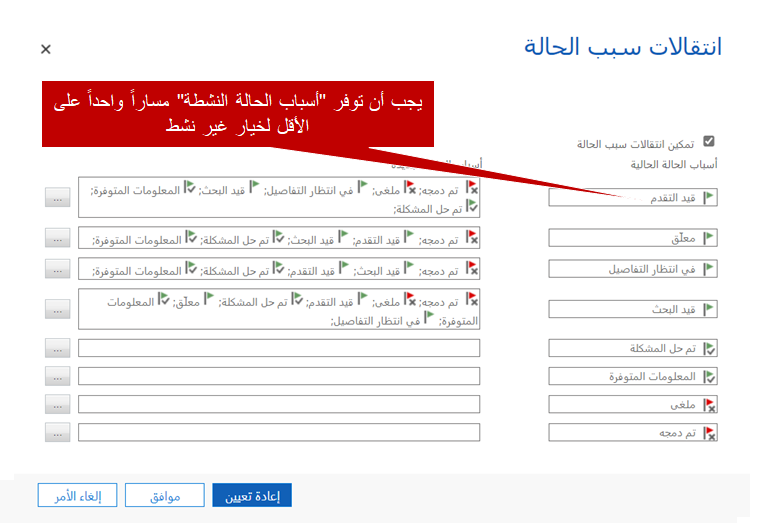

تساعد حالة سجل ما في تحديد مكان السجل في عملية معينة. فمثلاً، إذا كنت تعمل حالياً على مشكلة في النظام، فإن حالة المشكلة تعتبر *نشط*. وبعد إغلاق المشكلة، يمكن تعيينها إلى الحالة "محلول". وتسهِّل هذه الحالات فرز السجلات المحددة في النظام، وتصفيتها، والاستعلام عنها.

تتوفر حالات محددة وجاهزة للاستخدام لكل سجل من سجلات Dynamics 365 حسب نوع السجل. ويمكن إدراج المشكلات ضمن ثلاث حالات هي:

- **نشط:** المشكلة مفتوحة حالياً ويجري العمل عليها بنشاط في التطبيق.

- **محلول:** تم إصلاح المشكلة.

- **مُلغى:** لم تعد المشكلة نشطة في النظام، ولكن لم يتم حلها.

لا يمكنك تغيير الحالات المتوفرة لنوع سجل معين. ولكن من المهم في كثير من الأحيان الحصول على معلومات أكثر تحديداً حول حالة سجل ما. فمثلاً، قد تكون مشكلة ما نشطة في النظام، ولكن ما الذي يجري بالضبط في المشكلة؟ هل يبحث المندوب في المشكلة؟ أم هل ينتظر المندوب أن يقدم العميل معلومات أكثر؟ يمكن أن يكون لمعرفة هذه التفاصيل أهمية بالغة في تقديم الخدمات الفعالة.

يحتوي كل نوع سجل على ما يسمى *سبب الحالة*. ويقترن سبب الحالة بحالة سجل معينة ويوفر معلومات أكثر عن سبب وضع السجل في تلك الحالة. بالنسبة إلى المشكلات في Dynamics 365، تتوفر عدة أسباب للحالة جاهزة للاستخدام هي:

- **نشط:**
    - **قيد التقدم**: يعمل مندوب خدمة العملاء على المشكلة حالياً.
    - **قيد الانتظار**: المشكلة نشطة، ولكن لا يجري العمل عليها حالياً.
    - **في انتظار التفاصيل**: المشكلة نشطة، ولكنك تنتظر وصول معلومات أكثر من العميل.
    - **قيد البحث**: يجري حالياً البحث في المشكلة.

- **محلول:‬**
    - **تم حل المشكلة**: عُثر على حل ناجح للمشكلة.
    - **المعلومات متوفرة**: أُعطي العميل معلومات مُرضية، وتم إصلاح المشكلة.

- **مُلغى:**
    - **مُلغى**: تم إلغاء المشكلة.
    - **مُدمج**: أُلغيت المشكلة لأنه تم دمجها مع سجل آخر.

> [!div class="mx-imgBorder"]
> 

يمكنك إضافة أسباب الحالة لمشكلة ما أو إزالتها أو تغييرها حسب الحاجة بالانتقال إلى **تخصيصات** \> **المشكلات** \> **الحقول** ثم تحديد سهم القائمة المنسدلة في الحقل **سبب الحالة**. تتوفر العديد من أسباب الحالة لكل حالة مع إمكانية تغيير هذه الأسباب.

## انتقالات سبب الحالة

تتبع المؤسسات في الغالب عملية محددة لحل المشكلات. وقد تؤدي حالات المشكلة وأسباب الحالة دوراً في تلك العملية. يتيح Dynamics 365 بدوره للمؤسسات إنشاء مسارات انتقال سبب الحالة للعملاء ليأخذ بأيدي تلك المؤسسات نحو تعريف وإنفاذ أكثر وضوحاً لتلك العمليات.

تضيف ميزة انتقالات سبب الحالة بدورها مستوى آخر من التصفية لتعريف قائمة محدَّدة من أسباب الحالة التي يمكن تحديدها لسبب حالة محدَّد. فمثلاً، عندما يكون سبب الحالة لمشكلة ما هو *في انتظار التفاصيل*، فهذا يعني أنها قيد الانتظار بالفعل من الناحية الفنية. ومن ثمَّ، فإن السماح للفني بتغيير سبب الحالة إلى *قيد الانتظار* لا لزوم له. وفضلاً عن ذلك، قد لا يمثّل سبب الحالة *قيد الانتظار* الخيار الأفضل الذي يجب الانتقال إليه. من هنا يمكّنك استخدام ميزة انتقالات سبب الحالة من تعريف الانتقالات المحدّدة التي يمكن لمندوب ما الانتقال إليها من سبب الحالة *في انتظار التفاصيل*.

تعرض الصورة التالية مثالاً.

> [!div class="mx-imgBorder"]
> 

كما ترى، عندما يكون لمشكلة ما سبب الحالة *في انتظار التفاصيل*، فإن خيارات الانتقال تقتصر على ما يلي:

- مُلغى
- تم تصعيد الخدمة
- قيد البحث
- ‏‏قيد التقدم

يمكن أن يتحدد لكل سبب من أسباب الحالة هذه، بدوره، انتقالات متعددة. ومن ثمّ تسهّل انتقالات سبب الحالة على المؤسسات المساعدة في ضمان اكتفاء المندوبين باستخدام أسباب صالحة استناداً إلى سبب الحالة الحالي.

الجدير بالذكر أن انتقالات سبب الحالة لا تتوفر إلا في كيان المشكلة والكيانات المخصصة. ويمكنك تغييرها عن طريق تحديد الزر **تحرير انتقالات سبب الحالة** على صفحة تخصيص حقل سبب الحالة. بعد تشغيل ميزة انتقالات سبب الحالة، يمكنك تعريف أسباب الحالة المحدَّدة المتوفرة.

> [!div class="mx-imgBorder"]
> 

عندما تعرّف خيارات السبب لسبب الحالة "نشط"، يجب أن يكون هناك مسار واحد على الأقل إلى الحالة "غير نشط". فمثلاً، إذا كان سبب الحالة لمشكلة ما هو *قيد التقدم*، فلا بد وأنه من الممكن الانتقال إلى سبب واحد على الأقل من أسباب الحالة التالية: *مُلغى*، *مُدمج*، أو *تم حل المشكلة*، أو *المعلومات متوفرة*. مع العلم بأنه في حال لم يتوفر مسار واحد على الأقل إلى الحالة "غير نشط"، فلن تتمكن من حفظ الانتقالات الجديدة.

بعد حفظ الانتقالات ونشرها، ستظهر التغييرات للمندوبين في التطبيق.

> [!VIDEO https://www.microsoft.com/videoplayer/embed/RE2IJmp]

لمزيد من المعلومات حول انتقالات سبب الحالة، راجِع [تعريف انتقالات سبب الحالة للمشكلة أو الكيانات المخصصة](/dynamics365/customer-engagement/customize/define-status-reason-transitions).
