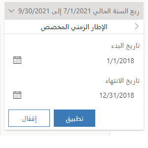
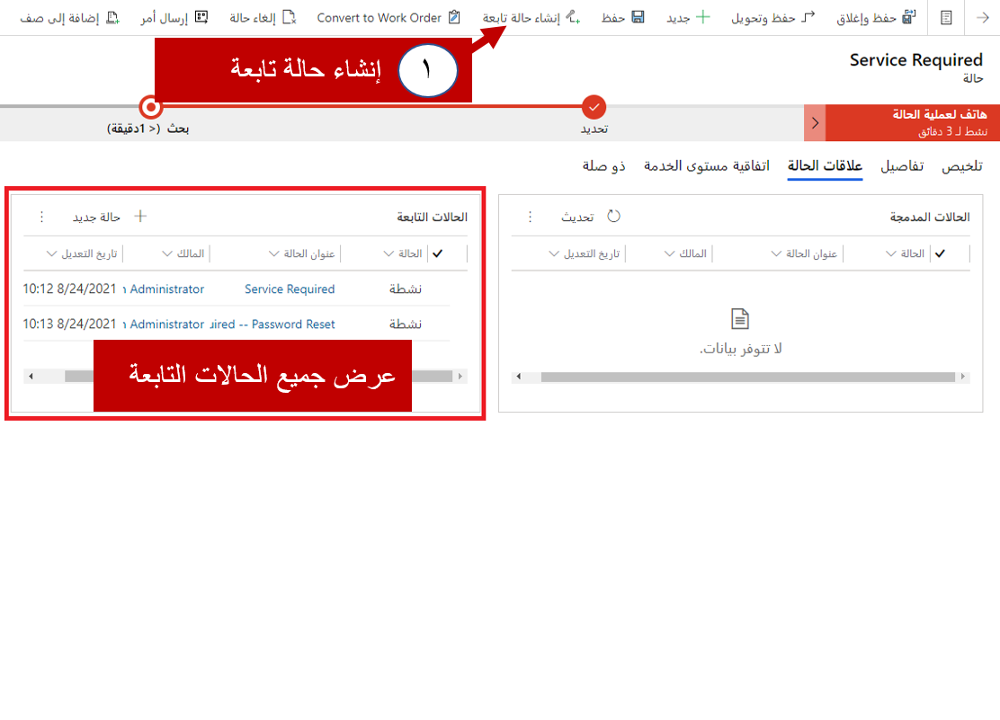
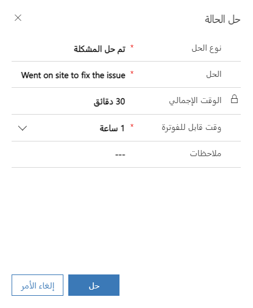
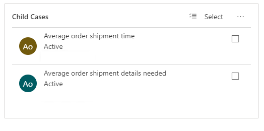

يُمكّن Dynamics 365 for Customer Service المؤسسة من خدمة عملائها بطرق عديدة اعتماداً على الاحتياجات المحددة للعميل، ونموذج خدمة المؤسسات والعوامل المحددة الأخرى. تُعد قدرات إدارة الحالات واحدة من السمات الرئيسية لحل خدمة العملاء.

يتمثل الغرض من هذا التمرين العملي في تقديم العمل باستخدام ميزات إدارة الحالات في Dynamics 365، بما في ذلك استخدام مركز خدمة العملاء، والعمل مع حالات الأصل والحالات التابعة، ودمج الحالات.

### الأهداف التعليمية

في نهاية هذه التمارين، ستتمكن من تحقيق الأهداف التالية:

-   تكوين إعدادات الحالة الأصل / التابعة

-   استخدام مركز خدمة العملاء لتحديد أي حالات عبر الهاتف ذات أولوية عالية.

-   العمل مع الحالات الأصل/التابعة

-   دمج حالتين معاً.

**الوقت المقدَّر لإنهاء هذا التمرين: *15 إلى 20* دقيقة**

### قبل أن نبدأ

أول ما نحتاج إلى فعله هو أن نكوّن إعدادات الحالة الأصل والتابعة في Dynamics 365 لتسمح لنا بإضافة بعض الحالات التابعة. ونريد أن نضمن أنه عندما تكون الحالات الأصل مغلقة، ستكون جميع الحالات التابعة مغلقة أيضاً. ولكن قبل أن يحدث هذا، نحن بحاجة إلى التأكد من أن هذا السلوك مكوّن.

***تكوين إعدادات الحالة الأصل/التابعة:***

1. على **شريط التنقل** للتطبيق الرئيسي، انقر فوق **محدّد القائمة المنسدلة للوحدة** ثم **إعدادات.**
2. من الكيان **إعدادات**، انقر فوق **إدارة الخدمة**.
3. حدِّد **إعدادات** **الحالة الأصل والتابعة** ضمن القسم **‏‫إعدادات الحالة بقواعد ‏‫إنشاء السجلات وتحديثها‬**. 
4. من المربع **السمات المتوفرة**، تحقَّق من تحديد السمات التالية: **نوع الحالة، وعنوان الحالة، وجهة الاتصال، والاستجابة الأولى بواسطة، والاستحقاق،** و **الأولوية.**
    - حدِّد القيمة ثم انقر فوق الزر **\[\>\>\]** للإضافة إلى قائمة **السمات المحدَّدة**.
5. حدِّد خانة الاختيار **تحديد تفضيل الإغلاق** ثم حدِّد الخيار **إغلاق كل الحالات التابعة عند إغلاق الحالة الأصل‬** لإغلاق الحالات المماثلة بسهولة.
6. انقر فوق **موافق** لحفظ إعدادات الحالة الأصل/التابعة.

### السيناريو

أنت تحظى بالعمل في شركة توفر الدعم لمكتب المساعدة لعملائها. تستخدم مؤسستك مركز خدمة العملاء في Dynamics 365 لإدارة أنشطتك اليومية وعمليات تحميل الحالات. في بداية مناوبة عملك، قيل لك أن الشركة يتعذر عليها المواكبة فيما يخص حالات الدعم عبر الهاتف في الآونة الأخيرة. وعليك أن تجعل الانشغال بحالات الدعم عبر الهاتف ذا أولوية. كما عليك البدء بالحالات عبر الهاتف ذات الأولوية العالية أولاً.

### الخطوات عالية المستوى:

-   استخدام مركز خدمة العملاء لتحديد أي حالات عبر الهاتف ذات أولوية عالية.
-   أضف نشاط متابعة مكالمة هاتفية للحالة.
-   أضف حالة تابعة لحالة موجودة.
-   استخدام مقالة معرفية لحل حالة.
-   إغلاق حالة أصل وتابعة.
-   دمج حالتين معاً.

### الخطوات التفصيلية:

#### استخدام مركز خدمة العملاء لتحديد الحالات ذات الأولوية العالية:

1. في مركز خدمة العملاء، انقر فوق الرمز مخطط الموقع، وحدِّد > لوحات المعلومات.
2. انقر فوق السهم لأسفل بجوار نطاق بيانات ربع السنة هذا، ثم > حدِّد الفترة المخصصة
3. عيِّن الفترة كما يلي:
    - تاريخ البدء: 2018/1/1
    - تاريخ الانتهاء: 2018/12/31

4. انقر فوق تطبيق.
5. في شريط الأوامر، انقر فوق الزر إظهار عامل التصفية المرئي.
6. حدِّد موقع المخطط ‏‫مزيج من الحالات (حسب الأصل)،‬ ثم حدّد شريحة الهاتف.
7. في مخطط الحالات حسب الأولوية، حدِّد الفئة العالية.
8. حدِّد موقع حالة الخدمة مطلوبة (عينة)، وانقر فوق السهم لأسفل للتحقق من أن العميل هو Fourth Coffee (عينة).
9. حدِّد حالة الخدمة مطلوبة (عينة) لفتحها.
10. في المخطط الزمني للسجل، انقر فوق الزر إضافة معلومات وأنشطة.
11. حدّد مكالمة هاتفية من القائمة
12. يُمكنك إنشاء "مكالمة هاتفية" على النحو التالي:

- الموضوع: مكالمة متابعة
- اتصال من: "سجل المستخدم الخاص بك"
- مكالمة إلى: Yavonne McKey (عينة)
- الاتجاه: صادر
- المدة: 15 دقيقة
- الأولوية: عادية
- بخصوص: الخدمة مطلوبة (عينة)

13. انقر فوق حفظ لحفظ النشاط
14. أغلق حالة الخدمة مطلوبة (عينة) في الوقت الحالي.

#### إنشاء حالة تابعة من حالة موجودة:

بينما تعمل على هذه الحالة، تذكر Yvonne أيضاً أنها تعجز عن التحقق من نجاح أي حل تعمل أنت عليه نظراً لعجزها عن تسجيل الدخول. تحتاج إلى إعادة تعيين كلمة المرور الخاصة بها لهذا العنصر. يجب أن تلتقط هذا في حالة تابعة.

1. في شريط الأوامر، انقر فوق إنشاء حالة تابعة ثم انقر فوق حفظ.
2. أكمل الحالة التابعة على النحو الآتي: 
    - عنوان الحالة: الخدمة مطلوبة -- إعادة تعيين كلمة المرور 
    - نوع الحالة: مشكلة 
    - الأصل: الهاتف

3. انقر فوق حفظ
4. لعرض الحالات التابعة، حدِّد علامة التبويب علاقات الحالة.

5. ضمن الشبكة الفرعية "الحالات التابعة"، انقر فوق الحالة "الخدمة مطلوبة-إعادة تعيين كلمة المرور" لفتحها.
6. حدِّد علامة التبويب تفاصيل، وستظهر لك الحالة الأصل ضمن القسم تفاصيل إضافية.
7. انتقل إلى الخلف إلى الحالة الأصل بالنقر فوق الارتباط التشعبي حالة الخدمة مطلوبة (عينة). 
8. في القسم "ذو صلة"، حدّد رمز Knowledge Base Search. 
9. حدد "مقالة" من اقتراحات المقالات وانقر فوق رمز "الرابط".
10. حدِّد علامة التبويب علاقات الحالة.
11. تحقَّق من أن المقالة التي تم التوصيل بها معروضة في الشبكة الفرعية سجلات المعرفة المقترنة
12. في تدفق العملية من الهاتف إلى الحالة، انقر فوق المرحلة التالية إلى أن تصبح في مرحلة الحل.
13. في مرحلة "الحل"، انقر فوق "إنهاء". 
14. انقر فوق الزر حل الحالة لحل الحالة الأصل. 
15. انقر فوق تأكيد لإعادة تأكيد قرارك بحل الحالة.
16. ضمن النافذة حل الحالة، اكتب "تم الذهاب إلى الموقع لإصلاح المشكلة" أمام الحل.
17.  غيِّر الوقت القابل للفوترة ليعرض ساعة واحدة.
18.  انقر فوق حل لحل الحالة الأصل مع كل الحالات التابعة ذات الصلة.

19. انقر فوق علامة التبويب علاقات الحالة للتحقق من حل أي حالات تابعة أيضاً.

#### دمج الحالات المكررة

أنت بصدد مناقشة بعض الحالات المفتوحة مع زميل وتدرك أن كليكما يعمل على المشكلة نفسها للعميل نفسه. وبما أنك لا تريد الحصول على معلومات حالة مكررة في نظامك، فإنك تقرر دمج الحالتين.

1. من مخطط الموقع، حدِّد رمز مفتاح الربط لعرض الحالات.
2. في شريط البحث، اكتب المنتج
3. انقر فوق علامة الاختيار واضغط باستمرار على مفتاح Ctrl لتحديد هاتين الحالتين:
    - كتالوج المنتجات مطلوب (عينة)
    - سؤال المنتج (عينة)
    - في الشريط، انقر فوق دمج الحالات.
5. في النافذة دمج الحالات، انقر فوق علامة الاختيار بجوار الحالة باسم كتالوج المنتجات مطلوب (عينة) لتعيينها كحالة رئيسية ثم انقر فوق دمج.
6. انقر فوق موافق.
