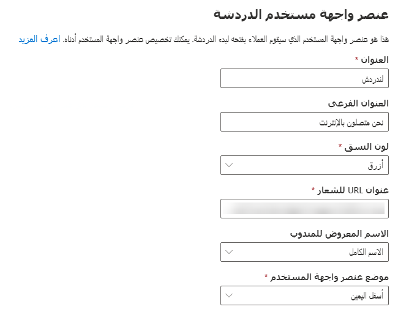
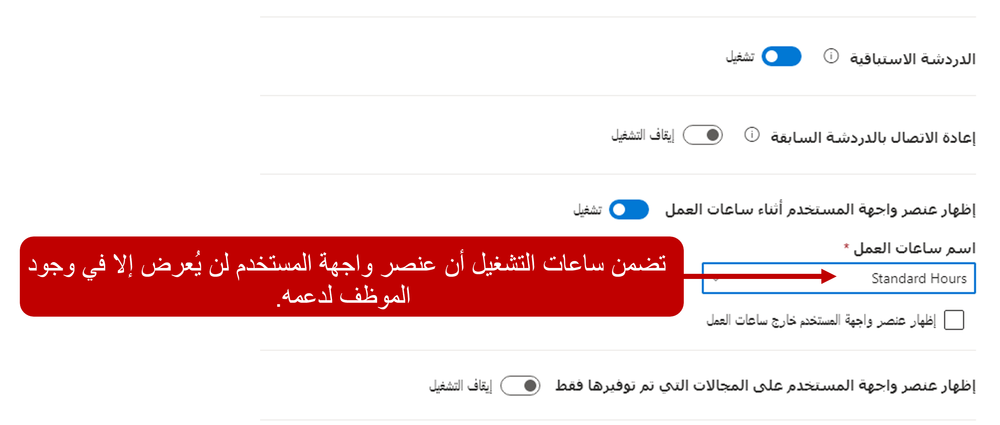
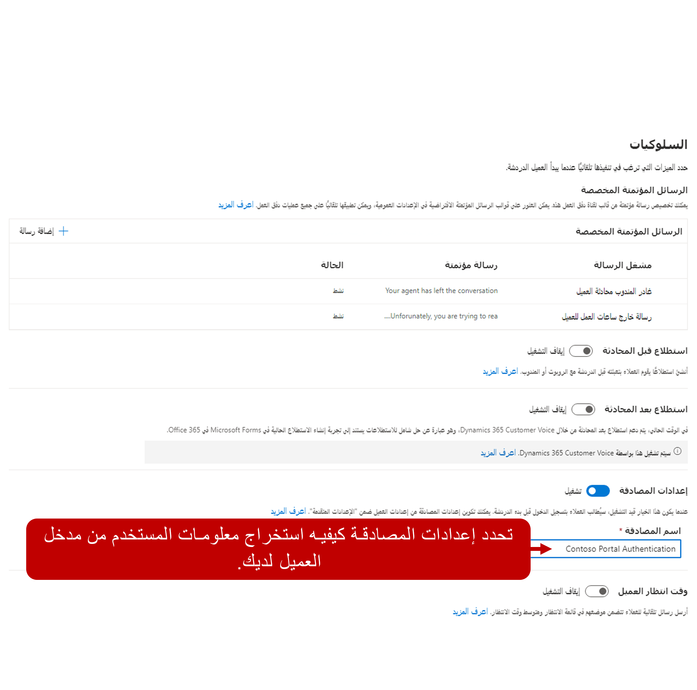
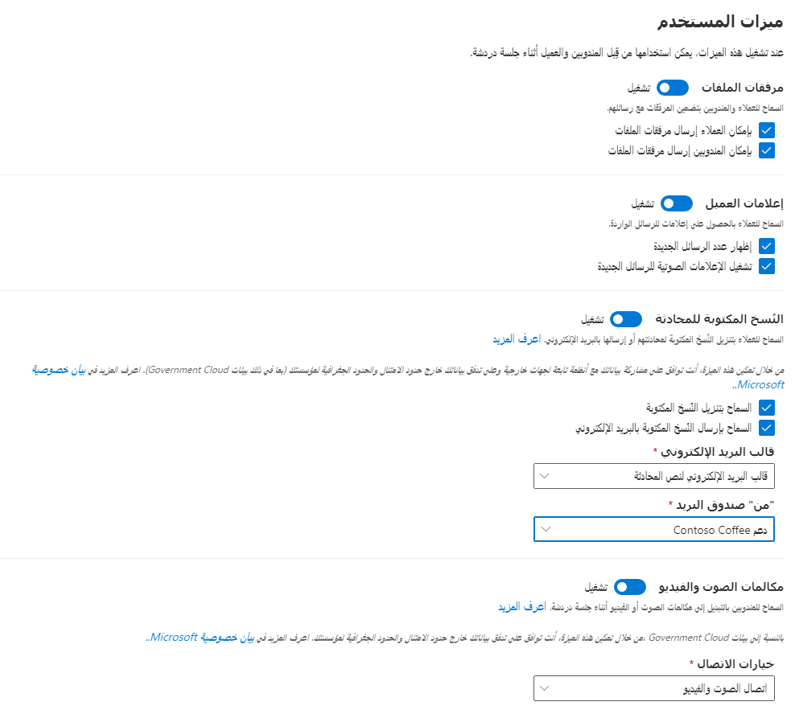

عندما تكون المؤسسة مستعدة لبدء التواصل مع العملاء من خلال حل المحادثة المباشرة، سوف يحتاجون إلى إنشاء قناة محادثة. بناء على احتياجات المؤسسة، يمكنهم إنشاء قناة محادثة واحدة أو عدة قنوات لدعم سيناريوهات مختلفة. على سبيل المثال، قد تنشئ المؤسسة أدوات محادثة متعددة تستهدف مناطق تركيز مختلفة حتى تتمكن من نشرها عبر مواقع ويب مختلفة.  

يتم إنشاء القنوات في تطبيق **مركز مسؤولي Customer Service**، ويمكن إضافتها عن طريق تحديد **القنوات** وتحديد **إدارة** بجوار **دردشة**. يجب أن تستند قنوات المحادثة إلى تدفقات العمل. قبل أن يمكن إضافة قناة محادثة، يجب أن يكون هناك تدفق عمل محادثة واحد على الأقل في التطبيق. يمكن إضافة القنوات مباشرة إلى مسار العمل.    

يتوفر مزيد من المعلومات حول [إنشاء عمليات تدفق العمل](/dynamics365/omnichannel/administrator/work-streams-introduction?azure-portal=true#create-a-work-stream/). 

عند تحديد قناة دردشة، هناك ست خطوات لمساعدتك على تحديد كيفية عمل القناة:

- **تفاصيل القناة**: تحديد التفاصيل الأساسية حول القناة مثل الاسم واللغة والنوع والقناة.  سيتم ملء النوع والقناة مسبقاً بالمراسلة والدردشة.  
    
- **تفاصيل تدفق العمل**: تحديد تدفق العمل وخيارات التوزيع التي سيتم استخدامها لدعم قناة الدردشة.  

- **عنصر واجهة مستخدم الدردشة**: تحديد كيفية عرض الأداة مثل لون الأداة وخيارات العلامة التجارية والموضع العام على الشاشة.

- **السلوكيات**: التحكم في السلوكيات المرتبطة بقناة الدردشة مثل ما إذا كان سيتم استخدام الاستطلاعات والرسائل التلقائية التي تستخدمها القناة والمزيد.  

- **ميزات المستخدم**: تحديد الميزات والخيارات المحددة التي ستكون متاحة على القناة. على سبيل المثال، إذا كان بإمكانك إرفاق ملفات بالمحادثة، أو إذا كنت تريد السماح للعملاء بتنزيل النسخ المكتوبة.  

## تحديد مظهر عنصر واجهة مستخدم الدردشة

تقوم معظم المؤسسات بوسم أصنافها لتبدو بطريقة محددة. تساعد العلامة التجارية العملاء على التعرف على من يعملون معه وتساعد على توفير رحلة متسقة. عند إنشاء أداة محادثة، يمكن للمؤسسات تخصيص العناصر المرئية للعنصر واجهة المستخدم لمحاذاة أفضل مع علامتها التجارية.  

عند تكوين قناة دردشة، يمكن للمؤسسات تخصيص أداة الدردشة لتناسب مؤسستهم بشكل أفضل، من خلال تحديد:

-   **العنوان** - عنوان عنصر واجهة المستخدم الذي يتم عرضه على عنصر واجهة مستخدم المحادثة عندما يتم تصغيره وتكبيره. 

-   **العنوان الفرعي** - النص الذي يتم تقديمه تحت العنوان على عنصر واجهة المستخدم. 

-   **لون السمة** - يتوفر اثنا عشر لوناً معرفاً مسبقاً للنسق.

-   **عنوان URL للشعار** - يحدد عنوان URL للشعار الذي سيتم استخدامه في عنصر واجهة مستخدم المحادثة.

-   **اسم عرض المندوب** - تحديد كيفية عرض اسم المندوب للعميل. 

-   **الموضع** - يحدد مكان عنصر واجهة المستخدم على الشاشة.

## العمل مع أسماء عرض المندوب

قد لا ترغب بعض المؤسسات في عرض الأسماء الكاملة لوكلائها في جلسات المحادثة. وبدلا من ذلك، قد يفضلون عرض الاسم الأول أو الأخير للعميل فقط لتوفير المزيد من عدم الكشف عن الهوية. يمكن للمنظمة اختيار استخدام إصدارات مبسطة من أسماء المندوب أو حتى أسماء مختلفة لإبقائها مجهولة. على سبيل المثال، قد يفضل مندوب يدعى Nicholas أن يُدعى Nick.  

يمكن للمؤسسات تعريف كيفية عرض اسم المندوب في عنصر واجهة المستخدم من حقل **اسم عرض المندوب**. يمكن تعيين **اسم عرض المندوب** إلى أحد الخيارات التالية:

-   **الاسم الكامل** - يعرض الاسم الكامل للمندوب.

-   **الاسم الأول** - يعرض الاسم الأول فقط للمندوب (يتم تحديد هذا الخيار افتراضياً).

-   **الاسم الأخير** - يعرض فقط الاسم الأخير للمندوب.

-   **اسم اللقب** - يعرض لقب المندوب. إذا لم يكن هناك لقب متاح، فسيتم عرض الاسم الكامل للمندوب.

## خيارات عنصر واجهة مستخدم الدردشة

بالإضافة إلى معلومات العرض المحددة أعلاه، يمكنك أيضاً تمكين الخيارات الإضافية المرتبطة بقناة عنصر واجهة مستخدم الدردشة.  

تتضمن هذه الخيارات:
- **المحادثة الاستباقية**: يمكنك إرسال الرسائل التي تم تشغيلها إلى العملاء بناءً على القواعد المحددة في التعليمات البرمجية الخاصة بك. على سبيل المثال، يمكنك إرسال "مرحباً! هل يمكنني مساعدتك في أي شيء اليوم؟" بعد أن يقضي العميل دقيقتين على صفحة الويب.  

- **إعادة الاتصال بالدردشة السابقة** : يمكنك الاتصال بالمندوب السابق ضمن الحد الزمني المعين.  

- **إظهار عنصر واجهة المستخدم أثناء ساعات العمل‬**: لن يتم عرض عنصر واجهة مستخدم الدردشة إلا خلال ساعات العمل المحددة.  

- **إظهار عنصر واجهة المستخدم على المجالات التي تم توفيرها فقط‬**: يمكنك تحديد أنه سيتم عرض عنصر واجهة مستخدم الدردشة في مجالات محددة فقط.  

## تحديد سلوكيات عنصر واجهة مستخدم الدردشة

عند إنشاء قناة دردشة، هناك العديد من السلوكيات المختلفة التي يمكنك تكوينها لتوفير مزيد من التحكم في التجربة بشكل عام.  على سبيل المثال، يمكنك إعداد المستخدمين للمصادقة على المدخل قبل أن يبدأوا الدردشة.  بمجرد تسجيل الدخول، يمكن تمرير معلومات المستخدم الخاصة بهم إلى سجل المحادثة.  بهذه الطريقة سيكون لدى المندوب الذي يدعم العميل التفاصيل اللازمة عن العميل.  

يوفر قسم **السلوكيات** في عنصر واجهة مستخدم **المحادثة** خيارات متعددة يمكنك تكوينها بناءً على احتياجاتك التنظيمية.  من شاشة **السلوكيات**، يمكنك تحديد التالي:

- **الرسائل التلقائية المخصصة**: يمكنك تحديد الرسائل المخصصة التي سيتم عرضها للعملاء في سيناريوهات محددة.  على سبيل المثال، قد تعرض رسالة إلى عميل عندما يحاول استخدام عنصر واجهة مستخدم المحادثة خارج ساعات عمل مؤسستك. لمزيد من المعلومات، راجع [تكوين الرسائل التلقائية](/dynamics365/customer-service/configure-automated-message?tabs=customerserviceadmincenter). 

- **استطلاع ما قبل المحادثة**: يمكنك إنشاء استطلاع للعملاء لملئه قبل الدردشة مع مندوب أو روبوت. لمزيد من المعلومات حول استطلاعات ما قبل المحادثة، راجع [استطلاعات ما قبل المحادثة](/dynamics365/customer-service/configure-pre-chat-survey?tabs=customerserviceadmincenter). 

- **استطلاع ما بعد المحادثة**: يمكنك استخدام Dynamics 365 Customer Voice لتقديم استطلاعات ما بعد المحادثة للعملاء بعد الانتهاء من المحادثة. لمزيد من المعلومات حول استطلاعات ما بعد المحادثة، راجع [استطلاعات ما بعد المحادثة](/dynamics365/customer-service/configure-post-conversation-survey?tabs=customerserviceadmincenter).   

- **إعدادات المصادقة**: عند التشغيل، سيطلب العملاء تسجيل الدخول قبل بدء المحادثة. لمزيد من المعلومات، راجع [تكوين إعدادات المصادقة](/dynamics365/customer-service/create-chat-auth-settings?tabs=customerserviceadmincenter).  

- **وقت انتظار العميل**: يمكنك تحديد ما إذا كنت تريد إرسال رسائل تلقائية للعملاء حول موقعهم الحالي في قائمة الانتظار ومتوسط وقت الانتظار.  

- **كشف موقع العميل**: يمكنك تمرير تفاصيل الموقع الخاصة بالعميل إلى سجل المحادثة.  
    - عند تمكين هذا الخيار، سيتلقى العملاء مطالبة للسماح بالكشف عن الموقع قبل أن تتمكن من الحصول على معلوماتهم.  
    - ستحتاج إلى تكوين سجل موفر الموقع الجغرافي في التطبيق لالتقاط تفاصيل الموقع. لمزيد من المعلومات، راجع [إعداد اكتشاف موقع الزائر ](/dynamics365/customer-service/geo-location-provider?tabs=customerserviceadmincenter).

## تحديد ميزات المستخدم ##

يمكنك تحديد العديد من الميزات عند إنشاء قناة دردشة لا تسهل على المندوبين خدمة العملاء فحسب، بل يمكنها أيضاً توفير قيمة لعملائك.  على سبيل المثال، قد يرغب العديد من العملاء في الحصول على نسخة من المحادثة لسجلاتهم.  

في قسم **سلوكيات المستخدمين** في قناه المحادثة، يمكنك تحديد ما يلي:

- **مرفقات الملفات**: السماح للعملاء والمندوبين بتضمين مرفقات مع المحادثات الخاصة بهم.  

- **إخطارات العملاء**: السماح للعملاء باستلام إخطارات للرسائل الواردة في المحادثة. بالإضافة إلى عرض رسالة، يمكنك أيضاً تشغيل صوت كجزء من الإخطار.  

- **النسخ المكتوبة للمحادثات**: السماح للعملاء بتنزيل أو تلقي رسالة إلكترونية تتضمن النسخ المكتوبة للمحادثات الخاصة بهم.  لمزيد من المعلومات، راجع [تمكين قناة محادثة للنسخ المكتوبة](/dynamics365/customer-service/enable-transcripts-messaging-channels?tabs=customerserviceadmincenter).   

- **مكالمات الصوت والفيديو**: السماح للعملاء بالتبديل إلى مكالمة الصوت أو الفيديو أثناء جلسة محادثة.  لمزيد من المعلومات، [خيارات الاتصال والمشاركة المرئية في المحادثة الحية](/dynamics365/customer-service/call-options-visual-engagement). 

- **مشاركه الشاشة**: باستخدام هذا الإعداد، يمكن للعملاء عرض شاشة العميل والتعامل معها. تتطلب هذه الميزة تكوين تطبيق مشاركة الشاشة لجهة خارجية. لمزيد من المعلومات، راجع [مشاركه الشاشة في المحادثة المباشرة](/dynamics365/customer-service/call-options-visual-engagement).   

- **الاستعراض المشترك**: السماح للمندوبين بالاطلاع على مستعرض ويب العميل والتفاعل معه.  تتطلب هذه الميزة تكوين تطبيق الاستعراض المشترك لجهة خارجية. لمزيد من المعلومات، راجع [الاستعراض المشترك في المحادثة الحية](/dynamics365/customer-service/call-options-visual-engagement).

بعد إنشاء قناة دردشة، ستختبر خيارات التكوين. 

