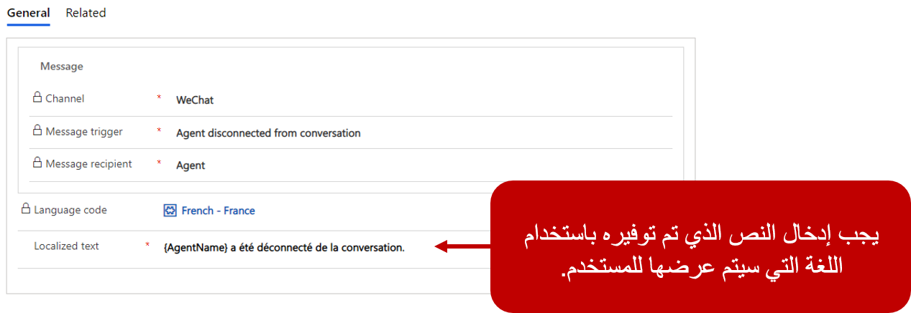

عندما تكون المؤسسة مستعدة لبدء التواصل مع العملاء من خلال حل المحادثة المباشرة، سوف يحتاجون إلى إنشاء قناة محادثة. بناء على احتياجات المؤسسة، يمكنهم إنشاء قناة محادثة واحدة أو عدة قنوات لدعم سيناريوهات مختلفة. على سبيل المثال، قد تنشئ المؤسسة أدوات محادثة متعددة تستهدف مناطق تركيز مختلفة حتى تتمكن من نشرها عبر مواقع ويب مختلفة.  

يتم إنشاء القنوات في تطبيق إدارة القناة متعددة الاتجاهات، ويمكن إضافتها عن طريق تحديد **المحادثة** ضمن عنوان **القنوات**.  يجب أن تستند قنوات المحادثة إلى تدفقات العمل. قبل أن يمكن إضافة قناة محادثة، يجب أن يكون هناك تدفق عمل محادثة واحد على الأقل في التطبيق.  

يتوفر مزيد من المعلومات حول [إنشاء عمليات تدفق العمل](/dynamics365/omnichannel/administrator/work-streams-introduction?azure-portal=true#create-a-work-stream/). 

تحتوي قناة المحادثة على خمس علامات تبويب يمكنك استخدامها لتحديد السلوك العام لعنصر واجهة المستخدم:

-   **الإعدادات العامة** - تعرف معظم قدرات سلوك القناة مثل كيفية توزيع أصناف العمل ومرفقات الملفات ونصوص المحادثة وخيارات قائمة الانتظار.

-   **الرسائل التلقائية** - تتيح لك تحديد الرسائل الآلية التي يمكن إرسالها إلى المستخدمين عند حدوث مشغلات معينة مثل انضمام مندوب إلى المحادثة وانتهاء جلسة وما إلى ذلك.  

-   **استطلاعات** - تُستخدم في السيناريوهات التي تريد فيها المؤسسات توفير مكان لالتقاط البيانات من المستخدمين إما قبل بدء المحادثة أو بعد اكتمالها.

-   **خيارات المحادثة** - توفر إمكانية استخدام تطبيقات مختلفة لتوفير إمكانات الصوت والفيديو والتصفح المشترك ومشاركة الشاشة. 

-   **التصميم** - يحدد كيفية ظهور عنصر واجهة المستخدم، مثل لون عنصر واجهة المستخدم وخيارات العلامة التجارية والموقع العام على الشاشة. 

-   **الموقع** - يحدد معلومات الموقع على المكان الذي يتم نشر عنصر واجهة مستخدم ويوفر القدرة على تمكين تتبع الزائر على عنصر واجهة مستخدم.

## تحديد إعدادات قناة المحادثة

يتم تعريف معظم الإعدادات المرتبطة بكيفية تصرف قناة محادثة في علامة التبويب **الإعدادات العامة**. تتضمن علامة التبويب عدة مقاطع يمكنك استخدامها لتكوين سلوكيات مختلفة:

-   **معلومات عامة** - تتضمن التفاصيل الأساسية مثل اسم القناة واللغة واسم عرض المندوب وإعدادات المصادقة.

-   **وضع المحادثة** - يسمح لك بتحديد نوع المحادثة التي سيتم ربطها بعنصر واجهة مستخدم المحادثة هذا. 
    يمكنك الاختيار من بين خيارين:

    -   **المحادثات المباشرة** - تحدث المحادثات في الوقت الحقيقي. عند انتهاء المحادثة، تنتهي الجلسة ولا يتم الاحتفاظ بمحفوظات المحادثة. 

    -   **المحادثة المستمرة** - يمكن أن تحدث المحادثات في الوقت الحقيقي أو على مدار فترة من الوقت نظراً لأنه يتم الحفاظ على محفوظات المحادثة. 
        يمكن للعملاء والمندوبين تسجيل الدخول مرة أخرى والمتابعة من حيث توقفوا. 

-   **توزيع العمل** - يحدد تدفق العمل المستخدَم لمعالجة توزيع الأصناف من القناة.

-   **محادثة استباقية** - تمكن أداة المحادثة من إشراك العملاء بشكل استباقي بدلا من انتظارهم لإشراك القطعة.

-   **مرفقات الملفات** - تمكن من قدرة العملاء و/أو العملاء على إرفاق الملفات بنافذة محادثة.

-   **نسخ المحادثة المكتوبة** - يوفر للعملاء القدرة على تنزيل نسخ المحادثة المكتوبة.

-   **انتظار العميل** - يوفر الخيارات التي يمكن عرضها لأحد العملاء اثناء انتظار مندوب، مثل إظهار موضعه في قائمة الانتظار وعرض متوسط وقت الانتظار.   

-   **القصاصة البرمجية** - تُستخدم لنشر عنصر واجهة المستخدم على البوابات الإلكترونية.

-   **إعادة اتصال المحادثة** - تستخدم لتوفير قدرة العميل على إعادة الاتصال بالمندوب الذي كان يساعده لفترة زمنية محددة بعد اكتمال المحادثة.  

> [!div class="mx-imgBorder"]
> 

## العمل مع أسماء عرض المندوب

قد لا ترغب بعض المؤسسات في عرض الأسماء الكاملة لوكلائها في جلسات المحادثة. وبدلا من ذلك، قد يفضلون عرض الاسم الأول أو الأخير للعميل فقط لتوفير المزيد من عدم الكشف عن الهوية. يمكن للمنظمة اختيار استخدام إصدارات مبسطة من أسماء المندوب أو حتى أسماء مختلفة لإبقائها مجهولة. على سبيل المثال، قد يفضل مندوب يدعى Nicholas أن يُدعى Nick.  

يمكن للمؤسسات تعريف كيفية عرض اسم المندوب في عنصر واجهة المستخدم من حقل **اسم عرض المندوب**. يمكن تعيين أسماء عرض المندوب إلى أحد الخيارات التالية:

-   **الاسم الكامل** - يعرض الاسم الكامل للمندوب.

-   **الاسم الأول** - يعرض الاسم الأول فقط للمندوب (يتم تحديد هذا الخيار افتراضياً).

-   **الاسم الأخير** - يعرض فقط الاسم الأخير للمندوب.

-   **اسم اللقب** - يعرض لقب المندوب.

إذا لم يكن هناك لقب متاح، فسيتم عرض الاسم الكامل للمندوب.

## إعدادات المصادقة

عند نشر عنصر واجهة مستخدم المحادثة في البوابة الإلكترونية، يمكن لأي مستخدمين تمت مصادقتهم بالفعل إلى تلك البوابة أن يتم تمرير بيانات اعتمادهم المصدق عليها إلى عنصر واجهة مستخدم المحادثة. تتيح هذه العملية للنظام مطابقة المستخدم مع معلومات السجل في Dynamics 365. عند تحميل محادثة، يمكن ملء معلومات العميل الخاصة بهذا العميل.  

إذا تم تكوين إعدادات المصادقة لمدخل معين في التطبيق، يمكن تعريف هذه الإعدادات في حقل **إعدادات المصادقة** في المحادثة.  

تتوفر معلومات إضافية حول [إنشاء إعدادات مصادقة المحادثة](/dynamics365/omnichannel/administrator/create-chat-auth-settings/?azure-portal=true). 

## توزيع عمل القناة

تعرف تدفقات العمل كيفية توجيه عناصر العمل من قناة وتوزيعها على المندوبين. عند نشر القناة متعددة الاتجاهات لـ Customer Service، يتم إنشاء دفق عمل محادثة مباشر افتراضي للمؤسسة تلقائياً. عند إنشاء قناة، يجب أن تكون مقترنة بتدفق عمل موجود. سيتم تعيين كل قناة محادثة جديدة لاستخدام عمل المحادثة الافتراضي. يمكن تغيير هذا الإعداد عند إنشاء قناة.
ومع ذلك، بعد حفظ السجل، لا يمكن تغيير تدفق العمل. لإجراء تغييرات، ستحتاج إلى حذف أداة المحادثة ثم إنشاء أداة جديدة.

## رسائل تلقائية

تتيح لك علامة التبويب **الرسائل التلقائية** إنشاء نص خاص بقناة أو نص خاص بلغة معينة. يمكن تخصيص هذه الرسائل أو تنشيطها أو إلغاء تنشيطها حسب الحاجة. على سبيل المثال، يمكنك إنشاء رسالة بعد ساعات العمل يتم إرسالها إلى العميل عندما يحاول بدء محادثة خارج ساعات عمل مؤسستك. يمكن أن تحتوي قناة معينة على عدة رسائل مكونة لكل لغة تحتاج إلى دعم.

عندما تقوم بتعريف رسالة تلقائية، سيتم تعريف ما يلي:

-   **القناة** - تحديد القناة التي سيتم إقران الرسالة بها.

-   **مشغل الرسالة** - تحديد المشغل الذي سيتم تطبيق الرسالة عليه كما هو الحال عندما يكون العميل في البند التالي، أو عند تعيين مندوب إلى المحادثة. تم بالفعل تحديد العديد من المشغلات المحددة مسبقاً في التطبيق.

-   **مستلم الرسالة** - يحدد الشخص الذي سيتم تقديم الرسالة إليه. واستناداً إلى المشغل المحدد، سيتم تحديد **المستلم** تلقائياً.  

-   **رمز اللغة** - يحدد رمز اللغة الذي سيتم إقرانه بالرسالة.  

-   **نص مترجم** - النص باللغة المطلوبة الذي سيتم عرضه لمستلم الرسالة.  

> [!div class="mx-imgBorder"]
> 

لمعرفة المزيد chat2-3b حول الرسائل التلقائية، راجع [تكوين الرسائل التلقائية](/dynamics365/customer-service/configure-automated-message?azure-portal=true)

## إضفاء الطابع الشخصي على مظهر عنصر واجهة مستخدم المحادثة

تقوم معظم المؤسسات بوسم أصنافها لتبدو بطريقة محددة. تساعد العلامة التجارية العملاء على التعرف على من يعملون معه وتساعد على توفير رحلة متسقة. عند إنشاء أداة محادثة، يمكن للمؤسسات تخصيص العناصر المرئية للعنصر واجهة المستخدم لمحاذاة أفضل مع علامتها التجارية.  

توفر علامة التبويب **تصميم** عدة خيارات للمؤسسات لتخصيص عنصر واجهة مستخدم المحادثة لتناسب مؤسستها على أفضل وجه:

-   **لون السمة** - يتوفر اثنا عشر لوناً معرفاً مسبقاً للنسق.

-   **الشعار** - يحدد عنوان URL للشعار الذي سيتم استخدامه في عنصر واجهة مستخدم المحادثة.

-   **العنوان** - عنوان عنصر واجهة المستخدم الذي يتم عرضه على عنصر واجهة مستخدم المحادثة عندما يتم تصغيره وتكبيره.

-   **العنوان الفرعي** - النص الذي يتم تقديمه تحت العنوان على عنصر واجهة المستخدم.

-   **الموضع** - يحدد مكان عنصر واجهة المستخدم على الشاشة.

-   **ساعات التشغيل** - تحدد متى سيكون عنصر واجهة المستخدم متوفراً.

## ‏‫العمل باستخدام معلومات الموقع

تتيح علامة التبويب **الموقع** للمؤسسات تحديد مواقع الويب والنطاقات التي يجب عرض عنصر واجهة المستخدم عليها. في قسم **موقع عنصر واجهة المستخدم** ، يمكن للمؤسسات تحديد نطاق موقع الويب حيث يجب إظهار عنصر واجهة مستخدم المحادثة. يجب أن لا يتضمن تنسيق المجال البروتوكول (على سبيل المثال، **http** أو **https**).

لا يتعين على المؤسسات تحديد مجال. إذا لم يتم تحديد نطاقات، يمكن تضمين أداة المحادثة على أي موقع ويب دون قيود. إذا تم تحديد مجال، يمكن استضافة أداة المحادثة فقط على النطاق المحدد.

عندما ترغب مؤسسة في التقاط بيانات جغرافية عن العميل الذي بدأ المحادثة، فيمكنها تمكينها في قسم  **موقع الزائر** . في هذا القسم، يمكن للمؤسسات تمكين القدرة على طلب موقع الزائر. مطلوب سجل موفر الموقع الجغرافي، وسوف تحتاج إلى إنشائه قبل تمكينه على واجهة عنصر مستخدم المحادثة.

يتوفر مزيد من المعلومات حول [اكتشاف موقع الزائر](/dynamics365/omnichannel/administrator/geo-location-provider/?azure-portal=true).
