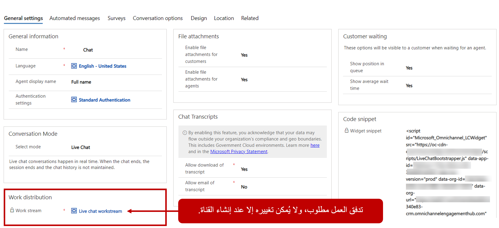
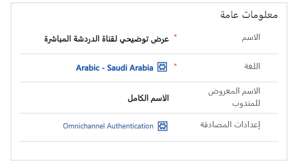
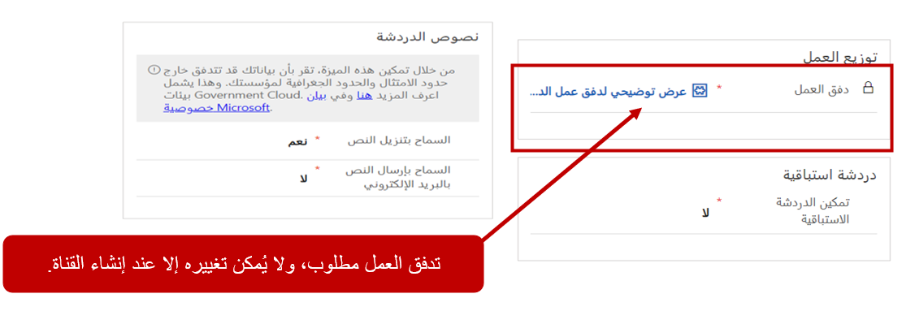
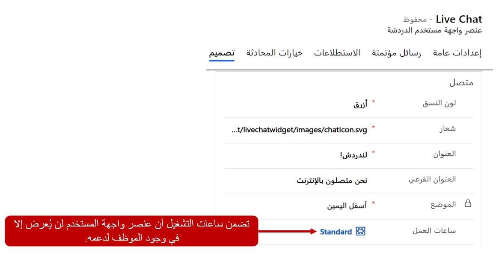
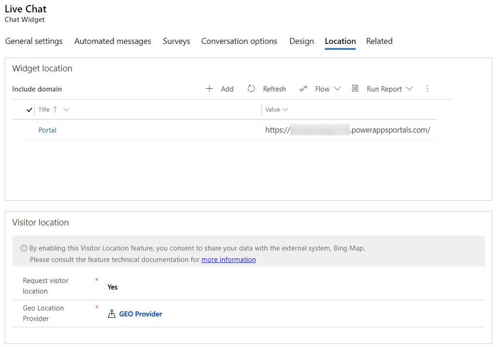

عندما تكون المؤسسة مستعدة لبدء التواصل مع العملاء من خلال حل المحادثة المباشرة، سوف يحتاجون إلى إنشاء قناة محادثة. بناء على احتياجات المؤسسة، يمكنهم إنشاء قناة محادثة واحدة أو عدة قنوات لدعم سيناريوهات مختلفة. على سبيل المثال، قد تنشئ المؤسسة أدوات محادثة متعددة تستهدف مناطق تركيز مختلفة حتى تتمكن من نشرها عبر مواقع ويب مختلفة.  

يتم إنشاء القنوات في تطبيق إدارة القناة متعددة الاتجاهات، ويمكن إضافتها عن طريق تحديد **المحادثة** ضمن عنوان **القنوات**.  يجب أن تستند قنوات المحادثة إلى تدفقات العمل. قبل أن يمكن إضافة قناة محادثة، يجب أن يكون هناك تدفق عمل محادثة واحد على الأقل في التطبيق.  

يتوفر مزيد من المعلومات حول [إنشاء عمليات تدفق العمل](https://docs.microsoft.com/dynamics365/omnichannel/administrator/work-streams-introduction#create-a-work-stream/?azure-portal=true). 

تحتوي قناة المحادثة على خمس علامات تبويب يمكنك استخدامها لتحديد السلوك العام للعنصر المصغر:

-   **التفاصيل الأساسية** - تعرف معظم قدرات سلوك القناة مثل كيفية توزيع عناصر العمل ومرفقات الملفات ونصوص المحادثة وخيارات قائمة الانتظار.

-   **التصميم** - يحدد كيفية ظهور عنصر واجهة المستخدم، مثل لون عنصر واجهة المستخدم وخيارات العلامة التجارية والموقع العام على الشاشة.

-   **استطلاع ما قبل المحادثة** - يستخدم في سيناريوهات حيث ترغب المؤسسات في توفير مكان لالتقاط البيانات من المستخدمين قبل بدء الاستطلاع.

-   **الموقع** - يحدد معلومات الموقع على المكان الذي يتم نشر القطعة ويوفر القدرة على تمكين تتبع الزائر على القطعة.

-   **خيارات المحادثة** - توفر إمكانية استخدام تطبيقات الجهات الخارجية لتوفير إمكانيات التصفح المشترك ومشاركة الشاشة.  

## تعريف تفاصيل قناة المحادثة

يتم تعريف معظم الإعدادات المرتبطة بكيفية تصرف قناة محادثة في علامة التبويب **التفاصيل الأساسية**. تتضمن علامة التبويب عدة مقاطع يمكنك استخدامها لتكوين سلوكيات مختلفة:

-   **معلومات عامة** - تتضمن التفاصيل الأساسية مثل اسم القناة واللغة واسم عرض المندوب وإعدادات المصادقة.

-   **توزيع العمل** - يحدد تدفق العمل المستخدم لمعالجة توزيع العناصر من القناة.

-   **محادثة استباقية** - تمكن أداة المحادثة من إشراك العملاء بشكل استباقي بدلا من انتظارهم لإشراك القطعة.

-   **مرفقات الملفات** - تمكن من قدرة العملاء و/أو العملاء على إرفاق الملفات بنافذة محادثة.

-   **نسخ المحادثة المكتوبة** - توفر للعملاء القدرة على تنزيل نسخ المحادثة المكتوبة.

-   **موضع قائمة الانتظار** - يعرض موضع العميل الحالي في قائمة انتظار.

-   **القصاصة البرمجية** - تُستخدم لنشر عنصر واجهة المستخدم على المداخل.

## العمل مع أسماء عرض المندوب

قد لا ترغب بعض المؤسسات في عرض الأسماء الكاملة لوكلائها في جلسات المحادثة. وبدلا من ذلك، قد يفضلون عرض الاسم الأول أو الأخير للعميل فقط لتوفير المزيد من عدم الكشف عن الهوية. يمكن للمنظمة اختيار استخدام إصدارات مبسطة من أسماء المندوب أو حتى أسماء مختلفة لإبقائها مجهولة. على سبيل المثال، قد يفضل مندوب يدعى Nicholas أن يُدعى Nick.  

يمكن للمؤسسات تعريف كيفية عرض اسم المندوب في عنصر واجهة المستخدم من حقل **اسم عرض المندوب**. يمكن تعيين أسماء عرض المندوب إلى أحد الخيارات التالية:

-   **الاسم الكامل** - يعرض الاسم الكامل للمندوب.

-   **الاسم الأول** - يعرض الاسم الأول فقط للمندوب (يتم تحديد هذا الخيار افتراضياً).

-   **الاسم الأخير** - يعرض فقط الاسم الأخير للمندوب.

-   **اسم اللقب** - يعرض لقب المندوب.

    إذا لم يتوفر اسم لقب، يتم عرض الاسم الكامل للمندوب

## إعدادات المصادقة

عند نشر أدوات المحادثة على مدخل، يمكن لأي مستخدمين قاموا بالفعل بالمصادقة على تلك البوابة تمرير بيانات اعتمادهم المصادق عليها إلى أداة المحادثة. تتيح هذه العملية للنظام مطابقة المستخدم مع معلومات السجل في Dynamics 365. عند تحميل محادثة، يمكن ملء معلومات العميل الخاصة بهذا العميل.  

إذا تم تكوين إعدادات المصادقة لمدخل معين في التطبيق، يمكن تعريف هذه الإعدادات في حقل **إعدادات المصادقة** في المحادثة.  

تتوفر معلومات إضافية حول [إنشاء إعدادات مصادقة المحادثة](https://docs.microsoft.com/dynamics365/omnichannel/administrator/create-chat-auth-settings/?azure-portal=true). 

## توزيع عمل القناة

تعرف تدفقات العمل كيفية توجيه عناصر العمل من قناة وتوزيعها على المندوبين. عند نشر القناة متعددة الاتجاهات لـ Customer Service، يتم إنشاء دفق عمل محادثة مباشر افتراضي للمؤسسة تلقائياً. عند إنشاء قناة، يجب أن تكون مقترنة بتدفق عمل موجود. سيتم تعيين كل قناة محادثة جديدة لاستخدام عمل المحادثة الافتراضي. يمكن تغيير هذا الإعداد عند إنشاء قناة.
ومع ذلك، بعد حفظ السجل، لا يمكن تغيير تدفق العمل. لإجراء تغييرات، ستحتاج إلى حذف أداة المحادثة ثم إنشاء أداة جديدة.

## إضفاء الطابع الشخصي على مظهر أداة المحادثة

تقوم معظم المؤسسات بوسم عناصرها لتبدو بطريقة محددة. تساعد العلامة التجارية العملاء على التعرف على من يعملون معه وتساعد على توفير رحلة متسقة. عند إنشاء أداة محادثة، يمكن للمؤسسات تخصيص العناصر المرئية للعنصر واجهة المستخدم لمحاذاة أفضل مع علامتها التجارية.  

توفر علامة التبويب **تصميم** عدة خيارات للمؤسسات لتخصيص عنصر واجهة مستخدم المحادثة لتناسب مؤسستها على أفضل وجه:

-   **لون السمة** - يتوفر اثنا عشر لوناً معرفاً مسبقاً للنسق.

-   **الشعار** - يحدد عنوان URL للشعار الذي سيتم استخدامه في عنصر واجهة مستخدم المحادثة.

-   **العنوان** - عنوان عنصر واجهة المستخدم الذي يتم عرضه على عنصر واجهة مستخدم المحادثة عندما يتم تصغيره وتكبيره.

-   **العنوان الفرعي** - النص الذي يتم تقديمه تحت العنوان على عنصر واجهة المستخدم.

-   **الموضع** - يحدد مكان عنصر واجهة المستخدم على الشاشة.

-   **ساعات التشغيل** - تحدد متى سيكون عنصر واجهة المستخدم متوفراً.

## ‏‫العمل باستخدام معلومات الموقع

تتيح علامة التبويب **الموقع** للمؤسسات تحديد مواقع الويب والنطاقات التي يجب عرض عنصر واجهة المستخدم عليها. في قسم **موقع عنصر واجهة المستخدم** ، يمكن للمؤسسات تحديد نطاق موقع الويب حيث يجب إظهار عنصر واجهة مستخدم المحادثة. يجب أن لا يتضمن تنسيق المجال البروتوكول (على سبيل المثال، **http** أو **https**).

لا يتعين على المؤسسات تحديد مجال. إذا لم يتم تحديد نطاقات، يمكن تضمين أداة المحادثة على أي موقع ويب دون قيود. إذا تم تحديد مجال، يمكن استضافة أداة المحادثة فقط على النطاق المحدد.

عندما ترغب مؤسسة في التقاط بيانات جغرافية عن العميل الذي بدأ المحادثة، فيمكنها تمكينها في قسم  **موقع الزائر** . في هذا القسم، يمكن للمؤسسات تمكين القدرة على طلب موقع الزائر. مطلوب سجل موفر الموقع الجغرافي، وسوف تحتاج إلى إنشائه قبل تمكينه على واجهة عنصر مستخدم المحادثة.

يتوفر مزيد من المعلومات حول [اكتشاف موقع الزائر](https://docs.microsoft.com/dynamics365/omnichannel/administrator/geo-location-provider/?azure-portal=true).