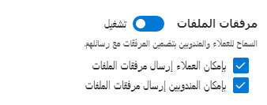
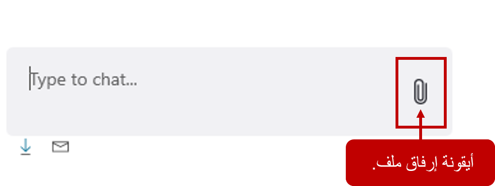

يمكن نسخ المحادثات وتنزيلها كملف لحفظ السجلات. تركز هذه الوحدة على هذه القدرات.

## تمكين قناة محادثة للنصوص

قد يرغب بعض العملاء في الحصول على سجل لما حدث أثناء جلسة الدعم. وقد يحتفظون بجلسة العمل لسجلاتهم أو يشيرون إليها في المستقبل. على سبيل المثال، قد يتضمن المندوب رابطاً إلى موقع مفيد أو قد يكون قدم معلومات وجدها العميل مفيدة. من خلال وجود نسخة من المحادثة مفيد، يمكن للعميل تحديد موقع المعلومات اللازمة دون عناء.    

تسمح القناة متعددة الاتجاهات لـ Customer Service للعملاء لتنزيل أو تلقي نسخة بريد إلكتروني من نسخ المحادثة المكتوبة الخاصة بهم. بعد تمكين خيارات التنزيل والرسالة الإلكترونية، يمكن للعملاء طلب نسخة من نسخة المحادثة المكتوبة في أي وقت أثناء جلسة المحادثة. إذا لم يطلبوا نسخة أثناء المحادثة، سيتم تذكيرهم في نهاية المحادثة بطلب نسخة مكتوبة. 

في قسم **ميزات المستخدم** في عنصر واجهة مستخدم **المحادثة**، حيث يوجد قسم **النسخ المكتوبة للمحادثة**. يتوفر الخياران التاليان:   

-   **السماح بتنزيل النسخ المكتوبة** - السماح لعملائك بتنزيل نسخة المحادثة المكتوبة.

-   **السماح ببريد إلكتروني النسخ المكتوبة** - السماح لعملائك بإرسال نسخة المحادثة المكتوبة كرسالة بريد إلكتروني.

    إذا تم تعيين **السماح ببريد إلكتروني النسخ المكتوبة** إلى **نعم**، يجب عليك أيضاً تقديم المعلومات التالية:

    -   **قالب الرسالة الإلكترونية** - تحديد قالب الرسالة الإلكترونية الذي يجب استخدامه عند إرسال النسخة المكتوبة.

        -   استخدم قالب بريد إلكتروني يتم توفيره بواسطة القناة متعددة الاتجاهات لـ Customer Service.

        -   قم بتعديل القالب الذي يتم توفيره بواسطة القناة متعددة الاتجاهات لـ Customer Service.

        -   أنشئ قالب بريدك الإلكتروني.

    -   **من علبة البريد** - يحدد سجل صندوق البريد الذي سيتم استخدامه لإرسال النسخة المكتوبة.

        يجب تكوين علبة بريد للمستخدم الذي سيتم استلام الرسالة الإلكترونية منه قبل استخدامه.

## طلب النسخ المكتوبة أثناء المحادثة 

بعد تكوين النسخ المكتوبة، سيرى العملاء الرموز في الجزء السفلي من عنصر واجهة مستخدم المحادثة. وتستخدم هذه الرموز لبدء رسالة بريد إلكتروني أو تحميل نسخة من نسخة المحادثة المكتوبة الخاصة بهم. سيتم إرسال النسخة المكتوبة إلى العميل عند انتهاء المحادثة.

-   **تنزيل نسخة المحادثة المكتوبة** - حدد رمز التحميل في الجزء السفلي من شاشة المحادثة.

-   **إرسال نسخة المحادثة المكتوبة بواسطة الرسالة الإلكترونية** - حدد رمز الرسالة الإلكترونية في الجزء السفلي من شاشة المحادثة.

في نهاية محادثة المحادثة، تظهر النافذة التالية، لتذكير العميل بأنه يمكنه إما تنزيل نسخة من نص المحادثة الخاص به أو إرسال نسخة عبر الرسالة الإلكترونية إلى نفسه.

## تكوين إمكانية مرفق الملف

في بعض الأحيان، أثناء المحادثة، قد يحتاج المندوبون والعملاء إلى إرسال ملفات دعم إلى بعضهم البعض للمساعدة في العثور على حل. على سبيل المثال، إذا تلقى أحد العملاء خطأ أثناء محاولة إكمال عملية، فيمكنه إرسال لقطات الشاشة للخطوات ورسالة الخطأ إلى المندوب. قد يرسل المندوب للعميل ورقة بيضاء أو دليل استكشاف الأخطاء وإصلاحها خطوة بخطوة.

لدعم هذه السيناريوهات، يمكن للمؤسسات تمكين مرفقات الملفات في محادثة. بعد تمكين المرفقات، يمكن للعملاء والمندوبين إرسال الملفات لمشاركة مزيد من المعلومات حول مشكلاتهم. وترتبط جميع الملفات المنقولة بالمحادثة. إذا كان العامل الذي يعمل على هذه المشكلة نقل المحادثة إلى عامل آخر، يمكن أيضا الوصول إلى هذا المندوب الجديد الملفات المرفقة في المحادثة.

 يتوفر خياران لك لمرفق الملف:

-   **تمكين مرفقات الملفات للعملاء** - يسمح للعملاء بإرسال الملفات إلى المندوبين.

-   **تمكين مرفقات الملفات للمندوبين** - السماح للمندوبين بإرسال الملفات إلى العملاء.

## إرفاق الملفات أثناء المحادثة

بعد تمكين مرفقات الملفات، سيتم عرض رمز مرفق في عنصر واجهة مستخدم المحادثة. عندما يقوم العملاء أو المندوبون بتحديد الرمز، سيتم توفير القدرة على تحديد الملف الذي يريدون إرفاقه.

> [!IMPORTANT]
> تتبع الملفات التي يتم إرفاقها في المحادثة نفس القيود المستخدمة لإرفاق الملفات في سجلات **الملاحظات**. إذا حاول عميل إرفاق نوع ملف غير معتمد أو تجاوز الحد الأقصى لحجم الملف أو يحتوي على محتوى ضار، فلا يتم تحميل الملف. سوف يتلقى العميل رسالة في إطار المحادثة توضح المشكلة. 

يتم تحديد حد حجم الملف للمرفقات وأنواع الملفات غير المدعومة في عميل الويب.

يتوفر مزيد من المعلومات حول [كيفية تكوين حدود حجم الملف وأنواع الملفات غير المدعومة](/dynamics365/omnichannel/administrator/configure-file-attachment/?azure-portal=true). 
