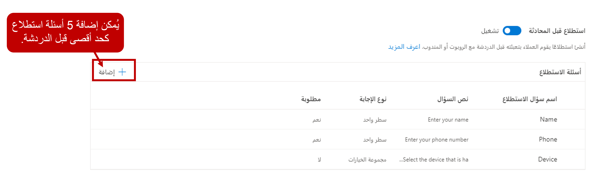

تعد استطلاعات الدردشة طريقة رائعة ليس فقط للحصول على تعليقات العملاء حول تجاربهم مع مؤسستك، ولكن أيضاً مدخلات قيمة قبل الانخراط في محادثة مع أحد العملاء. على سبيل المثال، يمكنك استخدام استطلاع ما قبل الدردشة للحصول على معلومات مثل اسم العميل أو الحالة التي يستفسر عنها. عندما يتم تسليم المحادثة إلى مندوب، يمكن استخدام هذه المعلومات للتأكد من أنه يتم تحميل الحساب الصحيح وسجل الحالة للسياق.
 
توفر القناة متعددة الاتجاهات لـ Customer Service خيارين للاستطلاع مع قنوات الدردشة:  

- استطلاعات ما قبل الدردشة

- استطلاعات ما بعد الدردشة

## التعامل مع استطلاعات ما قبل المحادثة 

عندما يبدأ العملاء في طلبات المحادثة، تأكد من حصولك على أكبر قدر ممكن من المعلومات منهم. بعد ذلك، ستتمكن من تقديم تفاصيل دقيقة عند تمرير المحادثة إلى المندوب. قد تتضمن هذه المعلومات تفاصيل العميل أو الحالة حتى يتمكن المندوب من فهم السياق المحيط بالمحادثة بشكل أكثر فاعلية. يمكن أن تؤثر عوامل متعددة على مقدار البيانات المتاحة للمندوب عند تسليم الطلب إليه.  

تتضمن السيناريوهان الشائعان لبدء المحادثة ما يلي:

-   **محادثة مصدق عليها** - قام المستخدم بتسجيل الدخول إلى موقع الويب أو المدخل الذي بدأت منه المحادثة.

-   **محادثة غير مصدق عليها** - المستخدم لم يسجل الدخول إلى موقع الويب أو المدخل الذي تم بدء طلب المحادثة منه.

## محادثة مصدق عليها

في الحالات التي يبدأ فيها مستخدم مصدق عليه طلب محادثة دردشة، يتم تمرير تفاصيل المستخدم واستخدامها لتحديد وتحميل التفاصيل المتعلقة بذلك العميل في صفحة **ملخص العميل**. يضمن هذا الأسلوب أن المندوب الذي يعمل على صنف ما مزوداً بالتفاصيل المتعلقة بالعميل. في بعض الحالات، قد يحتاج المندوب إلى مطالبة العميل بالتحقق مما إذا كانت هذه المحادثة مرتبطة بحالة موجودة؛ إذا كان الأمر كذلك، فستحتاج الحالة إلى ربطها يدوياً بالمحادثة.    

## محادثة غير مصدق عليها

عند بدء محادثة غير مصدق عليها، لا تتوفر معلومات خاصة بالعميل ليتم تمريرها وتحميلها في صفحة **ملخص العميل**. اعتماداً على كيفية تكوين أداة المحادثة، ستتوفر تفاصيل حول المحادثة مثل وقت بدئها وتفاصيل الموقع وما إلى ذلك. ومع ذلك، نظراً لعدم توفر بيانات مستخدم للتحميل، فمن المحتمل أن تحتاج المحادثة إلى الارتباط بكل من العميل الحالي وسجل الحالة. نتيجة لذلك، سيتعين على المندوب قضاء وقت إضافي في تحديد موقع المعلومات أو التعامل مع العميل للحصول على هذه المعلومات.  

للمساعدة في هذه العملية، يمكنك تكوين استطلاع ما قبل المحادثة للحصول على المعلومات الأساسية من العميل قبل بدء المحادثة. عند استخدامه لمحادثات غير مصدق عليها، قد يلتقط الاستطلاع معلومات مثل اسم العميل ورقم الهاتف وعنوان البريد الإلكتروني ورقم الحالة. بالنسبة للمحادثات المصدق عليها، قد يركز الاستطلاع على رقم الحالة ونوع الجهاز وما إلى ذلك.    

## استطلاعات التصميم

يمكنك تمكين استطلاعات ما قبل المحادثة في علامة التبويب **السلوكيات** في قناة المحادثة عن طريق تعيين حقل **استطلاع ما قبل المحادثة** إلى **نعم**.

الهدف الرئيسي من استطلاع ما قبل المحادثة هو الحصول على معلومات بسيطة عن العميل يجب إتاحتها للمندوب عند بدء العمل على المحادثة. لهذا السبب، تقتصر استطلاعات ما قبل المحادثة على خمسة أسئلة كحد أقصى.

سيحتوي كل سؤال على البيانات التالية:

-   **اسم سؤال الاستطلاع** - اسم السؤال.

-   **نص السؤال** - النص الذي سيتم عرضه للشخص الذي يشارك في الاستطلاع.

-   **نوع الإجابة** - نوع الإجابة التي سيقدمها المستخدمون. يمكن تعيين الأسئلة على أحد الخيارات التالية:

    -   **سطر واحد** - يمكن للمستخدم إدخال سطر واحد من النص.

    -   **أسطر متعددة** - يمكن للمستخدم إدخال أسطر متعددة من النص.

    -   **مجموعة الخيارات** - يحدد المستخدم خياراً في قائمة منسدلة.

        يجب فصل الخيارات بفاصلة منقوطة.
    
    -   **موافقة المستخدم** - سيقوم المستخدم بتوفير الموافقة.

-   **مطلوب** - يحدد ما إذا كان السؤال مطلوباً أم لا.

إذا كنت بحاجة إلى تغيير الترتيب الذي يتم تقديم الأسئلة به، فحدد السؤال ثم استخدم **تحريك لأعلى** أو **تحريك لأسفل** أزرار لوضع السؤال في المكان الذي تريده.

## استخدم استجابات الاستطلاع لتحديد العملاء

عند بدء محادثة، يبحث النظام عن الحسابات وجهات الاتصال والحالات. إذا تم العثور على تطابق، سيتم تحميل السجل في صفحة **ملخص العميل**.

اعتماداً على الكيان الذي يبحث عنه، سيبحث النظام في الحقول التالية:

-   **الحسابات وجهات الاتصال** - **الاسم**، **الرسالة الإلكترونية**، أو حقول **رقم الهاتف** .

-   **الحالات** - **حقل رقم الحالة** .

كما ذكرنا سابقاً، تتمثل إحدى ميزات استطلاعات ما قبل المحادثة في قدرتها على التقاط المعلومات التي ستساعد في ملء أكبر قدر ممكن من البيانات في صفحة **ملخص العميل** . هذه العملية لا تحدث تلقائياً. يحتاج التطبيق إلى معرفة الحقول التي تحتوي على البيانات التي سيتم البحث عنها للعثور على السجل الصحيح. للمساعدة في التأكد من أن كل إجابة سؤال يتم البحث عنها بشكل مناسب، يجب إدخال أسئلة استطلاع ما قبل المحادثة بالتنسيق التالي.

أسئلة ما قبل المحادثة لدردشة غير مصدق عليها.

| اسم السؤال | نوع الإجابة |
|---------------|-------------|
| رقم الحالة    | سطر واحد |
| الاسم          | سطر واحد |
| الرسالة الإلكترونية         | سطر واحد |
| الهاتف         | سطر واحد |

نظراً لأنه سيتم استخدام تفاصيل المستخدم الذي قام بتسجيل الدخول للبحث عن معلومات الاتصال وتحميلها للمحادثات المصدق عليها، يلزم فقط سؤال واحد قبل المحادثة يسأل عن رقم الحالة.

| اسم السؤال | نوع الإجابة |
|---------------|-------------|
| رقم الحالة    | سطر واحد |

## التعامل مع استطلاعات ما بعد المحادثة

يمكنك تكوين عنصر واجهه مستخدم لإظهار استطلاع بالعملاء يمكنهم الاستجابة لهم بعد إنهاء المحادثة.  عند تمكين استطلاع ما بعد المحادثة لقناة ما، سيظهر الاستطلاع للعميل بعد أن ينهي المندوب أو العميل المحادثة. عند تكوين الاستطلاع، يمكنك استخدام الإعدادات الخاصة بخيارات الاستجابة المتوفرة في Dynamics 365 Customer Voice. يمكنك تمكين استطلاعات ما بعد المحادثة للقنوات المباشرة، ورسائل SMS، والوسائط الاجتماعية، وMicrosoft Teams، والقنوات المخصصة.
  
يمكنك تكوين استطلاعات ما بعد المحادثة في تطبيق **مركز مسؤولي Customer Service**. افتح قناه المحادثة التي ترغب في تمكينها للاستطلاع بعد المحادثة، وقم بتعيين حقل **استطلاع ما بعد المحادثة** إلى **تشغيل**. 

ستحتاج إلى تحديد التالي:

- **استطلاع Dynamics 365 Customer Voice**: حدد استطلاع Dynamics 365 Customer Voice الذي تريد استخدامه.  

- **كيف يجب إرسال الاستطلاع**: حدد كيف سيتم إرسال الاستطلاع إلى العميل.  يمكنك اختيار اما ادراج استطلاع في المحادثة أو إرسال ارتباط الاستطلاع إلى المحادثة.  عند اختيار إرسال ارتباط الاستطلاع، يمكنك تحديد الرسالة التي ترغب في تقديمها للعملاء.   

- **استطلاع محادثة الروبوت**: يمكنك تقديم استطلاعات عن المحادثات التي لا تستخدم المندوبين البشريين.  

إذا قمت بتمكين **استطلاع ما بعد المحادثة** لإحدى المحادثات، فبعد انتهاء المحادثة، تتم مشاركه الاستطلاع الذي تم تصميمه مسبقاً مع العميل. يسمح لك هذا الاستطلاع بالاحتفاظ بالمعلومات الخاصة بالعملاء للخدمة الموفرة. 

يمكن اعتبار أي محادثة مغلقة عند حدوث أحد السيناريوهات التالية:

- يقوم المندوب بإغلاق محادثة الدردشة.

- يقوم العميل بإغلاق محادثة الدردشة.

- يقوم النظام بإغلاق محادثة الدردشة بعد وقت محدد مسبقاً.

بالنسبة لمحادثات الدردشة المباشرة، سيتلقى العملاء أسئلة استطلاع في نفس المحادثة أو من خلال رابط ينقلهم إلى موقع خارجي. بالنسبة إلى الرسائل النصية القصيرة والقنوات الاجتماعية، سيتم توفير رابط الاستطلاع. 

للمزيد حول إنشاء استطلاعات Dynamics 365 Customer Voice، راجع [إنشاء استطلاعات باستخدام Dynamics 365 Customer Voice](/learn/paths/create-surveys/). 