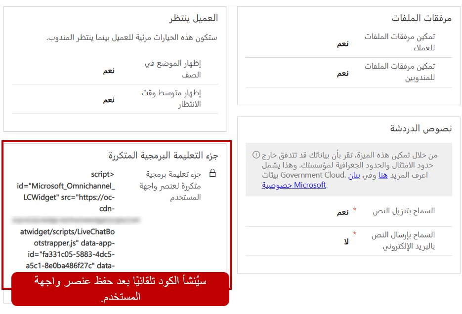
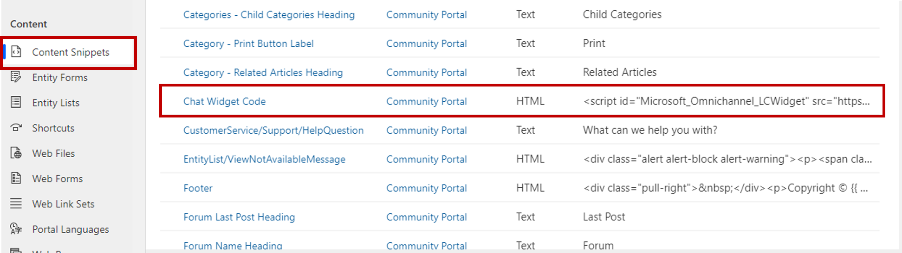
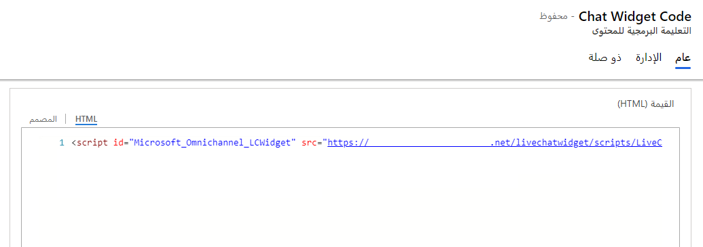
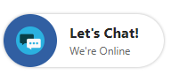
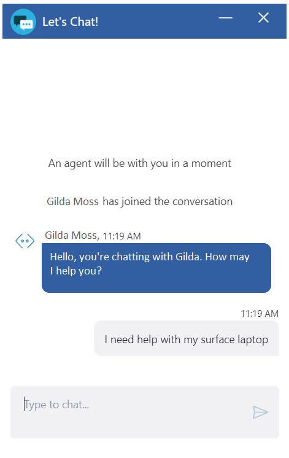
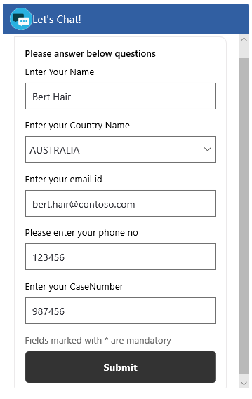
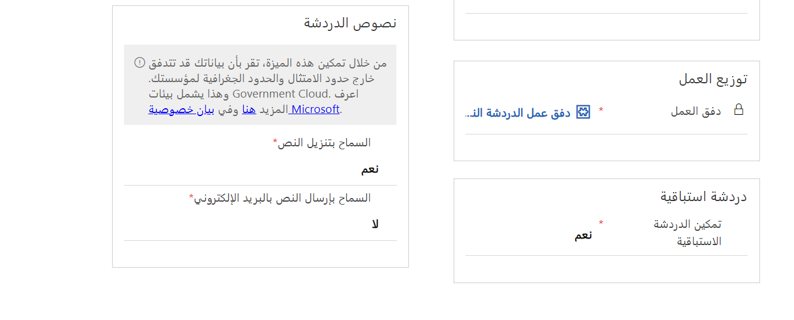
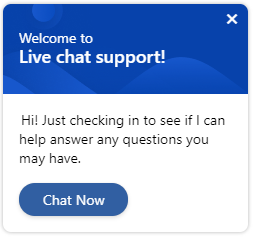
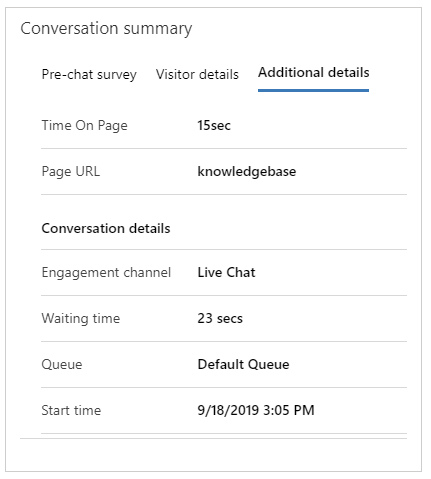

بعد إنشاء قناة للمحادثة، يجب أن يتم نشرها حتى يتمكن العملاء من بدء التفاعل مع مؤسستك. يمكن نشر عناصر واجهة المستخدم للمحادثة عبر قناة متعددة الاتجاهات على أي بوابة يمر بها العملاء. تستخدم العديد من المؤسسات مداخل Microsoft Dynamics 365 للتفاعل مع عملائها وتزويدهم بإمكانيات الخدمة الذاتية. وفي هذه الحالات، يمكن إضافة عناصر واجهة المستخدم للمحادثة عبر قناة متعددة الاتجاهات إلى بوابة العملاء.

> [!NOTE]
> يشار إلى مداخل Dynamics 365 الآن باسم مداخل Power Apps، حيث تمثل في الأساس الحل نفسه، باستثناء أنه يمكن نشرها وإدارتها عبر [Power Apps](https://make.powerapps.com/?azure-portal=true). لا تزال مداخل Power Apps مدعومة بتطبيق يستند إلى النموذج. 

عند إنشاء عنصر واجهة المستخدم للمحادثة، يتم إنشاء قصاصة برمجية لعنصر واجهة المستخدم. تحتوي القصاصة البرمجية هذه على معلومات العنوان المستخدمة في تشغيل عنصر واجهة المستخدم للمحادثة. يمكن تضمين هذه التعليمات البرمجية في مدخل التعامل مع العملاء.

لنشر عنصر واجهة المستخدم للمحادثة عبر مدخل Power Apps، سيتعين على المستخدم الذي يمتلك حق الوصول إلى تطبيق إدارة القناة متعددة الاتجاهات وحقوق المسؤول للوصول إلى مداخل Power Apps فتح عنصر واجهة المستخدم للمحادثة التي يريد تضمينها في مداخل Power Apps. من علامة التبويب **تفاصيل أساسية** ، يمكن للمستخدم نسخ رمز القصاصة البرمجية لعنصر واجهة المستخدم من المقطع **قصاصة برمجية**.



بعد نسخ القصاصة البرمجية، يجب إضافتها إلى مدخل Power Apps. يمكن تنفيذ هذه المهمة من خلال تطبيق مداخل Dynamics 365 الذي يستند إلى النموذج. يمكن الوصول إلى التطبيق من شاشة التطبيقات في بيئتك، على سبيل المثال `https://mytrainingenviornment.crm.dynamics.com/apps`

يمكنك أيضًا الوصول إلى التطبيق من خلال الانتقال إلى [Powerapps](https://make.powerapps.com/?azure-portal=true) وتحديد البيئة التي تريد العمل فيها وفتح تطبيق مدخل Dynamics 365 من قائمة **التطبيقات**.

لضمان نشر عنصر واجهة المستخدم بشكل مناسب، يتضمن تطبيق المدخل قصاصة برمجية لمحتوى خاص يسمى **رمز عنصر واجهة مستخدم المحادثة**. تُستخدم القصاصة البرمجية للمحتوى هذه لتوزيع عناصر واجهة مستخدم المحادثة في موقع المدخل. لا يقتصر استخدام القصاصة البرمجية للمحتوى على عناصر واجهة المستخدم الخاصة بالمحادثة ضمن القناة متعددة الاتجاهات؛ بل يمكن استخدامها أيضًا مع أي عنصر واجهة مستخدم يتم توزيعه عبر قصاصات برمجية. انتقل إلى **القصاصات البرمجية للمحتوى** أسفل العنوان **المحتوى** وافتح القصاصة البرمجية **رمز عنصر واجهة مستخدم المحادثة**. 



تتضمن علامة التبويب **عام** حقل HTML الذي يمكن استخدامه لتضمين عنصر واجهة المستخدم. بشكل افتراضي، سيتم تعيين الحقل لاستخدام المصمم لأن القصاصة البرمجية لعنصر واجهة المستخدم تعتمد على HTML. يجب التأكد من تحديد علامة التبويب  **HTML** . عند استخدام علامة التبويب **HTML‎**، يمكنك لصق القصاصة البرمجية لعنصر واجهة مستخدم المحادثة في الحقل.

> [!NOTE]
> تأكد من لصق سطر التعليمات البرمجية بالكامل في الحقل بشكل صحيح. وبخلاف ذلك، لن يعمل عنصر واجهة المستخدم، ومن المحتمل ألا يتم تزويدك بخطأ مرئي يشير إلى أن التعليمات البرمجية قد تم لصقها بشكل غير صحيح. هناك طريقة بسيطة للتحقق من صحة كل شيء قبل مغادرة الصفحة تتمثل في العودة مرة أخرى إلى علامة التبويب **المصمم**. وإذا بدا عنصر واجهة مستخدم فارغًا، فسيتم إدخال التعليمات البرمجية بشكل صحيح. وإذا كانت تعليماتك البرمجية مرئية، فلن يتم لصقها بشكل صحيح، كما لن تُقرأ كبرنامج نصي. يجب أن تنسخ التعليمات البرمجية وتلصقها في علامة التبويب **HTML** مرة أخرى.



بعد حفظ سجل القصاصة البرمجية للمحتوى، سيتم تضمين عنصر واجهة مستخدم المحادثة في المدخل.

> [!IMPORTANT]
> في معظم الحالات، من المفترض أن يكون عنصر واجهة مستخدم المحادثة مرئياً بعد وقت قصير من حفظه. ومع ذلك، يمكن أن تستغرق التغييرات التي يتم إجراؤها على المدخل من تطبيق بوابة Dynamics 365 ما يصل إلى 15 دقيقة حتى تظهر. يمكنك تحديث صفحة المدخل بشكل دوري لمعرفة ما إذا كان قد تم نشر عنصر واجهة المستخدم.

## <a name="control-which-chat-widget-is-presented-to-users"></a>التحكم في عنصر واجهة مستخدم المحادثة الذي يتم تقديمه للمستخدمين

غالبًا ما تحدث سيناريوهات حيث تريد مؤسستك استخدام عناصر واجهة مستخدم محادثة مختلفة اعتمادًا على ما إذا كان العميل الذي بدأ المحادثة قد تمت مصادقته أم لا.  

عند تكوين قناة للمحادثة، يمكن أن تحتوي على استبيان واحد فقط تم تكوينه قبل المحادثة. عندما يتم تكوين قناة باستخدام استبيان، سيتم طرح كل سؤال في هذا الاستبيان على أي شخص يبدأ محادثة محادثة باستخدام عنصر واجهة المستخدم هذا. إذا بدأ المستخدم محادثة عبر القناة، سيتم عرضه على الاستبيان بأكمله ويُطلب منه الإجابة عن جميع الأسئلة، حتى إذا تمت مصادقة المستخدم مسبقًا قبل بدء الاستبيان.  

ولهذا السبب، قد تجد المؤسسات أنه من المفيد تكوين عنصرين منفصلين من عناصر واجهة مستخدم المحادثة. يحتوي أحد عناصر واجهة مستخدم المحادثة على أسئلة تتعلق برقم الحالة والاسم والبريد الإلكتروني ورقم الهاتف، حيث تستهدف المستخدمين غير المصادق عليهم. وتستهدف قناة أخرى المستخدمين المصادق عليهم وستشمل عناصر مثل رقم الحالة. وفي هذا السيناريو، يمكن استخدام البرامج النصية لتحديد عنصر واجهة مستخدم المحادثة الذي سيتم استخدامه استنادًا إلى ما إذا كان المستخدم الذي بدأ المحادثة تمت المصادقة عليه أم لا.    

لتكوين عنصرين منفصلين من عناصر واجهة مستخدم المحادثة، اتبع الخطوات التالية: 

1. قم بإنشاء عنصرين من عناصر واجهة مستخدم المحادثة، حيث يتم تخصيص عنصر للزائرين المصادق عليهم وتخصيص الآخر للزائرين غير المصادق عليهم. 

1. بالنسبة للزائرين غير المصادق عليهم، اطرح عليهم استبيان ما قبل المحادثة لمعرفة المزيد عنهم.

1. بالنسبة للزائرين المصدق عليهم، يمكنك البدء باستخدام PVA أو المندوب المباشر. 

1. لتمكين هذا التكوين، أضف رمز حالة JavaScript التالي على الصفحة التي تقوم فيها بنشر عناصر واجهة مستخدم المحادثة: 

``` javascript 

<!—Embed script for auth chat widget-->

<!—Embed script for unauth chat widget-->

```

## <a name="customer-experience-of-chat-widget"></a>تجربة العملاء لعنصر واجهة مستخدم المحادثة

بعد تكوين عنصر واجهة مستخدم المحادثة، سيتم عرضه في المدخل بوضع مصغر. إذا تم تسجيل دخول المندوبين إلى القناة متعددة الاتجاهات لـ Customer Service وكان لديهم حق الوصول إلى قناة الدعم هذه، فسيعرض عنصر واجهة المستخدم رسالة عبر الإنترنت. في حالة عدم توفر أي مندوب، سيتم عرض رسالة دون اتصالا بالإنترنت.



عندما يختار المستخدم عنصر واجهة المستخدم، فسيتم تكبيره حتى يتمكن المستخدم من بدء محادثة مع المندوب. يمكن تصغير عنصر واجهة المستخدم مرة أخرى إذا لزم الأمر. عندما يتم تصغير عنصر واجهة المستخدم، فسيتم عرض عدد الرسائل المستلمة. يمكن للمندوبين الاطلاع على الرسائل من خلال تحديد عنصر واجهة المستخدم مرة أخرى.

يعرض عنصر واجهة المستخدم الرسائل التي تم إرسالها من المشاركين في المحادثة والرسائل التي تم إنشاؤها بواسطة النظام خلال الأحداث، كما هو الحال عندما ينضم مندوب إلى محادثة أو عند انتقال محادثة إلى مندوب آخر.





عند تكوين محادثة للاستبيان، سيتم عرضها للمستخدم قبل بدء المحادثة. غالباً ما يتم استخدام البيانات التي يتم جمعها من الاستبيان للمساعدة في تقديم الحلول وتوصيل المستخدم بالمندوب المناسب. يمكن للعملاء إنهاء المحادثة عن طريق تحديد زر **إغلاق المحادثة**. يتم عرض رسالة تأكيد قبل انتهاء المحادثة.

## <a name="configure-a-chat-channel-for-proactive-chat"></a>تكوين قناة محادثة للمحادثة الاستباقية

تتيح المحادثة الاستباقية لمندوبي خدمة العملاء التفاعل مع العملاء من خلال دعوتهم تلقائيًا إلى محادثة للمحادثة استنادًا إلى القواعد التي تم تكوينها. تساعد هذه الميزة المؤسسات على التفاعل بشكل استباقي مع العملاء عند الحاجة إلى ذلك. المحادثة الاستباقية تساعد على تحسين تجربة العملاء وتعمل على إرضائهم.

يمكن استخدام معلومات حول تجربة المستخدم والوقت الذي يقضيه المستخدم على صفحة الويب والكثير من المعلومات لتحديد وقت التفاعل مع أحد العملاء. يمكنك التحكم في تجربة المحادثة الاستباقية باستخدام رسائل المشغل المخصصة والقواعد القابلة للتكوين لتحديد الجمهور المستهدف والإطار الزمني والموقع المحدد.

يمكن تمكين المحادثة الاستباقية في علامة التبويب **التفاصيل الأساسية** من قناة المحادثة.



يتم تحديد حالات بدء المحادثة الاستباقية في التعليمات البرمجية لصفحة الويب حيث يتم تضمين عنصر واجهة مستخدم المحادثة. إذا تم استيفاء الحالات، يتم عرض دعوة المحادثة الاستباقية بمساعدة API.

عند تمكين المحادثة الاستباقية، يتم عرض دعوة المحادثة للعملاء استنادًا إلى المشغلات المكونة.



يمكن للعميل اختيار قبول دعوة المحادثة أو إغلاقها. يتم إغلاق دعوة المحادثة تلقائيًا بعد دقيقة واحدة إذا لم يقبلها العميل.

عندما يقبل العميل دعوة المحادثة الاستباقية، يتلقى المندوب الإخطار.


يقبل المندوب بعد ذلك طلب المحادثة ويبدأ في التحدث مع العميل لتقديم المساعدة اللازمة. يتم تحميل [ملخص العميل](/dynamics365/omnichannel/agent/agent-oc/oc-customer-summary/?azure-portal=true) وعرضه إذا تطابقت تفاصيل العميل مع البيانات المخزنة.

إذا قام المسؤول أو المطور بتكوين علامة التبويب **تفاصيل إضافية** ، وإذا كانت متغيرات السياق الإضافية موجودة مثل الوقت المنقضي في صفحة وعنوان URL للصفحة من حيث يتم بدء المحادثة، ويتم عرضها في علامة التبويب **تفاصيل إضافية**.


