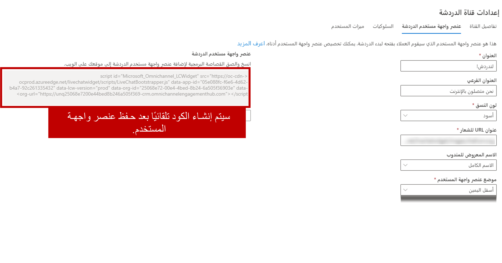
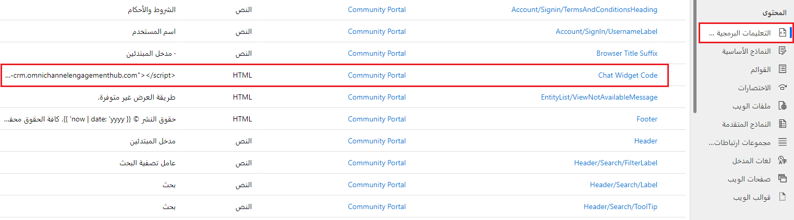
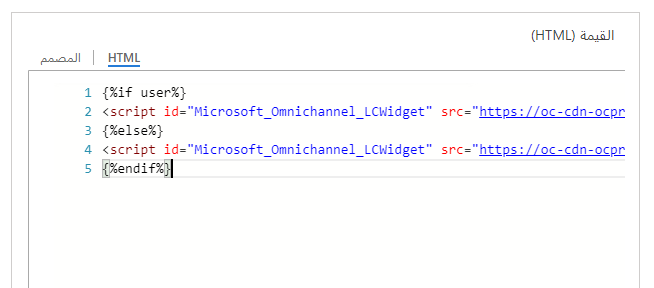

بعد إنشاء قناة للمحادثة، يجب أن يتم نشرها حتى يتمكن العملاء من بدء التفاعل مع مؤسستك. يمكن نشر عناصر واجهة المستخدم للمحادثة عبر قناة متعددة الاتجاهات على أي بوابة يمر بها العملاء. ستخدم العديد من المؤسسات **Microsoft Power Pages** لإنشاء مداخل للتفاعل مع عملائها وتوفير إمكانات الخدمة الذاتية لهم. وفي هذه الحالات، يمكن إضافة عناصر واجهة المستخدم للمحادثة عبر قناة متعددة الاتجاهات إلى بوابة العملاء.

عند إنشاء عنصر واجهة المستخدم للمحادثة، يتم إنشاء قصاصة برمجية لعنصر واجهة المستخدم. تحتوي القصاصة البرمجية هذه على معلومات العنوان المستخدمة في تشغيل عنصر واجهة المستخدم للمحادثة. يمكن تضمين هذه التعليمات البرمجية في مدخل التعامل مع العملاء.

لنشر عنصر واجهة مستخدم دردشة إلى مدخل Power Apps، استخدم تطبيق **مركز إدارة خدمة العملاء** لفتح عنصر واجهة مستخدم الدردشة الذي تريد استخدامه على المدخل.  في علامة التبويب **أداة الدردشة**، سترى قصاصةً من التعليمات البرمجية لأداة الدردشة. حدد الزر **نسخ** لنسخ التعليمات البرمجية.   

بعد نسخ قصاصة التعليمات البرمجية، ستحتاج إلى إضافته إلى مدخل **Power pages** من خلال تطبيق يستند إلى نموذج إدارة المدخل. يمكنك الوصول إلى التطبيق بالانتقال إلى [Power Apps](https://make.powerapps.com/?azure-portal=true)، وتحديد البيئة التي تريد العمل معها، وفتح تطبيق مدخل Dynamics 365 من قائمة **التطبيقات**.

لضمان نشر الأداة بنجاح، يتضمن تطبيق المدخل قصاصةً خاصة للمحتوى تسمى **التعليمات البرمجية لأداة الدردشة**. تُستخدم القصاصة البرمجية للمحتوى هذه لتوزيع عناصر واجهة مستخدم المحادثة في موقع المدخل. قصاصة المحتوى ليست فقط لأدوات دردشة القناة متعددة الاتجاهات؛ يمكن استخدامها مع أي عنصر واجهة مستخدم يتم نشره من خلال قصاصات التعليمات البرمجية. انتقل إلى **القصاصات البرمجية للمحتوى** أسفل العنوان **المحتوى** وافتح القصاصة البرمجية **رمز عنصر واجهة مستخدم المحادثة**. 

تتضمن علامة التبويب **عام** حقل HTML الذي يمكن استخدامه لتضمين عنصر واجهة المستخدم. بشكل افتراضي، سيتم تعيين الحقل لاستخدام المصمم لأن القصاصة البرمجية لعنصر واجهة المستخدم تعتمد على HTML. تحتاج إلى التأكد من تحديد علامة التبويب **HTML** . عند استخدام علامة التبويب **HTML‎**، يمكنك لصق القصاصة البرمجية لعنصر واجهة مستخدم المحادثة في الحقل.

> [!NOTE]
> تأكد من لصق سطر التعليمات البرمجية بالكامل في الحقل بشكل صحيح. وبخلاف ذلك، لن يعمل عنصر واجهة المستخدم، ومن المحتمل ألا يتم تزويدك بخطأ مرئي يشير إلى أن التعليمات البرمجية قد تم لصقها بشكل غير صحيح. هناك طريقة بسيطة للتحقق من صحة كل شيء قبل مغادرة الصفحة تتمثل في العودة مرة أخرى إلى علامة التبويب **المصمم**. وإذا بدا عنصر واجهة مستخدم فارغاً، فسيتم إدخال التعليمات البرمجية بشكل صحيح. وإذا كانت تعليماتك البرمجية مرئية، فلن يتم لصقها بشكل صحيح، كما لن تُقرأ كبرنامج نصي. يجب أن تنسخ التعليمات البرمجية وتلصقها في علامة التبويب **HTML** مرة أخرى.

بعد حفظ سجل القصاصة البرمجية للمحتوى، سيتم تضمين عنصر واجهة مستخدم المحادثة في المدخل.

> [!IMPORTANT]
> في معظم الحالات، من المفترض أن يكون عنصر واجهة مستخدم المحادثة مرئياً بعد وقت قصير من حفظه. ومع ذلك، يمكن أن تستغرق التغييرات التي يتم إجراؤها على المدخل من تطبيق بوابة Dynamics 365 ما يصل إلى 15 دقيقة حتى تظهر. يمكنك تحديث صفحة المدخل بشكل دوري لمعرفة ما إذا كان قد تم نشر عنصر واجهة المستخدم.

## التحكم في عنصر واجهة مستخدم المحادثة الذي يتم تقديمه للمستخدمين

في كثير من الأحيان، ستحتاج مؤسستك إلى استخدام أدوات دردشة مختلفة اعتماداً على ما إذا كان العميل الذي بدأ الدردشة مصادقاً عليه أم لا.

على سبيل المثال، عندما يبدأ عميل غير مصادق عليه دردشة، ستحتاج إلى معرفة المزيد عن العميل حتى تتمكن من تقديم استطلاع ما قبل الدردشة لالتقاط تفاصيل العميل. وبهذه الطريقة سيتمكن المندوب من ربط العميل بسجلات العملاء والحالات الحالية المناسبة في التطبيق.

في السيناريوهات التي يكون فيها العميل قد صادق بالفعل على المدخل قبل بدء الدردشة، يمكنك تحميل استطلاع مختلف قبل الدردشة أو حتى تسليم العميل إلى مندوب افتراضي لانحراف الحالة ثم إلى مندوب مباشر.    

عندما يتم تضمين أداة دردشة في مدخل، من الممكن تحميل الأداة الصحيحة بشكل مشروط استناداً إلى ما إذا كان المستخدم قد تمت مصادقته أم لا. يمكن إضافة شرط Cscript إلى قصاصة محتوى أداة الدردشة الذي من شأنه تحميل الأداة الصحيحة بشكل مشروط.  ستشبه التعليمات البرمجية الصورة أدناه.  

  

عندما يبدأ العميل محادثة دردشة، سيتم تحميل أداة قناة الدردشة المناسبة بناءً على ما إذا كان العميل مصادقاً عليه أم لا. في المثال أعلاه، إذا تمت مصادقة العميل، سيتم تحميل الأداة الأولى. إذا لم تتم مصادقة العميل، سيتم تحميل الأداة الثانية.

## تجربة العملاء لعنصر واجهة مستخدم المحادثة

بعد تكوين عنصر واجهة مستخدم المحادثة، سيتم عرضه في المدخل بوضع مصغر. إذا تم تسجيل دخول المندوبين إلى القناة متعددة الاتجاهات لـ Customer Service وكان لديهم حق الوصول إلى قناة الدعم هذه، فسيعرض عنصر واجهة المستخدم رسالة عبر الإنترنت. في حالة عدم توفر أي مندوب، سيتم عرض رسالة دون اتصالا بالإنترنت.

عندما يختار المستخدم عنصر واجهة المستخدم، فسيتم تكبيره حتى يتمكن المستخدم من بدء محادثة مع المندوب. يمكن تصغير عنصر واجهة المستخدم مرة أخرى إذا لزم الأمر. عندما يتم تصغير عنصر واجهة المستخدم، فسيتم عرض عدد الرسائل المستلمة. يمكن للمندوبين الاطلاع على الرسائل من خلال تحديد عنصر واجهة المستخدم مرة أخرى.

يعرض عنصر واجهة المستخدم الرسائل التي تم إرسالها من المشاركين في المحادثة والرسائل التي تم إنشاؤها بواسطة النظام خلال الأحداث، كما هو الحال عندما ينضم مندوب إلى محادثة أو عند انتقال محادثة إلى مندوب آخر.

 

عند تكوين دردشة لاستطلاع، سيتم عرضها على العميل قبل بدء المحادثة. غالباً ما تستخدم البيانات التي يتم جمعها من الاستطلاع للمساعدة في توجيه الحل وربط العميل بالمندوب الأنسب. يمكن للعملاء إنهاء المحادثة عن طريق تحديد زر **إغلاق المحادثة** . يتم عرض رسالة تأكيد قبل انتهاء المحادثة.

