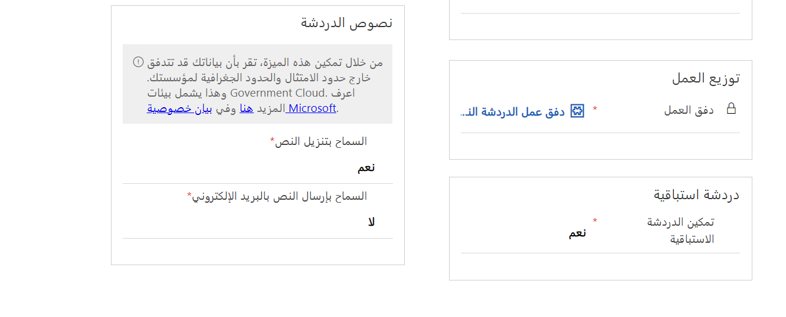
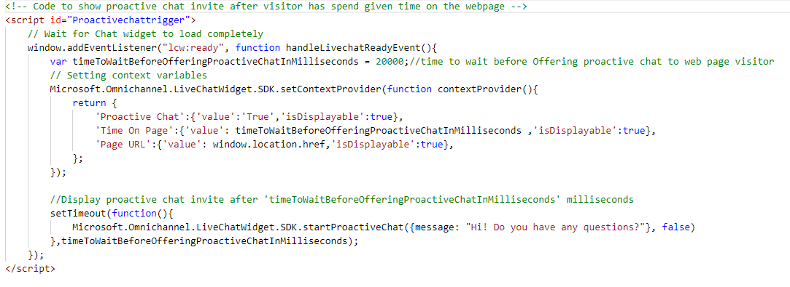
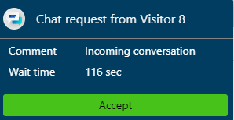

يتيح نشر عنصر واجهة مستخدم المحادثة الاستباقية لمناديب خدمة العملاء التفاعل مع العملاء من خلال دعوتهم تلقائيًا إلى محادثة المحادثة استنادًا إلى قواعد تم تكوينها مسبقًا مثل الوقت المنقضي في صفحة أو عدد زيارات الصفحة. تساعد هذه الميزة المؤسسات على التفاعل بشكل استباقي أكثر مع العملاء لتوفير مساعدة سياقية استنادًا إلى ما يفعلونه الآن. يمكن أن تحسن هذه التجربة بشكل كبير تجربة العملاء وتعزيز مستوى الرضا العام.

يمكن استخدام المعلومات ذات الصلة حول رحلة المستخدم والوقت الذي يقضيه في صفحة الويب والمزيد لتحديد وقت التفاعل مع عميل والمساعدة في تخصيص رسائل المشغل والقواعد القابلة للتكوين لتحديد الجمهور المستهدف والإطار الزمني والموقع المستهدف.

توجد سيناريوهات متعددة حيث يمكن أن يكون استخدام المحادثة بشكل استباقي مفيدًا للعملاء:

-   **أوقات الانتظار** - يتم إرفاق مؤقت بصفحة معينة مثل مقالة معرفية. بعد وجود شخص ما على الصفحة لفترة زمنية محددة مسبقًا، يتم تقديم محادثة استباقية له مثل "مرحبًا! ما عليك سوى التحقق لمعرفة ما إذا كان بإمكاني المساعدة في الإجابة عن أي أسئلة قد تريد طرحها."

-   **زيارات متعددة إلى نفس الصفحة** - تشير الزيارات المتعددة إلى صفحة واحدة خلال جلسة عمل واحدة في كثير من الأحيان إلى أن العملاء لا يجدون ما يبحثون عنه وقد يحتاجون إلى مساعدة إضافية. يمكن تحميل التفاصيل المتعلقة بالصفحة في الرسالة الاستباقية التي يتم تقديمها للعميل، مثل "مرحبًا! هل لديك سؤال بخصوص جهاز سطح المكتب؟ أنا هنا للمساعدة".

-   **فحص العميل لحالة القضية** - يجمع هذا الأسلوب بين وظيفة المؤقت وتقديم تفاصيل من السجل الذي يتم عرضه، مثل "مرحبًا! كيف حالك اليوم؟ حالة القضية: \<caseid\> قيد التنفيذ. هل ترغب في الحصول على المزيد من التفاصيل؟"

بالإضافة إلى حالات المثال السابق، يمكن استخدام المحادثة الاستباقية بطرق أخرى كثيرة من خلا تقديم الدعم بشكل استباقي قبل أن يغادر شخص ما الصفحة أو تقديم المساعدة للعميل القادم من صفحة أو منطقة معينة أو توفير خيارات خلال أطر زمنية محددة.

## تكوين قناة محادثة للمحادثة الاستباقية

يشكل تكوين حل محادثة استباقية ونشره عملية من جزأين. أولاً، يجب تمكين المحادثة الاستباقية على أي عنصر واجهة مستخدم سيتم استخدامه معها. يمكن تمكين المحادثة الاستباقية في علامة التبويب **تفاصيل أساسية** من قناة المحادثة.

قبل نشر رسالة استباقية، سيتعين عليك تحديد الحالات التي سيتم استخدامها لتشغيل الرسالة الاستباقية. يتم تحديد هذه الشروط كأيقونة على الصفحة حيث تحتاج الحالة إلى تشغيل الرسالة. على سبيل المثال، إذا أردت إظهار رسالة استباقية على صفحة المقالة معرفية بعد فترة زمنية معينة، يمكنك إضافة التعليمات البرمجية التالية إلى صفحة المقالة:

سيعرض المثال السابق تلقائيًا الرسالة "مرحبًا! هل لديك أي أسئلة؟" بعد أن يقضي شخص ما 20 ثانية على صفحة المقالة المعرفية. يمكن استخدام إصدارات مشابهة من هذه التعليمات البرمجية لدعم أي عدد من السيناريوهات المختلفة.

في حين لا ينصب تركيزك الأساسي على تطوير المكونات وترميزها لتفعيل الأصناف، فمن المهم أن يكون لديك فهم أساسي لكيفية عملها وما يمكن القيام به. توفر الروابط التالية نقطة انطلاق رائعة عندما تستعد لتطوير أصناف مخصصة لحلول المحادثة الاستباقية.

[بدء جلسات المحادثة بشكل استباقي](https://docs.microsoft.com/dynamics365/omnichannel/developer/how-to/start-proactive-chat/?azure-portal=true)

[واجهات برمجة التطبيقات الاستباقية لبدء المحادثة](https://docs.microsoft.com/dynamics365/omnichannel/developer/reference/methods/startproactivechat/?azure-portal=true)

## استخدام المحادثة الاستباقية

يتم تحديد حالات بدء المحادثة الاستباقية في التعليمات البرمجية لصفحة الويب حيث يتم تضمين عنصر واجهة مستخدم المحادثة. إذا تم استيفاء الحالات، يتم عرض دعوة المحادثة الاستباقية بمساعدة API.

عند تمكين المحادثة الاستباقية، يتم عرض دعوة المحادثة للعملاء استنادًا إلى المشغلات المكونة.

يمكن للعميل اختيار قبول دعوة المحادثة أو إغلاقها. يتم إغلاق دعوة المحادثة تلقائيًا بعد دقيقة واحدة إذا لم يقبلها العميل.

عندما يقبل العميل دعوة المحادثة الاستباقية، يتلقى المندوب الإخطار.

يقبل المندوب بعد ذلك طلب المحادثة ويبدأ في التحدث مع العميل لتقديم المساعدة اللازمة. يتم تحميل [ملخص العميل](https://docs.microsoft.com/dynamics365/omnichannel/agent/agent-oc/oc-customer-summary/?azure-portal=true) وعرضه إذا تطابقت تفاصيل العميل مع البيانات المخزنة.

إذا قام المسؤول أو المطور بتكوين علامة التبويب  **تفاصيل إضافية** ، وإذا كانت متغيرات السياق الإضافية موجودة مثل الوقت المنقضي في صفحة وعنوان URL للصفحة من حيث يتم بدء المحادثة، ويتم عرضها في علامة التبويب  **تفاصيل إضافية** .

