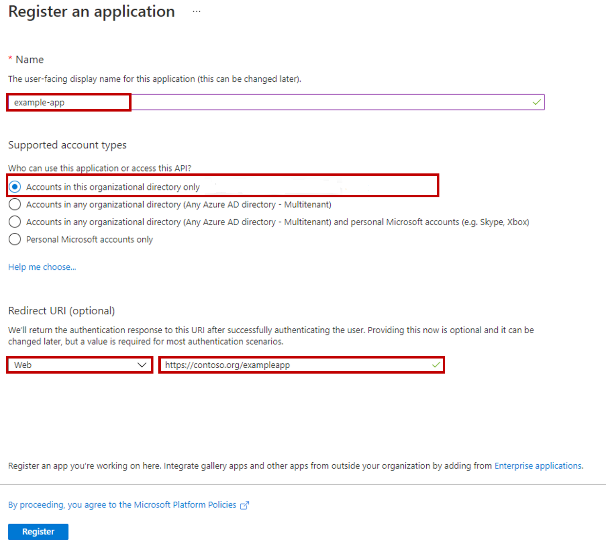

يتم توزيع كل محادثة في القناة متعددة الاتجاهات لـ Customer Service في نهاية المطاف إلى مستخدم القناة متعددة الاتجاهات. يمكن أن يمثل مستخدم القناة متعددة الاتجاهات مندوباً مباشراً أو مستخدم روبوت. مستخدم الروبوت هو في الأساس مستخدم في القناة متعددة الاتجاهات لـ Customer Service التي يدعمها أحد التطبيقات. في هذه الحالة، تطبيق الخادم هو روبوت Power Virtual Agents. تشير القناة متعددة الاتجاهات لـ Customer Service إلى هذه الروبوتات كمستخدمي التطبيق. عندما يتم توجيه المحادثات إلى مستخدم التطبيق، يتولى روبوت Power Virtual Agents ويوفر التفاعل الضروري مع العميل.

لأن الروبوت هو مستخدم التطبيق، يحتاج التطبيق الذي سيدعم روبوت إلى أن يكون مسجلاً في Microsoft Azure Active Directory (Azure AD). يصادق Azure AD على التطبيق تماماً كما لو كان مستخدماً بشرياً. قبل أن يتم دمج الروبوت، ستحتاج إلى إنشاء تسجيل تطبيق في Azure AD. بعد تحديد تسجيل التطبيق، يمكن ربط روبوت Power Virtual Agents بالتطبيق المسجل.

يمكن فقط للمستخدمين الذين لديهم الأذونات الضرورية إضافة عناصر في مستأجر Azure وإجراء تسجيلات التطبيقات الضرورية. يمكنك إنشاء تسجيل التطبيق على النحو التالي: 
1. انتقل إلى [مدخل Azure](https://portal.azure.com/?azure-portal=true). 

2. سجّل تطبيقاتك. انتقل إلى **Azure Active Directory** وقم بإنشاء تسجيل جديد ضمن **تسجيلات التطبيقات**.
3. حدد المجالات الثلاثة الأساسية لإنشاء تسجيل التطبيق على النحو التالي:

    - **الاسم** - اسم التطبيق الذي يواجه المستخدم. يمكن تغيير هذه المعلومات لاحقاً، إذا لزم الأمر.

    - **أنواع الحسابات المدعومة** - تعرف هذه المنطقة من يمكنه الوصول إلى التطبيق.

    - **عنوان URI لإعادة التوجيه (اختياري)** - هذا الخيار هو عنوان URL حيث يوجد التطبيق. هذا ليس إلزامياً. 

    > [!div class="mx-imgBorder"]
    > 

4. بعد تحديد المعلومات الضرورية، حدد الزر **تسجيل**.

لمزيد من المعلومات، راجع [إنشاء تطبيق Azure Active Directory](/azure/active-directory/develop/howto-create-service-principal-portal?azure-portal=true#create-an-azure-active-directory-application).
 
ستنشئ هذه العملية تسجيل التطبيق الأولي. لأغراض وحدة التعلم هذه، تفي هذه الخطوات بالمتطلبات الضرورية لنشر روبوت Power Virtual Agents للتطبيق. ومع ذلك، بناءً على سيناريو النشر والتقنية المستخدمة وسياسات الأمان وما إلى ذلك، قد تحتاج إلى تكوين عناصر أخرى في التطبيق.

تتضمن العناصر الإضافية التي قد ترغب في مراعاتها ما يلي:

-   **تعيين دور إلى التطبيق** - يسمح للتطبيق بالوصول إلى موارد إضافية في اشتراك Azure. لمزيد من المعلومات، راجع [تعيين دور للتطبيق](/azure/active-directory/develop/howto-create-service-principal-portal?azure-portal=true#assign-a-role-to-the-application).

-   **الشهادات والأسرار** - المساعدة في إدارة أمان تطبيق المصادقة والتحكم. للحصول على مزيد من المعلومات، راجع [الشهادات والأسرار](/azure/active-directory/develop/howto-create-service-principal-portal?azure-portal=true#certificates-and-secrets).

-   **سياسات الوصول على الموارد** - تسمح لك بتعريف أذونات إضافية قد يحتاجها التطبيق. ‏‫لمزيد من المعلومات، راجع [تكوين سياسات الوصول](/azure/active-directory/develop/howto-create-service-principal-portal?azure-portal=true#configure-access-policies-on-resources).

الآن بعد أن قمت بإنشاء تسجيل تطبيق، يمكنك إنشاء روبوت Power Virtual Agents وتكوينه لتسليم المحادثات إلى القناة متعددة الاتجاهات لـ Customer Service.
