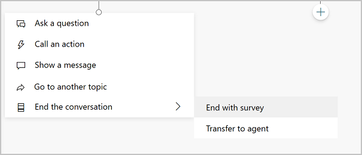
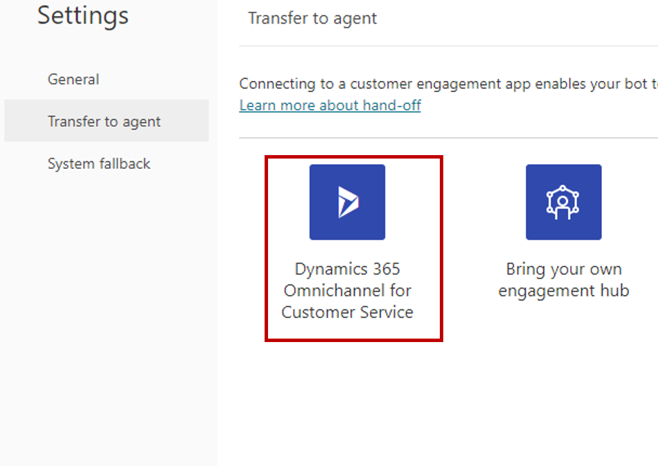
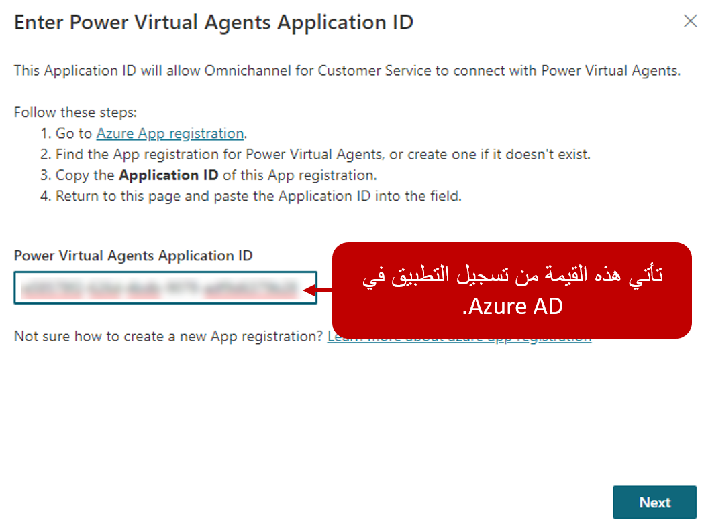

يؤدي دمج روبوت Power Virtual Agents إلى مشاركة السجل الكامل للمحادثة (السياق) وأي متغيرات يحددها المستخدم مع القناة متعددة الاتجاهات لـ Customer Service. تسمح هذه الميزة للقناة متعددة الاتجاهات لـ Customer Service بتوجيه التصعيدات الواردة إلى قائمة انتظار المندوب المباشر المناسبة، كما يسمح المندوبون المباشرون بمراجعة ما حدث بالضبط في المحادثة السابقة بحيث يمكنهم استئناف عند هذه النقطة. يمنع هذا الجانب المندوبين من احتمال طلب المعلومات التي تم التقاطها مسبقاً بواسطة الروبوت.

## خطط لروبوتك

عند إنشاء روبوت، والنظر في كيفية المعلومات التي يتم جمعها من قبل بوت يمكن أن تؤثر على المحادثة إذا كان يحتاج إلى نقلها إلى مندوب. يمكن لروبوتات Power Virtual Agents طرح أسئلة للحصول على المعلومات وتخزينها لاستخدامها لاحقاً كمتغيرات. يمكن توفير المتغيرات في جميع أنحاء الروبوت واستخدامها لتخصيص الرسائل التي يتم توفيرها للعملاء، أو تحديد كيفية تفاعل الروبوت مع العميل، أو الإشارة إلى أنه يجب تمريره إلى تطبيقات أخرى كمعلمات إدخال. يمكن أن تكون المتغيرات مفيدة أيضاً عندما يقوم الروبوت بنقل محادثة إلى مندوب. يمكن استخدام البيانات من هذه المتغيرات بواسطة قواعد توجيه القناة متعددة الاتجاهات لـ Customer Service لضمان إرسال المحادثة إلى الموقع المناسب. على سبيل المثال، إذا طلب روبوت خدمة العملاء من العميل تقديم سبب للتواصل، وأشار العميل إلى "الفوترة"، فسيتم تخزين كلمة "الفوترة" في المحادثة كمتغير. عند نقل المحادثة إلى القناة متعددة الاتجاهات لـ Customer Service، يمكن لقاعدة التوجيه تحديد هذا العنصر كطلب فوترة ثم التأكد من توجيهه إلى الموقع الصحيح.

لمزيد من المعلومات، راجع [استخدام المتغيرات في روبوت](/power-virtual-agents/authoring-variables/?azure-portal=true). 

يعد العمل مع المتغيرات جزءاً من تصميم الروبوت والتحكم في كيفية تفاعل العملاء معه. يحتوي Power Virtual Agents على العديد من الميزات المختلفة التي تساعد في التحكم في تدفق المحادثة ويمكن أن يكون لها تأثير على كيفية نقل المحادثة. واحدة من هذه الميزات الرئيسية هي الموضوعات، والتي تملي مسارات المحادثة التي يتم توجيه العملاء أثناء التفاعل مع الروبوت.

## نقل المحادثات إلى المندوبين

المكونان الأساسيان اللذان يتم تضمينهما عند نقل الروبوت إلى مندوب هما:

-   إخبار الروبوت بموعد نقل المحادثة إلى مندوب.

-   إخبار الروبوت بمكان نقل المحادثة أو إلى أي قائمة انتظار.

## إخبار الروبوت بنقل المحادثة إلى مندوب

إن الطريقة التي يخبر بها روبوت Power Virtual Agents الروبوت أن الوقت قد حان لنقل محادثة إلى مندوب هو نفسها دائماً. يتضمن Power Virtual Agents ما يشار إليه باسم "عقدة محادثة"، تسمى **إنهاء المحادثة**. يتم استخدام عقد المحادثة للتفاعل مع العميل. يمكنهم عرض رسالة أو طرح سؤال على العملاء أو توجيههم إلى موضوع مختلف. تعني عقدة **إنهاء المحادثة** نهاية المحادثة بأكملها وتوفر إجراءين يمكن البدء فيهما:

-   **الإنهاء باستطلاع** - يظهر استطلاع يسأل المستخدم إذا كانت الإجابة على سؤاله أو مشكلته أو تم حلها بشكل صحيح.

-   **نقل إلى مندوب** - تصعيد المحادثة إلى [إلى مندوب مباشر](/power-virtual-agents/advanced-hand-off/?azure-portal=true).

> [!div class="mx-imgBorder"]
> 

يمكن لمؤلفي الروبوت إنهاء محادثة والانتقال إلى مندوب من داخل موضوع معين. على سبيل المثال، إذا أشار أحد العملاء إلى الروبوت أن نظام نقاط البيع الخاص به معطل بالكامل، فيمكن للروبوت الاتصال تلقائياً بعقدة **إنهاء المحادثة** وتحويلها إلى مندوب. هناك طريقة أخرى يمكن من خلالها إنجاز هذه المهمة وهي تصعيد الموضوع. تتضمن جميع الروبوتات موضوع محادثة يسمى **التصعيد**. يتضمن موضوع **التصعيد** رسالة يتم تقديمها للعميل ثم يتصل بعقدة **إنهاء المحادثة** لتحويلها إلى مندوب. يتم تشغيل موضوع **التصعيد** تلقائياً عندما يكتب أحد الأشخاص شيئاً مثل "التحدث إلى المندوب". يمكن أيضاً تشغيله من داخل موضوع آخر عن طريق تحديد **انتقل إلى موضوع آخر** ثم تحديده.

## تكوين مكان تسليم المحادثة

الجزء الثاني من تسهيل النقل إلى مندوب هو تكوين الروبوت لإرسال المحادثة إلى مركز مشاركة معين. يدعم Power Virtual Agents القدرة على الإرسال إلى بيئة القناة متعددة الاتجاهات لـ Customer Service أو إلى مركز مُشاركة مخصص. يُمكن استخدام الروبوتات التي تم نشرها فقط لضمان عمل الإمكانات الشاملة على النحو المتوقع.  تأكد من أنك قد  [نشرت الروبوت الخاص بك](/power-virtual-agents/getting-started-deploy/?azure-portal=true)  قبل التحقق من صحة التجربة المتكاملة.

سوف تحتاج، في أثناء التكوين، إلى تحديد إذا ما كان سيتم توجيه المحادثات إلى بيئة Dynamics 365 Customer Service أو مركز مشاركة مخصص. إذا حددت بيئة القناة متعددة الاتجاهات لـ Customer Service، فسوف تحتاج إلى تحديد بيئة Dynamics 365 التي سيتم استخدامها في الروبوت الفردي. يُمكن تكوين كل روبوت فقط لإرسال محادثات إلى بيئة قناة متعددة اتجاهات لـ Customer Service واحدة. إذا كنت بحاجة إلى إرسال محادثات من عدة روبوتات إلى بيئة Dynamics 365 مُعينة، فسيلزم تكوين كل روبوت بشكل فردي.

لتكوين التسليم، حدد رمز **الإعدادات**، ثم حدد  **نقل إلى مندوب**. تتيح لك شاشة **النقل إلى مندوب** تحديد كيفية قيام الروبوت بتسهيل التسليم إلى تطبيقات مختلفة مثل القناة متعددة الاتجاهات لـ Customer Service. حدد الإطار المتجانب القناة متعددة الاتجاهات لـ Customer Service في Dynamics 365 لبدء عملية التكوين.

> [!div class="mx-imgBorder"]
> 

المكون الأساسي الذي تحتاج إلى توفيره هو معرف التطبيق للتطبيق الذي قمت بتسجيله مسبقاً في Azure Active Directory. روبوتات نماذج القناة متعددة الاتجاهات لـ Customer Service كمستخدمين للتطبيق في التطبيق. تضمن نمذجة الروبوتات كمستخدمين للتطبيق أن الروبوت يمكنه إجراء محادثات عليه مثل أي مندوب بشري. من المهم أن يكون معرف التطبيق فريداً لمؤسستك (مؤسسة أو بيئة Microsoft Dataverse). سيحتاج كل روبوت سيتفاعل مع نفس القناة متعددة الاتجاهات لـ Customer Service إلى استخدام معرف تطبيق مختلف. قد تحتاج إلى إنشاء تسجيلات تطبيقات متعددة لدعم العديد من الروبوتات.

في مدخل Azure، انتقل إلى Azure AD، وحدد **تسجيلات التطبيقات**. سيتم عرض جميع التطبيقات المسجلة. حدد التطبيق الذي تريد استخدامه مع الروبوت. سيكون حقل **معرف التطبيق** في صفحة نظرة عامة على التطبيق. انسخ المعرف والصقه في حقل Power Virtual Agents **معرف التطبيق**.

يستخدم Power Virtual Agents قناة Microsoft [Teams](/power-virtual-agents/getting-started-deploy/?azure-portal=true)  للاتصال بالقناة متعددة الاتجاهات لـ Customer Service. أثناء اتباع معالج الإعداد، إذا لم يتم تمكين قناة Teams، فسيتم تمكين قناة Teams تلقائياً.

> [!div class="mx-imgBorder"]
> 

يتمثل الجزء الأخير من عملية التكوين في تحديد القناة متعددة الاتجاهات لـ Customer Service التي تريد استخدامها مع هذا الروبوت. تأكد من تحديد بيئة تحتوي على القناة متعددة الاتجاهات لـ Customer Service المقدمة. تعرض القائمة جميع البيئات المتوفرة، حتى إذا لم يتم توفير القناة متعددة الاتجاهات لـ Customer Service.

بعد إنشاء الاتصال، يُمكنك تحديد ارتباط  **الانتقال إلى القناة متعددة الاتجاهات**  من أجل  [متابعة تكوين اتصال الروبوت في القناة متعددة الاتجاهات لـ Customer Service](/dynamics365/omnichannel/administrator/configure-bot-virtual-agent/?azure-portal=true).

## إزالة الاتصال بالقناة متعددة الاتجاهات لـ Customer Service

إذا لم تعد ترغب في تسليم المحادثات من روبوت إلى بيئة القناة متعددة الاتجاهات لـ Customer Service، فيُمكنك فصلها عن البيئة. يُمكنك الفصل من خلال تحديد رمز **الإعدادات** ثم اختيار **نقل إلى مندوب**. في الجزء السفلي من شاشة **نقل إلى مندوب**، سيتم إدراج البيئة التي يتصل بها الروبوت حاليًا. سوف يؤدي تحديد الزر **فصل** إلى فصل الروبوت عن البيئة المكونة حاليًا. بمجرد الفصل، سوف تتمكن من متابعة عملية الاتصال مرة أخرى للاتصال ببيئة مختلفة. 

## التعامل مع مشكلات عرض المحتوى

أثناء العمل مع تكامل التسليم، قد تجد أن بعض العناصر، مثل الرموز التعبيرية وأنواع معينة من الملاحظات أو المتغيرات، قد لا يتم عرضها على النحو المنشود. قد يكون أحد الأسباب بسبب القيود داخل القناة متعددة الاتجاهات لـ Customer Service أو التكامل بينهما.

لمزيد من المعلومات، راجع [مشكلات وقيود القناة متعددة الاتجاهات لـ Customer Service](/dynamics365/omnichannel/omnichannel-readme/?azure-portal=true). 

لمزيد من المعلومات، راجع [القيود المعروفة مع تكامل Power Virtual Agents](/power-virtual-agents/configuration-hand-off-omnichannel?azure-portal=true#known-limitations/). 
