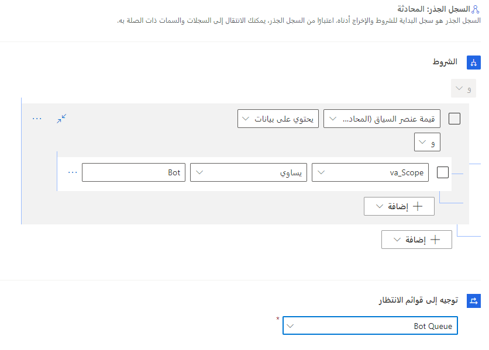

بعد تكوين روبوت Power Virtual Agents لإرسال محادثات إلى Omnichannel for Customer Service، تحتاج أنت إلى تكوين Omnichannel for Customer Service لفهم ما يجب فعله بالمحادثات الواردة. يتم تنفيذ التكوين في تطبيق إدارة القناة متعددة الاتجاهات.

عندما قمت بتوصيل الروبوت ببيئة Omnichannel for Customer Service، تم إنشاء مستخدم تطبيق الروبوت تلقائياً. يحتاج مستخدم المندوب الافتراضي أن يكون مرتبطاً بصف انتظار Omnichannel for Customer Service واحد على الأقل. عندما يتم إرسال محادثة إلى صف الانتظار، يتم توجيهها إلى مستخدم مندوب الروبوت الافتراضي، والذي سيُطلق الروبوت Power Virtual Agents. يتم دائماً توجيه محادثات صف الانتظار إلى مستخدمي الروبوت قبل المندوبين المباشرين، على سبيل المثال، إذا كانت مؤسستك تريد إرسال محادثات صف الانتظار الافتراضي إلى المندوب الافتراضي. بمجرد إضافة مستخدم المندوب الافتراضي إلى صف الانتظار الافتراضي، سيتم إرسال جميع محادثات صف الانتظار الافتراضي تلقائياً إلى المندوب الافتراضي. يتم تطبيق هذه الطريقة عبر قنوات المؤسسة المختلفة التي تستخدمها. إذا سمحت المؤسسة بخدمة الرسائل القصيرة (SMS) كقناة، فسيتم إرسال رسائل SMS التي تتلقاها صف الانتظار الافتراضي إلى الروبوت، وسيتواصل الروبوت مع العميل من خلال الرسائل القصيرة.

## التحكم في كيفية تحويل المحادثات

يستخدم Omnichannel for Customer Service قواعد التحويل لإرسال محادثات إلى صفوف انتظار مختلفة بناءً على المعلومات المتعلقة بالمحادثة. على سبيل المثال، يتم إرسال المحادثات الواردة المتعلقة بالفوترة إلى صف انتظار الفوترة. يتم إرسال المحادثات المتعلقة بالدعم إلى صف انتظار الدعم. يمكن لقواعد التحويل استخدام التفاصيل الفعلية من المحادثة والبيانات السياقية المخزنة في متغيرات السياق لتحويل المحادثة بشكل مناسب. عندما يقوم روبوت Power Virtual Agent بتصعيد محادثة إلى Omnichannel for Customer Service، تُستخدم قواعد التصعيد للتأكد من إمكانية الروبوت توجيه المحادثة إلى المندوب المناسب.

يمكن إعداد قواعد التصعيد بطريقتين:

-   **إضافة الروبوت إلى صف انتظار المندوب المباشر الحالي** - عند بدء التسليم، يتم نقل العملاء من الروبوت Power Virtual Agents إلى المندوب المباشر وفقاً لقواعد تحويل التصعيد. *(قد يتطلب هذا الخيار القليل من التكوين الإضافي أو لا يتطلب لأنه يستخدم القواعد الحالية.)*
    
    لمزيد من المعلومات، راجع [قواعد التحويل](/dynamics365/omnichannel/administrator/routing-rules/?azure-portal=true). 

-   **إنشاء صف انتظار روبوت وصف انتظار مندوب مباشر** - يتطلب هذا الخيار صف انتظار "روبوت" منفصل وصفوف انتظار مخصصة للمندوبين. قد تحتاج إلى إنشاء تدفق عمل إضافي يحتوي على متغيرات السياق وقواعد التحويل المناسبة لتحويل استعلامات العملاء.

### إنشاء صفوف انتظار منفصلة للروبوت والمندوبين المباشرين

عادةً ما يتم تطوير برامج الروبوت لتلقي أصناف العميل أولاً، والحصول على مزيد من المعلومات، ثم تمرير الصنف إلى مندوب مباشر، إذا لزم الأمر. لكي تحدث هذه العملية، يجب إضافة مستخدم الروبوت إلى صف انتظار حيث سيتم توجيه الرسائل الواردة إليه، مما يضمن أن الروبوت يستقبل الرسائل الواردة.

> [!div class="mx-imgBorder"]
> 

إذا قمت بإنشاء صف انتظار مخصصة لمحادثات الروبوت، مثل صف انتظار "المندوب الافتراضي"، فيمكنك إضافة مستخدم روبوت مندوب افتراضي إلى صف الانتظار. عندما يتم إرسال المحادثات إلى صف الانتظار، سوف يتولى الروبوت الأمر. للتعامل مع المحادثات بعد أن أعاد الروبوت المحادثة إلى Omnichannel for Customer Service، يمكنك إنشاء صف انتظار واحد أو أكثر من صفوف "المندوب". قد تمثل صفوف الانتظار عدة مشكلات في الفوترة أو الدعم أو المواقع أو أي عنصر آخر يمكن أن يؤثر على كيفية توجيه صنف ما. ستحتاج لإضافة المندوبين المباشرين إلى كل صف انتظار بحيث يمكنهم استلام أصناف العمل منه. عندما تكون في صف الانتظار، يتم تسليم المحادثة إلى المندوب التالي المتاح.

## التقط سياق المحادثة

عندما يُسهَّل الروبوت Power Virtual Agents التسليم إلى نظام آخر، فإنه يتضمن تلقائياً متغيرات يمكن أن يستهلكها النظام الآخر لفهم أفضل لسياق المحادثة. عندما تتلقى Omnichannel for Customer Service المحادثة، يمكنها مراجعة متغيرات السياق هذه وتحديد ما يجب فعله بعد ذلك.

Power Virtual Agents يتضمن متغيرات السياق عندما ينقل محادثة إلى مندوب، كما هو موضح في الجدول التالي.

|     السياق                             |     الغرض                                                                     |     مثال                                                      |
|-----------------------------------------|---------------------------------------------------------------------------------|------------------------------------------------------------------|
|     va_Scope                            |     يساعد في تحويل التصعيدات إلى مندوب مباشر                                   |     "روبوت"                                                        |
|     va_LastTopic                        |     يساعد في تحويل التصعيدات إلى مندوب مباشر ويساعد في استدعاء المندوب المباشر    |     "إرجاع الأصناف"                                             |
|     va_Topics                           |     يساعد في استدعاء مندوب مباشر                                                |     [ "الترحيب"، "ساعات عمل المتجر"، "إرجاع الصنف" ]              |
|     va_LastPhrases                      |     يساعد في تحويل التصعيد إلى مندوب مباشر ويساعد في حث المندوب المباشر     |     "هل يمكنني إرجاع الصنف الخاص بي"                                     |
|     va_Phrases                          |     يساعد في استدعاء مندوب مباشر                                                |     ["مرحباً"، "متى يفتح المتجر"، "هل يمكنني إرجاع الصنف الخاص بي" ]    |
|     va_ConversationId                   |     يساعد على تحديد محادثة الروبوت بشكل فريد                                |     GUID                                                         |
|     va_AgentMessage                     |     يساعد في استدعاء مندوب مباشر                                                |     "حصلت على هدية من: HandoffTest"                             |
|     va_BotId                            |     يساعد في تحديد الروبوت الذي يسلم المحادثة                 |     GUID                                                         |
|     va_Language                         |     يساعد في تحويل التصعيد إلى مندوب مباشر                                    |     "en-us"                                                      |
|     [جميع متغيرات الموضوع المعرفة من قبل المستخدم](/power-virtual-agents/how-to-variables/?azure-portal=true)    |     يساعد في استدعاء مندوب مباشر                                                |     @StoreLocation = "Bellevue"                                |

سيحتاج تدفق العمل إلى تضمين أي متغيرات سياق تم إنشاؤها أثناء الإعداد حتى يتمكن الروبوت من التعامل مع استفسارات العملاء بشكل مناسب. على سبيل المثال، إذا كنت تريد استخدام متغير va_Scope للمساعدة في تحديد ما إذا كان قادماً من روبوت أو شخص مباشر، فستحتاج إلى إضافة متغير سياق يسمى va_Scope إلى تدفق العمل. يجب تحديد هذا المعيار لجميع متغيرات الروبوت التي سيتم استخدامها، بما في ذلك المتغيرات التي تم إنشاؤها أثناء عملية الكتابة.

> [!div class="mx-imgBorder"]
> 

لمزيد من المعلومات، راجع [متغيرات السياق](/power-virtual-agents/advanced-hand-off). 

## تكوين قواعد التحويل

بعد تحديد متغيرات السياق التي تم استخدامها بواسطة تدفق العمل، يجب إنشاء قواعد التحويل لإرسال المحادثة إلى صف الانتظار الصحيح. تتضمن قواعد التحويل شرطاً ووجهة الصف. عندما يأتي صنف ما، سيتم اختبار قواعد التحويل مقابل الصنف بالترتيب الذي تم تحديده به في التطبيق. عندما يكون شرط القاعدة صحيحاً، يتم تحويل الصنف إلى صف انتظار المُوجه إليه. لن يتم تشغيل أي قواعد متبقية لأنه تم العثور على تطابق. عندما تعمل مع برامج الروبوت، يمكن بناء الشروط باستخدام متغيرات السياق مثل va_Scope.

في هذا المثال، ستحتاج إلى تحديد قاعدتي تحويل:

- قم بتوجيه المحادثات الواردة إلى روبوت مندوب افتراضي.

- قم بتحويل المحادثات التي يتم تصعيدها من مندوب افتراضي إلى وكيل مباشر.

عندما يرسل Power Virtual Agents محادثة إلى مندوب، سيقوم تلقائياً بتعيين متغير سياق va_Scope إلى **روبوت**. إذا لم يتم تصعيد المحادثة من الروبوت، فسيكون متغير سياق va_Scope فارغاً. باستخدام هذه المعلومات، يمكنك تحديد ما يجب فعله بالمحادثة.

> [!div class="mx-imgBorder"]
> 

على سبيل المثال، إذا كانت قيمة متغير سياق va_Scope تساوي **روبوت**، فأنت تعلم أن المحادثة قادمة من الروبوت Power Virtual Agents ويجب تحويلها إلى صف انتظار بشري. إذا كان متغير سياق va_Scope لا يحتوي على بيانات، فيجب إرسالها تلقائياً إلى صف انتظار الروبوت.

لمزيد من المعلومات، راجع [Omnichannel for Customer Service](/dynamics365/omnichannel/administrator/unified-routing-work-distribution?azure-portal=true#overview-of-routing-system).

للحصول على معلومات إضافية، راجع [صفوف الانتظار](/dynamics365/omnichannel/administrator/queues-omnichannel/?azure-portal=true). 
