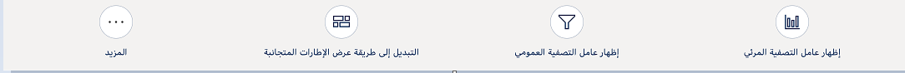

يمكن للمستخدمين الوصول إلى بيانات تطبيقات Dynamics 365 Customer Engagement من الأجهزة المحمولة بطرق مختلفة. يمكنهم تثبيت واستخدام التطبيقات للأجهزة المحمولة التي تعمل بأنظمة Windows وiOS وAndroid أو تشغيل تطبيق الويب على المتصفح المفضل للجهاز.

يمكن للمستخدمين الوصول إلى بياناتهم عندما يكونوا خارج نطاقات تواجدهم المعتادة باستخدام أي من التطبيقات التالية:

- **Dynamics 365 للهواتف** - باستخدام Dynamics 365 للهواتف، يمكنك تصميم بنية المعلومات الخاصة بك مرة واحدة، وسوف تتدفق التخصيصات تلقائياً إلى جميع عوامل التصميم. تتم مشاركة الكثير مع إصدار Dynamics 365 لأجهزة الكمبيوتر اللوحية.

- **Dynamics 365 لأجهزة الكمبيوتر اللوحية** - مع نفس الميزات الأساسية مثل Dynamics 365 للهواتف، سيقدّر مستخدمو أجهزة الكمبيوتر اللوحية التجربة المحسّنة لشاشة أكبر.

### أشياء يجب معرفتها حول Dynamics 365 للهواتف

تستخدم النماذج في Dynamics 365 للهواتف نوع النموذج الرئيسي. يعمل سلوك الجدول والعمليات التجارية في نماذج Dynamics 365 للهواتف بشكل مشابه للنماذج الموجودة في تطبيق الويب، ولكن مع تدفق مخصص للهاتف.

لتبسيط النماذج بشكل أكبر، يمكنك إخفاء المكونات في تطبيق الهاتف. يمكنك إخفاء أقسام علامات التبويب والشبكات الفرعية والأعمدة والمخططات. على سبيل المثال، لإخفاء علامة التبويب "التفاصيل" في نموذج **جهة الاتصال** انتقل إلى **الجداول**  >  **جهة الاتصال**  >  **النماذج**. حدد نموذج **جهة اتصال**، ثم مرر لأسفل وانقر على **تفاصيل**. انقر فوق خانة الاختيار  **إخفاء على الهاتف** لإخفاء علامة التبويب **التفاصيل** من الظهور في نموذج لمستخدمي الهاتف **جهة الاتصال**.

### الاختلافات الأخرى مع Dynamics 365 لأجهزة الكمبيوتر اللوحية

توجد بعض الاختلافات بين Dynamics 365 للهواتف وDynamics 365 لأجهزة الكمبيوتر اللوحية:

- القوائم البسيطة غير متوفرة في Dynamics 365 للهواتف. بدلاً من ذلك، استخدم شريط الأوامر (علامات الحذف **...**)وانقر فوق **تحديد عرض** لتغيير طريقة العرض الخاصة بك.
- الكشف عن التكرار غير متاح.
- ميزة **فتح في المتصفح** غير متوفرة.

### الجداول وDynamics 365 للهواتف وDynamics 365 لأجهزة الكمبيوتر اللوحية

يمكنك تمكين مجموعة محدودة من الجداول لـ Dynamics 365 للهواتف وDynamics 365 لأجهزة الكمبيوتر اللوحية. لمعرفة ما إذا كان الجدول ممكناً أو لتمكينه، انتقل إلى **الإعدادات** > **التخصيصات** > **تخصيص النظام** > **الجداول**. حدد جدولاً وراجع إعدادات **Outlook والجوال**.

بعض الأشياء الأخرى التي يجب ملاحظتها:

- يمكن تمكين جميع الجداول المخصصة لـ Dynamics 365 للهواتف وDynamics 365 لأجهزة الكمبيوتر اللوحية.
- يمكنك استخدام البحث عن الجداول التي لم يتم تمكينها لـ Dynamics 365 للهواتف وDynamics 365 لأجهزة الكمبيوتر اللوحية من سجل تم تمكينه والاطلاع على البيانات. ومع ذلك، لن تتمكن من تحرير الجدول.

### الجداول المرئية والقراءة / الكتابة في Dynamics 365 للهواتف وDynamics 365 لأجهزة الكمبيوتر اللوحية

| **اسم الجدول**   |**خاصية الرؤية**  |**خاصية القراءة فقط**   |
|  -----------------| ------------------------| ------------------------|
|  الحساب          | قابل للتعديل              |  قابل للتعديل |
|  نشاط         | غير قابل للتعديل          |  غير قابل للتعديل  |
|  الموعد      | قابل للتعديل              | قابل للتعديل   |
|  الحالة             | قابل للتعديل              |  قابل للتعديل   |
|  المنافس       | قابل للتعديل              |  قابل للتعديل   |
|  اتصال       | غير قابل للتعديل          |  قابل للتعديل   |
|  فاتورة          | قابل للتعديل              |  قابل للتعديل   |
|  عميل متوقع             | قابل للتعديل              |  قابل للتعديل   |
|  ملاحظة             | غير قابل للتعديل          |  غير قابل للتعديل  |
|  الفرصة      | قابل للتعديل              |  قابل للتعديل  |
|  طلب            | قابل للتعديل              |  قابل للتعديل  |
|  مكالمة هاتفية       | قابل للتعديل              |  قابل للتعديل  |
|  عرض أسعار            | قابل للتعديل              |  قابل للتعديل  |
|  النشاط الاجتماعي  | قابل للتعديل              | قابل للتعديل   |
|  الملف الاجتماعي   | قابل للتعديل              |  قابل للتعديل  |
|  المهمة             | قابل للتعديل              |  قابل للتعديل  |

### الجداول المرئية والقراءة فقط في Dynamics 365 للهواتف وDynamics 365 لأجهزة الكمبيوتر اللوحية

|  **اسم الجدول**      | **خاصية الرؤية**  | **خاصية القراءة فقط**  |
|  ---------------------| -------------------------| ------------------------ |
| المرفق            |غير قابل للتعديل            | غير قابل للتعديل |
|  البريد الإلكتروني                | قابل للتعديل               | غير قابل للتعديل |
|  الاستحقاق          | غير قابل للتعديل           | غير قابل للتعديل |
|  مقالة معرفية    | قابل للتعديل               | غير قابل للتعديل |
|  قائمة الاسعار           | غير قابل للتعديل           | غير قابل للتعديل |
|  المنتج              | قابل للتعديل               | غير قابل للتعديل |
|  صف                | قابل للتعديل               | غير قابل للتعديل |
|  SharePoint مستند  | غير قابل للتعديل           | غير قابل للتعديل |
|  مثيل SLA KPI     | غير قابل للتعديل           | قابل للتعديل     |
|  فريق                 | غير قابل للتعديل           | غير قابل للتعديل |
|  المستخدم                 | غير قابل للتعديل           | غير قابل للتعديل |
|  مورد الويب         | غير قابل للتعديل           | غير قابل للتعديل |

### قم بتغيير أوامر Dynamics 365 للهواتف وأجهزة الكمبيوتر اللوحية

يستخدم Dynamics 365 للهواتف وأجهزة الكمبيوتر اللوحية تعريفات الشريط نفسها لتوفير أوامر مثل تطبيق الويب إلا أنه تم تحسينه للعرض التقديمي في تطبيقات الأجهزة المحمولة. يمكنك تعيين تعريفات الشريط لعرضها بناءً على نوع العميل. على سبيل المثال، يمكنك تعيين الأوامر، بحيث تظهر في تطبيق الويب وليس في تطبيقات الهاتف أو الكمبيوتر اللوحية. يتم تعيين بعض الأوامر الافتراضية لتظهر فقط في تطبيق الويب، ولهذا السبب لن تراها في تطبيقات الأجهزة المحمولة.

### تمكين لوحات المعلومات لـ Dynamics 365 للهواتف وDynamics 365 لمستخدمي الكمبيوتر اللوحي

تتوفر لوحات المعلومات المتعددة لمستخدمي Dynamics 365 للهواتف وDynamics 365 لأجهزة الكمبيوتر اللوحية. بعد قيامك بإعداد لوحات معلومات قياسية أو مخصصة للوصول عبر الأجهزة المحمولة، يمكن للمستخدمين بسهولة تعديل لوحات المعلومات التي تظهر وكيفية ظهورها على هواتفهم أو أجهزة الكمبيوتر اللوحية الخاصة بهم.

1. انتقل إلى **الإعدادات** > **التخصيصات**.
2. انقر على **تخصيص النظام**.
3. ضمن **المكونات**، انقر على **لوحات المعلومات**.
4. انقر نقراً مزدوجاً أو اضغط مع الاستمرار على لوحة المعلومات التي تريد تمكينها للوصول إلى الهاتف أو الكمبيوتر اللوحي.
5. انقر على **خصائص** > **تمكين للجهاز المحمول** > **موافق**.
6. انقر **حفظ**.

لتوضيح كيفية تعيين وعرض لوحات المعلومات الممكّنة على هواتفهم أو أجهزة الكمبيوتر اللوحية للمستخدمين، راجع [التعرف على Dynamics 365 للهواتف و> الأجهزة اللوحية](/dynamics365/customer-engagement/mobile-app/dynamics-365-phones-tablets-users-guide).

يمكنك تعيين أدوار أمان للوحة معلومات بحيث تظهر لوحة المعلومات فقط للمستخدمين الذين لديهم أدوار أمان معينة. على سبيل المثال، لتعيين من لديه حق الوصول إلى لوحة معلومات المبيعات، انتقل إلى **الإعدادات** > **التخصيصات** > **تخصيص النظام** > **المكونات** > **لوحات المعلومات**، ثم حدد **لوحة معلومات المبيعات**. انقر على **تمكين أدوار الأمان**.

### الحفظ التلقائي في Dynamics 365 للأجهزة الكمبيوتر اللوحية

يتم حفظ السجلات في Dynamics 365 لأجهزة الكمبيوتر اللوحية بناءً على كيفية تكوينك للحفظ التلقائي في إعدادات مؤسستك. لعرض إعدادات الحفظ، انتقل إلى **الإعدادات** > **الإدارة** > **إعدادات النظام** > **علامة التبويب عام**. اعرض الإعدادات ضمن **حدد خيار الحفظ الافتراضي للنماذج**.

خيارات الحفظ التلقائي هي إما:

- ممكّناً للمؤسسة، يتم حفظ التغييرات على النماذج عندما يغادر المستخدمون النماذج.
- مُعطَّل للمؤسسة، يجب على المستخدمين استخدام شريط الأوامر والنقر فوق **حفظ** لحفظ تغييرات النموذج.
