يُمكنك الاستفادة من تطبيقات Dynamics 365 للهواتف وDynamics 365 لأجهزة الكمبيوتر اللوحية لمساعدتك في المبيعات وخدمة العملاء والخدمة الميدانية وغيرها من المهام أثناء التنقل. وبعملية تنزيل واحدة من متجر التطبيقات، سيصبح بإمكانك الوصول تلقائياً إلى جميع التطبيقات التي تحتاجها في الدور المنوط بك. ستظهر لك التطبيقات عبر الواجهة الموحدة الجديدة على جهازك المحمول.

### التنقل الأساسي

1. بمجرد تسجيل الدخول، ستظهر لك صفحة MyApps، حيث تضمّ جميع التطبيقات الخاصة بك.
2. حدد التطبيق الذي تريد استخدامه.

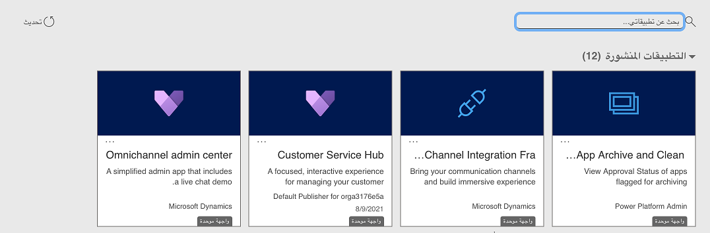

### اتجاه الشاشة
بالنسبة للهواتف، يتم تعيين الوضع العمودي كاتجاه افتراضي للشاشة. بالنسبة لأجهزة الكمبيوتر اللوحية، يتم تعيين الوضع الأفقي كاتجاه افتراضي. لا يمكن تغيير اتجاه الشاشة في تطبيق Dynamics 365 للهواتف وتطبيق Dynamics 365 لأجهزة الكمبيوتر اللوحية.

### شريط التنقل

يُمكنك استخدام شريط التنقل للوصول إلى منطقة العمل، أو إنشاء صف جديد، أو البحث، أو إجراء أي مهام أخرى.

### الحصول على مساعدة أثناء استخدام التطبيق

إذا كنت بحاجة إلى مساعدة أثناء وجودك في تطبيق الأجهزة المحمولة، فعليك الضغط في شريط التنقل على علامة الحذف (**...**)، ثمّ اضغط على **مساعدة**.

### المواقع المفضلة والصفوف المستخدمة مؤخراً

باستخدام قسمي "المفضلة" و"المستخدمة مؤخراً"، يُمكنك الوصول سريعاً إلى الصفوف وطرق العرض ولوحات المعلومات.

- وللوصول إلى هذين القسمين، اضغط على زر  **القائمة** في شريط التنقل، ثمّ اضغط على زر  **المفضلة والأخيرة** .

- لتثبيت عنصر كمُفضّل، من قائمة **المستخدمة مؤخراً** ، اضغط على الدبوس. سيؤدي هذا الإجراء إلى تثبيت العنصر ونقله إلى **المفضلة**.

- ولإزالة تثبيت عنصر من **المفضلة**، اضغط على الدبوس مرة أخرى.

### تبديل التطبيقات

ارجع إلى صفحات MyApps وقم بالتبديل إلى تطبيق مختلف.

### لوحات المعلومات

تمنحك لوحات المعلومات نظرة عامة على المعلومات القيّمة. اضغط على رمز "الشاشة الرئيسية" في أي وقت للوصول إلى لوحات المعلومات.

إذا كنت ترغب في استخدام لوحة معلومات مختلفة، فمن السهل التبديل للأمام وللخلف.

من الشاشة الرئيسية، اضغط على قائمة لوحات المعلومات، ثم حدد لوحة المعلومات التي تريد استخدامها.

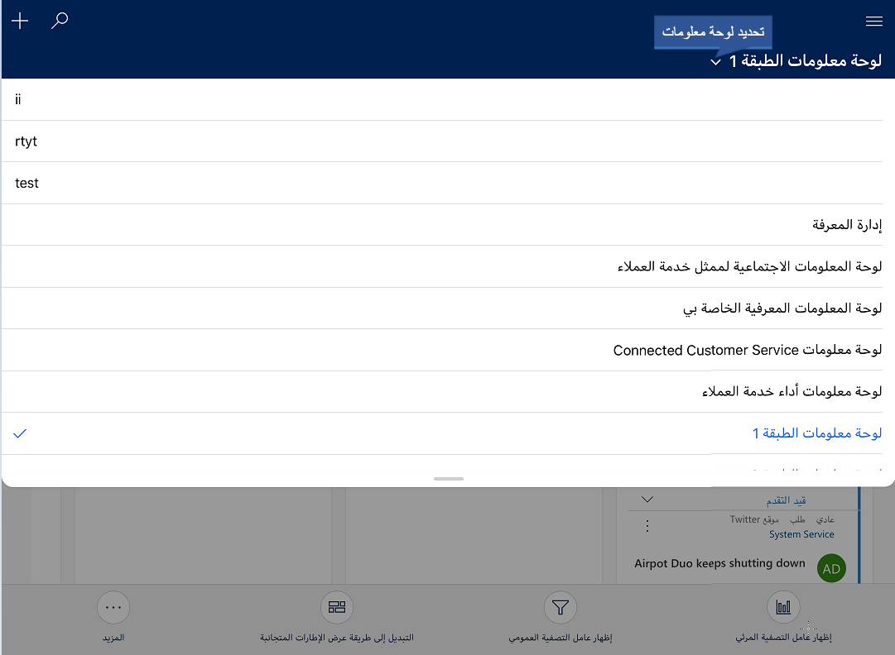

فيما يلي بعض طرق التعامل مع لوحات المعلومات.

|  **للقيام بذلك**    |      **عليك إجراء ما يلي**  |
|--------------------|-------------------------------------------------------------------------------|
| قم بعرض كل الصفوف لأحد أنواع الصفوف في لوحة المعلومات (على سبيل المثال **الحسابات**).| اضغط على رأس القائمة. يؤدي ذلك إلى فتح الصفوف في طريقة عرض الشبكة على جهازك المحمول. |
| افتح النموذج لأحد الصفوف بلوحة المعلومات. | اضغط على الصف. |
| لإنشاء لوحات معلومات جديدة وتمكين استخدامها على الهواتف وأجهزة الكمبيوتر اللوحية. | راجع [إنشاء لوحات معلومات أو تخصيصها](/dynamics365/customer-engagement/customize/create-edit-dashboards). |

### تغيير طرق العرض لقائمة بلوحة المعلومات

اضغط على اسم القائمة وحدد القائمة التي تريد استخدامها.

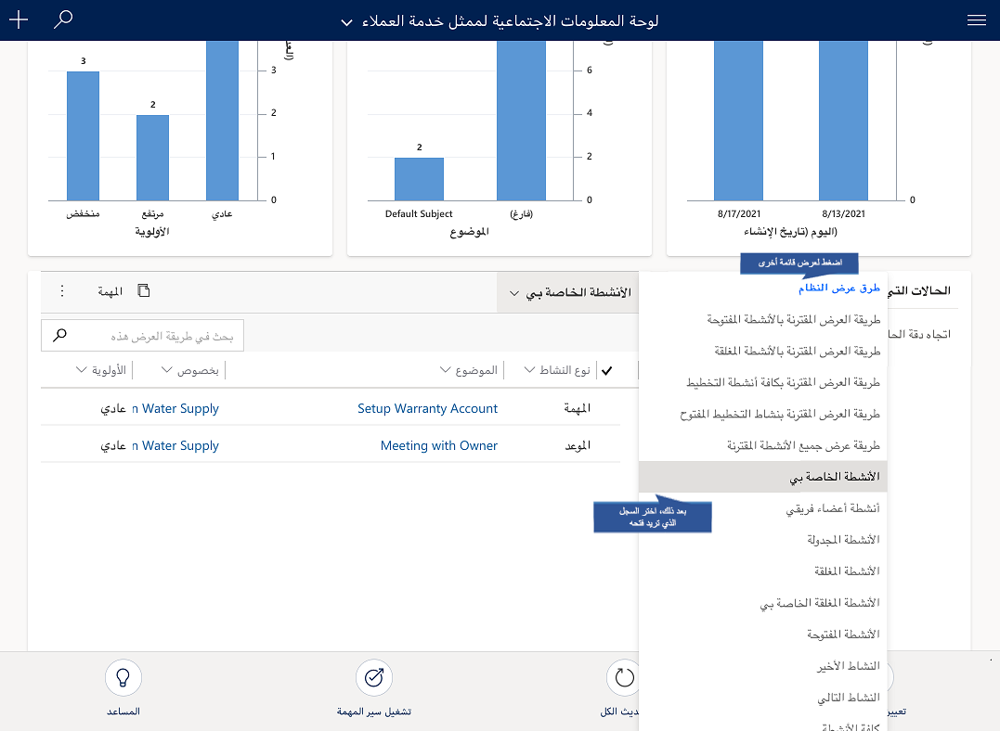

لإنشاء لوحات معلومات جديدة وتمكين استخدامها على الهواتف وأجهزة الكمبيوتر اللوحية، اطلع على [إنشاء لوحات معلومات أو تخصيصها](/dynamics365/customer-engagement/customize/create-edit-dashboards).

### فتح قائمة صفوف في طريقة عرض لوحة معلومات

- من إحدى قوائم الصفوف (على سبيل المثال، **الحسابات**)، اضغط على **فتح لوحات المعلومات**.

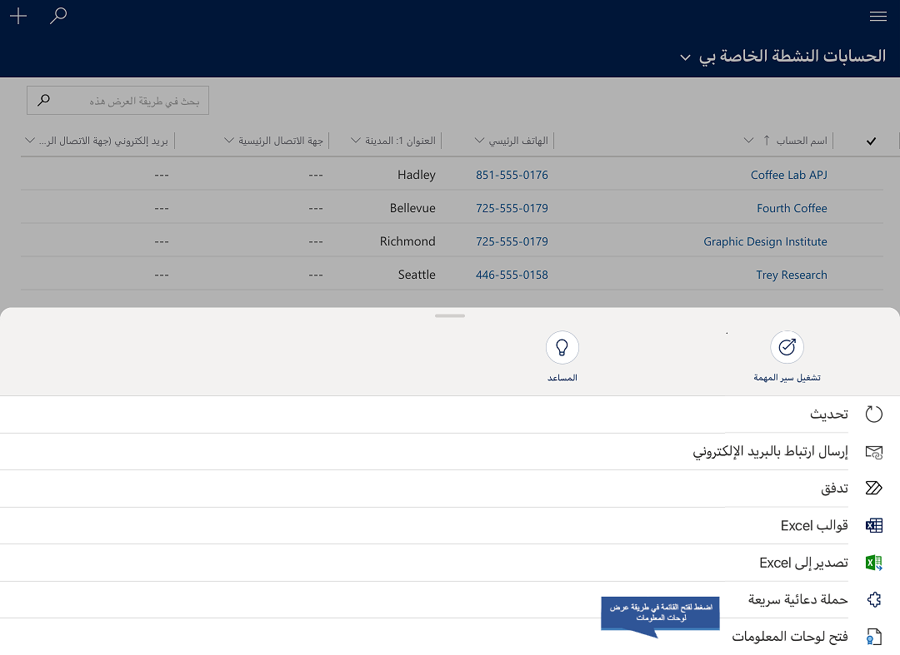
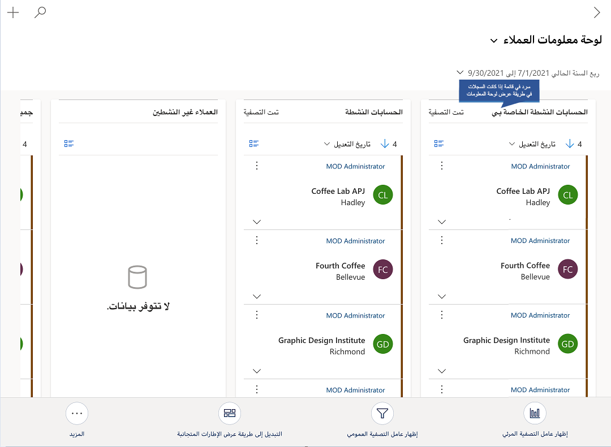

#### التعامل مع الصفوف

بصفتك محترفاً في مجال المبيعات أو الخدمة، ستعمل على الأنواع التالية من الصفوف وأكثر من ذلك:

- **الحسابات** - تحتوي صفوف الحسابات على معلومات حول الشركات التي تتعامل معها.
- **جهات الاتصال** - تحتوي صفوف جهات الاتصال على معلومات حول الأشخاص الذين تعرفهم وتعمل معهم. وعادة ما يتم إقران جهات اتصال متعددة بحساب واحد. يمكن أن تشمل جهات الاتصال الأشخاص المسؤولين عن اتخاذ قرارات الشراء، أو الأشخاص المسؤولين عن دفع الفواتير، أو فنيي الدعم، أو أي شخص تعمل معه في الشركة.

1. لإضافة صف، في شريط التنقل اضغط على علامة الحذف (**...**).
2. اضغط على **قائمة الإنشاء السريع** واختر نوع الصف.
3. حدد نوع صف لإنشائه.
4. أدخل المعلومات المطلوبة ثم اضغط على **حفظ**.

### فتح صف بسرعة

عندما يكون لديك صف مفتوح وتحتاج إلى عرض صف آخر في نفس القائمة، اضغط لاختيار صف آخر.

### اتخاذ إجراء بالنسبة للصف

يُمكنك اتخاذ إجراء على صف دون الحاجة إلى فتح الصف. من قائمة الصفوف، حدد الصف الذي تريد تحديثه، ثم حدد إجراءً بشريط الأوامر مثل **تعيين**، أو **إلغاء التنشيط**، أو **حذف**. كما يُمكنك اتخاذ إجراء مماثل عند تحديد صفوف متعددة.

### تحديث صورة للصف

لإضافة صورة إلى صف، افتح الصف واضغط على صورة الصف. بعدها، حدد الصورة التي ترغب في استخدامها.

#### متابعة التقدم الذي تحرزه باستخدام المخططات

تمنحك الرسوم البيانية رؤية سريعة لمسارك نحو تحقيق أهدافك.
وتتسم تلك الرسوم البيانية بالتفاعلية، بحيث يُمكنك النقر على منطقة في المخطط للحصول على مزيد من المعلومات.

- اضغط مرة واحدة على قسم بالمخطط لرؤية تلميح يوفر معلومات سريعة حول تلك المنطقة من المخطط.
- ويُمكنك الضغط مرة أخرى على نفس القسم لرؤية عرض شبكة مع مزيد من التفاصيل حول البيانات في المخطط.
- لتوسيع مخطط، من شبكة الصفحة الرئيسية للرسوم البيانية، اضغط على الزر  **توسيع المخطط** .
- لعرض الصفوف في المخطط أو تحديث المخطط، اضغط ثم اختر إجراء: **تحديث** أو **عرض الصفوف**.

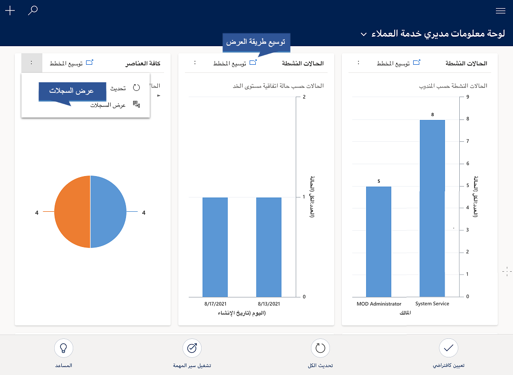

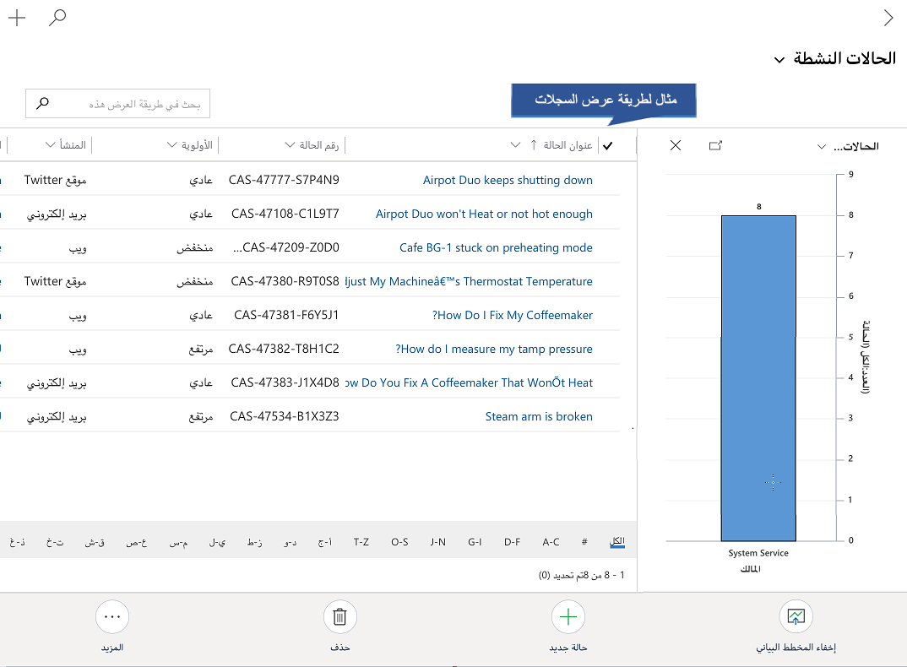

يدعم مخططان للبُعد مثل "السطر" و"الشريط" و"العمود" و"المنطقة" ميزة التكبير/التصغير. لا تدعم مخططات البعد المفردة مثل "أنبوب" و"دائري مجوف" و"دائري" و"علامات" ميزة التكبير/التصغير.

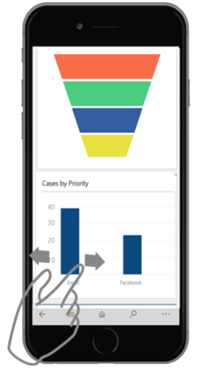

### تغيير طريقة عرض المخطط

تغيير طريقة عرض المخطط يُظهر توزيعاً مختلفاً لبياناتك، مثل الفرص التي تم فتحها خلال فترة زمنية محددة. يُمكنك تغيير طريقة عرض مخطط بتحديد مُحدد "عرض" في صفحة "شبكة".

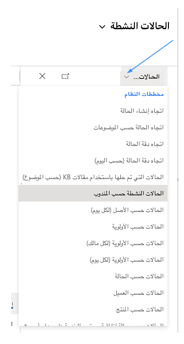

على سبيل المثال، اضغط على "كافة الفرص"، ثم حدد طريقة عرض مختلفة، وسيتم تحديث كل من المخطط والشبكة.

### البحث عن صفوف

يُمكنك البحث عن صفوف عبر جداول متعددة باستخدام "بحث الصلة" أو "البحث حسب الفئة". يُقدم "بحث الصلة" نتائج سريعة وشاملة عبر جداول متعددة، وفي قائمة واحدة، حيث يتم فرزها بحسب الصلة. يظهر "البحث حسب الفئة" نتائج بحث مُجمعة حسب أنواع الجداول، مثل الحسابات أو جهات الاتصال أو العملاء المتوقعين.

وعند تمكين "بحث الصلة" لمؤسستك، يصبح تجربة البحث الافتراضية.

### التبديل بين "بحث الصلة" و"البحث حسب الفئة"

1. في شريط التنقل، انقر فوق زر **بحث**.

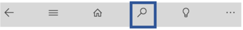

2. في القائمة، حدد نوع البحث.

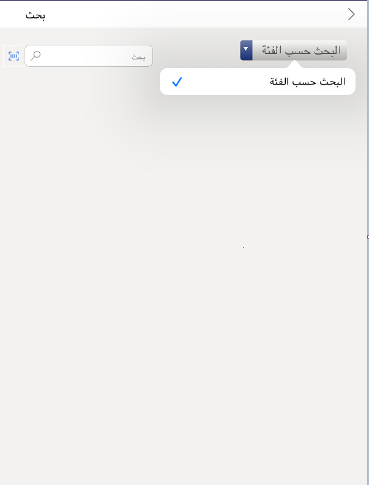

### استخدام بحث الصلة

1. في شريط التنقل، انقر فوق زر **بحث**.

2. اكتب شيئاً في خانة البحث، ثم اضغط على "بحث".

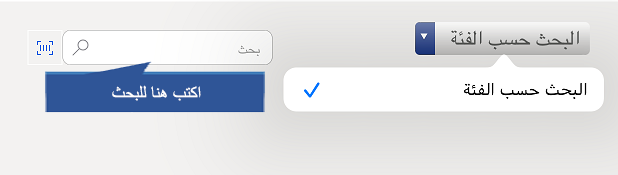

استخدم بنية الجملة في مصطلح البحث للحصول على النتائج المرجوة. على سبيل المثال، اكتب "سيارة فضية 2 باب" لتضمين نتائج مطابقة في نتائج البحث لأي كلمة في مصطلح البحث. اكتب "سيارة+فضية+2-باب" للعثور على المباريات التي تتضمن الكلمات الثلاث فقط. اكتب "سيارة|فضية|2-باب" للحصول على النتائج التي تحتوي على "سيارة" أو "فضية" أو "2-باب"، أو كل الكلمات الثلاث.

### استخدام البحث حسب الفئة

1. في شريط التنقل، انقر فوق زر **بحث**.

2. اكتب شيئاً في خانة البحث، ثم اضغط على **بحث**.

تقتصر نتائج البحث على الصفوف التي تبدأ بالأحرف التي تكتبها. على سبيل المثال، إذا كنت ترغب في البحث عن "كايرو فيستفال سيتي"، فاكتب **كاير** في خانة البحث. أما إذا كتبت **فيست**، فلن يظهر الصف.

### تصفية نتائج البحث

لتصفية النتائج حسب نوع الصف، اختر نوع صف من الخانة المنسدلة  **التصفية باستخدام** .

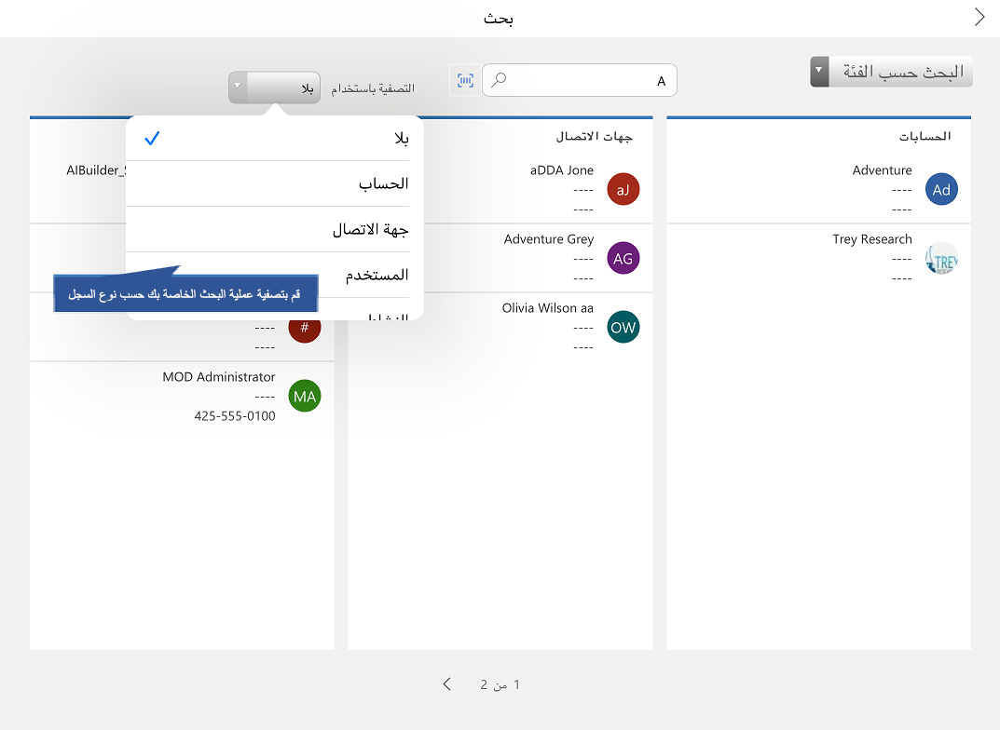

### فرز العناصر في طريقة عرض الشبكة

لمساعدتك في العثور على صف بسرعة، يمكنك فرز العناصر في طريقة عرض الشبكة. على سبيل المثال، عندما تنظر إلى قائمة بحساباتك النشطة، يُمكنك الضغط على السهم لفرز الصفوف بترتيب تصاعدي أو تنازلي.

- للفرز بترتيب تصاعدي حسب عمود، اضغط على عنوان العمود.
- للفرز بترتيب تنازلي حسب عمود، اضغط على عنوان العمود مرة أخرى.

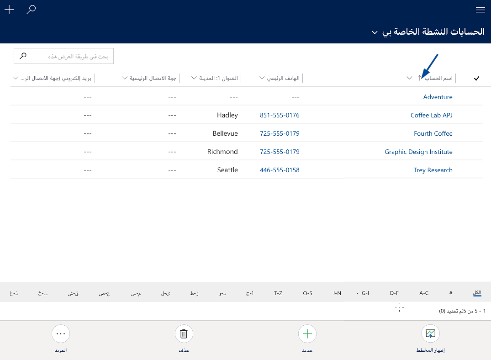

يمكنك إجراء الأمر نفسه من طريقة عرض قائمة في Dynamics 365 للهواتف.

- اضغط على **فرز** ثمّ اختر الطريقة التي تريد فرز البيانات بها.

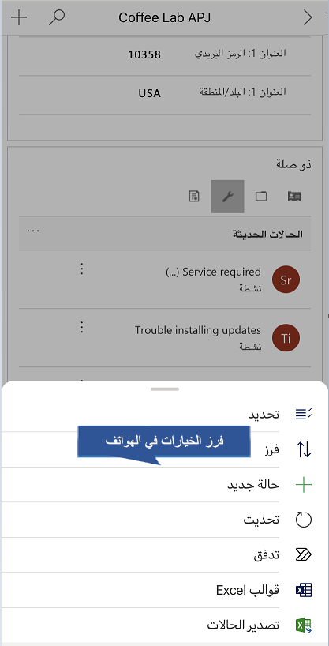

### تصدير الصفوف بصيغة Excel

في قائمة الصفوف، يمكنك تصدير الصفوف بصيغة Microsoft Excel، كما هو الحال تماماً في تطبيق الويب. من طريقة عرض الشبكة في تطبيقات Customer Engagement ضمن Microsoft Dynamics لأجهزة الكمبيوتر اللوحي أو قائمة الصفوف في Dynamics 365 للهواتف، اضغط على علامة الحذف (**...**) في شريط الأوامر، ثم اضغط على **تصدير إلى Excel**.

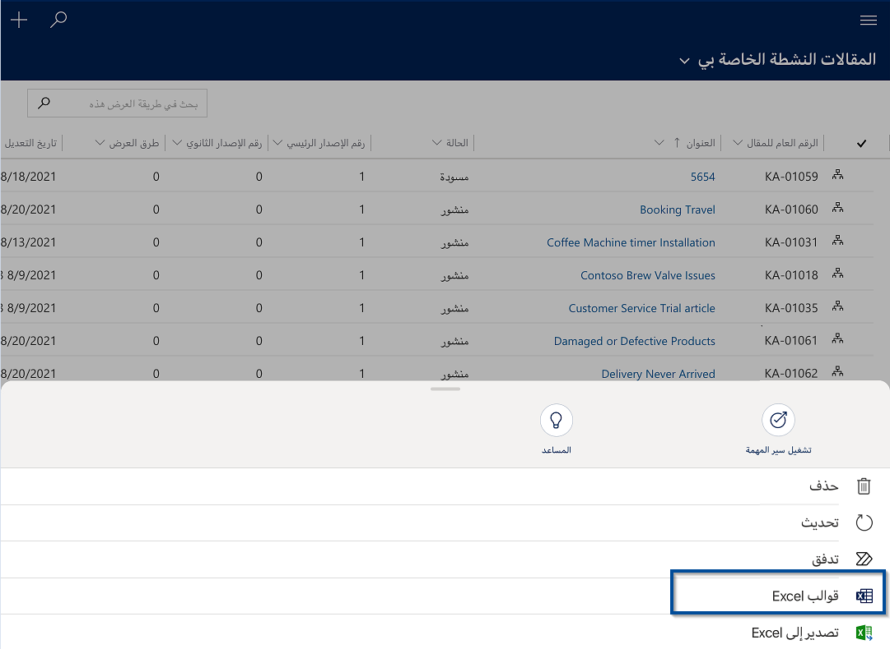

للحصول على مزيد من المعلومات، راجع [تصدير البيانات إلى Excel](/dynamics365/customer-engagement/basics/export-data-excel).

### مساعدة العلاقة

تم تصميم مساعد العلاقة لتقديم أهم المعلومات وثيقة الصلة بما تقوم به الآن. يعمل المساعد من خلال تحليل جميع البيانات المتاحة له وتوليد مجموعة من بطاقات الإجراءات، كل منها يتضمن رسالة تلخص محتوى البطاقة، بالإضافة إلى مجموعة من الروابط لاتخاذ إجراءات. يتولى المساعد فرز البطاقات حسب الأولوية وتصفيتها لتناسب سياقك الحالي.

يقوم المساعد بتذكيرك بالأنشطة القادمة; فهو يُقيّم اتصالاتك ويقترح الوقت المناسب للاتصال بجهة اتصال غير نشطة لفترة من الوقت؛ ويُحدد رسائل البريد الإلكتروني التي قد تكون بحاجة إلى رد منك؛ كما يُنبهك عندما توشك فرصة على الاقتراب من تاريخ إغلاقها; إلى جانب أشياء أخرى كثيرة.

عند بدء يومك بتسجيل الدخول إلى تطبيقات Dynamics 365 Customer Engagement، يلفت المساعد انتباهك إلى أهم العناصر والمهام، المستمدة من جميع مناطق التطبيق.

1. للوصول إلى المساعد، اضغط في شريط التنقل على علامة الحذف (**...**).
2. اضغط على **مساعد العلاقة**.

#### تحديث أنشطتك في المخطط الزمني

تُساعدك طريقة عرض المخطط الزمني على التعاون مع فريقك من خلال تتبع سجلّ الاتصالات على صفحة واحدة في طريقة عرض سهلة القراءة بزاوية عرض 360 درجة. يُمكنك مشاهدة كل شيء بدءاً من المشاركات والمرفقات الصوتية، وصولاً إلى البريد الإلكتروني والملاحظات والمزيد.

### إضافة نشاط

- افتح صفاً في منطقة **المخطط الزمني** ، واضغط على **+**، ثم حدد نوع النشاط الذي تريد إضافته.

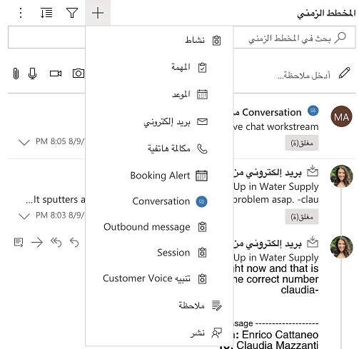

- اضغط على علامة الحذف (**...**) ثمّ اضغط على **فتح جزء عامل التصفية** لتصفية الصفوف في المخطط الزمني حسب نوع الصف.
- اضغط على **السهم لأسفل** لتغيير ترتيب فرز الصفوف من تصاعدي إلى تنازلي والعكس.

### تدوين الملاحظات

يتيح لك تطبيق الأجهزة المحمولة أيضاً تدوين الملاحظات وإرفاق صور بملاحظة، أو التقاط صورة جديدة باستخدام كاميرا جهازك. لذا، إذا كنت على سبيل المثال في موقع وتحتاج إلى توثيق مشكلة أحد العملاء مع منتج معين، فيُمكنك التقاط صورة وإضافتها إلى ملاحظة على الفور، بدلاً من التقاط الصورة، ثم إضافتها من شريط الكاميرا لاحقاً.

لإضافة ملاحظة، افتح صفاً ثم أدخل ملاحظتك في منطقة الملاحظات.

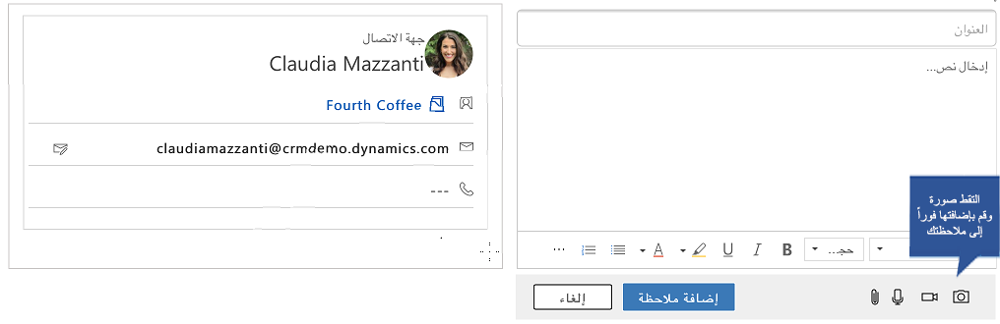

### مسح الرموز الشريطية

بدلاً من كتابة رقم الكود الشريطي يدوياً في عمود، يُمكنك مسح الباركود ضوئياً باستخدام كاميرا جهازك. اضغط على الرمز الموجود على يمين العمود لبدء تشغيل الماسح الضوئي. وهذا يجعل من السهل التقاط معلومات حول المخزون والمشكلات الأخرى عندما تكون في العمود من الخارج. سيلزمك مطالبة المشرف بإعداد هذه الميزة لك.

#### إرسال رسالة إلكترونية أو إجراء مكالمة

يُمكنك الاتصال أو إرسال رسالة إلكترونية إلى عملائك بسهولة من تطبيقات الأجهزة المحمولة. ما عليك سوى الضغط على أي رقم هاتف في أحد الصفوف لبدء مكالمة، أو الضغط على زر الرسالة الإلكترونية لإرسال رسالة.

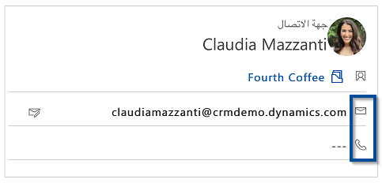

في تطبيق Dynamics 365 لأجهزة الكمبيوتر اللوحي، يؤدي الضغط على زرّ الهاتف إلى إجراء مكالمة عبر Skype. في Dynamics 365 للهواتف، تبدأ مكالمة هاتفية.

عند الانتهاء من مكالمتك، يطالبك التطبيق بإدخال تفاصيل حول المكالمة.

#### العمل دون اتصال بالإنترنت

يُمكنك العمل بسلاسة دون اتصال بالإنترنت مع مزامنة الهاتف المحمول دون اتصال. ويمكنك العمل عبر تطبيق الهاتف المحمول في وضع عدم الاتصال عندما يكون الجهاز غير متصل بالإنترنت. يوفر التطبيق تجربة غنية دون اتصال بالإنترنت، تتيح لك التعامل مع الأوامر الأساسية مثل إنشاء وقراءة وتحديث وحذف وعمليات الأعمال - حتى تظل دائماً منتجاً. وبمجرد معاودة الاتصال، تتم مزامنة التغييرات التي أجريتها.

إذا قام المشرف بتمكين الهاتف المحمول دون اتصال بالإنترنت، ففي المرة التالية التي يمكنك فيها الوصول إلى تطبيق الهاتف المحمول، ستتم مطالبتك بتنزيل التحديثات. عند تنزيل التحديثات، يُمكنك البدء في استخدام تطبيق الهاتف المحمول في وضع عدم الاتصال.

1. عند ظهور مربع الحوار **تتوفّر تحديثات دون اتصال** ، اختر **تحديث**.

2. سترى مؤشراً للتقدم أثناء تنزيل التحديثات. عند اكتمال التنزيل، من المستحسن التحقق من توفّر وضع عدم الاتصال.

### معرفة ما إذا كان وضع عدم الاتصال متوفراً

عند تنزيل التحديثات، يُمكنك التحقق لمعرفة ما إذا كان الهاتف المحمول متوفّر دون اتصال بالإنترنت.

1. على شريط التنقل، اضغط على علامة الحذف (**...**)، ثم اضغط على **حالة عدم الاتصال**.

2. تتولى **حالة عدم الاتصال** تتبع حالة عدم الاتصال في التطبيق بأكمله، وكذلك حالة كل جدول على حدة. عندما تظهر الحالة على أنها **متوفرة**، فإنها تشير إلى توفّر حالة عدم الاتصال ومزامنة البيانات بنجاح.

> [!NOTE]
> يمكن أن تكون الحالة **غير متوفرة** بسبب خطأ أو إذا فاتك تنزيل تحديثات عدم الاتصال. إذا كانت الحالة **غير متوفرة** بسبب عدم تنزيل آخر تحديثات عدم الاتصال، فجرب تنزيل التحديثات مرة أخرى.

3. توفّر **حالة الجدول** حالة عدم الاتصال لكل جدول على حدة. بالنسبة للجداول المتوفرة، يُمكنك أيضاً تتبع آخر مرة تمت مزامنة الجدول فيها.

يُمكنك أيضا تعقب حالة الجداول دون اتصال من زر  **القائمة** .

- يشير رمز Wi-Fi الأخضر الموجود بجوار اسم الجدول إلى أنه متوفر في وضع عدم الاتصال.
- يشير رمز Wi-Fi الأحمر إلى تمكين هذا الجدول في حالة عدم الاتصال، لكنه غير متوفر للعمل في وضع عدم الاتصال بسبب حدوث خطأ أو فقدان تحديثات.

- لا يوجد رمز Wi-Fi يُشير إلى أن المشرف لم يُمكن الجدول للاستخدام في وضع عدم الاتصال.

### مزامنة الخلفية

يتم تمكين مزامنة الخلفية حتى عند تصغير التطبيق عند اكتشاف اتصال بالشبكة. عندما يكون التطبيق في الخلفية، لن يتم قبول تغييرات البيانات الوصفية تلقائياً.

أشياء أخرى يجب وضعها في الاعتبار بشأن مزامنة الخلفية:

- سيتم تشغيل المزامنة حتى تقوم بتسجيل الدخول إلى تطبيق الهاتف المحمول.
- أثناء تشغيل التطبيق في الخلفية، يتم تعطيل المزامنة تلقائياً عند تعطيل الشبكة.
- عند إحضار التطبيق إلى المقدمة، يتم الكشف عن المزامنة المعتادة وتمكينها.
- يتم تعطيل مزامنة الخلفية عند قفل الجهاز وتمكينها عند فتح قفله.
- عندما يكون التطبيق قيد التشغيل في الخلفية، لن يتم قبول تغييرات بيانات التعريف تلقائياً. سيوقف تطبيق الهاتف المحمول مزامنة الخلفية.
- عند إحضار التطبيق إلى المقدمة، تتم مطالبتك بقبول تغييرات بيانات التعريف.
- أثناء تشغيل التطبيق في المقدمة، بعد تحديث بيانات التعريف، سيتحول التطبيق إلى المزامنة المعتادة.

سيتم تعطيل مزامنة الخلفية في الحالات التالية:
- انتهاء صلاحية الرمز المميز للمستخدم في الخلفية.
- إغلاق التطبيق لسبب ما.
- قفل الجهاز.

تتوفر مزامنة الخلفية على جميع الأجهزة المدعومة. لمزيد من المعلومات، راجع [دعم Dynamics 365 للهواتف وDynamics 365 لأجهزة الكمبيوتر اللوحية](/dynamics365/customer-engagement/mobile-app/support-phones-tablets).

### حل تعارض المزامنة

إذا تم إجراء إدخالات متعددة في نفس العمود بواسطة المستخدمين في وضع عدم الاتصال (على سبيل المثال، تاريخين أو أكثر في "الإغلاق في")، يتم وضع علامة التعارض بوضوح، ويمكنك اختيار الإدخال الصحيح.

إذا تغير صف على الخادم بين الوقت الذي استعاد فيه جهازك الصف وعندما يحاول تحديث هذا الصف أو حذفه، فسترى علامة تعجب ("!") في العمود ذي الصلة وستحتاج إلى إعادة إرسال التغييرات بعد تحديثها.

#### إعادة تكوين التطبيق

إذا كنت تستخدم تطبيق الهاتف المحمول على هاتف أو جهاز كمبيوتر لوحي مؤقتاً وتريد إزالة جميع بيانات ذاكرة التخزين المؤقت قبل إعطاء جهازك لشخص آخر، فسيلزمك إعادة تكوين التطبيق.

علماً بأن إعادة التكوين تؤدي إلى حذف كافة البيانات وبيانات التعريف من ذاكرة التخزين المؤقت، ومع ذلك يجب عدم الاعتماد على هذا كإجراء أمان.

إذا قمت بتسجيل الخروج من مؤسسة واحدة وتسجيل الدخول إلى مؤسسة أخرى، ثم استخدمت خيار **إعادة تكوين** في المؤسسة التي قمت بتسجيل الدخول إليها، فستظل بيانات التعريف خاصة بالمؤسسة التي قمت بتسجيل الخروج منها. لإزالة بيانات التعريف الخاصة بك من المؤسسة التي قمت بتسجيل الخروج منها، ستحتاج إلى تسجيل الدخول إليها واستخدام خيار **إعادة تكوين** هناك أيضاً.

وإليك كيفية إجراء ذلك:

1. اضغط على علامة الحذف (**...**).
2. اضغط على **معلومات المستخدم**.
3. اضغط على **إعادة تكوين**.

### Field Service Mobile

يوفر تطبيق Field Service Mobile للفنيين الميدانيين المعلومات التي يحتاجونها للوصول إلى موقع العميل وإكمال أوامر العمل بسرعة.

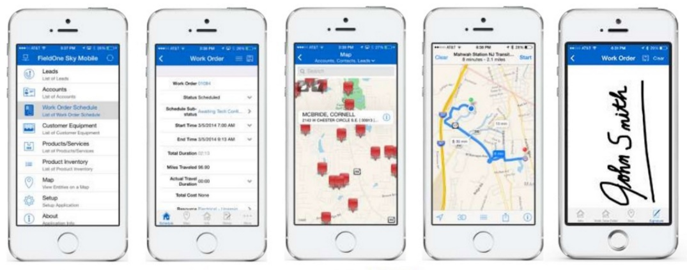

قبل أن يتمكن الفنيون الميدانيون من استخدام تطبيق Field Service Mobile، يحتاج المسؤول إلى تثبيت أداة تكوين Field Service Mobile والمشروع المتنقل ذي الصلة.

لمزيد من المعلومات حول Field Service Mobile، راجع [إعداد Field Service Mobile](/dynamics365/customer-engagement/field-service/field-service-mobile-app-user-guide).