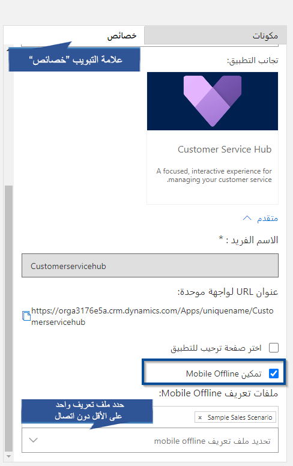

يمكنك توفير تجربة محسّنة في وضع عدم الاتصال لمستخدمي الأجهزة المحمولة باستخدام تطبيقات مشاركة عملاء Dynamics 365. عند تشغيل المزامنة دون اتصال، يمكن لمستخدمي الأجهزة المحمولة العمل بسلاسة في وضع عدم الاتصال على أجهزتهم المحمولة عندما لا يكون لديهم اتصال بالإنترنت.

تستخدم تجربة العمل دون اتصال هذه خدمات Microsoft Azure لمزامنة الجداول بشكل دوري مع تطبيقات مشاركة عملاء Dynamics 365 لتطبيقات الهواتف وأجهزة الكمبيوتر اللوحية بحيث تتوفر الصفوف المتزامنة عند قطع اتصال الأجهزة المحمولة. لتمكين مزامنة Mobile Offline، اتبع الخطوات التالية.

> [!NOTE] 
> لا تتوفر مزامنة Mobile Offline للمؤسسات في وضع الإصدار التجريبي أو الأولي أو وضع الحماية.

### الخطوة 1: تمكين الجداول لمزامنة Mobile Offline

أحد الأشياء الأولى التي يتعين عليك القيام بها هو تمكين الجداول التي ستتوافر لمستخدمي الأجهزة المحمولة عندما يستخدمون تطبيق الأجهزة المحمولة في وضع عدم الاتصال. يمكن أيضاً تمكين أي جدول تم تمكينه للجهاز المحمول لوضع Mobile Offline. للعثور على قائمة بالجداول المتوفرة للأجهزة المحمولة، راجع [الجداول المعروضة في Dynamics 365 للهواتف وأجهزة الكمبيوتر اللوحية](/dynamics365/customer-engagement/customize/customize-phones-tablets#tables-displayed-in-dynamics-365-for-phones-and-tablets).

يتم تمكين الجداول التالية لـ Mobile Offline افتراضياً:

- الحساب
- الموعد
- المرفق
- المنافس
- عنوان المنافس
- جهة الاتصال
- البريد الإلكتروني
- العميل المتوقع
- ملاحظة
- الفرصة
- منتج الفرصة
- المنتج
- المهمة
- الحالة
- صف
- عنصر الصف
- مثيل SLA KPI
- الاستحقاق
- Team
- المستخدم

> [!NOTE]
> يمكنك تعطيل أي من هذه الجداول دون اتصال أو تمكين أي جدول من القائمة دون اتصال. استخدم الخطوات التالية لتمكين جدول ما أو تعطيله.

ضع في اعتبارك أن كمية البيانات التي تتيحها للمستخدمين أثناء عملهم دون اتصال يمكن أن تؤثر على معدلات استخدام البيانات للأجهزة على الشبكات الخلوية. تعتمد كمية البيانات على ما يلي:

- عدد الجداول التي تقوم بتمكينها لـ Mobile Offline.
- عدد الأيام التي تحددها منذ آخر تعديل للصفوف.
- عوامل التصفية التي تعينها أثناء إنشاء ملفات تعريف Mobile Offline.

لتمكين المزيد من الجداول دون اتصال، اتبع الخطوات التالية:

1. في تطبيق  **تطبيقات مشاركة عملاء Dynamics 365 - مخصصة** ، انتقل إلى  **الإعدادات > التخصيصات**.
2. انقر على **تخصيص النظام**.
3. قُم بتوسيع **الجداول** في الجزء الأيسر.
4. حدد الجدول الذي تريد تمكينه لـ Mobile Offline (على سبيل المثال، **الحساب**).
5. تحت **Outlook وMobile**، حدد **تمكين لـ Mobile Offline**.

6. انقر فوق **عامل تصفية تنزيل بيانات المؤسسة** لتصفية البيانات وتعيين حداثة البيانات التي تريد إتاحتها في وضع عدم الاتصال. يمكنك إعداد ما يصل إلى ثلاثة معايير عند تحديد عامل تصفية. حدد الحقل المطلوب التصفية على أساسه، وحدد عامل، ثم قُم بتعيين قيمة.

الجداول التي يتم تمكينها لـ Mobile Offline بشكل افتراضي تم ضبط **تاريخ التعديل** فيها على **آخر X أيام** = 10، لذا فإن البيانات التي تم تعديلها أو إنشاؤها في آخر 10 أيام ستكون متاحة للتنزيل على الأجهزة المحمولة.

7. انقر فوق **حفظ**.
8. عند الانتهاء من تمكين الجداول لـ Mobile Offline، انقر فوق **نشر** حتى تسري تغييراتك.

> [!NOTE]
> يطالب نشر التخصيصات تطبيقات الأجهزة المحمولة بتنزيل التغييرات عندما يُشغّل المستخدمون تطبيقهم في المرة التالية، مما قد يؤثر سلباً على تجربتهم من خلال بطء الاتصالات.

### الخطوة 2: تمكين مزامنة Mobile Offline لمؤسستك

في هذه الخطوة، تحتاج إلى تشغيل مزامنة Mobile Offline. سيتم نسخ بيانات الجداول التي تم تمكينها لـ Mobile Offline في خدمة Azure وستتاح للمزامنة مع عملاء الأجهزة المحمولة

لتمكين المزامنة دون اتصال، اتبع الخطوات أدناه.

1. في تطبيق  **تطبيقات مشاركة عملاء Dynamics 365 - مخصصة** ، انتقل إلى  **الإعدادات** > **Mobile Offline**. إذا كنت لا ترى هذا الخيار، فيُرجى الاتصال بالدعم الفني.
2. انقر فوق **تكوين Mobile Offline**.
3. انقر فوق **متابعة** لقبول شروط إخلاء المسؤولية والسماح بمشاركة البيانات مع نظام خارجي على خدمات Azure.
4. حدد **بدء التوفير**. يؤدي هذا إلى بدء عملية التوفير لـ Mobile Offline. عند اكتمالها، سيقوم مستخدمو الأجهزة المحمولة لديك بتجربة إمكانات Mobile Offline الجديدة.

يمكن للمستخدمين متابعة العمل في وضع عدم الاتصال أثناء مزامنة التطبيق لبياناتك. لعرض حالة التنزيل لجميع الجداول التي تم تمكينها للعمل دون اتصال، راجع **حالة تنزيل بيانات الجدول**.
-  **تتبع حالة عدم الاتصال** - يمكن للمستخدمين تتبع حالة التوفير دون اتصال من المرحلة 1 إلى 7. في المرحلة الخامسة، يمكنك أيضاً تتبع حالة تنزيل البيانات من حيث النسبة المئوية المكتملة والوقت المتبقي لإكمال تنزيل البيانات. 
-  **بدء العمل دون اتصال على الفور** - بمجرد تشغيل مزامنة Mobile Offline، يمكن للمستخدمين البدء في استخدامه دون الحاجة إلى انتظار تنزيل جميع بيانات الجدول. عند اكتمال بيانات الجدول الإلزامية، يمكنك البدء في استخدام تطبيق الأجهزة المحمولة في وضع عدم الاتصال بينما يستمر النظام في تنزيل بيانات الجدول الأخرى التي حددتها. سيتم إخطارك بالمدة التي سيستغرقها التنزيل، بالإضافة إلى الحالة التفصيلية لكل جدول.

### توصية لتغيير مراكز البيانات أو المواقع الجغرافية

إذا قررت نقل مؤسستك إلى مركز بيانات أو موقع جغرافي مختلف، فأنت بحاجة إلى تعطيل ثم تمكين مزامنة Mobile Offline لمؤسستك بعد اكتمال النقل:

1. انتقل إلى **الإعدادات > Mobile Offline.**
2. انقر فوق **تكوين Mobile Offline**.
3. حدد **بدء إلغاء التوفير**. يؤدي هذا الإجراء إلى بدء عملية إلغاء التوفير. إذا لم يكن هذا الخيار متاحاً، فقد تم تعطيل مزامنة Mobile Offline أثناء الانتقال إلى مركز بيانات أو موقع جغرافي مختلف، ويمكنك المتابعة إلى الخطوة التالية. عند اكتمال إلغاء التوفير، حدد **بدء التوفير**.

### أشياء يجب معرفتها عند بدء توفير Mobile Offline

- يمكن للمسؤولين رؤية حالة التوفير وإلغاء التوفير.
- يتم تحديث صفحة تكوين Mobile Offline تلقائياً على فترات منتظمة لإظهار رسائل الحالة المحدّثة أثناء التوفير وإلغاء التوفير.
- يمكنك إيقاف التوفير في أي مرحلة خلال عملية التوفير.
- يمكنك إلغاء التوفير لمؤسستك عند اكتمال عملية التوفير.
- لا يمكن إيقاف عملية إلغاء التوفير لأي مؤسسة بمجرد بدء العملية.
- يمكنك بدء التوفير مرة أخرى فقط عند اكتمال إلغاء التوفير.
- في حالة فشل التوفير أو إلغاء التوفير، ضع في اعتبارك إعادة محاولة عملية التوفير قبل الاتصال بالدعم.
- سيتم عرض جميع رسائل التوفير وإلغاء التوفير على شاشة **تكوين Mobile Offline** إلى جانب التاريخ والطابع الزمني لوقت آخر فحص للحالة.

### الخطوة 3: إنشاء ملف تعريف Mobile Offline لتحديد البيانات التي ستتاح أثناء العمل دون اتصال

تحتاج إلى إنشاء ملفات تعريف Mobile Offline للمستخدمين لتكوين عوامل التصفية التي تحدد مقدار بيانات الجدول (وبيانات الجداول ذات الصلة) التي ستتاح للمستخدم أثناء العمل دون اتصال.

> [!NOTE]
> يجب أن يكون لدى المستخدم دور أمان له أذونات قراءة في ملف تعريف Mobile Offline حتى يتمكن من استخدام أجهزته المحمولة في وضع عدم الاتصال.

1. انتقل إلى **الإعدادات > Mobile Offline**.
2. انقر فوق **ملفات تعريف Mobile Offline**.
3. انقر فوق **جديد** لإنشاء ملف تعريف Mobile Offline جديد. إذا كان لديك بالفعل ملف تريد تحريره، فحدده من القائمة.
4. أدخل اسماً ووصفاً لملف تعريف Mobile Offline الخاص بك.
5. انقر فوق **حفظ** لإنشاء ملف تعريف Mobile Offline حتى تتمكن من متابعة تحريره.
6. في منطقة **تفاصيل عنصر ملف تعريف Mobile Offline** ، انقر فوق **+** لإنشاء عنصر ملف تعريف Mobile Offline جديد. تحتاج إلى إنشاء عنصر ملف تعريف Mobile Offline لكل جدول تريد إتاحته لملف تعريف Mobile Offline هذا.
7. أدخل اسماً وحدد جدولاً. تظهر فقط الجداول التي قمت بتمكينها لـ Mobile Offline في هذه القائمة.
8. يمكن للمسؤولين اختيار المعلومات المراد مزامنتها مع أجهزة المستخدم. يمكن أن يساعد ذلك في تقليل التأثير على ذاكرة جهاز المستخدم. باستطاعة المسؤولين تحديد عامل تصفية مخصص استناداً إلى القواعد التالية. ويمكنك إنشاء عوامل تصفية لما يصل إلى ثلاثة مستويات.

- يساوي                           
- لا يساوي  
- gt -- greater than  
- ge -- greater than or equal to  
- le -- less than or equal to  
- lt -- less than  
- like  
- not-like  
- in  
- not-in  
- null  
- not-null  
- eq-userid  
- ne-userid  
- eq-userteams  
- eq-useroruserteams  
- eq-useroruserhierarchy  
- eq-useroruserhierarchyandteams  
- eq-businessid  
- ne-businessid  
- eq-userlanguage  
- begins-with  
- not-begin-with  
- ends-with  
- not-end-with  

> [!NOTE]
> تأكد من استخدام المستخدمين لديك لأحدث إصدار من تطبيق الأجهزة المحمولة لكي تعمل عوامل التصفية المتقدمة في وضع عدم الاتصال.

حدد عامل تصفية تنزيل البيانات بناءً على نوع الملكية للجدول. يمكنك تحديد عوامل التصفية بناءً على المستخدم أو الفريق والمؤسسة والأعمال، وبلا.

9. انقر فوق **حفظ** لإنشاء عنصر ملف تعريف Mobile Offline حتى تتمكن من متابعة تحريره.
10. في منطقة **تفاصيل اقتران عنصر ملف تعريف Mobile Offline** ، انقر فوق **+** لإنشاء عنصر ملف تعريف Mobile Offline جديد. تحتاج إلى إنشاء اقتران عنصر ملف تعريف Mobile Offline لكل صف ذي صلة تريد إتاحته في وضع عدم الاتصال. بالإضافة إلى ذلك، تحتاج إلى تضمين أي جداول ذات صلة في ملف تعريف Mobile Offline هذا.

على سبيل المثال، إذا قمت بإنشاء اقتران عنصر ملف تعريف Mobile Offline من جدول العملاء المتوقعين، فستحتاج إلى إضافة جدول العملاء المتوقعين إلى ملف تعريف Mobile Offline هذا.

11. أدخل اسماً لاقتران عنصر ملف تعريف Mobile Offline، وحدد علاقة، ثم انقر فوق **حفظ**.

عندما تنتهي من إضافة حالات اقتران عنصر ملف تعريف Mobile Offline إلى عنصر ملف تعريف Mobile Offline، انقر فوق **حفظ وإغلاق** في الجزء العلوي من شاشة **عنصر ملف تعريف Mobile Offline‏‎** .

12. عند الانتهاء من إضافة تفاصيل عنصر ملف تعريف Mobile Offline إلى عنصر ملف تعريف Mobile Offline، انقر فوق زر **حفظ** الموجود في الزاوية السفلية اليمنى من نافذة‏‎ **عنصر ملف تعريف Mobile Offline‏‎** .

#### الخطوة 3.1: إضافة مستخدمين إلى ملف تعريف Mobile Offline

بعد إنشاء ملف تعريف Mobile Offline، يمكنك البدء في إضافة مستخدمين إلى ملف التعريف. يمكنك إضافة مستخدم إلى ملف تعريف Mobile Offline واحد فقط.

1. إذا لم يكن مفتوحاً بالفعل، فافتح ملف تعريف Mobile Offline الذي تريد إضافة مستخدمين إليه.
2. في منطقة **المستخدمين** ، انقر فوق **+** لإضافة مستخدم جديد.
3. انقر فوق حقل البحث الذي يظهر وحدد مستخدماً لإضافته إلى ملف تعريف Mobile Offline هذا.
4. عند الانتهاء من إضافة المستخدمين، اختر زر **حفظ** الموجود في الزاوية السفلية اليمنى من نافذة **ملف تعريف Mobile Offline** .

#### الخطوة 3.2: نشر ملف تعريف Mobile Offline

لإتاحة ملف تعريف Mobile Offline للمستخدمين حتى يتمكنوا من الحصول على تجربة Mobile Offline التي حددتها لهم، تحتاج إلى نشر ملف التعريف.

1. إذا لم يكن مفتوحاً بالفعل، فافتح ملف تعريف Mobile Offline الذي تريد نشره.
2. عند الانتهاء من إضافة المستخدمين وإجراء أي تغييرات أخرى على ملف تعريف Mobile Offline، فانقر فوق **نشر** لذلك يمكن بدء مزامنة البيانات التي حددتها مع أجهزة المستخدمين المحمولة.

من المهم ملاحظة أنه عند تصدير حل يتضمن ملف تعريف Mobile Offline، حدد دائماً خانة الاختيار **تضمين بيانات تعريف الجدول** لكل جدول تقوم بتصديره. بعد استيراد الحل إلى المؤسسة الهدف، انشر جميع ملفات تعريف Mobile Offline.

### الخطوة 4: تمكين وحدة التطبيق دون اتصال

تمكين Mobile Offline لتطبيق معين من صفحة MyApps.

1. في تطبيق  **تطبيقات مشاركة عملاء Dynamics 365 - مخصصة** ، انتقل إلى  **الإعدادات** > **تطبيقاتي**.
2. من قائمة التطبيقات المنشورة، حدد التطبيق الذي تريد تمكينه لـ Mobile Offline.
3. في التطبيق المحدد، اختر  **المزيد من الخيارات** (**...**).
4. اختر **فتح في مصمم التطبيق**.

5. في علامة التبويب **الخصائص** ، قُم بالتمرير لأسفل وحدد **تمكين Mobile Offline** ثم اختر ملفاً تعريفياً.

> [!NOTE]
> يمكنك إضافة أكثر من ملف تعريف لوحدة تطبيق.

6. اختر **حفظ** ثم **نشر**.

### تلميحات

فيما يلي بعض الأمور التي يجب وضعها في الاعتبار حول مزامنة Mobile Offline.

- تحدث مزامنة Mobile Offline مع الأجهزة المحمولة بشكل دوري. يمكن أن تستمر دورة المزامنة لعدة دقائق، بناءً على زمن الانتقال في شبكة Azure وحجم البيانات التي تم تعيينها للمزامنة وسرعة شبكة الهاتف المحمول. لا يزال بإمكان المستخدمين استخدام تطبيقات الأجهزة المحمولة أثناء المزامنة.

- يتم تحديث التغييرات على امتيازات أمان المستخدم أثناء دورة المزامنة التالية. حتى ذلك الوقت، لا يزال بإمكان المستخدمين الاستمرار في الوصول إلى البيانات وفقاً لامتيازات الأمان السابقة الخاصة بهم، ولكن سيتم التحقق من صحة أي تغييرات يقومون بها أثناء المزامنة مع الخادم. إذا لم يعد لديهم امتيازات لإجراء تغييرات لصف ما، فسيتلقون خطأ ولن يتم إنشاء الصف أو تحديثه أو حذفه.

- لن تسري أي تغييرات على امتياز المستخدم لعرض صف على الجهاز المحمول حتى دورة المزامنة التالية.

بمجرد تمكين مزامنة Mobile Offline، يتم دفع تغييرات بيانات التعريف إلى تطبيقات الأجهزة المحمولة عند نشر التغييرات، وليس عند بدء تشغيل التطبيق فقط. للحفاظ على تحديث مزامنة Mobile Offline، يجب على المستخدمين دائماً قبول المطالبة بتنزيل تغييرات بيانات التعريف.
