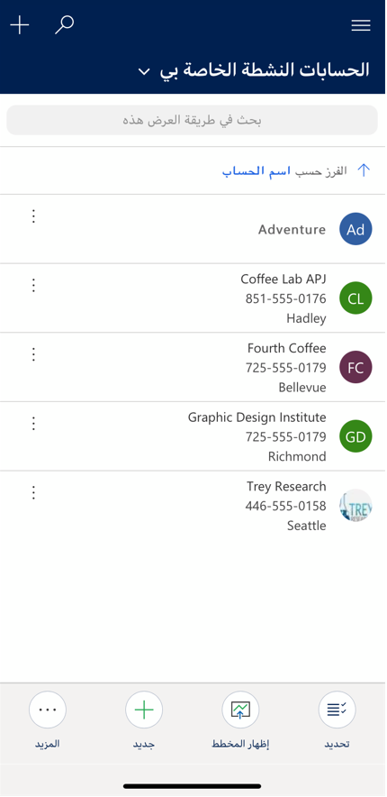
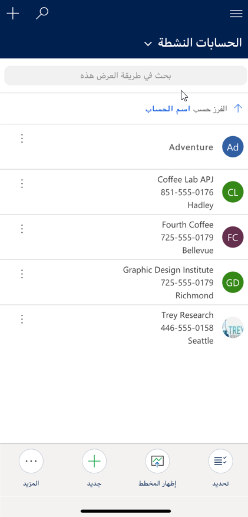

Power Apps عبارة عن مجموعة من التطبيقات والخدمات والموصّلات ونظام أساسي للبيانات توفر بيئة تطوير سريعة للتطبيقات لإنشاء تطبيقات مخصَّصة تلبي احتياجات عملك. باستخدام Power Appsيمكنك إنشاء تطبيقات أعمال مخصصة بسرعة تتصل ببيانات عملك المخزنة  *إما* في النظام الأساسي للبيانات الأساسية (Microsoft Dataverse للتطبيقات) *أو* أو في العديد من مصادر البيانات عبر الإنترنت والمحلية (SharePoint، وExcel، وMicrosoft 365، وDynamics 365، وSQL Server، وما إلى ذلك).

توفر التطبيقات التي أُنشئت باستخدام Power Apps منطق أعمال ثرياً وقدرات سير عمل ثرية لتحويل عمليات أعمالك اليدوية إلى عمليات رقمية وتلقائية. وعلاوة على ذلك، تتميز التطبيقات التي أُنشئت باستخدام Power Apps بتصميم متجاوب، ويمكن تشغيلها بسلاسة في مستعرض أو على الأجهزة المحمولة (الهاتف أو الكمبيوتر اللوحي). إن Power Apps "يضفي الطابع الديمقراطي" على تجربة إنشاء تطبيقات الأعمال المخصّصة بتمكين المستخدمين من إنشاء تطبيقات أعمال ثرية بالميزات ومخصّصة دون كتابة تعليمة برمجية.

كما يوفر Power Apps نظاماً أساسياً قابل للتوسعة يتيح للمطورين التفاعل برمجياً مع البيانات وبيانات التعريف، وتطبيق منطق الأعمال، وإنشاء موصلات مخصّصة والتكامل مع البيانات الخارجية.

### كيف يمكن البحث عن التطبيقات وتشغيلها؟

لا داعٍ للعمل يدوياً على مهمة لإنجاز عملك. فبفضل Power Apps، يمكنك إنشاء تطبيق لوحة أو تطبيق يستند إلى النموذج واستخدامه لإنجاز عملك بسرعة. بعد إنشاء التطبيق، يمكنك مشاركته مع مؤسستك.

تمنحك [تطبيقات اللوحة](/power-apps/maker/canvas-apps/getting-started) مستوى كبيراً من التحكم في تجربة المستخدم الخاصة بالتطبيق. بإمكان منشئ التطبيق استخدام القوالب لإنشاء تطبيق اللوحة، أو يمكنك تكوين التطبيق بالطريقة التي تناسبه. تطبيق اللوحة، كما يشير إليه اسمه، هو عبارة عن لوحة فارغة، وبالتالي يمكنك إنشاء تطبيق يتلاءم مع احتياجات المستخدمين في مؤسستك.

يمكن أن تكون تطبيقات اللوحة أي شيء في الأساس، لذا لا توجد وثائق تعليمات كثيرة حول كيفية استخدام تطبيق بمجرد إنشائه. إذا احتجتَ إلى المساعدة في استخدام تطبيق لوحة، فاتصل بمنشئ التطبيق أو مسؤول Power Apps.

[التطبيقات المستندة إلى النماذج](/power-apps/maker/model-driven-apps/model-driven-app-overview) تستخدم [الواجهة الموحدة](/power-apps/user/unified-interface) التي توفر تصميماً متجاوباً ويمكن الوصول إليه. يمكنك تشغيل التطبيق على مستعرض ويب أو على أجهزة محمولة رائجة. يحتوي التطبيق على مكونات متعددة بما في ذلك لوحات المعلومات والنماذج وطرق العرض والمخططات وعمليات الأعمال التي تساعد جميعها معًا في جعل التطبيق سهل الاستخدام. يتم إنشاء التطبيقات المستندة إلى النموذج وتصميمها وفقًا لإطار عمل Microsoft Dynamics 365 Customer Engagement، لذا فإن تجربة المستخدم تشبه  [تطبيقات](/dynamics365/customer-engagement/basics/business-apps-dynamics-365) Dynamics 365 Customer Engagement.

### ما المطلوب لتشغيل التطبيقات؟

- تأكد من أنك تستخدم  [نظامًا أساسيًا ومستعرضًا معتمدًا للجهاز](/power-apps/maker/canvas-apps/limits-and-config).
- لتشغيل تطبيقات اللوحة، نزّل Power Apps وثبّته من [App Store](https://itunes.apple.com/app/power-apps/id1047318566?mt=8) أو [Google Play](https://play.google.com/store/apps/details?id=com.microsoft.msapps).
- لتشغيل التطبيقات المستندة إلى النموذج:

> [!IMPORTANT]
> لا تشغّل تطبيقات مشاركة العملاء (مثل Dynamics 365 Sales وDynamics 365 Customer Service) في تطبيق Power Apps للأجهزة المحمولة. بدلاً من ذلك، يمكنك استخدام تطبيقات Dynamics 365 للهواتف ولأجهزة الكمبيوتر اللوحية. مزيد من المعلومات: [دليل المستخدم لـ Dynamics 365 للهواتف ولأجهزة الكمبيوتر اللوحية](/dynamics365/mobile-app/dynamics-365-phones-tablets-users-guide)

  - على الهاتف، نزّل Dynamics 365 للهواتف وثبّته من [App Store](https://itunes.apple.com/app/dynamics-crm-for-phones/id1003997947?ls=1&mt=8) أو [Google Play](https://play.google.com/store/apps/details?id=com.microsoft.crm.crmphone).
  - على كمبيوتر لوحي، نزّل Dynamics 365 لأجهزة الكمبيوتر اللوحية وثبّته من [App Store](https://itunes.apple.com/app/microsoft-dynamics-crm/id678800460?mt=8)، أو [Google Play](https://play.google.com/store/apps/details?id=com.microsoft.crm.crmtablet)، أو [Microsoft Store](https://www.microsoft.com/store/p/microsoft-dynamics-365/9nblggh4rfqp).

### تشغيل تطبيق لوحة على جهاز محمول

عندما تُنشئ تطبيقاً، أو يشارك شخص ما تطبيقاً معك، يمكنك تشغيل ذللك التطبيق على Windows، أو iOS، أو Android، أو في مستعرض ويب. ستتعرف في هذا القسم على كيفية تشغيل تطبيق لوحة على جهاز محمول. يمكن للتطبيقات التي تعمل على جهاز محمول الاستفادة من قدرات الجهاز، مثل خدمات الموقع والكاميرا.

لاتباع هذا الإجراء، إذا لم تسجّل في Power Apps، [فسجّل مجاناً](https://make.powerapps.com/signup?redirect=marketing&email=) قبل أن تبدأ، ثم نزّل Power Apps من [App Store](https://itunes.apple.com/app/power-apps/id1047318566?mt=8) أو [Google Play](https://play.google.com/store/apps/details?id=com.microsoft.msapps) على جهاز iPhone، أو iPad، أو Android يشغّل [نظام تشغيل مدعوماً](/power-apps/maker/canvas-apps/limits-and-config). تأكّد أيضاً من أنك تتمتع بحق الوصول إلى تطبيق لوحة أنشأتَه أو أنشأه شخص آخر وشاركه معك.

#### فتح Power Apps وتسجيل الدخول

افتح Power Apps على جهازك المحمول، وسجّل الدخول باستخدام بيانات اعتمادك في Azure Active Directory.

إذا كان لديك تطبيق Microsoft Authenticator مثبتاً على جهازك المحمول، فما عليك سوى إدخال اسم المستخدم عند مطالبتك بذلك، ثم الموافقة على الإعلام المُرسَل إلى جهازك.

#### البحث عن التطبيق

لتسهيل البحث عن التطبيق، افتح قائمة **Power Apps** ثم حدد عامل تصفية.

تتوفر عوامل التصفية التالية:

- **كل التطبيقات** - يعرض كل التطبيقات التي لك حق الوصول إليها، بما في ذلك التطبيقات التي أنشأتَها والتطبيقات التي شاركها الآخرون معك.
- **تطبيقاتي** - يعرض التطبيقات التي شغلتَها مرة واحدة على الأقل.
- **عينات التطبيقات** - يعرض عينات تطبيقات من Microsoft تعرض سيناريوهات التطبيق الواقعية مع بيانات وهمية لمساعدتك على استكشاف قدرات التصميم.
- **المفضلة** - يعرض التطبيقات التي ميّزتَها بلمس علامة الحذف (...) على لوحة التطبيق، ثم لمس **المفضلة**. لإزالة تطبيق من هذه القائمة، المس علامة الحذف (...) على لوحة التطبيق، ثم المس **إزالة من المفضلة**.

بعد تصفية تطبيقاتك، يمكنك فرز القائمة المصفّاة حسب تاريخ آخر مرة تم فيها فتح التطبيقات أو تعديلها، أو أبجدياً حسب الاسم. يُحتفظ بهذه التفضيلات عندما تغلق Power Apps وتعيد فتحه.

إذا كنت تعرف اسم التطبيق الذي تريد تشغيله، يمكنك لمس أيقونة البحث في أعلى Power Apps، ثم كتابة جزء من اسمه في مربع البحث.

إذا أجريتَ تصفية لتطبيقاتك، فسيتم البحث في القائمة المصفّاة.

#### تشغيل تطبيق

لتشغيل تطبيق لوحة على جهاز محمول، المس لوحة التطبيق. إذا أنشأ شخص آخر تطبيق لوحة وشاركه معك في بريد إلكتروني، فإن بإمكانك تشغيل التطبيق عن طريق الضغط على الارتباط في البريد الإلكتروني.

إذا كانت هذه هي المرة الأولى التي تستخدم فيها Power Apps، فستعرض شاشة إيماءة السحب لإغلاق التطبيق.

#### منح الموافقة

إذا تطلَّبَ تطبيقاً ما اتصالاً بمصدر بيانات أو إذناً لاستخدام قدرات الجهاز (مثل الكاميرا أو خدمات الموقع)، فإنه يتعين عليك منح الموافقة قبل أن تتمكن من استخدام التطبيق. مع العلم بأنك تُطالَب بذلك عادة في المرة الأولى فقط.

#### تثبيت تطبيق بالشاشة الرئيسية

يمكنك تثبيت تطبيق بالشاشة الرئيسية لجهازك للوصول السريع إليه. المس علامة الحذف (...) على لوحة التطبيق، والمس **تثبيت بالشاشة الرئيسية**، ثم اتبع الإرشادات التي تظهر.

#### إغلاق تطبيق

لإغلاق تطبيق، استخدم إصبعك للسحب من الحافة اليسرى للتطبيق إلى اليمين. على أجهزة Android، يمكنك أيضاً الضغط على الزر **رجوع** ثم تأكيد نيتك المتمثلة في إغلاق التطبيق.

### تشغيل تطبيق يستند إلى النموذج على جهاز محمول

بعد إنشاء التطبيق ثم مشاركته معك، يمكنك تشغيل ذلك التطبيق على مجموعة متنوعة من الأجهزة المحمولة الرائجة مثل Windows، أو iOS، أو Android، أو في مستعرض ويب. ستتعرف في هذا القسم على كيفية تشغيل تطبيق يستند إلى النموذج على جهاز محمول.

لاتباع هذا الإجراء، إذا لم تكن قد سجلتَ في Power Apps، [فسجّل مجاناَ](https://make.powerapps.com/signup?redirect=marketing&email=) قبل أن تبدأ. تأكّد أيضاً من أنك تتمتع بحق الوصول إلى تطبيق أنشأتَه أو أنشأه شخص آخر وشاركه معك.

#### تشغيل التطبيق الذي يستند إلى النموذج

لا تعمل التطبيقات المستندة إلى النموذج في تطبيق Power Apps للأجهزة المحمولة. بدلاً من ذلك، يمكنك تشغيل تطبيق يستند إلى النموذج على جهاز محمول باستخدام تطبيق Dynamics 365 للأجهزة المحمولة أو في مستعرض ويب الهاتف.

### استخدام تطبيق الأجهزة المحمولة

ثبّت تطبيق Dynamics 365 للهواتف أو Dynamics 365 لأجهزة الكمبيوتر اللوحية من متجر التطبيقات بجهازك. لمزيد من المعلومات، راجِع [تثبيت Dynamics 365 للهواتف ولأجهزة الكمبيوتر اللوحية](/dynamics365/customer-engagement/mobile-app/install-dynamics-365-for-phones-and-tablets).

### **التشغيل في مستعرض هاتفك**

انتقِل إلى [الصفحة الرئيسية لـ Dynamics 365](https://home.dynamics.com/) أو أدخِل عنوان URL للتطبيق مباشرة في مستعرض ويب هاتفك، واتبِع التوجيهات الظاهرة على شاشتك لتحميل التطبيق. لمزيد من المعلومات، راجِع [تشغيل تطبيق في مستعرض ويب](/power-apps/user/run-app-browser).

