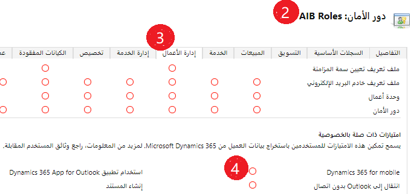

تعمل هذه التمارين بشكل أفضل عند استخدام الإصدار 9.0 من بيئة الإصدار التجريبي من تطبيقات Dynamics 365 Customer Engagement أو إصدار أحدث.

### الأهداف التعليمية

في نهاية هذه التمارين، ستتمكن من تنفيذ المهمة التالية: التأكد من أن المستخدمين لديهم أذونات للوصول إلى Dynamics 365 for Mobile وإزالة الجداول غير المستخدمة من الظهور في Dynamics 365 for Mobile وإنشاء دفتر ملاحظات OneNote لسجل حساب.

الوقت المقدر لإنهاء هذا التمرين العملي: 20 إلى 30 دقيقة

### الخطوات عالية المستوى

1. التأكيد أن دور البائع له امتيازات Dynamics 365 for Mobile.
2. منع ظهور المنافس وعنوان المنافس في Dynamics 365 for Mobile.
3. إنشاء دفتر ملاحظات OneNote لسجل حساب.

### الخطوات التفصيلية

أنت مستشار وظيفي يبدأ العمل على تنفيذ تطبيقات Dynamics 365 Customer Engagement لعميل جديد. يتضمن هذا التنفيذ نشر Dynamics 365 للهواتف للمستخدمين داخل المؤسسة. لا تستخدم المؤسسة حالياً جدول "المنافس" وقد طلبت إزالة الجداول من Dynamics 365 for Mobile.

### التأكيد أن دور البائع له امتيازات Dynamics 365 for Mobile

1. في تطبيق  **Dynamics 365 Customer Engagement apps - مخصص** ، انتقل إلى  **الإعدادات** > **الأمان** > **أدوار الأمان**.
2. انقر نقرًا مزدوجًا فوق الدور الأمني **مندوب المبيعات** لفتحه.
3. حدِّد علامة التبويب **إدارة الأعمال**.
4. مرِّر لأسفل إلى **امتيازات ذات صلة بالخصوصية** وتأكَّد من أن **Dynamics 365 for Mobile‎** مُمكَّن.

5. انقر فوق **حفظ وإغلاق** لإغلاق دور الأمان

#### منع ظهور المنافس وعنوان المنافس في Dynamics 365 for Mobile

1. انتقِل إلى **إعدادات** > **تخصيصات** > **تخصيص النظام**.
2. في جزء التنقل الأيسر، عليك توسيع **الجداول**.
3. انقر فوق **المنافس**.
4. مرِّر لأسفل إلى القسم **Outlook وMobile**.
5. ألغِ تحديد الخيار **تمكين للجهاز المحمول**.
6. انقر فوق **نشر**.

> [!NOTE]
> في المرة القادمة التي يفتح فيها المستخدم Dynamics 365 للهواتف، سيُطالَب بتحديث بيانات التعريف ولن يظهر جدول Competitor على مخطط الموقع.

### إنشاء دفتر ملاحظات OneNote لسجل حساب

1. في **تطبيق مركز المبيعات**، انتقل إلى **الحسابات** > **الحسابات النشطة**.
2. افتح أي حساب نشط. استخدِم في هذا المثال **Adventure Works**.
3. في **المخطط الزمني**، انقر فوق **+**.
4. حدِّد **OneNote**.

5. لاحظ أن Online OneNote يفتح على علامة تبويب أخرى، وأنه تم إنشاء دفتر ملاحظات للحساب.

