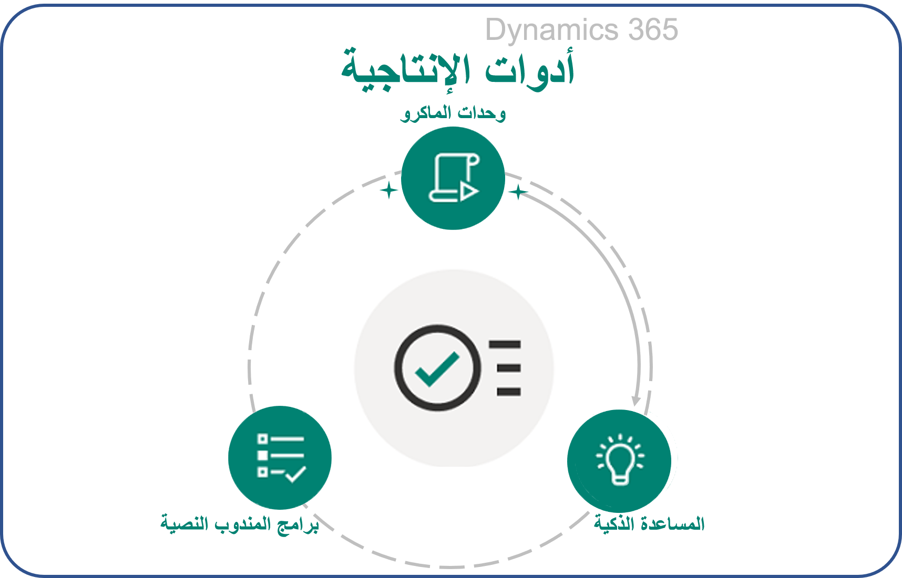
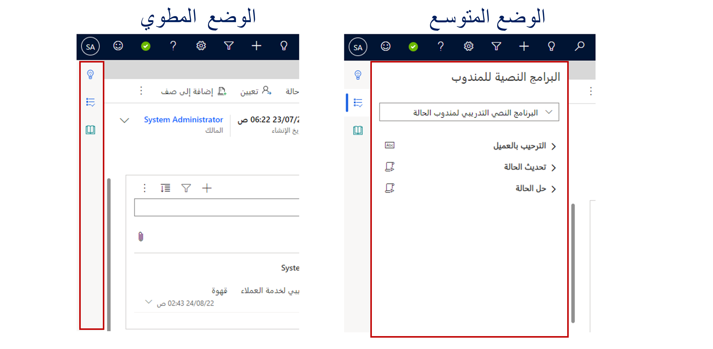
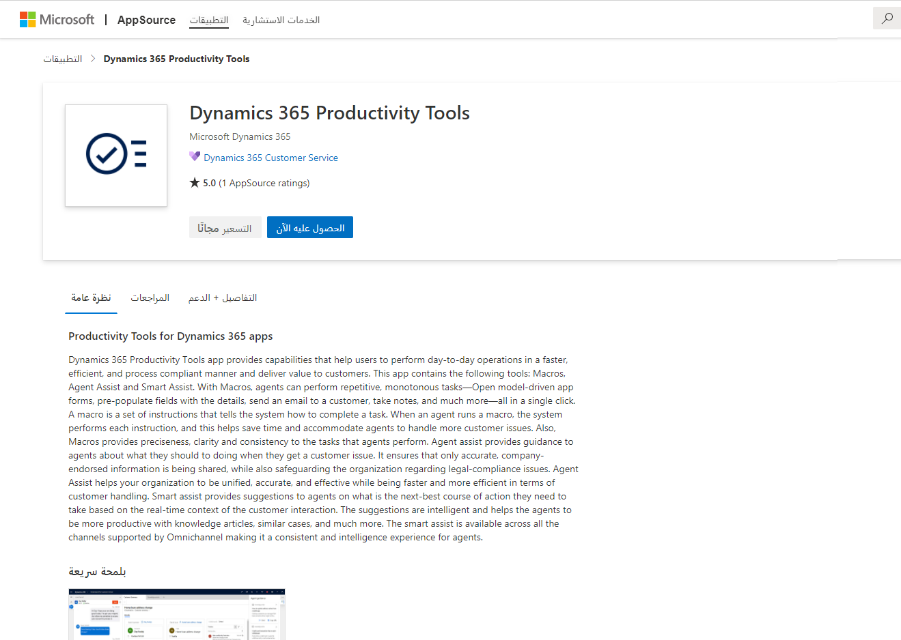

في صناعة خدمة العملاء اليوم، يزداد الطلب على المندوبين باستمرار. يتوقع من المندوبين معالجة حجم أكبر من مشكلات العملاء وحلها بشكل أسرع والحفاظ على رضا العملاء العالي. وبالإضافة إلى ذلك، يحتاج المندوبون إلى تحقيق هذه الأهداف مع الالتزام بمعايير عملية مؤسستهم.

يواجه المندوبون العديد من التحديات، مثل:

- وجود خطوات ونقرات كثيرة جدا لتنفيذ إجراءات مثل إنشاء حالات، وإدخال البيانات، وحفظ البيانات، وما إلى ذلك.

- الحاجة إلى تنفيذ مهام متكررة مثل تحية العميل بالطريقة الصحيحة والتحقق من تفاصيل العميل وتدوين الملاحظات.

- الأخطاء البشرية التي يتم تقديمها أثناء نسخ البيانات ولصقها عبر صفحات مختلفة.

- الالتزام بالعملية والامتثال المحددين لمؤسسات الأعمال في مركز الاتصال.

- عدم وجود رؤى في الوقت الحقيقي للعميل، والمقالات المعرفية، وغيرها من الاحتياجات ذات الصلة التي تقوم على سياق التفاعل.

لتحقيق الأهداف التي تحددها مؤسساتهم، يجب أن يكون المندوبون قادرين على التغلب على هذه التحديات لمساعدتهم على تحقيق ما تتطلبه أعمالهم وعملائهم. يعالج تطبيق أدوات إنتاجية Dynamics 365 هذه التحديات، ويساعد المندوبين على أداء عملياتهم اليومية بشكل أسرع وأكثر كفاءة وبطريقة متوافقة مع العمليات.

> [!div class="mx-imgBorder"]
> 

تحتوي أدوات إنتاجية Dynamics 365 على ثلاث أدوات لمساعدة المندوبين على أن يكونوا أكثر إنتاجية:

- **[وحدات الماكرو](https://docs.microsoft.com/dynamics365/omnichannel/administrator/productivity-tools#macros/?azure-portal=true)** - الإجراءات التسلسلية التي تساعد المندوبين على تنفيذ المهام المتكررة بنقرة واحدة، مثل فتح النماذج، وملء الحقول مسبقاً بالتفاصيل، وتدوين الملاحظات، وما إلى ذلك.

- **[البرنامج النصية للمندوبين](https://docs.microsoft.com/dynamics365/omnichannel/administrator/productivity-tools#agent-scripts/?azure-portal=true)** - تقديم إرشادات إلى المندوبين فيما يتعلق بمشكلات أو سيناريوهات محددة. تساعد البرامج النصية المؤسسات على أن تكون موحدة ودقيقة وفعالة، بالإضافة إلى كونها أسرع وأكثر كفاءة من حيث التعامل مع العملاء.

- **[المساعدة الذكية](https://docs.microsoft.com/dynamics365/omnichannel/administrator/productivity-tools#smart-assist/?azure-portal=true)** - مساعد ذكي يوفر توصيات في الوقت الفعلي للمندوبين، مما يساعدهم على اتخاذ الإجراءات أثناء التفاعل مع العملاء. فهو يسمح للمؤسسات ببناء روبوت مخصص لمساعدة المندوبين على توصيل بيئتهم في الوقت الفعلي.

ميزة أخرى لأدوات الإنتاجية هي جزء الإنتاجية. يتيح لك جزء الإنتاجية عرض عنصر تحكم **إرشادات المندوب** (البرامج النصية للمندوب وبطاقات المساعدة الذكية) في طريقة عرض موحدة. يمكنك استخدام جزء الإنتاجية في الوضع المطوي أو الوضع الموسع، كما هو موضح في الرسوم التوضيحية التالية.

> [!div class="mx-imgBorder"]
> 

بعد تكوين البرامج النصية للمندوب وبطاقات المساعدة الذكية، يمكنك تمكين جزء الإنتاجية لتوفير إرشادات المندوب من خلال برامج نصية للمندوب وبطاقات مساعدة ذكية لمساعدة المستخدمين في القناة متعددة الاتجاهات لـ Microsoft Dynamics 365 Customer Service.

## إعداد أدوات إنتاجية Dynamics 365

إذا كانت مؤسستك تقوم بإنشاء القناة متعددة الاتجاهات لـ Customer Service بعد أبريل 2020، فسيتم تثبيت أدوات إنتاجية Dynamics 365 بالفعل في بيئتك افتراضياً. إذا قمت بتكوين البيئة قبل أبريل 2020، لم يتم تثبيت أدوات الإنتاجية بشكل افتراضي. في هذه الحالة، يمكنك تثبيتها يدوياً من [Microsoft AppSource](https://appsource.microsoft.com/product/dynamics-crm/mscrm.d365_productivity_tools-preview?flightCodes=d365productivitytoolspreview/?azure-portal=true). عندما تكون في Microsoft AppSource، ستظهر صفحة **أدوات إنتاجية Dynamics 365**. حدد الزر **الحصول عليها الآن**.

> [!div class="mx-imgBorder"]
> 

بعد نجاح التثبيت، يمكنك عرض أدوات الإنتاجية، مثل وحدات الماكرو والبرامج النصية للمندوب، في خريطة الموقع لتطبيق إدارة القناة متعددة الاتجاهات.
