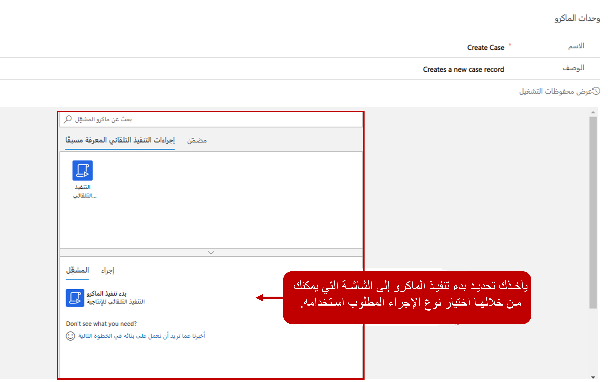
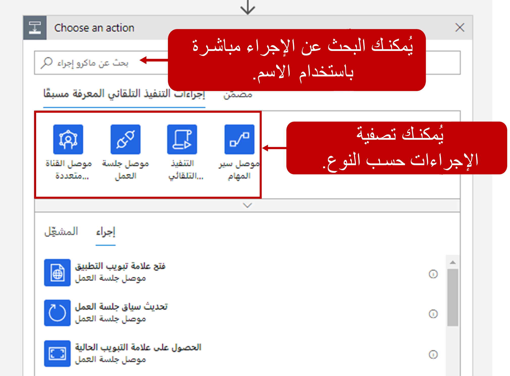

مندوبو خدمة العملاء لديهم الكثير للقيام به أثناء العمل على مشكلات العملاء. يمكن أن تؤدي النقرات المتعددة والمهام المتكررة إلى خطأ بشري بينما ينسخ المندوبون البيانات ويلصقونها عبر عمليات مختلفة. تساعد وحدات الماكرو في معالجة هذه التحديات من خلال مساعدة المستخدمين في تنفيذ العمليات اليومية بشكل أسرع وأكثر كفاءة وبطريقة متوافقة مع العملية. تستخدم وحدات الماكرو بشكل شائع لأتمتة الإجراءات المتكررة. فهي تقلل من حدوث خطأ بشري عندما يقوم المندوبون بنسخ البيانات ولصقها وتساعد على تحسين إنتاجية العوامل. يؤدي تحسين إنتاجية المندوب إلى تقليل متوسط وقت المناولة وتحسين رضا العملاء. فكر في وحدات الماكرو كمكونات قابلة لإعادة الاستخدام، حيث يمكن استخدام الماكرو نفسه مع جلسات عمل مختلفة استنادا إلى متطلبات مؤسستك.

## إنشاء وحدات ماكرو

يمكنك إنشاء وحدات ماكرو في تطبيق إدارة القناة متعددة الاتجاهات عن طريق الانتقال إلى قسم **خبرة المندوب** وتحديد **وحدات الماكرو**.

عند إنشاء الماكرو في البداية، حدد المعلومات التالية:

- **اسم** - اسم الماكرو الذي سيتم عرضه على المندوب في وقت التشغيل.

- **الوصف** - وصف غرض الماكرو الذي سيتم عرضه على المندوب في وقت التشغيل.

> [!div class="mx-imgBorder"]
> 

بعد تعريف التفاصيل الأولية للماكرو، يمكنك تعريف الإجراءات المختلفة التي سيقوم الماكرو بتنفيذها. يمكنك إنجاز هذه المهمة باستخدام الموصلات المتوفرة:

- **[أتمتة الإنتاجية](https://docs.microsoft.com/dynamics365/omnichannel/administrator/macros#productivity-automation/?azure-portal=true)** - توفير الإجراءات التي تؤدي عمليات التطبيق المستندة إلى النموذج.

- **[موصل جلسة العمل](https://docs.microsoft.com/dynamics365/omnichannel/administrator/macros#session-connector/?azure-portal=true)** - يوفر الإجراءات التي تؤدي العمليات المتعلقة بالجلسة.

- **[موصل القناة متعددة الاتجاهات](https://docs.microsoft.com/dynamics365/omnichannel/administrator/macros#omnichannel-connector/?azure-portal=true)** - يوفر إجراءات لأداء العمليات ذات الصلة بالقناة متعددة الاتجاهات لـ Customer Service.

> [!div class="mx-imgBorder"]
> 

### التنفيذ التلقائي للإنتاجية

السبب في أن المؤسسات تريد أتمتة العناصر هو مساعدة المندوبين على أن يكونوا أكثر إنتاجية وإزالة الأخطاء التي يمكن أن تحدث عند تنفيذ المهام يدوياً. تساعد وحدات الماكرو في أتمتة الإنتاجية على تقليل الأخطاء من خلال السماح لك بأتمتة وتنفيذ عمليات التطبيقات الشائعة المستندة إلى الطراز. على سبيل المثال، يمكن أن يقوم الماكرو بإنشاء سجل حالة جديد استنادا إلى التفاصيل المتوفرة في المحادثة.

تتضمن إجراءات أتمتة الإنتاجية ما يلي:

- **فتح نموذج جديد لإنشاء سجل** - فتح نموذج جديد لإنشاء سجل.

- **فتح نموذج موجود** - فتح نموذج سجل موجود.

- **فتح شبكة سجلات** - افتح شبكة سجلات.

- **البحث في قاعدة المعارف عن العبارة المنشورة‬** - البحث في المقالات المعرفية استناداً إلى العبارة المنشورة.

- **هل يستند بحث الصلة إلى العبارة‬** - يستخدم البحث الملائم المضمن في التطبيقات المستندة إلى النماذج للبحث عن البيانات.

- **تحديث حقل** - تحديث سمة النموذج (حقل).

- **حفظ السجل** - حفظ بيانات السجل التي تم إدخالها في جميع الحقول الإلزامية. يفشل الإجراء إذا كانت الحقول الإلزامية لا تحتوي على بيانات.

- **تحديث سجل موجود** - تحديث سجل موجود.

- **فتح نموذج بريد إلكتروني بقالب معرّف مسبقاً‬** - يفتح رسالة بريد إلكتروني مع قالب محدد مسبقاً.

- **حل حالة** - يحل حالة.

> [!div class="mx-imgBorder"]
> 

### موصل جلسة العمل

واحدة من العديد من مزايا القناة متعددة الاتجاهات لـ Customer Service هي قدرة المندوبين على العمل مع جلسات متعددة في وقت واحد. يمكن استخدام إجراءات "موصل جلسة العمل" لأتمتة العمليات المرتبطة بجلسة عمل وتنفيذها في القناة متعددة الاتجاهات لـ Customer Service. على سبيل المثال، بعد تغيير بعض البيانات في سجل، يمكنك تحديث علامة التبويب التي يتم عرض السجل فيها للتأكد من أنك تعمل مع أحدث البيانات.

تتضمن إجراءات موصل جلسة العمل المتوفرة:

- **تحديث علامة التبويب** - تحديث علامة تبويب في جلسة عمل القناة متعددة الاتجاهات لـ Customer Service.

- **التركيز على علامة التبويب** - يضع التركيز على علامة تبويب في القناة متعددة الاتجاهات لـ Customer Service.

- **الحصول على علامة التبويب الحالية** - الحصول على تفاصيل علامة التبويب الحالية في القناة متعددة الاتجاهات لـ Customer Service.

> [!div class="mx-imgBorder"]
> 

### موصل القناة متعددة الاتجاهات

تتيح لك إجراءات موصل القناة متعددة الاتجاهات لأتمتة العمليات المتعلقة بالقناة متعددة الاتجاهات لـ Customer Service وتنفيذها فيها. على سبيل المثال، العمليات الأكثر شيوعاً التي يمكنك تنفيذها هي ربط السجلات وفك ارتباطها.

يسمح موصل القناة متعددة الاتجاهات لك بتنفيذ الإجراءات التالية:

- **ربط السجل بالمحادثة** - ربط سجل بالمحادثة عندما يتصل العميل بمندوب في جلسة عمل القناة متعددة الاتجاهات لـ Customer Service.

- **إلغاء ربط السجل بالمحادثة** - إلغاء ربط سجل بالمحادثة عندما يتصل العميل بمندوب في جلسة عمل القناة متعددة الاتجاهات لـ Customer Service.

- **تنفيذ إجراء استناداً إلى شرط (مضمن)** - يسمح لك بتشغيل خطوة إجراء ماكرو استناداً إلى شروط معرفة مسبقاً. يحتوي موصل الفئة  **المضمن**  على إجراء شرط.

> [!div class="mx-imgBorder"]
> 

لمزيد من المعلومات، راجع [أتمتة المهام باستخدام وحدات الماكرو](https://docs.microsoft.com/dynamics365/omnichannel/administrator/macros#predefined-automation-actions-and-built-in/?azure-portal=true).
