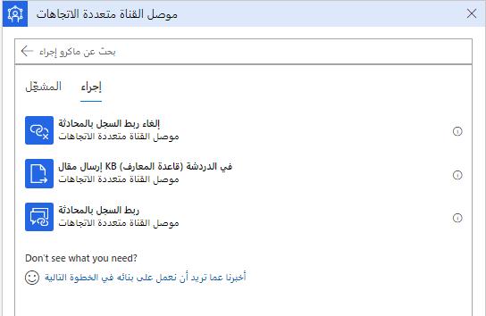

مندوبو خدمة العملاء لديهم الكثير للقيام به أثناء العمل على مشكلات العملاء. يمكن أن تؤدي النقرات المتعددة والمهام المتكررة إلى خطأ بشري بينما ينسخ المندوبون البيانات ويلصقونها عبر عمليات مختلفة. تساعد وحدات الماكرو في معالجة هذه التحديات من خلال مساعدة المستخدمين في تنفيذ العمليات اليومية بشكل أسرع وأكثر كفاءة وبطريقة متوافقة مع العملية. تستخدم وحدات الماكرو بشكل شائع لأتمتة الإجراءات المتكررة. فهي تقلل من حدوث خطأ بشري عندما يقوم المندوبون بنسخ البيانات ولصقها وتساعد على تحسين إنتاجية العوامل. يؤدي تحسين إنتاجية المندوب إلى تقليل متوسط وقت المناولة وتحسين رضا العملاء. فكر في وحدات الماكرو كمكونات قابلة لإعادة الاستخدام، حيث يمكن استخدام الماكرو نفسه مع جلسات عمل مختلفة استنادا إلى متطلبات مؤسستك.

## إنشاء وحدات ماكرو

يمكن إنشاء وحدات ماكرو في تطبيق **مركز مسؤولي خدمة العملاء**. انتقل إلى قسم **تجربة المندوب**، وحدد **الإنتاجية**، وحدد **إدارة** بجوار **وحدات ماكرو**.  

> [!div class="mx-imgBorder"]
> 

عند إنشاء الماكرو في البداية، حدد المعلومات التالية:

- **اسم** - اسم الماكرو الذي سيتم عرضه على المندوب في وقت التشغيل.

- **الوصف** - وصف غرض الماكرو الذي سيتم عرضه على المندوب في وقت التشغيل.

> [!div class="mx-imgBorder"]
> 

بعد تعريف التفاصيل الأولية للماكرو، يمكنك تحديد الإجراءات المختلفة التي سيقوم الماكرو بتنفيذها. يمكنك إنجاز هذه المهمة باستخدام الموصلات المتوفرة:

- **[أتمتة الإنتاجية](/dynamics365/omnichannel/administrator/macros?azure-portal=true#productivity-automation/)** - توفير الإجراءات التي تؤدي عمليات التطبيق المستندة إلى النموذج.

- **[موصل جلسة العمل](/dynamics365/omnichannel/administrator/macros?azure-portal=true#session-connector/)** - يوفر الإجراءات التي تؤدي العمليات المتعلقة بالجلسة.

- **[موصل القناة متعددة الاتجاهات](/dynamics365/omnichannel/administrator/macros?azure-portal=true#omnichannel-connector/)** - يوفر إجراءات لأداء العمليات ذات الصلة بالقناة متعددة الاتجاهات لـ Customer Service.

-  **[موصل Flow](/dynamics365/omnichannel/administtrator/macros?azure-portal=true#onmichannel-flow-connector/)** - يوفر القدرة على تشغيل تدفق Power Automate.

> [!div class="mx-imgBorder"]
> 

### التنفيذ التلقائي للإنتاجية

السبب في أن المؤسسات تريد أتمتة العناصر هو مساعدة المندوبين على أن يكونوا أكثر إنتاجية وإزالة الأخطاء التي يمكن أن تحدث عند تنفيذ المهام يدوياً. تساعد وحدات الماكرو في أتمتة الإنتاجية على تقليل الأخطاء من خلال السماح لك بأتمتة وتنفيذ عمليات التطبيقات الشائعة المستندة إلى الطراز. على سبيل المثال، يمكن أن يقوم الماكرو بإنشاء سجل حالة جديد استنادا إلى التفاصيل المتوفرة في المحادثة.

تتضمن إجراءات أتمتة الإنتاجية ما يلي:

- **فتح نموذج جديد لإنشاء سجل** - فتح نموذج جديد لإنشاء سجل.

- **فتح نموذج موجود** - فتح نموذج سجل موجود.

- **فتح شبكة سجلات** - افتح شبكة سجلات.

- **البحث في قاعدة المعارف عن العبارة المنشورة‬** - البحث في المقالات المعرفية استناداً إلى العبارة المنشورة.

- **إجراء بحث الصلة بناءً على العبارة‬** - البحث في المقالات المعرفية استناداً إلى العبارة المنشورة.

- **تحديث سجل موجود** - تحديث سجل موجود.

- **فتح نموذج بريد إلكتروني بقالب معرّف مسبقاً‬** - يفتح رسالة بريد إلكتروني مع قالب محدد مسبقاً.

- **حل حالة** - يحل حالة.

-  **‏‫التعبئة التلقائية لحقول النماذج** - تحديث سمة النموذج (حقل).
  
-  **نسخة السجل الحالي** - نسخ سجل موجود مفتوح في علامة التبويب الحالية.  

-  **فتح مقال قاعدة المعارف** - يفتح مقال قاعدة المعارف.

-  **حفظ السجل** - حفظ بيانات السجل التي تم إدخالها في جميع الحقول الإلزامية. يفشل الإجراء إذا كانت الحقول الإلزامية لا تحتوي على بيانات.

-  **نسخة سجل الإدخال** - يقوم هذا الإجراء باستنساخ سجل موجود.  وهو يقوم فقط بنسخ الحقول ولا يحفظ السجل.  

> [!div class="mx-imgBorder"]
> 

### موصل جلسة العمل

واحدة من العديد من مزايا القناة متعددة الاتجاهات لـ Customer Service هي قدرة المندوبين على العمل مع جلسات متعددة في وقت واحد. يمكن استخدام إجراءات "موصل جلسة العمل" لأتمتة العمليات المرتبطة بجلسة عمل وتنفيذها في القناة متعددة الاتجاهات لـ Customer Service. على سبيل المثال، بعد تغيير بعض البيانات في السجل، يمكنك تحديث علامة التبويب التي يتم عرض السجل فيها للتأكد من أنك تعمل باستخدام أحدث البيانات.

تتضمن إجراءات موصل جلسة العمل المتوفرة:

- **الحصول على علامة التبويب الحالية** - الحصول على تفاصيل علامة التبويب الحالية في القناة متعددة الاتجاهات لـ Customer Service. 

- **‏‫فتح علامة تبويب التطبيق‬** - يفتح التطبيق المحدد في علامة تبويب جديدة بالسمات التي تحددها.  

- **‏‫تحديث سياق جلسة العمل** - تحديث سياق جلسة العمل في Customer Service workspace لجلسات عمل العنصر.  

- **تحديث علامة التبويب** - تحديث علامة تبويب في جلسة عمل القناة متعددة الاتجاهات لـ Customer Service.

- **التركيز على علامة التبويب** - يضع التركيز على علامة تبويب في القناة متعددة الاتجاهات لـ Customer Service.

> [!div class="mx-imgBorder"]
> 

### موصل القناة متعددة الاتجاهات

تتيح لك إجراءات موصل القناة متعددة الاتجاهات لأتمتة العمليات المتعلقة بالقناة متعددة الاتجاهات لـ Customer Service وتنفيذها فيها. على سبيل المثال، العمليات الأكثر شيوعاً التي يمكنك تنفيذها هي ربط السجلات وفك ارتباطها.

يسمح موصل القناة متعددة الاتجاهات لك بتنفيذ الإجراءات التالية:

- **‏‫إرسال مقال KB (قاعدة المعارف) في الدردشة‬** - لصق مقال قاعدة المعارف في نافذة محادثة الدردشة.  يجب استخدامه مع قاعدة معارف البحث لإجراء العبارة التي تمت تعبئتها.  

- **ربط السجل بالمحادثة** - ربط سجل بالمحادثة عندما يتصل العميل بمندوب في جلسة عمل القناة متعددة الاتجاهات لـ Customer Service.

- **إلغاء ربط السجل بالمحادثة** - إلغاء ربط سجل بالمحادثة عندما يتصل العميل بمندوب في جلسة عمل القناة متعددة الاتجاهات لـ Customer Service.

> [!div class="mx-imgBorder"]
> 

## موصل سير العمل

وبصفتك مسؤولاً، يمكنك استخدام الإجراءات في أي عدد من المرات عبر وحدات ماكرو مختلفة لأتمتة وتنفيذ العمليات المتعلقة بالقناة متعددة الاتجاهات لـ Customer Service workspace وخدمة العملاء.

- **تشغيل Flow**: تدفقات مشغلات **Power Automate** باستخدام وحدات الماكرو في البرامج النصية للمندوب.  

> [!div class="mx-imgBorder"]
> 

## مضمّن

يمكنك تشغيل خطوة إجراء ماكرو وفقاً للظروف باستخدام عنصر التحكم **المضمن**. يحتوي موصل الفئة  **المضمن**  على إجراء شرط.

لاستخدام الفئة المضمنة، يجب أولاً أن يكون لديك مشغل (إجراءات أتمتة محددة مسبقاً). بهذه الحالة، حدد إجراء أتمتة محدد مسبقاً أولاً، وقبل الخطوة أو بعدها، يمكنك تحديد الشرط. يمكنك أيضاً إنشاء شروط متداخلة وفقاً لمتطلباتك.

> [!div class="mx-imgBorder"]
> 

باستخدام خيار **‏‫عرض محفوظات التشغيل‬** لماكرو معين، يمكنك رؤية الشرط الذي تم تشغيله وما إذا كان قد نجح.
على سبيل المثال، تريد فتح نموذج جديد وحفظه بعد إدخال الحقول. إذا كان حقل **المنتج** في النموذج يحتوي على **Surface** كقيمة، فقم بتقييمها على أنها صحيحة، ثم نفذ البحث في مقال قاعدة المعارف باستخدام عبارة البحث كـ **Surface**. إذا تم تقييمه على أنه خطأ، فلا تقم بأي إجراءات أخرى.

> [!div class="mx-imgBorder"]
> 

لمزيد من المعلومات، راجع [أتمتة المهام باستخدام وحدات الماكرو](/dynamics365/omnichannel/administrator/macros#predefined-automation-actions-and-built-in/?azure-portal=true).

بعد فهم الإجراءات المختلفة المتاحة، ستقوم بفحص كيفية استخدام التشغيل التلقائي لتمرير المعلمات.