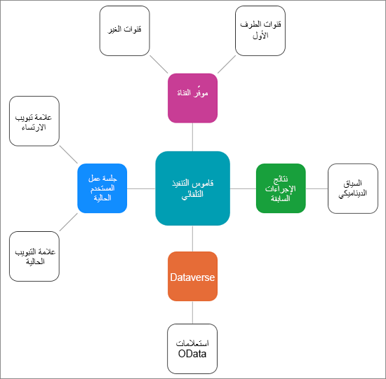

كما يعمل مندوبون مع العملاء، والمعلومات التي ترتبط المحادثة يمكن أن تكون مفيدة في توفير السياق الذي يضمن أن مندوب يمكن أن توفر للعملاء مع أفضل تجربة وأكثر تخصيص ممكن. على سبيل المثال، إذا بدأ عميل يُدعى Kenny Smith محادثة، فيجب أن يرى المندوب برنامجاً نصياً مخصصاً للترحيب، مثل "مرحباً، **Kenny**. شكراً لك على الاتصال بنا، اسمي هو **اسم المندوب**. كيف يمكنني مساعدتك اليوم؟" تأخذ التحية المخصصة معلومات سياقية، مثل العميل والمندوب، لإنشاء تجربة مخصصة.

تتضمن أدوات إنتاجية Dynamics 365 قاموس التشغيل التلقائي، الذي يحافظ على البيانات السياقية للجلسات. أثناء إنشاء قوالب ووحدات ماكرو في تطبيق إدارة القناة متعددة الاتجاهات، يمكنك تمرير مفاتيح المعلمات مثل عنوان جلسة العمل وعنوان الإعلام وعنوان قالب علامة تبويب التطبيق وقيم المعلمات المخصصة لأنواع علامات التبويب للتطبيق. يتم استبدال هذه المفاتيح استناداً إلى المعلومات السياقية المتوفرة في وقت التنفيذ.

فيما يتعلق بحالة تحية العميل السابقة، يعرض الإخطار حقولاً وقيما معينة، والتي تسمى **رأس الحقل** و **القيمة**، على التوالي. في هذا السيناريو، **رأس الحقل** يمثل **اسم العميل** وستمثل **قيمة** الرأس Kenny Smith.

### تمرير معلمات البيانات في وحدات الماكرو والبرامج النصية للمندوبين

المنطقتان الأكثر شيوعاً حيث سترى معلمات البيانات المستخدمة هي مع وحدات الماكرو والبرامج النصية للمندوبين. عندما يقوم المندوب بتشغيل الماكرو، يستبدل النظام مفاتيح المعلمات هذه بالقيم الفعلية بناءً على سياق الجلسة وموفر القناة وMicrosoft Dataverse وإجراءات المستخدم. عندما يكون السياق من جلسة عمل، يتم تشغيل إجراء الماكرو استناداً إلى معلومات جلسة العمل الحالية، حيث يتم الحصول على المعلومات من علامة تبويب ارتساء أو علامة تبويب حالية في التركيز. على سبيل المثال، لإنشاء حالة، تحتاج إلى تعريف الإجراءات التي تحتوي على نموذج كيان الحادث وGUID للنموذج (اختياري).

### أنواع معلمات بيانات السياق

يستخدم قاموس التنفيذ التلقائي معلمات بيانات السياق المتوفرة من المصادر التالية:

- **بيانات السياق من موفر القناة** - بيانات السياق من موفر القناة مثل القناة متعددة الاتجاهات لـ Customer Service أو موفر قناة آخر. تتضمن بيانات السياق من القناة متعددة الاتجاهات لـ Customer Service استطلاعاً قبل الدردشة، والتنقل في مدخل الزوار، وما إلى ذلك.

- **بيانات السياق من إجراءات المستخدم** - البيانات التي يتم ملؤها عند قيام المندوبين بتنفيذ الأنشطة في جلسة العمل، مثل فتح سجل عميل وحالة وما إلى ذلك.

- **بيانات السياق من Dataverse** - البيانات التنظيمية المخزنة في Dataverse التي يمكنك إحضارها باستخدام استعلامات OData.

- **بيانات السياق من إجراءات الماكرو الأخرى** - إجراء في ماكرو يقوم بإنشاء بيانات السياق التي يتم استهلاكها بواسطة إجراءات أخرى في الماكرو.

> [!div class="mx-imgBorder"]
> 

### تنسيقات قاموس التنفيذ التلقائي لتمرير مفاتيح معلمات البيانات

يحتفظ قاموس التنفيذ التلقائي بالبيانات السياقية لجلسات العمل. يمكن تمرير المفاتيح الموجودة في قاموس التنفيذ التلقائي كمعلمات للإجراء في وحدات الماكرو. يستبدل النظام مفاتيح المعلمات هذه بالقيمة الفعلية بناءً على سياق الجلسة وموفر القناة وDataverse وإجراءات المستخدم.

يدعم قاموس التنفيذ التلقائي التنسيقات التالية:

- **Slugs** - معلمات الاستبدال التي يقوم النظام بملئها في وقت التشغيل استناداً إلى السياق.

- **استعلامات OData** - الحصول على السياقات المتوفرة من Dataverse.

- **القيم الثابتة** - القيم ذات الترميز الثابت التي تقوم بتحديثها وفقاً لمتطلبات عملك.

## حقول احتياطية للبريد الإلكتروني

حقل احتياطي البريد الإلكتروني عبارة عن معلمة استبدال يقوم النظام بملئها في وقت التشغيل استناداً إلى السياق. عند تنفيذ حقل احتياطي البريد الإلكتروني، سيتم استبداله بالنص الذي يتطابق مع حقل احتياطي البريد الإلكتروني الذي تمت الإشارة إليه.  على سبيل المثال، يمكنك استخدام حقل احتياطي بريد إلكتروني لملئه في عنوان الحالة لسجل الحالة المرتبط بمحادثة ما. يمكنك استخدام القائمة التالية للحقول الاحتياطية للبريد الإلكتروني لوحدات الماكرو والبرامج النصية للمندوب، ولتعيين برنامج نصي لمندوب ليكون البرنامج الافتراضي باستخدام منشئ تعبير البرنامج النصي للمندوب.

|     حقل احتياطي البريد الإلكتروني                                         |     الوصف‏‎                                                                                                                        |
|-----------------------------------------------------|----------------------------------------------------------------------------------------------------------------------------------------|
|     **${customerName}**                                 |     اسم العميل الذي بدأ المحادثة.                                                                         |
|     **${caseId}**                                       |     المعرّف الفريد لحالة. يعرض النظام معرف الحالة فقط إذا كانت الحالة مرتبطة بالمحادثة.                         |
|     **${caseTitle}**                                    |     عنوان الحالة. يعرض النظام عنوان الحالة فقط إذا كانت الحالة مرتبطة بالمحادثة.               |
|     **${queueId}**                                      |     المعرّف الفريد لقائمة انتظار. يتم عرض هذه السلسلة الأبجدية الرقمية في عنوان URL لصفحة قائمة الانتظار.                                         |
|     **${visitorLanguage}**                              |     لغة العميل الذي بدأ المحادثة.                                                                     |
|     **${visitorDevice}**                                |     جهاز العميل الذي بدأ المحادثة.                                                                       |
|     **${entityRoutingLogicalName}**                     |     اسم الكيان إذا كان الإشعار لسجل كيان.                                                             |
|     **${entityRoutingRecordId}**                        |     المعرف الفريد لسجل الكيان إذا كان الإشعار لسجل كيان.                                                 |
|     **${customerEntityName}**                           |     اسم الكيان (جهة الاتصال أو الحساب) إذا تمت مصادقة العميل.                                                   |
|     **${customerRecordId}**                             |     المعرف الفريد للكيان (جهة الاتصال أو الحساب) إذا تمت مصادقة العميل.                                            |
|     **${`<name of the pre-chat survey questions>`}**    |     سيكون لكل أسئلة استطلاع الرأي قبل المحادثة التي تم تكوينها لتدفق عمل اسم حقل احتياطي البريد الإلكتروني ليكون اسم السؤال.    |

للحصول على مزيد من المعلومات حول التعامل مع الحقول الاحتياطية للبريد الإلكتروني في سيناريوهات مختلفة، [الحقول الاحتياطية للبريد الإلكتروني](/dynamics365/app-profile-manager/automation-dictionary-keys#slugs)  

لمزيد من المعلومات، راجع [استخدام قاموس التنفيذ التلقائي لتمرير مفاتيح معلمات البيانات](/dynamics365/omnichannel/administrator/automation-dictionary-keys?azure-portal=true#automation-dictionary-formats-to-pass-data-parameter-keys/).
