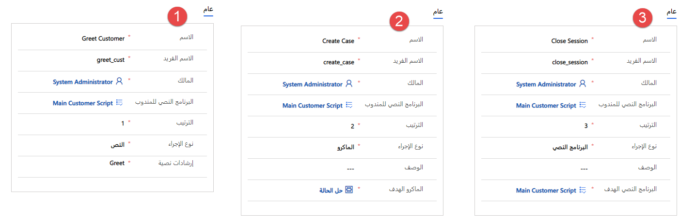

يحتاج المندوبون الذين يعملون في مراكز دعم العملاء إلى التكيف بسرعة مع التغيير. تخضع المنتجات والخدمات للتعديل والتحديث بصورة مستمرة. وبناءً على ذلك، ومع حدوث تلك التغييرات، يلزم تحديث العمليات والإجراءات أو تعديلها أيضاً. حتى بعد تدريب المندوبين تدريباً صارماً، تحدث أخطاء وتأخيرات في تقديم الخدمات بسبب نقص التوجيه في سيناريوهات العملاء في الوقت الفعلي. تؤدي هذه المشكلات إلى انخفاض الإنتاجية وتؤثر سلباً على مستويات رضا العملاء. لتجنب الأخطاء والتأكد من الالتزام بالعمليات، يجب توفير التوجيه للمندوبين.

توفر البرامج النصية للمندوب إرشادات للمندوبين بشأن ما يجب عليهم فعله عندما يواجهون مشكلة مع العميل. تضمن البرامج النصية مشاركة المعلومات الدقيقة المعتمدة من الشركة فقط، مع حماية المؤسسة أيضاً فيما يتعلق بقضايا الامتثال القانوني. تساعد البرامج النصية للمندوب على الحفاظ على توحيد المؤسسات ودقتها وفعاليتها، وتجعل التعامل مع العميل أسرع وأكثر كفاءة.

تعمل البرامج النصية للمندوب على تقليل الأخطاء البشرية التي قد تنطوي عليها العملية، لأن المندوبين على دراية بالإجراءات التي يتعين عليهم تنفيذها أثناء تفاعلهم مع العميل. وتساعد هذه الميزة المندوبين على الالتزام بعمليات الأعمال ومساعدتهم أيضاً على توفير حلول سريعة للمشكلة (انخفاض متوسط وقت المعالجة) وتحسين رضا العملاء.

> [!div class="mx-imgBorder"]
> 

تتكون البرامج النصية للمندوب من سلسلة من الخطوات. يتم تحديد كل خطوة برمز قابل للتنفيذ يساعد في تطبيق هذه الخطوة. عندما يقوم المندوب بتوسيع خطوة، يتم تزويده بوصف قصير يحدد ما تقوم به الخطوة ويوفر رمزاً يمكن تحديده لتنفيذ إجراء الخطوة. عندما يُكمل المندوبون الخطوات، يتعقب البرنامج النصي حالة تطبيق الخطوة ويدوّنها. تتم الإشارة إلى الخطوات المكتملة بنجاح برمز علامة اختيار خضراء. تتم الإشارة إلى الخطوات التي تحتوي على أخطاء باستخدام أيقونة التقاطع الحمراء. يمكن إجراء الخطوات مجدداً حسب الحاجة. ويعتمد ظهور علامة الاختيار الخضراء أو رمز التقاطع الأحمر على آخر مرة تم فيها تنفيذ الخطوة.

### العمل مع البرامج النصية

بعد أن يقبل مندوب إخطار محادثة واردة، مثل المحادثة، بالإضافة إلى بدء جلسة عمل جديدة، سيتم عرض برنامج المندوب النصي. تُظهر الصورة التالية مثالاً على برنامج نصي للمندوب يحتوي على خمس خطوات.

يبدأ البرنامج النصي برسالة نصية ترشد المندوب، ابتداءً من الترحيب بالعميل وانتهاءً بنقل المندوب إلى برنامج نصي للإنهاء.

> [!div class="mx-imgBorder"]
> 

يوضح الجدول التالي كل خطوة بمزيد من التفصيل.

|     الخطوة                |     العنوان                 |     التعليمات                                                                                                                                     |     الأيقونة              |     الإجراء                                                                                                                                                                          |
|-------------------------|---------------------------|-----------------------------------------------------------------------------------------------------------------------------------------------------|-----------------------|-------------------------------------------------------------------------------------------------------------------------------------------------------------------------------------|
|     التعليمات النصية    |     الترحيب بالعميل      |     يمكنك الترحيب بالعميل باستخدام رسالة ترحيب من مستودع الرد السريع                                                                      |     وضع علامة "تمّ"    |     بعد أن يقوم المندوب بالترحيب بالعميل، يجب عليه تحديد أيقونة لإظهار الخطوة على أنها "مكتملة".                                                                              |
|     التعليمات النصية    |     التحقق من العميل       |     استخدم أي خيارين من الخيارات التالية للتحقق من العميل Kenny Smith‏: 1. تاريخ الميلاد، 2. مُعرّف البريد الإلكتروني، 3. الرمز البريدي، 4. رقم الهاتف المحمول    |     وضع علامة "تمّ"      |     بعد أن يتحقق المندوب من البيانات المناسبة، يجب عليه تحديد الرمز لإظهار الخطوة على أنها "مكتملة".                                                                       |
|     الماكرو               |     إنشاء حالة         |     يؤدي إلى إنشاء نموذج حالة باستخدام سياق العميل                                                                                               |     تشغيل               |     عند تحديد أيقونة التشغيل الماكرو، يفتح النظام نموذج حالة في لوحة علامة التبويب "تطبيق" الجديدة.                                                                            |
|     الماكرو               |     إرسال التفاصيل          |     يفتح بريداً إلكترونياً لإرسال التفاصيل إلى العميل                                                                                                     |     تشغيل               |     عند تحديد أيقونة التشغيل الماكرو، يفتح النظام مسودة بريد إلكتروني بحيث يمكنك إرسال بريد إلكتروني إلى العميل المرتبط.                                                           |
|     البرنامج النصي للمندوب        |     إنهاء المحادثة    |     اتبع الخطوات التالية لإنهاء محادثة                                                                                                    |     العرض              |     عند تحديد أيقونة طريقة العرض، يقوم النظام بتحميل برنامج نصي آخر للمندوب من البرنامج النصي الحالي للمندوب. في هذا النموذج، يكون البرنامج النصي الآخر للمندوب هو البرنامج النصي "إنهاء المحادثة".    |

> [!div class="mx-imgBorder"]
> 

### تحديد البرامج النصية للمندوب

يمكن للمستخدمين الذين يتمتعون بحقوق إدارية إنشاء برامج نصية للمندوب تحت العنوان **تجربة المندوب** في تطبيق **مركز مسؤولي Customer Service**. حدد **الإنتاجية**، ثم اختر **إدارة** بجوار **‏‫برامج المندوب النصية‬**.

في الصفحة الجديدة **للبرنامج النصي للمندوب** حدد المعلومات التالية:

- **الاسم** - يُوفَّر اسماً للبرنامج النصي للمندوب.

- **الاسم الفريد**: معرف فريد بتنسيق `<prefix>`_`<name>`. مثال: greet_script

    > [!IMPORTANT]
    > بالنسبة إلى **الاسم الفريد**، يمكن أن تكون البادئة فقط أبجدية رقمية ويجب أن يتراوح طولها بين 3 إلى 8 أحرف. يجب أن توجد شرطة سفلية بين البادئة والاسم.

- **اللغة** - تحدد اللغة المقترنة بالبرنامج النصي.

- **الوصف** - يصف البرنامج النصي للمندوب.  

بعد إنشاء البرنامج النصي، حدد الخطوات التي سيتم تقديمها إلى المندوب. على سبيل المثال، قد تمثل خطوة ما رسالة يجب على المندوب قراءتها أو إجراءً تلقائياً يمكن تشغيله.

تتوفر ثلاثة أنواع من الخطوات داخل البرنامج النصي للمندوب:

- **إرشادات نصية** - توفير إرشادات حول الإجراءات التي يجب تنفيذها. على سبيل المثال، قد تنصح التعليمات النصية المندوب بشأن كيفية الترحيب بالعميل أو قد تمثل بياناً ختامياً يمكن استخدامه لإنهاء المحادثة.

  في واجهة المستخدم، يمكن للمندوبين تدوين متى أكملوا الخطوة بناءً على التعليمات.

- **الماكرو** - تعليمات تخبر النظام بكيفية إكمال مهمة ما. على سبيل المثال، قد يتم تكوين الماكرو لإنشاء سجل حالة.

  عندما يحدد مندوب أيقونة‏  **تشغيل** ، سيقوم النظام بتنفيذ الماكرو.

- **البرنامج النصي للمندوب** - يمكنك تحميل برنامج نصي آخر للمندوب من البرنامج النصي الحالي للمندوب. سيحل البرنامج النصي الذي تم تحميله مؤخراً محل البرنامج النصي الحالي في قائمة **البرنامج النصي للمندوب**.

تُظهر الصورة التالية مثالاً يمثل كل نوع من أنواع البرامج النصية الثلاثة المتاحة.

> [!div class="mx-imgBorder"]
> 

- **الترحيب بالعميل** - يمثل نوع خطوة التعليمات النصية الذي سيتم تقديمه إلى المندوب أولاً. يشير الحقل **التعليمات النصية** إلى ما يجب على المندوب فعله.

- **إنشاء حالة** - نوع خطوة الماكرو الذي سيقوم بإنشاء سجل حالة جديدة وربطه بالمحادثة الحالية.   

- **إغلاق جلسة العمل** - يمثل نوع خطوة البرنامج النصي الذي سيعمل على تحميل "برنامج نصي للمندوب" مختلف ومصمم ليصطحب المندوب خلال عملية إكمال محادثة مع العميل.

تتضمن كل خطوة من خطوات البرنامج النصي حقل **الترتيب**، حيث يشير إلى الترتيب الذي يجب تقديم الخطوة به إلى المندوب. تَظهر الخطوات بالترتيب الذي سيتم به تقديمها إلى المندوبين من قسم **خطوة البرنامج النصي للمندوب**. يتم عرض نوع الإجراء المقترن بكل خطوة في الحقل **نوع الإجراء**.

> [!div class="mx-imgBorder"]
> 

### إقران برنامج نصي للمندوب بقالب جلسة عمل

بعد إكمال البرنامج النصي للمندوب، يجب عليك إقرانه بقالب جلسة عمل. يضمن هذا الإجراء أن البرنامج النصي للمندوب سيتم تحميله للمندوبين بناءً على نوع جلسة العمل التي قاموا بفتحها. على سبيل المثال، إذا كانت مؤسستك لديها عمليات مختلفة لمحادثات الرسائل القصيرة عن تلك المستخدمة لمحادثات المحادثة، فيمكنك إرفاق "البرامج النصية للمندوب" اللازمة بقوالب الرسائل القصيرة أو جلسة عمل المحادثة المناسبة.

للوصول إلى قوالب جلسات عمل موجودة أو إنشاء قوالب جديدة، من القسم **مساحات العمل**، حدد **إدارة** بجوانب **قوالب جلسة العمل**. في قسم  **البرامج النصية للمندوب** من قالب جلسة عمل، استخدم الخيار **إضافة برنامج نصي للمندوب الحالي** لتحديد البرامج النصية التي يجب أن تكون متوفرة لنوع جلسة العمل هذا.

> [!div class="mx-imgBorder"]
> 

لمزيد من المعلومات، راجع [إرشاد المندوبين باستخدام البرامج النصية](/dynamics365/omnichannel/administrator/agent-scripts/?azure-portal=true/#overview-of-agent-scripts).

للحصول على معلومات، راجع [تعيين "البرنامج النصي للمندوب" الافتراضي للمندوبين](/dynamics365/omnichannel/administrator/agent-scripts/?azure-portal=true/#set-the-default-agent-script-for-agents).
