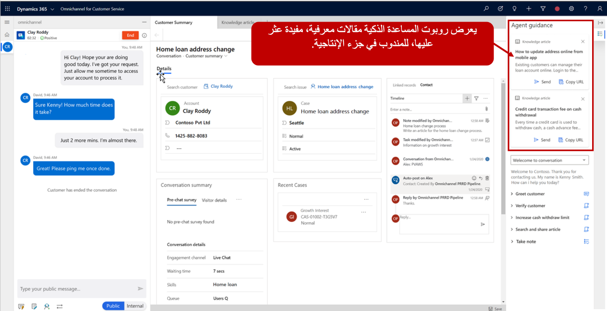

تنتقل مؤسسات خدمة العملاء من مرحلة التفاعلات المستندة إلى العمليات ويديرها العملاء إلى مرحلة تقديم حلول ذكية. تستخدم المؤسسات الذكاء الاصطناعي لتقديم تفاصيل سياقية إلى المندوبين استناداً إلى ما يحدث في هذه الأثناء. تساعد هذه القدرة على العرض المحوري المستندة إلى الذكاء المناديب على تقديم أداء أفضل في مؤشرات الأداء الأساسية (KPIs) وتقديم تجربة أفضل للعملاء. عندما يصبح المندوبون أكثر كفاءة وإنتاجية، تنخفض التكاليف التي تتحملها المؤسسة لتشغيل مركز الاتصال.

يمكن أن تساعد المساعدة الذكية المؤسسات لكي تصبح أكثر ذكاءً. تتمثل المساعدة الذكية في المساعد الذكي الذي يقدم توصيات في الوقت الحقيقي للمناديب لمساعدتهم على التعامل بفعالية أكثر مع الأصناف أثناء التفاعل مع العملاء.

باستخدام المساعدة الذكية، يمكن للمؤسسات إنشاء روبوتات مخصصة يمكن توصيلها ببيئات للمساعدة في تفسير المحادثات في الوقت الحقيقي وتقديم توصيات ذات صلة بالمناديب في سياق المحادثة الحالية. يمكن للشركات استخدام هذه الخاصية لإرفاق التوصيات المتعلقة بمؤسساتها. على سبيل المثال، بصفته مندوب يعمل مع عميل، يمكن أن تقترح المساعدة الذكية تقديم مقالات معرفية ذات صلة أو تحدد حالات مماثلة يمكن أن تساعد المندوب في إيجاد حل. بالإضافة إلى ذلك، يمكن تقديم توصيات ذو مردود عملي للمساعدة في تفعيل الإجراءات التلقائية مثل اتخاذ أفضل الخطوات أو الإجراءات التالية. يتم تقديم المعلومات إلى المناديب باستخدام بطاقات Microsoft Adaptive التي يتم عرضها من خلال واجهة المستخدم.

يمكن تفعيل المساعدة الذكية للقنوات غير القائمة على الكيانات مثل المحادثة وخدمة الرسائل القصيرة (SMS) وموقع Facebook وغيرها لمنح المناديب تجربة متسقة.

### خطوات عالية المستوى لنشر روبوت المساعدة الذكية

بعد إنشاء روبوت المساعد الذكية، سيتعين عليك تمكين المساعدة الذكية في بيئتك.

يجب اتخاذ الخطوات الخمس التالية لتمكين المساعدة الذكية وتقديم اقتراحات ذكية للمستخدمين في القناة متعددة الاتجاهات لـ Customer Service:

1. **إنشاء بطاقات تكيفية لتمكين المؤلف من تقديم المحتوى.** تستخدم هذه البطاقات كنظام تسليم محتوى يسمح باستهلاك البيانات وتقديمها في تطبيقات متعددة مع الحفاظ على مظهر التطبيق وسلوكه.

1. **إنشاء روبوت المساعدة الذكية.** حدد الأتمتة التي سيتم استخدامها في الوقت الحقيقي، ثم حدد موقع البيانات التي سيتم تقديمها إلى المندوب، بالإضافة إلى تحديد البطاقة التكيفية التي سيتم عرضها.

1. **إنشاء مستخدم روبوت.** يعمل مستخدم الروبوت كمساعد ذكي للمندوب. سيستفيد مستخدم التطبيق هذا روبوت المساعدة الذكية الذي تم إنشاؤه. على سبيل المثال، للبحث عن مقالات المعرفة، يمكنك إنشاء مستخدم روبوت يشير إلى روبوت المساعدة الذكية وتم تعيين الأذونات اللازمة للوصول إلى المقالات المعرفية التي يجب إنشاؤها في التطبيق.

1. **إضافة روبوت المساعدة الذكية إلى دفق العمل.** تضمن هذه الإضافة تضمين مستخدم الروبوت الذي تم إنشاؤه ضمن دفق العمل، بحيث يمكن لأي مندوب يشارك في دفق العمل هذا الاطلاع على الاقتراحات التي يوفرها الروبوت. على سبيل المثال، قد يحتوي دفق عمل المحادثة المباشرة الذي يتم استخدامه مع الدردشات المصدق عليها وغير المصدق عليها على المقالة المعرفية التي تمت إضافة روبوت المساعدة الذكية إليها للمساعدة في تحديد المقالات المعرفية المحتملة.

1. **تمكين جزء الإنتاجية.** يستخدم هذا الجزء لعرض بطاقات المساعدة الذكية التي تتضمن المحتوى المقترح للمناديب في القناة متعددة الاتجاهات لـ Customer Service. على سبيل المثال، بعد العثور على مقالة محتمل واقتراحها بواسطة الروبوت، سيتم تقديم تفاصيل المقالة إلى المندوب في جزء الإنتاجية.

> [!div class="mx-imgBorder"]
> 

