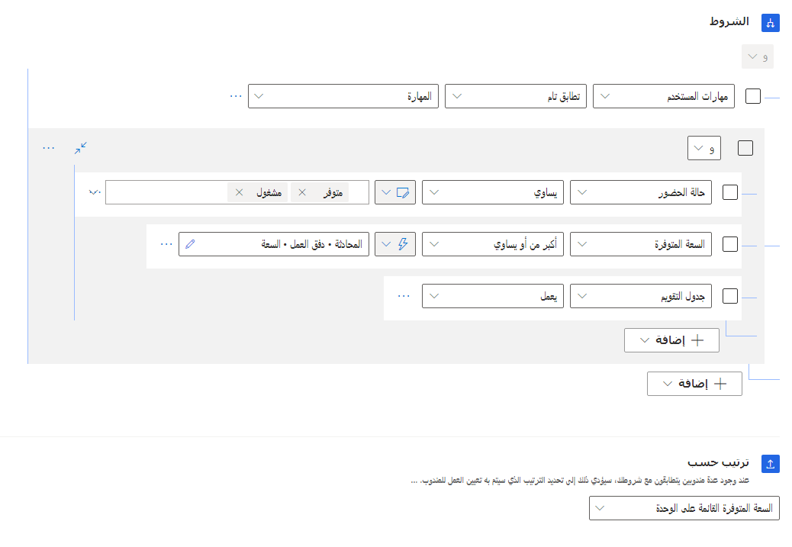

بعد توجيه عنصر العمل إلى قائمة انتظار، يجب تعيينه إلى مندوب. تتضمن هذه العملية عادةً النظر إلى حضور المندوب ومهاراته وقدرته الإنتاجية المتاحة. عندما تدخل العناصر في قائمة الانتظار، يمكن للنظام تحديد أولوياتها قبل تعيينها إلى مندوب. على سبيل المثال، قد يقرر النظام أن عنصر العمل الذي تم وضع علامة عليه كعنصر عاجل يجب أن يكون له الأولوية أولاً على العناصر الأخرى المتوفرة في قائمة الانتظار. وقد تقوم المؤسسات المتعددة بتحديد أولويات العمل وتوزيعه بطرق مختلفة.

للمساعدة في هذه العملية، يوفر التوجيه الموحد طرق تعيين مختلفة يمكنك استخدامها لتحديد كيفية ترتيب أولويات عناصر العمل وكيفية تعيينها للمندوبين. تتوفر طرق التعيين هذه لأي قائمة انتظار تم تعريفها على أنها قائمة انتظار متقدمة في التوجيه الموحد.

لمزيد من المعلومات، راجع [إدارة قوائم الانتظار لتوجيه موحد](/dynamics365/customer-service/queues-omnichannel/?azure-portal=true).

لتبسيط التوزيع، تتوفر طرق التعيين التالية:

- **أعلى قدرة إنتاجية** - تعيين عنصر عمل إلى المندوب الذي يتمتع بأعلى قدرة إنتاجية، من بين أولئك الذين لديهم المهارات التي تم تحديدها خلال مرحلة التصنيف. سيكون لهذا المندوب أيضاً الحضور كما هو محدد في خيارات الحضور المسموح بها لتدفق العمل. وطريقة التعيين هذه هي الطريقة الافتراضية.

- **ترتيب دوري** - تعيين عنصر العمل إلى المندوب بترتيب القائمة الذي يطابق المعايير الخاصة بالمهارات والحضور. يعتمد الترتيب الأولي على وقت إضافة المستخدم إلى قائمة الانتظار. 
  وبعد ذلك، يتم تحديث الترتيب على أساس التعيينات.

إذا وجدت أن الخيارات الجاهزة لا تناسب احتياجاتك، يمكنك إنشاء قواعد تعيين مخصصة عن طريق إعداد قواعد تحديد الأولويات ومجموعات قواعد التعيين. للقيام بذلك، حدد **عرض المزيد** في القسم **طريقة التعيين**.

> [!div class="mx-imgBorder"]
> 

ستكون أي طرق تعيين جاهزة، وأي طرق مخصصة تم إنشاؤها مسبقاً متاحة لك للاختيار من بينها. يمكنك إنشاء مجموعات قواعد جديدة عن طريق تحديد الزر **إنشاء جديد**.

تتضمن القواعد المخصصة مجموعات القواعد التالية:

- **تحديد الأولوية** - تحديد الترتيب الذي سيتم به تعيين عناصر العمل إلى المندوبين عندما يكونون متاحين لتلقي المزيد من العمل. على سبيل المثال، قد تحتل الحالات التي يرسلها عملاء من المستويين **الذهبي** و **الفضي** الأولوية على الحالات التي يرسلها عملاء ليسوا من هذين المستويين.

- **التعيين**‎ - تمثيل مجموعة من الشروط التي تُستخدم لتحديد المندوبين واستخدام ترتيب حسب الخيار لفرز المندوبين المطابقين، مثل تعيين عنصر عمل للمندوب الذي لديه حالياً أكبر قدرة إنتاجية متاحة.

## تحديد أولوية العمل

بشكل افتراضي، يتم إعطاء الأولوية لعناصر العمل حسب طريقة *ما يرد أولاً يصرف أولاً*. بشكل أساسي، يتم تعيين عنصر العمل الذي تم إنشاؤه أولاً في المقام الأول. يعمل هذا الأسلوب بشكل جيد في العديد من السيناريوهات. ومع ذلك، يتوفر لدى العديد من المؤسسات عوامل متعددة تؤثر في كيفية تحديد أولويات العناصر وتعيينها. على سبيل المثال، من المحتمل أن تحظى شبكة الكمبيوتر المعطلة بالأولوية على عنصر مرتبط بطابعة شخص ما لا تعمل، حتى إذا تم إرسال عنصر الطابعة أولاً.

لاستيعاب هذه الأنواع من السيناريوهات، يمكنك إنشاء واستخدام مجموعات قواعد خاصة بك لتحديد الأولويات، مثل تحديد أولويات العناصر التي تم تمييزها على أنها عاجلة أكثر من العناصر الأخرى.

> [!IMPORTANT]
> تأكد من قيامك بإعداد قواعد مطابقة المهارات في طريقة التعيين المخصص لأن إعدادات **خوارزمية مطابقة المهارات الافتراضية** لتدفق العمل لن تُستخدم في طريقة التعيين المخصص. لمزيد من المعلومات، راجع [‏‫‏‫التوجيه المستند إلى المهارة‬‬](/dynamics365/customer-service/set-up-skill-based-routing/?azure-portal=true).

لإضافة مجموعة قواعد مخصصة لتحديد الأولويات، حدد الزر **إنشاء مجموعة قواعد** ضمن **مجموعات قواعد تحديد الأولويات**. يمكن أن تحتوي كل مجموعة قواعد على قواعد متعددة. يمكنك إضافة قواعد عن طريق تحديد **إنشاء قاعدة**. 

تتكون قواعد تحديد الأولويات من مجالين:

- **الشروط** - تحديد الشروط التي يجب تلبيتها للسجل المراد إضافته إلى فئة تحديد الأولويات هذه.

- **ترتيب حسب** - تحديد كيفية توزيع السجلات بعد وصولها إلى هذه الفئة. التوزيع الافتراضي هو *ما يرد أولاً يصرف أولاً*، ولكن يمكنك تحديد القواعد الخاصة بك بناءً على احتياجاتك التنظيمية.

في الصورة التالية، سيتم تطبيق هذه القاعدة على أية حالات يتم فيها تعيين **الأولوية** على **عالية**. سيتم تعيين حالات المطابقة باستخدام طريقة ما يرد أولاً يصرف أولاً.

> [!div class="mx-imgBorder"]
> 

## كيفية عمل مجموعات قواعد تحديد الأولويات

تمثل كل قاعدة تحديد أولويات فئة أولوية في قائمة الانتظار. تمثل هذه الفئات مجموعات الحالات التي تفي بشروط محددة. أثناء التقييم، يتم تشغيل قواعد تحديد الأولويات بالترتيب الذي تم إدراجها به. إذا كان العنصر يطابق المعايير الموجودة في القاعدة، فإنه يتم نقله إلى تلك الفئة. وإذا لم يكن الأمر كذلك، فسيتم مقارنته بالقاعدة الثانية حيث، في حالة التطابق، ستتم إضافته إلى فئة تلك المجموعة. وتستمر هذه العملية حتى يتم تقييم جميع القواعد.

توفر لقطة الشاشة التالية مثالاً على هذا المفهوم.

> [!div class="mx-imgBorder"]
> 

- **أولوية عالية وفئة متميزة** - البحث عن جميع عناصر العمل في قائمة الانتظار حيث تكون أولوية الحالة المرتبطة **عالية** وفئة الحالة **متميزة**.

  - تقوم مجموعة القواعد هذه بإنشاء فئة الأولوية القصوى مع عناصر العمل هذه.

  - ضمن هذه الفئة، يتم فرز عناصر العمل بطريقة ما يرد أولاً يصرف أولاً، حيث سيكون عنصر العمل الأول الذي سيتم تعيينه من قائمة الانتظار هو العنصر الأقدم في هذه الفئة.

- **حالات متميزة وأي أولوية** - ستحتوي هذه الفئة على عناصر حيث تكون فئة الحالة **متميزة**.

  - نظراً لأنه تم بالفعل وضع الحالات ذات فئة الحالة **متميزة** والأولوية **عالية** في الفئة العليا، فإن هذه القاعدة ستنظر فقط في عناصر العمل الأخرى حيث تكون فئة الحالة **متميزة**.

  - سيتم أيضاً فرز هذه العناصر بطريقة ما يرد أولاً يصرف أولاً.

- **أولوية عالية** - تتكون هذه الفئة من عناصر العمل التي تكون أولوية الحالة الخاصة بها عالية ولم يتم تصنيفها بالفعل.

  - يتم ترتيب العمل هذه حسب الحقل **الاستجابة الأولى بواسطة** بترتيب تصاعدي.

  - سيتم إعطاء الأولوية لعناصر العمل ذات التاريخ الأقدم في الحقل **الاستجابة الأولى بواسطة‏‎** أولاً.

لمزيد من المعلومات، راجع [مجموعات قواعد تحديد الأولويات](/dynamics365/customer-service/assignment-methods?azure-portal=true#how-prioritization-rulesets-work).

## العمل مع مجموعات قواعد التعيين

بينما تحدد مجموعات قواعد تحديد الأولويات العناصر وترتيبها، تحدد مجموعات قواعد التعيين المندوبين الذين يمكن تعيين العناصر إليهم وكيفية تعيينها. على سبيل المثال، قد تحدد قاعدة التعيين المندوبين الذين تم تعيين حضورهم على **متوفر** أو **مشغول** والذين يعملون مع عملاء التصنيع.

تحتوي مجموعة قواعد التعيين على قواعد متعددة. تمثل كل قاعدة مجموعة من الشروط التي يستخدمها النظام لتحديد المندوبين الذين يجب تحديدهم وكيفية فرزهم. تتم مطابقة المندوبين بناءً على الشروط المحددة في القاعدة.

مثل قواعد تحديد الأولويات، تتكون قواعد التعيين من مجالين:

- **الشروط** - تحديد الشروط التي سيحتاج المندوب إلى استيفائها لتعيين عناصر إليه. تتكون الشروط من ثلاثة أجزاء:

  - **سمة المستخدم** - التفاصيل التي تستخدم لمقارنة المستخدم بالعمل الوارد. قد تتضمن هذه التفاصيل عناصر مثل قدرة المندوب الإنتاجية أو مهاراته أو جدوله أو موقعه.

  - **عوامل التشغيل** - تحديد علاقة المقارنة بين **سمة المستخدم** وسمات عناصر العمل الوارد، مثل يساوي أو يحتوي على بيانات أو يعمل.

  - **القيمة** - القيمة التي يبحث عنها الشرط.

- **ترتيب حسب** - تحديد كيف سيحدد النظام المندوب الذي سيتم تعيين عناصر العمل إليه. تتوفر لديك خيارات متعددة لتختار من بينها:

  - **ترتيب Robin** - تعيين عناصر العمل بترتيب القائمة.

  - **القدرة الإنتاجية المتوفرة استناداً إلى الوحدة** - تعيين عناصر العمل استناداً إلى القدرة الإنتاجية المتوفرة للمندوب.

  - **القدرة الإنتاجية المتوفرة استناداً إلى ملف التعريف** - تعيين عناصر العمل استناداً إلى ملفات تعريف القدرة الإنتاجية المرتبطة بالعناصر والمندوبين.

  - **الكفاءة** - تعيين عناصر العمل استناداً إلى كفاءة مهارة المندوب من حيث صلتها بالمهارات الخاصة بالمحادثة.

  - **عدد المهارات** - تعيين عناصر العمل استناداً إلى عدد المهارات المطابقة التي يحظى بها مندوب ما.

  - **سمات المستخدم** - تعيين عناصر العمل استناداً إلى البيانات المحددة في سجل المستخدم الخاص بالمندوب.

تُظهر الصورة التالية مثالاً على قاعدة التعيين.

> [!div class="mx-imgBorder"]
> 

#### الشروط في الصورة السابقة

يمكن توضيح الشروط المعروضة في الصورة السابقة على النحو التالي:

- يحدد الشرط الأول أن مهارات المستخدم يجب أن تكون مطابقة تماماً للمهارات المحددة في عنصر العمل الوارد.

- تقيّم الشروط البيانات من سجل مستخدم المندوب. يمكن تقييم القيم كقيم **ثابتة** أو **ديناميكية**.

  - تستخدم  **حالة الحضور** الخاصة بالمندوب قيمة ثابتة تحدد أن حضور المندوب يجب أن يساوي **متوفر** أو **مشغول**.

  - تستخدم **القدرة الإنتاجية المتوفرة** قيمة ديناميكية تتحقق مما إذا كانت **القدرة الإنتاجية المتوفرة** للمندوب أكبر من أو تساوي القدرة الإنتاجية المطلوبة لعناصر العمل هذه التي تم تحديدها في تدفق العمل.

  - يتحقق **جدول التقويم** لتحديد ما إذا كان المندوب يعمل حالياً.

#### ترتيب حسب

يمكنك استخدام الوظيفة **ترتيب حسب** للمهام التالية:

- فرز المندوبين في قائمة الانتظار حسب القدرة الإنتاجية المتاحة لهم.

- التأكد من أن المندوبين المطابقين ذوي أعلى قدرة إنتاجية متوفرة سيتم تعيين عناصر إليهم أولاً.

## كيفية عمل مجموعات قواعد التعيين

إذا تم العثور على أكثر من مندوب مطابق، يمكن للنظام إجراء المزيد من الفرز لتحديد المندوب الذي سيتم تعيين العناصر إليه أولاً. في حالة عدم وجود مندوبين مطابقين، فسيتم تقييم قاعدة التعيين التالية في مجموعة القواعد. إذا لم يتم العثور على مندوبين مطابقين، فسيظل عنصر العمل في قائمة الانتظار حيث يمكن تحديده يدوياً.

توفر لقطة الشاشة التالية مثالاً على هذا المفهوم.

> [!div class="mx-imgBorder"]
> 

- **تعيين المندوب استناداً إلى الحضور والقدرة الإنتاجية والمهارات** - تحديد جميع المندوبين الذين تتطابق مهاراتهم مع تلك المهارات المحددة في المحادثة والذين يتوفر لديهم الحضور المناسب والقدرة الإنتاجية الملائمة لمعالجة العنصر.

  سيتم فرز جميع المندوبين الذين يطابقون المعايير المحددة حسب القدرة الإنتاجية المتوفرة. بشكل أساسي، سيتم تعيين العنصر إلى المندوب الذي يتمتع بمهارات مطابقة وأعلى قدرة إنتاجية متوفرة.

- **تعيين المندوب استناداً إلى القدرة الإنتاجية المتوفرة** - إزالة متطلبات مطابقة المهارات وتحديد جميع المندوبين الذين يتوفر لديهم الحضور المناسب والقدرة الإنتاجية الملائمة لمعالجة العنصر.

  سيتم فرز جميع المندوبين الذين تم تعيينهم لقائمة الانتظار حسب القدرة الإنتاجية المتوفرة، مما يعني أنه سيتم تعيين العنصر إلى المندوب الذي يتمتع بأعلى قدرة إنتاجية متوفرة.
