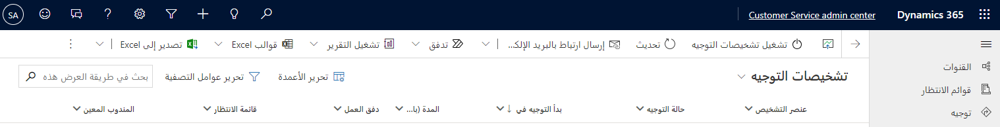
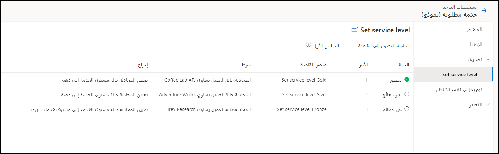
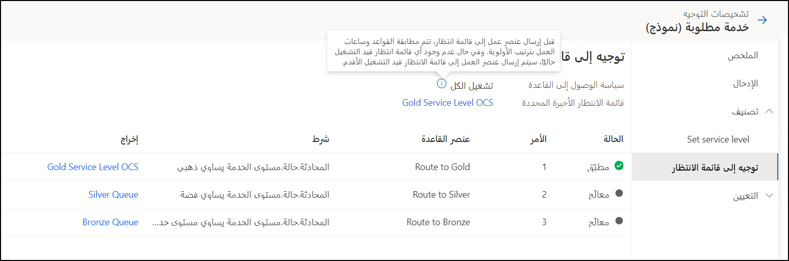
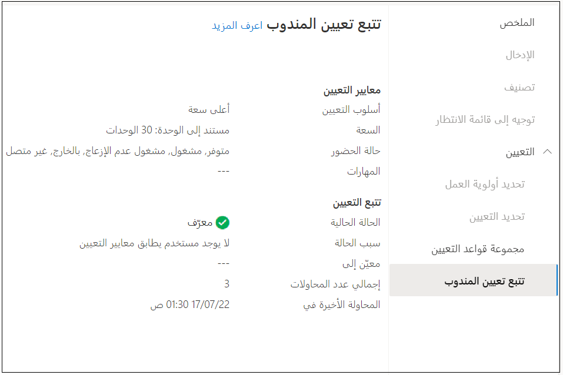

يساعدك التوجيه الموحد في تعيين عنصر عمل إلى المندوب أو قائمة الانتظار الأنسب، بناءً على مهارات الوكيل والكيانات المرتبطة بعنصر العمل. تدخل العديد من المكونات في جعل هذه العملية تعمل، مثل ضمان تحديد قوائم الانتظار الخاصة بك بشكل صحيح، وربط الوكلاء بقوائم الانتظار المناسبة، وإعداد القواعد بشكل صحيح، والمزيد. عندما يكون لديك العديد من الأجزاء المتحركة، فإن تحديد مكان حدوث المشكلات يمكن أن يكون صعباً إذا كان هناك شيء لا يعمل كما هو متوقع. توفر تشخيصات التوجيه عرضاً مفصلاً لكل سجل موجه لمساعدتك على فهم أفضل للمشكلات التي تحدث في تصنيف وتعيين عناصر العمل وتشخيصها ذاتياً بشكل أفضل.

ستحتاج إلى تمكين تشخيص التوجيه في بيئتك قبل أن تتمكن من استخدامها. يمكنك تشغيل الميزة في مركز مسؤولي Customer Service بالانتقال إلى قسم **التوجيه** وتحديد **تشخيصات التوجيه**.

بعد تمكين ميزة تشخيص التوجيه، سيتم عرض قائمة بعناصر العمل الجديدة. ومع ذلك، قد لا تظهر عناصر العمل على شاشتك على الفور. تعرض صفحة **تشخيصات التوجيه** قائمة بعناصر العمل مع التفاصيل والمرحلة التي يوجد بها كل عنصر عمل. تُظهر الصورة التالية مثالاً على السمات.

> [!div class="mx-imgBorder"]
> 

- **عنصر التشخيص** - اسم عنصر العمل. يمكنك البحث عن عناصر العمل وفرزها عن طريق تحديد القائمة المنسدلة بجوار عمود عنصر العمل.

- **حالة التوجيه** - المرحلة التي يوجد بها عنصر العمل.

- **تاريخ بدء التوجيه** - تاريخ ووقت بدء التوجيه.

- **المدة** - المدة التي ظل فيها عنصر العمل في مرحلته الحالية.

- **تدفق العمل** - اسم تدفق العمل الذي تم تعيين عنصر العمل إليه.

- **قائمة الانتظار** - اسم قائمة الانتظار التي تم توجيه عنصر العمل إليها.

- **المندوب المعيَّن** - المندوب الذي تم تعيين عنصر العمل إليه.

## تدفق تشخيصات التوجيه

يحتاج كل عنصر عمل إلى المرور عبر مجموعة من المراحل قبل أن يتم توجيهه للتعيين. يمكنك إنشاء تدفقات عمل متعددة وتعيين عناصر العمل بناءً على خطورتها وأولويتها. يعرض تدفق التشخيص المعلومات بناءً على التدفق الذي يمر به كل عنصر عمل.

استيعاب ➡ تصنيف ➡ توجيه إلى قائمة الانتظار ➡ تعيين

### استيعاب

عندما يأتي عنصر العمل، فإنه ينتقل إلى تدفق العمل الأول في جدول 
**الاستيعاب** ويتم التحقق مما إذا كان يفي بشروط مجموعة القواعد أو لا. ينتقل عنصر العمل إلى تدفق العمل الثاني ويتم التحقق من تطابقه مع مجموعة القواعد هذه، وهكذا. عندما يتطابق عنصر العمل مع مجموعة القواعد، سيتم تشغيل عنصر العمل. يمكنك إنشاء مسارات عمل متعددة للتعامل مع عناصر العمل بناءً على أولويتها، التي تسمى مرحلة **الاستيعاب** في تدفق العمل.

بعد أن يمر عنصر العمل بمرحلة **الاستيعاب** ، يتم تصنيفه من خلال العديد من مجموعات القواعد وعناصر القواعد.

يمر عنصر العمل بالمراحل التالية:

- **مُعالج** - مر عنصر العمل عبر مجموعة قواعد ولكنه لم يتطابق مع مجموعة القواعد؛ لذا لا يتم تشغيله.

- **مطابق** - قابل للتطبيق على قواعد التوجيه إلى قائمة الانتظار فقط؛ يعرض بعلامة اختيار خضراء إذا كانت شروط القاعدة صحيحة.

- **مُطبق** - مر عنصر العمل عبر مجموعة قواعد وتمت مطابقته بشروط مجموعة القواعد.

- **غير مُعالج** - لم يمر عنصر العمل من خلال مجموعة قواعد.

### تصنيف

إذا لم يتم تشغيل عنصر العمل من خلال مجموعة قواعد معينة في قائمة 
**مجموعات قواعد التصنيف** ، ثم يتم عرض خانة الاختيار **حالة التشغيل** باللون الأحمر. عندما يقوم عنصر العمل بتشغيل مجموعة قواعد معينة، فإنه يتم عرض علامة الاختيار **حالة التشغيل** باللون الأحمر. يقوم عنصر العمل بتشغيل جميع مجموعات القواعد، لكنه لا يقوم بتشغيل جميع عناصر القاعدة ضمن مجموعة القواعد.

إذا تم استخدام تحديد المهارات القائمة على التعلم الآلي أو تقدير الجهد (معاينة) أو نموذج التنبؤ بالتوجه (إصدار أولي)، فسيتم عرض تفاصيل النموذج المستخدم في قسم 
**التصنيف.** 

> [!div class="mx-imgBorder"]
> 

### توجيه إلى قائمة انتظار

تتم صياغة قواعد توجيه قائمة الانتظار لإرسال عنصر العمل إلى قائمة الانتظار الصحيحة. سيتم عرض اسم قائمة الانتظار التي يتم توجيه عنصر العمل إليها في صفحة **توجيه إلى قائمة انتظار**.

> [!div class="mx-imgBorder"]
> 

إذا لم تتطابق أي قائمة انتظار مع المتطلبات، فسيتم تعيين عنصر العمل إلى قائمة الانتظار الاحتياطية.

### تعيين

يتم تعيين كل عنصر عمل إلى مندوب أو يتم إرساله إلى قائمة انتظار بناءً على مجموعة قواعد **التعيين.**  تحتوي مجموعات قواعد التعيين على الشروط التي يلزم تعيين عناصر العمل الخاصة بها إلى المندوبين. في تشخيصات التوجيه، تساعدك مرحلة التعيين على فهم كيفية معالجة تعيين عنصر العمل، مثل كيفية إجراء تحديد الأولويات ومعايير تحديد التعيين التي تم تطبيقها.

تتوفر المراحل التالية:

- **تحديد الأولوية** - يسرد قاعدة الأولوية التي تم تطبيقها، إن وُجدت. يتم توجيه عناصر العمل وفقاً لأولويتها.

- **تحديد التعيين** - يعرض معلومات حول الشروط التي تحدد اختيار مندوب. في حالة وجود أكثر من مجموعة قواعد تعيين واحدة، ستحدد معايير التحديد الترتيب الذي سيتم تقييم مجموعات القواعد به. تحدد معايير تحديد التعيين مجموعة القواعد التي لها أقرب تطابق والقاعدة التي يجب أن تنفد من القواعد العديدة.

- **مجموعة قواعد التعيين** - تعرض معلومات حول مجموعات القواعد التي تمت معالجتها.

- **تتبع تعيين المندوب** - يوفر تفاصيل حول معايير التعيين وتتبع التعيين.

  - **معايير التعيين**

    - **أسلوب التعيين** - يعرض **أعلى سعة** أو **جولة روبن** أو **مخصص**.

    - **السعة** - تعرض معلومات السعة.

    - **الوجود** - يعرض الوجود المُستخدم.

    - **المهارات** - تعرض المهارات التي تمت مطابقتها، إن وُجدت.

  - **تتبع التعيين**

    - **الحالة الحالية** - تعرض حالة عنصر العمل، مثل ما إذا تم تحديد مندوب.

    - **سبب الحالة** - يعرض سبب الحالة المقترن.

    - **معيَّن إلى** - يعرض المندوب الذي تم تعيين عنصر العمل إليه، إن وُجد.

    - **مجموع المحاولات** - يعرض عدد المحاولات المطلوبة لتعيين المندوب، إن وُجد.

    - **آخر محاولة في** - يعرض تاريخ ووقت آخر محاولة لتعيين عنصر العمل.

> [!div class="mx-imgBorder"]
> 
