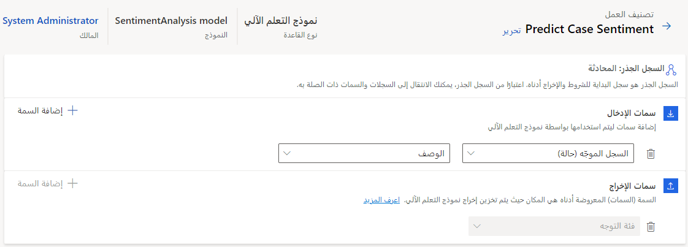
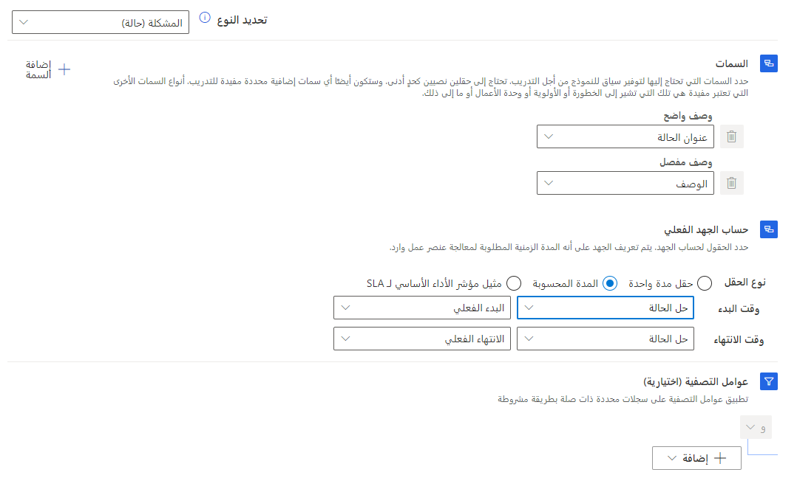
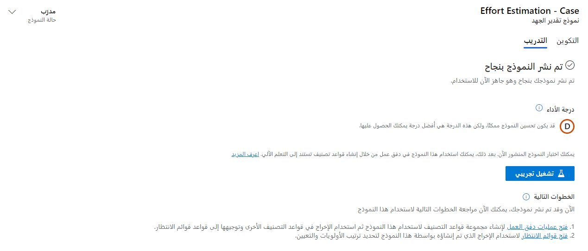
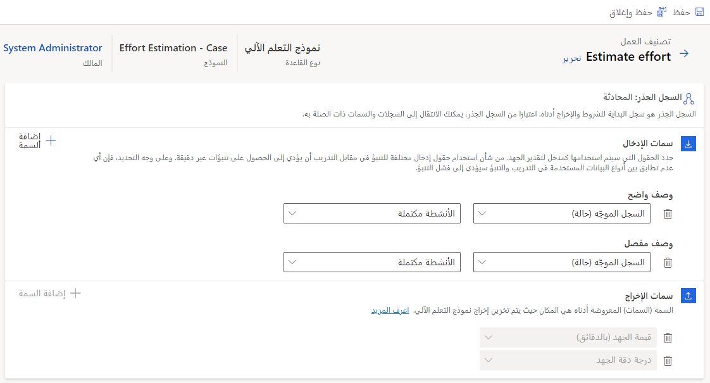

بالإضافة إلى القدرة على تشغيل القواعد المنطقية للمساعدة في تصنيف العمل وتعيين السجلات، يمكنك استخدام الذكاء الاصطناعي (AI) لتوجيه العناصر بذكاء. على سبيل المثال، قد تصعد العملاء غير الراضين إلى قائمة انتظار محددة، حيث يتوفر كبار المندوبين للتفاعل معهم. بدلاً من ذلك، قد ترغب في استخدام التفاعلات الأساسية لجعل النظام يقوم بذكاء بتعيين المهارات لعناصر العمل الواردة.

يتضمن التوجيه الموحد خيارات متعددة لاستخدام الذكاء الاصطناعي (AI) والتعلم الآلي لتحسين تجربة التوجيه:

- **التوجيه المستند إلى التوجه‬** - يستخدم التعلم الآلي للتنبؤ بدرجة توجه العميل لعناصر العمل الجديدة.

- **التوجيه المستند إلى الجهد‬** - يتيح لك إنشاء وتدريب نماذج التعلم الآلي، التي تحدد مقدار الجهد المطلوب لعناصر العمل الجديدة.

- **الباحث عن المهارات الذكية‬** - يتيح لك إنشاء نماذج التعلم الآلي وتدريبها لتحديد المهارات اللازمة لعناصر العمل الجديدة.

## التوجيه المستند إلى التوجه

يتيح التنبؤ بالتوجه‬ للمؤسسات استخدام درجات توجه العملاء كعامل في تصنيف عناصر العمل لتوجيهها إلى المندوبين. تتيح لك هذه الميزة كتابة قواعد لتصنيف عناصر العمل وتعيينها للمندوبين الأفضل تجهيزاً للتعامل معها.

مع ظهور عناصر العمل، سيقوم نموذج التوجه بتعيين توجه إليها بناءً على مقياس النقاط السبع التالي:

- إيجابي جداً

- إيجابي

- إيجابي بعض الشيء

- محايد

- سلبي بعض الشيء

- سلبي

- سلبي جداً

تم إعداد نموذج التوجه للبحث فقط عن الرسائل التي أرسلها العملاء واستخدامها. لا يتم احتساب الرسائل التي تم إرسالها من قِبل المندوبين إلى العملاء في درجة التوجه.

قبل أن تتمكن من استخدام التوجه في قواعد التصنيف الخاصة بك، ستحتاج إلى تمكينه في نظامك. يمكنك القيام بذلك في تطبيق مركز مسؤولي Customer Service في قسم **التوجيه**. حدد موقع **‏‫التوجيه المستند إلى التوجه‬**، ثم قم بتمكين التنبؤ بالتوجه للتوجيه.

بشكل اختياري، يمكنك اختبار نموذج التوجه باستخدام خيار **التشغيل التجريبي**. يتيح لك هذا الخيار اختبار العبارات الحقيقية، التي قد تتوقع مواجهتها عند اتصال العملاء بالدعم. يساعدك هذا على فهم الشكل الذي قد يبدو عليه التنبؤ بالتوجه في تلك العبارات. باستخدام خيار **التشغيل التجريبي**، يمكنك عرض المعلومات الأساسية، مثل فئة التوجه على مقياس من سبع نقاط، ودرجة التوجه التي يتم قياسها من صفر إلى 100، والكلمات الأساسية من العبارة، التي أثرت على درجة التوجه.

### إنشاء قواعد التصنيف على أساس التنبؤ بالتوجه

بعد تمكين ميزة التنبؤ بالتوجه، ستنشئ تنبؤاً بالتوجه في قسم تصنيف العمل في تدفق العمل. عند إنشاء مجموعة قواعد جديدة، حدد **نموذج التعلم الآلي**، ثم قم بتعيين النوع إلى **التنبؤ بالتوجه**.

ستحتاج إلى تحديد سمة الإدخال، حيث من المرجح أن يتم العثور على توجه العميل. على سبيل المثال، بالنسبة لتدفق عمل الحالة، من المحتمل أن تحدد حقل **الوصف**، لأنه قد يحتوي عادةً على كلمات أساسية تشير إلى التوجه. بالنسبة إلى قناة المراسلة، ستستخدم عادةً سياق سجل المحادثة.

تُظهر الصورة التالية مثالاً على الشكل الذي ستبدو عليه قاعدة تصنيف التنبؤ بالتوجه لحالة ما.

> [!div class="mx-imgBorder"]
> 

يمكنك تحديد ما يصل إلى 10 سمات، ويمكنك استخدام قيم تلك السمات لإنشاء نموذج التنبؤ. توجد سمة واحدة على الأقل، والسمة الأولى إلزامية ولا يمكن حذفها.

سيتم تعيين سمة الإخراج إلى **فئة التوجه**، التي يمكنك استخدامها في الشروط عند إنشاء قواعد التوجيه والتعيين.

## تقدير الجهد

توجد طريقة أخرى يمكن للمؤسسات من خلالها توجيه المعلومات إلى المندوبين تعتمد على مقدار الجهد الذي سيُتطلب بذله. في التوجيه الموحد، يمثل الجهد طول الوقت اللازم لحل عنصر العمل أو مقدار الوقت المنقضي في عنصر العمل قبل أن ينتقل إلى المرحلة التالية، على النحو المحدد من قِبل المؤسسة. يتضمن التوجيه الموحد نموذج تقدير الجهد، الذي يمكنك استخدامه لتصنيف عناصر العمل وتوجيهها. تتيح لك هذه الميزة تحديد مقدار الوقت، الذي ستستغرقه معالجة عنصر العمل. بناءً على هذا التقدير، يمكن توجيه العنصر إلى المندوب، الذي لديه النطاق الترددي لإدارته.

يمكن للمؤسسات استخدام تقدير الجهد من أجل:

- تقدير الوقت لتحليل المندوب والتعيين وفقاً لذلك.

- تقدير الوقت لحل الحالة بالكامل والتعيين وفقاً لذلك.

### إنشاء نموذج تقدير الجهد

يمكنك إنشاء نماذج تقدير الجهد لأي سجل تم تمكينه للتوجيه الموحد. يمكنك توفير السياق للنموذج بغرض التدريب عن طريق تحديد السمات. يلزم وجود سمتين على الأقل، ويمكنك تحديد ما يصل إلى 10 سمات. السمات التي تشير إلى الخطورة والأولوية مفيدة.

لإنشاء نماذج تقدير الجهد، انتقل إلى تطبيق مركز مسؤولي Customer Service‬. في قسم **التوجيه**، حدد **إدارة** لـ **التوجيه المستند إلى الجهد**. ستحتاج إلى تحديد اسم للنموذج.

قسم **ملخص البيانات** هو المكان الذي ستحدد فيه كيفية حساب الجهد. ستحتاج إلى تحديد القيم التالية:

- **نوع السجل** - يحدد نوع السجل الذي سيتم استخدامه مع النموذج الخاص بك. على سبيل المثال، إذا كنت تحاول تحديد مقدار الجهد المطلوب لحل أنواع معينة من الحالات، فستحدد **مشكلة (حالة)**.

- **السمات** - تحدد السمات (الحقول)، التي ستحتوي على بيانات ذات صلة بالنموذج. في البداية، ستحتاج إلى تحديد قيم لحقلي **الوصف الواضح** و **الوصف التفصيلي.**  
  يمكنك إضافة سمات أخرى حسب الحاجة. يمكنك إضافة ما يصل إلى 10 سمات لاستخدامها في تدريب النموذج.

- **عملية حساب الجهد الفعلي‬** - تحدد كيف سيتم حساب الجهد. ستعتمد طريقة حساب الجهد على الأنواع المختلفة للعناصر التي تعمل بها، ولكن يمكنك تحديد أحد الخيارات التالية لتحديد الوقت اللازم لمعالجة عنصر عمل وارد:

  - **حقل المدة الواحدة‬** - يُستخدم في السيناريوهات التي يتم فيها التقاط الوقت في حقل واحد، مثل حقل المدة في سجلات النشاط، مثل المكالمات الهاتفية، والمهام، والرسائل الإلكترونية.

  - **المدة المحسوبة** - تُستخدم في السيناريوهات، حيث يشير وقت البدء والانتهاء إلى الجهد، مثل استخدام حقلي **تاريخ الإنشاء** و **تاريخ الحل** في حالة ما لتحديد المدة التي كان خلالها السجل مفتوحاً.

  - **مثيل مؤشر الأداء الأساسي لاتفاقية مستوى الخدمة** - يُستخدم في السيناريوهات حيث تريد أن تكون قادراً على استخدام اتفاقيات مستوى الخدمة (SLA) المحددة في Dynamics 365 على أنها تعريف الجهد.

- **عوامل التصفية (اختياري)** - تتيح لك تصفية السجلات لاستخدامها في النموذج، مثل الاقتصار على سجلات الحالة فقط، حيث يكون لدى العميل مستوى خدمة. 
  بشكل اختياري، يمكنك تحديد شروط عوامل التصفية لتحديد السجلات ذات الصلة فقط.

- **نطاق التاريخ (اختياري)** - يتيح لك قصر السجلات، التي سيتم تضمينها في نموذجك، على نطاقات تاريخ محددة.

تُظهر الصورة التالية مثالاً لما قد يبدو عليه تعريف النموذج لتقدير الجهد المبذول في سجلات الحالة. تستخدم عملية حساب الجهد خياري **البداية الفعلية** و **النهاية الفعلية** في سجل حل الحالة لتحديد مقدار الجهد المطلوب.

> [!div class="mx-imgBorder"]
> 

بعد تحديد كل ما تريده في النموذج، حدد 
**تدريب نموذج الذكاء الاصطناعي**. تعرض علامة التبويب **تدريب** حالة التدريب، التي قد تستغرق بضع ساعات وتعتمد على الشروط المستخدمة. بعد أن يتم تدريب النموذج، ستظهر رسالة 
**تم نشر النموذج بنجاح‬** في الصفحة.

> [!div class="mx-imgBorder"]
> 

كما هو الحال مع نموذج التوجه، يمكنك تحديد **التشغيل التجريبي** وتحديد قيمة إدخال لاختبار النموذج. تتوفر التفاصيل التالية:

- **قيمة الجهد (بالدقائق)** - الوقت المقدر بالدقائق لعنصر العمل المراد معالجته.

- **درجة الثقة** - درجة الثقة، في قيمة بالنسبة المئوية، للتنبؤ بالجهد.

#### درجة الأداء

تتم الإشارة إلى درجة أداء النموذج بواسطة A أو B أو C أو D أو E أو F. وتشير الأحرف إلى جودة النموذج بترتيب تنازلي.

لمزيد من المعلومات، راجع [أداء نموذج التنبؤ](/ai-builder/prediction-performance/?azure-portal=true).

#### إنشاء قواعد التصنيف على أساس نموذج تقدير الجهد

بعد تدريب نماذج تقدير الجهد، يمكنك إنشاء قواعد التصنيف على أساس النماذج. بعد ذلك، يمكنك استخدام القواعد مع القواعد الأخرى للمساعدة في تصنيف عناصر العمل ليتم توجيهها إلى المندوبين المناسبين، الذين سيساعدون في حل المشكلات.

كما هو الحال مع جميع قواعد التصنيف الأخرى، ستحدد أنت قاعدة التصنيف في تدفق العمل، الذي تريد استخدامه معها. في مربع الحوار **إنشاء مجموعة قواعد تصنيف العمل‬** ، حدد نوع القاعدة كـ **نموذج التعلم الآلي‬**، ثم حدد النوع كـ **تقدير الجهد**.

في **تحديد نموذج تقدير الجهد‬**، حدد النموذج الذي تريد استخدامه للتنبؤ، ثم حدد **إنشاء**.

في الصفحة التي تظهر، حدد سمات الإدخال لاستخدامها في تقدير الجهد. على الرغم من أنه يمكنك استخدام ما يصل إلى 10 سمات، إلا أن حقلا 
**الوصف الواضح** و **الوصف التفصيلي** إلزاميين. بشكل افتراضي، سمات الإخراج هي 
**قيمة الجهد (بالدقائق)** و **درجة ثقة الجهد** ولا يمكن تحريرهما.

بالنسبة إلى قنوات المراسلة، يجب عليك تعيين متغيرات سياق الروبوت أو إعداد استطلاع ما قبل المحادثة، بحيث يمكنك استخدام سمات الإدخال.

> [!div class="mx-imgBorder"]
> 

> [!NOTE]
> يمكنك الحصول على قاعدة تقدير جهد واحدة فقط لكل تدفق عمل.

## الباحث عن المهارات الذكية

يتيح لك الباحث عن المهارات الذكية إنشاء وتدريب نماذج التعلم الآلي، التي تستخدم الذكاء الاصطناعي (AI) لتحديد المهارات اللازمة لعناصر العمل الجديدة. تفحص نماذج الذكاء الاصطناعي (AI) البيانات وتبدأ في تعلم المهارات المُراد إرفاقها بعنصر العمل. على سبيل المثال، قد تشير محادثة واردة إلى رقم نموذج معين لمنتج ما، مثل جهاز Café A-100. يستطيع الباحث عن المهارات الذكية فحص المحادثات السابقة ليعرف أن النظام يجب أن يرفق مهارة Café A-100 بالمحادثة وأن يرفق أيضاً مهارتي التدفئة والكهرباء، لأنهما غالباً ما تكونا مطلوبتين عند العمل مع الجهاز.

> [!IMPORTANT]
> يُستخدم الباحث عن المهارات الذكية مع التوجيه المستند إلى المهارات. على الرغم من أن هذا ليس هو التركيز الأساسي لهذه الدورة التدريبية، إلا أنه يمكنك معرفة المزيد حول التوجيه المستند إلى المهارات من خلال الانتقال إلى [التوجيه المستند إلى المهارات](/dynamics365/customer-service/overview-skill-work-distribution/?azure-portal=true).
