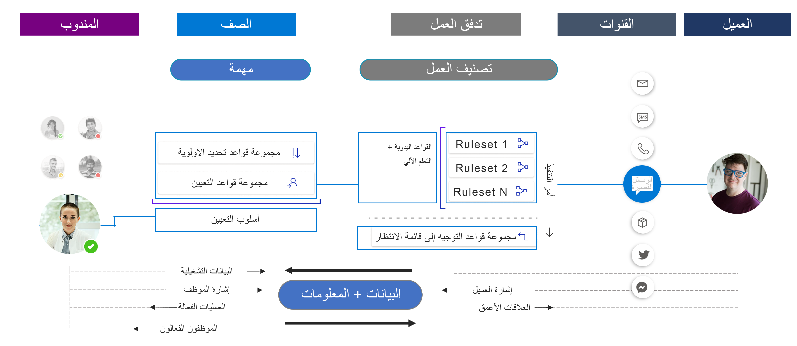

التوجيه الموحد هو قدرة توجيه وتعيين ذكية وقابلة للتطوير وذات مستوى مؤسسي. يمكنه توجيه عنصر العمل الوارد إلى قائمة الانتظار والمندوب الأنسب من خلال الالتزام بمتطلبات عنصر العمل ومطابقتها مع قدرات المندوب.

يمكنك استخدام البنية الأساسية الموحدة للتوجيه لتوجيه طلبات الخدمة عبر جميع القنوات. تساعدك هذه الإمكانية على إنشاء طريقة عرض موحدة لاستخدام القوى العاملة عبر قنوات متعددة؛ وبالتالي، فإنها تساعدك على تحسين توزيع العمل عبر القوى العاملة. إنها تعمل بطريقة قناة شاملة من خلال ضمان توجيه عناصر العمل على جميع القنوات بطريقة متسقة ومماثلة. إنها تأخذ في الاعتبار تفاعل المندوب على قنوات مختلفة قبل تعيين عمل جديد إليه.

يحتوي التوجيه الموحد على مرحلتين رئيسيتين:

- **التصنيف** - خلال هذه المرحلة، يمكنك استخدام القواعد ونماذج التعلم الآلي لإضافة معلومات حول عنصر العمل، والتي يمكن للنظام استخدامها للعثور على المندوب الأنسب.

- **التعيين** - خلال هذه المرحلة، يعطي النظام الأولوية لطلبات الخدمة ثم يعينها للمندوبين بناءً على طبيعة العمل والكيانات ذات الصلة ومهارات الوكيل والحالة الحالية للقوى العاملة للمندوب من حيث التوافر وعبء العمل.

> [!div class="mx-imgBorder"]
> 

نظراً لإرسال عنصر العمل من قِبل عميل من أي قناة، فإنه تتم معالجته بواسطة تدفق عمل مرتبط بنوع القناة هذا. على سبيل المثال، ستتم معالجة محادثة الدردشة التي يتم إرسالها من المدخل بواسطة تدفق عمل المراسلة.

- **تصنيف العمل**

  - تقارن قواعد التصنيف عنصر العمل بالشروط الموجودة في القاعدة. بناءً على الشروط، ستضيف معلومات إلى عنصر العمل للمساعدة في تصنيفها من أجل معالجة أفضل في المستقبل. 
    من المحتمل أن يحتوي تدفق العمل على مجموعات قواعد تصنيف متعددة لاستيعاب العديد من الاحتياجات المختلفة.

  - بعد تصنيف القواعد، ترسل قواعد التوجيه إلى قائمة الانتظار العنصر إلى قائمة الانتظار الصحيحة. على سبيل المثال، يمكن توجيه عنصر تم تصنيفه كعنصر إعداد فواتير إلى قائمة انتظار إعداد الفواتير.

- **التعيين**

  - عندما تكون عناصر العمل في قائمة الانتظار، يمكنك ترتيبها حسب الأولوية للتأكد من أن أنواعاً معينة من العناصر لها الأولوية على غيرها، مثل إعطاء الأولوية للحالات **الذهبية**، التي تم فيها تحديد الأولوية على أنها أعلى من الحالات الأخرى.

  - بعد تحديد أولويات العمل، سيقوم النظام بتعيينه إلى مندوب بناءً على إجراءات المؤسسة، مثل التعيين إلى المندوب في قائمة الانتظار الذي لديه أكبر سعة متاحة.

يدرس الجزء المتبقي من هذه الوحدة كيفية إعداد المكونات المختلفة المتضمنة في تصنيف عناصر العمل وتعيينها.
