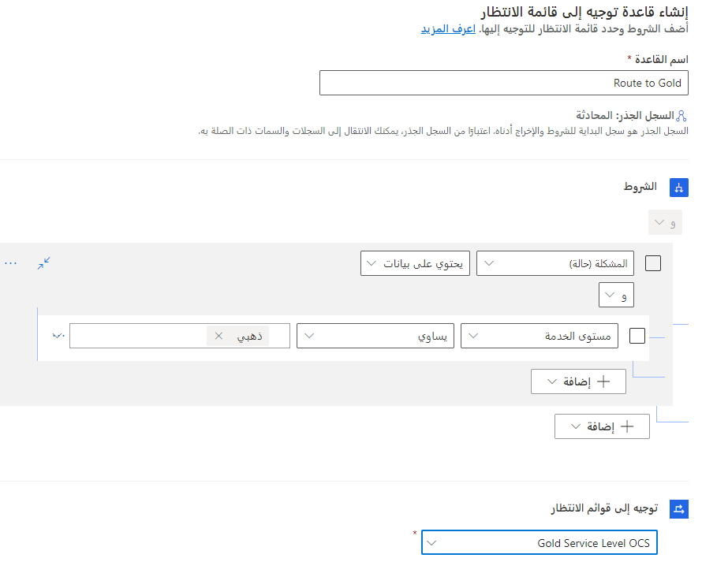
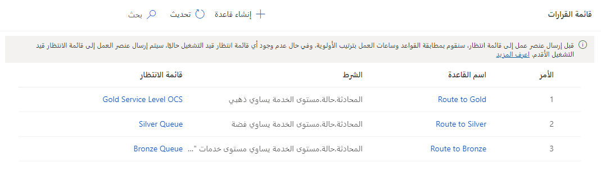
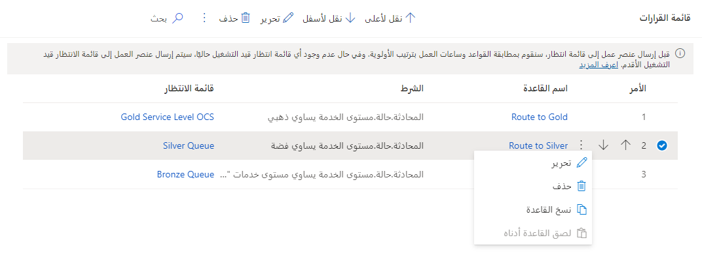

قبل توزيع العمل على أحد المندوبين، يجب أولاً توجيهه إلى قائمة انتظار. ويمكنك توجيه عنصر إلى قائمة انتظار باستخدام قواعد التحويل إلى قائمة الانتظار. ترسل هذه القواعد عناصر العمل إلى قائمة الانتظار الصحيحة. بطريقة مماثلة لقواعد تصنيف العمل، تعد قواعد التحويل إلى قائمة الانتظار اختيارية. بخلاف قواعد تصنيف العمل، حيث يمكنك إنشاء مجموعات قواعد متعددة على الأرجح لاستيعاب الاحتياجات المختلفة لمؤسستك، يمكنك فقط إعداد مجموعة قواعد واحدة فقط للتوجيه إلى قائمة انتظار لكل تدفق عمل.

بعد إعداد قواعد التحويل، ومع دخول عناصر عمل جديدة إلى تدفق العمل هذا، سيطابق النظام شروط القاعدة المحددة في مجموعة القواعد مع ساعات العمل لتوجيه عنصر العمل إلى قائمة الانتظار الصحيحة.

يمكنك إنشاء مجموعات قواعد التحويل في مركز مسؤولي Dynamics 365 Customer Service. بعد تحديد تدفق العمل الذي تريد العمل معه، حدد الزر **إنشاء مجموعة قواعد** إلى جانب القسم **توجيه إلى قوائم الانتظار**. في قائمة القرارات، حدد **إنشاء قاعدة** لإنشاء قاعدة جديدة.

المكونان الأساسيان لقاعدة التوجيه إلى قائمة الانتظار هما:

-   **الشرط** - يحدد الظروف التي سيتم فيها تطبيق القاعدة.

-   **توجيه إلى قوائم الانتظار** - يحدد عناصر قائمه الانتظار التي تستوفي الشرط الذي سيتم توجيه العنصر إليه.

## العمل مع الشروط

يمكنك تحديد شروط لقواعد التوجيه إلى قائمة الانتظار بنفس الطريقة التي تحدد بها شروط قواعد تصنيف العمل. بإمكان الشروط أن تستند إلى عنصر العمل أو الكيانات المرتبطة بالعنصر.

تُظهر الصورة التالية مثالاً عن قاعدة تحويل ستقوم بتوجيه أي محادثات يتم إرسالها بواسطة عملاء من المستوى **الذهبي** إلى قائمة انتظار من المستوى **الذهبي**.

> [!div class="mx-imgBorder"]
> 

إذا تطابقت أكثر من قاعدة واحدة مع الشرط المطلوب، وإذا كانت قوائم الانتظار المقابلة تتطابق أيضاً مع ساعات العمل، فسيتم تحديد قائمة الانتظار التي تتوافق مع القاعدة الأولى في القائمة للتعيين. إذا لم تتمكّن أي قائمة انتظار تتوافق مع القواعد من تلبية ساعات العمل، فسيتم تعيين عنصر العمل إلى قائمة الانتظار التي ستكون قادرة على العمل في أقرب وقت.

عندما لا يتطابق أي شرط قاعدة، أو عند عدم تحديد أي قاعدة، سيتم تعيين عنصر العمل إلى قائمة الانتظار الاحتياطية.

> [!div class="mx-imgBorder"]
> 

بعد إنشاء القواعد، يمكنك تغيير الترتيب الذي يجب أن يتم تقييم القواعد به، والبحث عن القواعد، وعرض الشرط الذي تم استخدامه لكل قاعدة عن طريق تمرير مؤشر الماوس فوق الشرط. يمكنك أيضاً إنشاء نُسخ من القواعد وتحديث المعلومات الضرورية فقط لتجنب كتابة شروط جديدة. يمكنك تمرير مؤشر الماوس فوق شرط ما لعرضه دون الحاجة إلى الانتقال إلى كل شرط.

> [!div class="mx-imgBorder"]
> 
