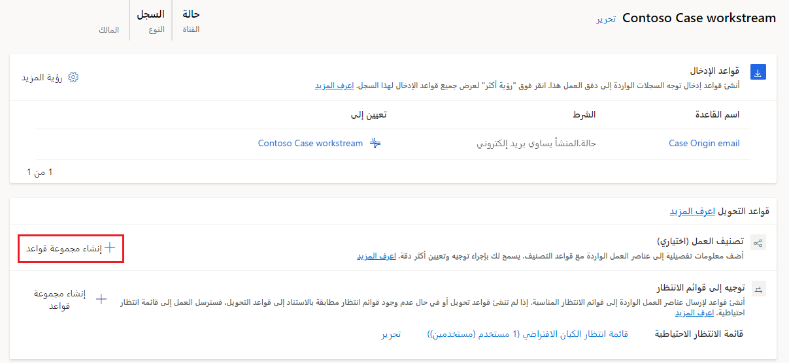
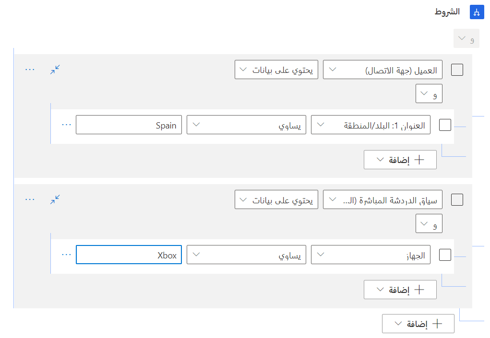
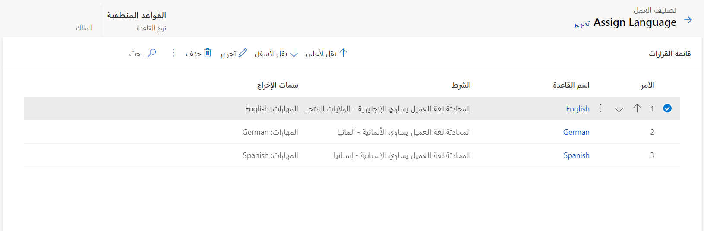
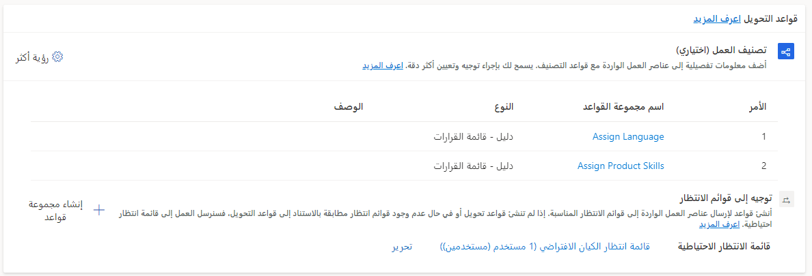

مع ورود عناصر العمل، يجب أولاً أن يتم توجيهها إلى قائمة الانتظار الأكثر ملاءمة قبل توزيعها على المندوب الأنسب. على سبيل المثال، سيتم أولاً توجيه محادثة متعلقة بالفوترة إلى قائمة انتظار الفوترة. وعندما تكون في قائمة الانتظار، سيتم تعيينها إلى مندوب متاح مؤهل للعمل على العنصر. في التوجيه الموحد، تتم هذه العملية من خلال تصنيف العمل ومجموعات قواعد التوجيه إلى قائمة الانتظار.

## مجموعة قواعد تصنيف العمل

قد لا تحتوي عناصر العمل الواردة دائماً على البيانات الضرورية لضمان توجيهها وتوزيعها بالاستناد إلى احتياجات مؤسستك. على سبيل المثال، قد يبدأ العميل محادثة دعم حول أحد المنتجات. وبينما قد يعكس النص الموجود في المحادثة المنتج الذي لديه سؤال حوله، لا يحتوي سجل المحادثة على البيانات الضرورية المحددة المتعلقة به لضمان توزيع عناصر العمل على المندوب الأنسب. ستحتاج تكراراً إلى إضافة بيانات التصنيف إلى المحادثة لتسهيل تحديد الشخص المناسب لتوزيع عنصر العمل عليه.

في التوجيه الموحد، تتم هذه العملية من خلال مجموعات قواعد التصنيف. مجموعة قواعد التصنيف هي قائمة مرتبة تحتوي على شروط مختلفة تساعد في تحديد التفاصيل في العنصر الوارد. بعد ذلك، تساعد هذه الشروط في إضافة علامات إلى العنصر ستساعد في توجيهه وتوزيعه لاحقاً. على سبيل المثال، قد تقوم مجموعة قواعد التصنيف بتقييم اللغة التي يتحدث بها العميل، ثم تضيف تلك اللغة كمهارة إلى المحادثة. عندما يحين وقت تعيين المحادثة، بإمكان النظام البحث عن مندوبين يتحدثون اللغة التي تحددها قاعدة التصنيف.

يمكنك تعريف قواعد تصنيف العمل ضمن قسم قواعد التوجيه في مسار العمل عن طريق تحديد **إنشاء مجموعة قواعد**. يمكنك تحديد ما يصل إلى 10 مجموعات قواعد لكل مسار عمل.

> [!div class="mx-imgBorder"]
> 

عند إنشاء مجموعة قواعد، يمكنك تحديد أحد الخيارات التالية لنوع القاعدة:

-   **منطقي** - القواعد التي تستخدم ملفات تعريف السعة أو المهارات أو السمات الخاصة بالسجل الموجه.

-   **نموذج التعلم الآلي** - استخدم نماذج التعلم الآلي للمساعدة في تصنيف عناصر العمل. يمكنك الاختيار من بين أحد النماذج التالية: **تعريف المهارة** أو **التنبؤ بالتوجه** أو **تقدير الجهد**.

بعد تحديد القاعدة، سيتم نقلك إلى قائمة القرارات. تشكل قائمة القرارات المكان الذي ستحدد فيه القواعد المختلفة التي سيتم تضمينها في مجموعة القواعد هذه. يمكنك إنشاء قواعد جديدة عن طريق تحديد الزر **إنشاء قاعدة**.

المكونان الأساسيان لقواعد تصنيف العمل هما:

-   **الشرط** - يحدد الظروف التي سيتم فيها تطبيق قاعدة المرفق.

-   **الإخراج** - يحدد المكان الذي يجب إرسال البيانات إليه، مثل تحديث حقل في السجل أو إرفاق مهارة أو بعض العناصر الأخرى.

## العمل مع الشروط

بإمكان الشروط أن تستند إلى عنصر العمل أو الكيانات المرتبطة بالعنصر. استنادا إلى نوع صنف العمل الذي تعمل معه، ستختلف السجلات ذات الصلة. على سبيل المثال، فيما يتعلق بالمحادثات، قد يتضمن هذان السجلان المرتبطان **الحساب** أو **جهة الاتصال** أو **الحالة** أو **نتيجة التنبؤ بالجهد‬** أو **متغير السياق** أو **سياق الدردشة المباشرة**. عندما تبني شرطاً على كيان ذي صلة، سيكون لديك حق الوصول الكامل إلى جميع الحقول الموجودة على الكيان ذي الصلة. على سبيل المثال، لتعيين لغة كمهارة استناداً إلى موقع الشخص الذي بدأ المحادثة، يمكنك تعيين الشرط استناداً إلى الجدول التالي.

| الكيان | السمة | المشغل | القيمة |
|--------|-----------|----------|-------|
| الاتصال (محادثة) | العنوان 1: البلد/المنطقة | يساوي | إسبانيا |
| سياق الدردشة النشطة (المحادثة) | الجهاز | يساوي | Xbox |

لتوفير المرونة، يمكنك تحديد شروط متعددة في قاعدة مرفق واحدة. بالإضافة إلى ذلك، يمكنك استخدام شروط **و/أو** لتجميع الأصناف معاً لمزيد من المرونة. بإمكان هذا النهج أن يكون مفيداً بشكل خاص في السيناريوهات التي قد تتأثر فيها كفاءة المهارة، مثل العمل مع نوع منتج معين، بناءً على عوامل متعددة. على سبيل المثال، إذا بدأ أحدهم محادثة حول Xbox وطرح سؤالاً حول حساب، فإن الكفاءة اللازمة للتعامل مع هذه المشكلة قد تكون منخفضة. إذا كان أحد الأشخاص يستعلم عن مشكلة دعم فني، فقد يحتاج إلى شخص يتمتع بمستوى كفاءة أعلى.

> [!div class="mx-imgBorder"]
> 

في مجموعه القواعد، سيتم تشغيل عناصر القاعدة بحسب ترتيب ذكرها. وفور مطابقة شرط عنصر قاعدة، يتم تطبيق الإخراج المحدد في عنصر القاعدة هذا. بعد ذلك، يتم تشغيل قسم الإخراج لعنصر القاعدة، وسيقوم النظام بتقييم القواعد في مجموعة القواعد التالية، إذا تم إعدادها. على سبيل المثال، في الصورة التالية، سيتم تقييم قاعدة اللغة الإنجليزية أولاً. إذا كانت لغة العميل هي اللغة الإنجليزية، فسيتم تطبيق مهارة اللغة الإنجليزية. وإذا لم يكن الأمر كذلك، فستنتقل إلى قاعدة اللغة الألمانية.

> [!div class="mx-imgBorder"]
> 

بإمكان تدفق عمل فردي أن يتضمن مجموعات قواعد تصنيف عمل متعددة. يسمح هذا العامل لمجموعات قواعد متعددة بمعالجة احتياجات تصنيفات متعددة في وقت واحد. وسيتم تشغيل مجموعات قواعد تصنيف العمل بحسب ترتيب ذكرها.

في الصورة التالية، ستقوم مجموعة قواعد **تعيين اللغة** بتعيين لغة إلى المحادثة. بعد اكتمال هذه العملية، ستقوم مجموعة قواعد **تعيين مهارات المنتج** بإرفاق مهارات المنتج بالمحادثة.

> [!div class="mx-imgBorder"]
> 

يمكنك استخدام القيم من مجموعة قواعد تصنيف عمل سابقة كشروط في مجموعات قواعد أخرى. على سبيل المثال، إذا قامت مجموعة القواعد الأولى بتعيين أولوية الحالة إلى **عالية**، فبإمكان عناصر القاعدة اللاحقة من مجموعات القواعد الأخرى استخدام متغير الأولوية والقيمة المقابلة للأولوية **عالية** لتعيين القيمة لسمة أخرى. على سبيل المثال، إذا كانت **الأولوية** تساوي **عالية**، فيمكنك تعيين الخطورة إلى حرجة. يساعد هذا النهج في توفير المرونة في دعم العديد من السيناريوهات المختلفة.

فيما يتعلق بعنصر القاعدة، يمكنك تعيين قيم الإخراج لسمات يصل عددها إلى خمس سمات كحدٍ أقصى. هذه السمات هي:

- ملفات تعريف القدرة الإنتاجية

- المهارات

- العميل

- عدد مرات التصعيد

- المشكلة

الآن بعد أن تعرفت على كيفية تصنيف العمل الوارد، يمكنك معرفة كيفية تحديد القواعد التي سيتم استخدامها لتوجيه العنصر إلى قائمة الانتظار المناسبة.
