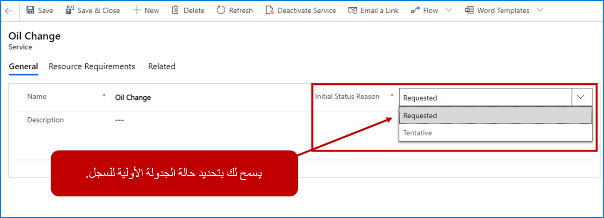
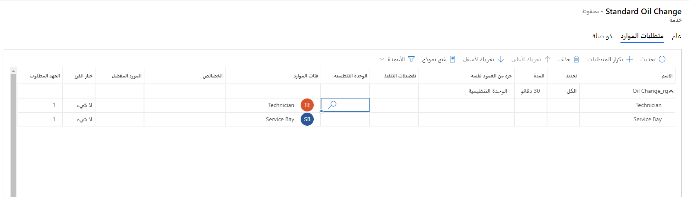
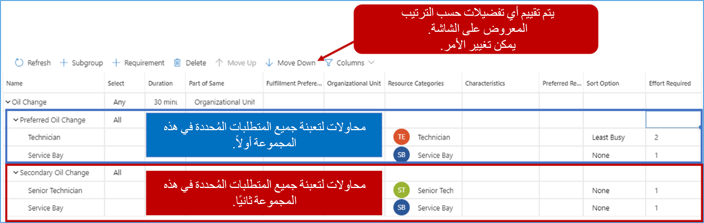

تمثل الخدمات أصناف محددة قابلة للجدولة يمكن إجراؤها للعميل. على سبيل المثال، قد تستخدم شركة كمبيوتر خدمات لتحديد أنواع العمل التي تقدمها مثل عمليات الضبط أو إزالة الفيروسات أو استعادة البيانات. قد يحدد مركز خدمة السيارات خدمات لتغيير الزيت أو دوران الإطارات أو ضبط المحرك أو عمليات سحب المصنع. تتيح لك جدولة Customer Service في Dynamics 365 تكوين الخدمات التي تقدمها مؤسستك. عند إنشاء خدمة، يمكنك بسهولة تحديد المدة التي يجب أن تستغرقها، بالإضافة إلى الموارد اللازمة لنشاط الخدمة.

## إنشاء الخدمات

يتم إنشاء الخدمات بالنقر فوق الزر **جديد**. عند إنشاء خدمة في البداية، ستحتاج إلى تحديد الأصناف التالية:

-   **الاسم**: تحديد اسم الخدمة.

-   **سبب الحالة الأولية**: تحديد كيفية ظهور الصنف على لوحة الجدولة. يمكنك تحديد إما **مطلوب** أو **مؤقت**.

> [!div class="mx-imgBorder"]
> 

بعد حفظ السجل، سيتم عرض علامة التبويب **متطلبات الموارد**. هذا هو المكان الذي يمكنك فيه تحديد التفاصيل المحددة المتعلقة باحتياجات الموارد لأداء الخدمة.

## متطلبات الموارد

ستتطلب كل خدمة أنواعاً مختلفة من الموارد لجدولة الخدمة وتنفيذها. عند تحديد خدمة، يمكنك تحديد أنواع الموارد اللازمة لإكمال هذا الصنف. على سبيل المثال، قد يتطلب تغيير الزيت فقط فني سيارات وحجرة خدمة، في حين أن إصلاح المحرك قد يتطلب فنيين، وحجرة خدمة، ورفع المحرك.

عند تحديد خدمة، يمكنك تحديد الموارد المطلوبة للخدمة. سيتم تجميع المتطلبات معاً للجدولة. يتيح ذلك للمرسلين جدولة فريق كامل من الموارد لنشاط خدمة واحد. على سبيل المثال، في السيناريو المذكور سابقاً، سيتم إنشاء خدمة تغيير الزيت تتضمن متطلبات فني وحجرة خدمة. ستشمل خدمة إصلاح المحرك متطلبات فنية متعددة، وحجرة خدمة، ورفع المحرك.

> [!div class="mx-imgBorder"]
> 

تواجه أحياناً مواقف يكون فيها مجموعات متعددة من الموارد مقبولة للحصول على حل. في هذه الحالة، يمكن إضافة المزيد من المجموعات الفرعية لتوفير المزيد من المرونة.

يمكن إضافة المتطلبات مباشرة إلى مجموعة المتطلبات الرئيسية، أو إلى مجموعة فرعية واحدة أو أكثر يمكن تحديدها. على سبيل المثال، قد يكون فني كبير قادراً على القيام بخدمة مثل تغيير الزيت بنفسه، عندما يتطلب الأمر فنيين أقل خبرة لإكمال الخدمة. على الرغم من أنها تتطلب عدداً أكبر من الأشخاص، إلا أنه سيتم تفضيل اثنين من الفنيين على أحد كبار الفنيين لأننا نريد إبقاء كبار الفنيين متاحين للوظائف الأكبر.

لإنجاز هذا السيناريو، يمكننا تعيين الخدمة بحيث تحتوي على مجموعتين فرعيتين:

-   المجموعة المفضلة لتغيير الزيت

-   فني

-   فني

-   حجرة خدمة

-   المجموعة الثانوية لتغيير الزيت

-   فني أول

-   حجرة خدمة

عند إنشاء الخدمة، من الممكن تحديد ما إذا كان يلزم تنفيذ جميع المتطلبات، أو ما إذا كان يلزم تنفيذ بعضها فقط. يمكن تحقيق ذلك باستخدام عمود التحديد. يحتوي عمود التحديد على خيارين:

-   **الكل**: يحدد وجوب تنفيذ جميع المتطلبات المحددة.

-   **أي**: يحدد أن واحداً فقط من المتطلبات المحددة يجب تنفيذه.

على سبيل المثال، يمكننا أن نرى في الصورة أنه تم اختيار أي منها لخدمة تغيير الزيت. يشير هذا إلى أننا نحتاج فقط إلى ملء إما مجموعة تغيير الزيت المفضلة أو متطلبات مجموعة تغيير الزيت الثانوية، ولكن ليس كليهما. لقد حددنا أيضاً أنه بالنسبة لكل مجموعة فرعية، سنحتاج إلى تلبية جميع متطلبات الموارد.

اعتبار آخر هو الترتيب الذي تظهر به المجموعات الفرعية والمتطلبات. نظراً لأن مجموعة تغيير الزيت مضبوطة على أي مجموعة، وتم إدراج مجموعة تغيير الزيت المفضلة أولاً، فهذا هو المطلب الذي ستحاول ملؤه أولاً. إذا لم تستطع تلبية المتطلبات، فسوف تنتقل إلى مجموعة تغيير الزيت الثانوية التي لديها مورد فني واحد فقط.

> [!div class="mx-imgBorder"]
> 

توفر الشبكة العديد من الخيارات للمساعدة في إنشاء المتطلبات الفردية. يتضمن ذلك تكرار المتطلبات وحذف المتطلبات وحتى القدرة على تحرير المجموعات والمجموعات الفرعية والمتطلبات المضمنة مباشرةً على الشبكة. يمكن تحديد بعض الإعدادات المتاحة التي يمكن تحريرها على الشبكة على مستوى المجموعة، بالإضافة إلى مستوى المتطلبات الفردية.

على سبيل المثال، يتم تحديد أصناف مجموعة المتطلبات مثل:

-   **جزء من نفس:** يسمح لك بتحديد ما إذا كان يجب أن تنتمي الموارد إلى نفس الوحدة التنظيمية‏‎ أو شجرة الموارد أو الموقع.

-   **تفضيلات التنفيذ:** تحدد ما إذا كان هناك أي تفضيلات تنفيذ يجب استخدامها عند اقتراح الموارد.

-   **الوحدة التنظيمية**: تحدد أن جميع الموارد يجب أن تأتي من وحدة تنظيمية معينة.

-   **فئات الموارد:** يحدد دور المورد الذي يجب أن يقترن بهذا المورد.

من المهم أن تأخذ الوقت اللازم لتحديد معايير اختيار الخدمة. بينما يمكنك حفظ خدمة دون تحديد المعايير، لن تتمكن من جدولة تلك الخدمة.

العناصر الإضافية التي يجب مراعاتها على مستوى المتطلبات هي:

-   **خيار الفرز:** يحدد كيفية عرض الموارد في نتائج البحث. هناك أربعة خيارات للاختيار من بينها:

    -   **بلا:** عدم القيام بأي فرز.

    -   **عشوائي:** تقديم مورد متاح بشكل عشوائي.

    -   **الأكثر انشغالاً:** تقديم المورد المتاح الذي يحتوي على أكبر عدد من الحجوزات.

    -   **الأقل انشغالاً:** تقديم المورد المتاح الذي يحتوي على أقل عدد من الحجوزات.

-   **الجهد المطلوب:** يحدد عدد الموارد المطلوبة لهذا النوع. أثناء الحجز، يتيح لك هذا الخيار عرض جميع الموارد التي تلبي الحد الأدنى من متطلبات الجهد. على سبيل المثال، إذا تم تحديد الجهد المطلوب على أنه 100، فسيتم فقط عرض الموارد ذات قيمة السعة 100 وأكثر في القائمة أثناء حجز الخدمة في لوحة الجدولة.

## تنشيط خدمة أو إلغاء تنشيطها

يمكنك جعل الخدمة متاحة أو غير متاحة للجدولة عن طريق تنشيطها أو إلغاء تنشيطها. للقيام بذلك، في قائمة سجلات الخدمة، حدد خدمة، ثم حدد التنشيط أو إلغاء التنشيط في شريط الأوامر. يمكنك فقط إلغاء تنشيط الخدمة إذا لم تكن هناك أنشطة خدمة مفتوحة أو مجدولة مرتبطة بها.
