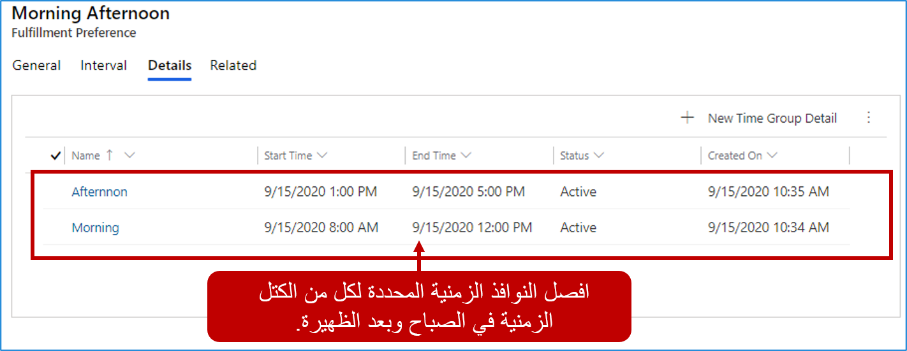
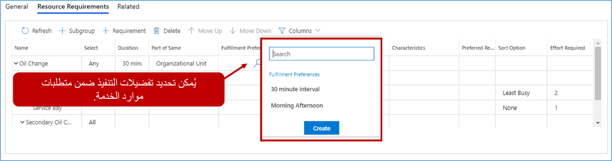
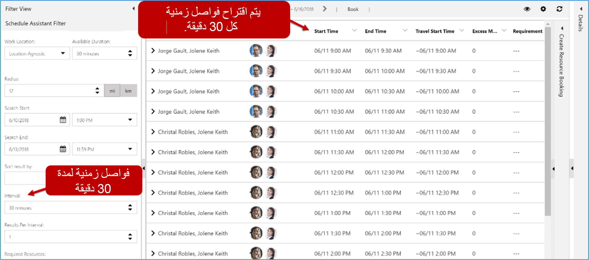
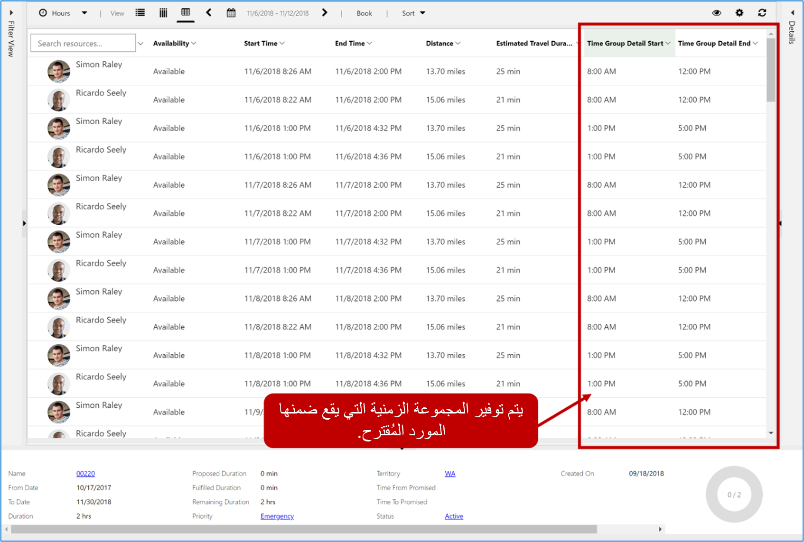
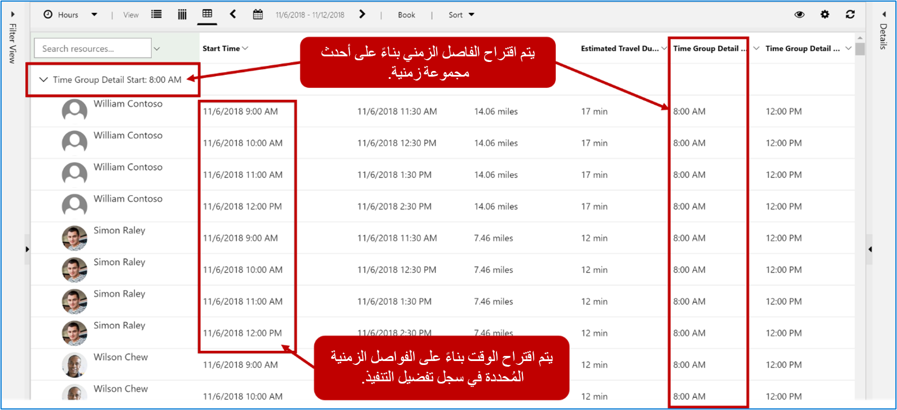

تستخدم جدولة الخدمات مساعد الجدولة لتحديد موقع الموارد المحتملة وعرضها مره أخرى في الجدول الزمني في لوحة الجدولة. عندما يعرض مساعد الجدولة النتائج، فإنها تعتمد بالكامل على جداول الموارد وأقرب وقت متاح لها. على سبيل المثال، إذا بدء تشغيل مساعد الجدولة الساعة 10:41 صباحاً فسيبدأ في البحث عن الموارد المتوفرة بدءاً من ذلك الوقت. على سبيل المثال، قد يحدد مساعد الجدولة أن أقرب وقت سيكون فيه المورد متاحاً هو 10:41 صباحاً.
قد تجعل جدولة شخص ما للعمل لإجراء مكالمة في الساعة 10:41 من الصعب جدولة مواعيد أخرى حولها. قد تفضل إحدى المؤسسات أن يتم اقتراح الأوقات في الفواصل الزمنية التي تعتبر أكثر انعكاساً لسيناريوهات العالم الحقيقي، مثل فترات 15 دقيقة أو 30 دقيقة أو ساعة واحدة. وبدلاً من 10:41، سيكون هذا المورد متاحاً بدءاً من الساعة 10:45 أو 11:00 صباحاً.

هناك اعتبار آخر وهو عندما لا تقوم المنظمات بجدولة الفنيين خلال أوقات محددة من اليوم. على سبيل المثال، قد تختار إحدى المؤسسات عدم جدولة الفنيين من الساعة 12:00 مساءً إلى 1:00 مساءً. لا يمثل هذا وقت الغداء للموارد فحسب، بل يمكن أن يعمل أيضاً كمخزن مؤقت للسماح للفنيين بتعويض الوقت إذا كانوا يركضون وراءهم. هذه الخيارات تجعل من السهل على المجدول عرض وفهم والتواصل مع العميل.

لتقديم هذه الخيارات، توفر Universal Resource Scheduling ما يسمى تفضيلات التنفيذ. تفضيلات التنفيذ هي جداول قابلة للتخصيص تتيح لك اختيار كيفية عرض نتائج مساعد الجدولة، مثل المواعيد بالساعة أو نوافذ أوقات الصباح وبعد الظهر.

تنقسم تفضيلات التنفيذ إلى ميزتين:

-   **الفواصل الزمنية**: تعرض نتائج مساعد الجدولة على فترات زمنية تحدد وقت بدء الحجوزات اللاحقة.

-   **مجموعات الوقت** تسمح المجموعات الزمنية‬ للمجدولين بالبحث في النتائج وعرضها على شكل كتل زمنية عند استخدام مساعد الجدولة. قد تشمل الأمثلة النموذجية فترات الصباح، وبعد الظهر، والليل، والنوافذ التي تعمل بساعتين.

تفضيلات التنفيذ مرتبطة بالمتطلبات والسجلات. عندما يتم تنفيذ مساعد الجدولة وفقاً للمتطلبات، فإنه سيقترح الأصناف بناءً على تفضيلات التنفيذ المحددة. يتم تحديد تفضيلات التنفيذ بالانتقال إلى **الجدولة > تفضيلات التنفيذ** وتحديد زر **جديد**.

## تحديد الفترات

يتم تحديد الفترات الزمنية لجدولة الفاصل الزمني في علامة تبويب الفاصل الزمني لسجل تفضيلات التنفيذ. هناك ثلاثة إعدادات رئيسية تم تحديدها لسجل الفاصل الزمني.

-   **الفاصل الزمني:** يحدد المدة بين الفترات الزمنية المتاحة، مثل 30 دقيقة و45 دقيقة وساعة واحدة وساعتين.

-   **تبدأ الفواصل الزمنية:** تحدد وقت بدء حساب الفاصل الزمني.

-   **نتائج واحدة لكل فترة:** تحدد عدد الخيارات التي سيتلقاها المجدول لكل فترة زمنية. إذا ترك هذا الخيار فارغاً، فسيتم تعيين النظام افتراضياً على 1.

> [!div class="mx-imgBorder"]
> 

في الصورة أعلاه، الفاصل الزمني هو 30 دقيقة مع فترات تبدأ في الساعة 8:00 صباحاً. يشير هذا إلى أن الخيارات المتاحة لعرض النتائج هي 8:00 صباحاً و8:30 صباحاً و9:00 صباحاً وما إلى ذلك. ومع ذلك، فإن النتائج تعتمد على توافر الموارد وساعات العمل.

> [!NOTE] 
> إذا تُرك حقل "الفواصل الزمنية" فارغاً، فسيبدأ الفاصل الزمني في وقت الحجز. على سبيل المثال، إذا كان الفاصل الزمني 30 دقيقة وكان الفاصل الزمني يبدأ فارغاً، فعندما تحاول الحجز الساعة 11:13 صباحاً، ستكون خيارات الفترة الزمنية هي 11:13 صباحاً و11:43 صباحاً و12:13 مساءً، وغيرها.

تعمل الفواصل الزمنية مع النتائج لكل إعداد فاصل زمني. إذا كان لدى إحدى المؤسسات 50 مورداً متاحاً جميعاً في الساعة 9:30 صباحاً، وتم تعيين النتائج لكل فترة زمنية على 50، فستظهر جميع الموارد. إذا تم تعيين النتائج لكل حقل من حقول الفواصل الزمنية على 5، فسيتم عرض أفضل 5 نتائج فقط.

## تحديد المجموعات الزمنية

بخلاف الفواصل الزمنية، فإن المجموعات الزمنية لا تفرض وقت بدء الحجوزات اللاحقة. تقوم المجموعات الزمنية بتنظيم النتائج، ولكنها تترك وقت البدء/وقت الوصول كما هو، استناداً إلى جدول المورد المحدد. لا يمكن تحديد تفاصيل مجموعة الوقت حتى يتم حفظ سجل تفضيل التنفيذ لأول مرة. بمجرد الحفظ، يتم تحديد المجموعات الزمنية من علامة تبويب التفاصيل بالنقر على الزر **إضافة مجموعة الوقت** في الشبكة الفرعية لمجموعات الوقت.

عند تحديد مجموعة الوقت، ستحتاج إلى توفير:

-   **الاسم:** اسم وصفي للمجموعة مثل الصباح أو بعد الظهر أو المساء.

-   **وقت البدء:** يحدد المرة الأولى التي يمكن فيها جدولة الحجز خلال الفترة الزمنية.

-   **وقت الانتهاء:** يحدد آخر مرة يمكن فيها جدولة حجز خلال الفترة الزمنية.

> [!IMPORTANT] 
> يحدد وقت الانتهاء آخر مرة يمكن أن يبدأ فيها الموعد داخل النافذة. على سبيل المثال، إذا كانت النافذة الزمنية من 8:00 صباحاً إلى 12:00 مساءً، فمن الممكن أن يكون هناك صنف له مدة محجوزة في 11:30 صباحاً أو 12:00 مساءً حتى لو كان وقت الانتهاء في كلتا الحالتين أكبر من النافذة الزمنية.

تُظهر الصورة أدناه مثالاً نموذجياً حيث يتم تحديد الإطارات الزمنية في الصباح وبعد الظهر. يتبقى فجوة زمنية من ساعة واحدة بين الساعة 12:00 والساعة 1:00 مساءً.

> [!div class="mx-imgBorder"]
> 

## ربط تفضيلات التنفيذ بالمتطلبات.

لكي يتم أخذ تفضيلات التنفيذ في الاعتبار لأحد المتطلبات، يجب عليك التأكد من إرفاقها بسجل المتطلبات. تعد أسهل طريقة لإضافة تفضيلات التنفيذ إلى أحد السجلات موجودة في متطلبات الموارد الخاصة بالخدمة. يمكن تعريفها يدوياً أو تعبئتها باستخدام تدفق Power Automate أو سيناريو تنفيذ تلقائي آخر.

> [!div class="mx-imgBorder"]
> 

## حجز المتطلبات مع مساعد الجدولة

عندما تعمل مع سجل متطلبات به فترات زمنية محددة، سيتم تحميل الفواصل الزمنية/مجموعات الوقت المحددة في تفضيل التنفيذ عند تحديد زر الكتاب. سيؤدي هذا إلى تشغيل مساعد الجدولة.

-   **الفواصل الزمنية:** يقدم الخيارات المتاحة بناءً على شاشة الفاصل الزمني المحددة. على سبيل المثال، الصورة أدناه تستخدم الجدول الزمني 30 دقيقة الذي حددناه.

    > [!div class="mx-imgBorder"]
    > 

-   **مجموعات الوقت:** ستستند النتائج المعروضة إلى إعداد مجموعة الوقت المحددة في التقويم. توضح الصورة أدناه كيفية تدوين الموارد بناءً على مجموعة الوقت وعرضها.

    > [!div class="mx-imgBorder"]
    > 

## استخدام الفواصل الزمنية ومجموعات الوقت معاً

في بعض الأحيان، قد ترغب في استخدام مجموعة من الفواصل الزمنية ومجموعات الوقت معاً. من الممكن تحديد تفضيل التنفيذ الذي يستخدم كلاً من الفواصل الزمنية والمجموعات الزمنية، ومع ذلك، هناك بعض الاختلافات الرئيسية التي يجب مراعاتها عند استخدام كليهما.

-   لا يمكنك إضافة قيمة لبداية الفاصل الزمني. سيبدأ الفاصل الزمني في وقت أقرب مجموعة زمنية.

-   إذا تم تعيين الخيار إعادة تعيين الفواصل الزمنية لكل تفاصيل المجموعة الزمنية‬ إلى نعم، فسيُعاد تعيين الفواصل الزمنية عندما تتداخل تفاصيل مجموعة زمنية جديدة مع فاصل زمني.

> [!div class="mx-imgBorder"]
> 

ضع في الاعتبار السيناريو التالي. تقدم شركة تقليدية مواعيد لعملائها كل 90 دقيقة، وبالتالي يتم تعيين الفواصل الزمنية إلى 90 دقيقة. بالإضافة إلى ذلك، تم فصلها إلى مجموعات زمنية للصباح وأخرى لبعد الظهر من 8:00 ص إلى 12:00 ظهرًا و 1:00 بعد الظهر إلى 5:00 مساء، مع استراحة غداء من ساعة واحدة بينهما. وبالتالي، فإن الفواصل الزمنية والمجموعات الزمنية تعتبر مفيدة لهذه الشركة.

**إذا كان تعيين خيار إعادة تعيين الفاصل الزمني حسب تفاصيل المجموعة الزمنية = لا، فستكون المواعيد على الشكل التالي:**

-   8:00 صباحاً و9:30 صباحاً و11:00 صباحاً (وليس 12:30ظهراً نظراً لحجز هذا الوقت لاستراحة الغداء)، و2:00 بعد الظهر، و3:30 بعد الظهر.

**إذا تم تعيين الخيار إعادة تعيين الفواصل الزمنية لكل تفاصيل المجموعة الزمنية‬ إلى لا، فستكون المواعيد على الشكل التالي:**

-   8:00 صباحاً و9:30 صباحاً و11:00 صباحاً (وليس 12:30ظهراً نظراً لحجز هذا الوقت لاستراحة الغداء)، و1:00 بعد الظهر (إعادة التعيين حسب تفاصيل المجموعة الزمنية التالية)، و2:30 بعد الظهر و4:00 مساءً.
