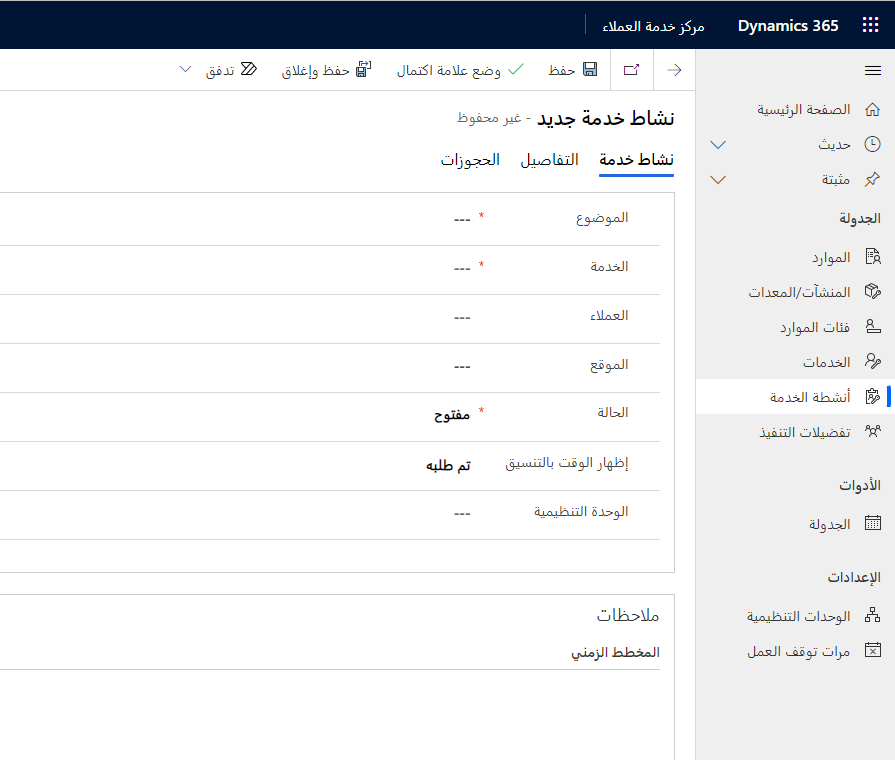
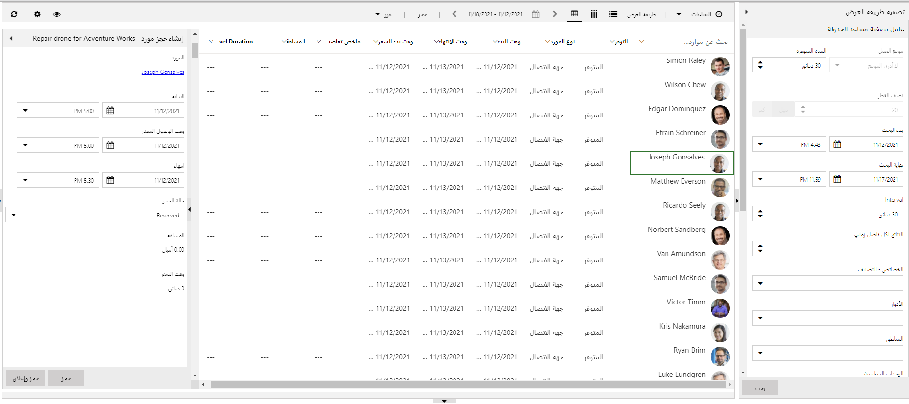
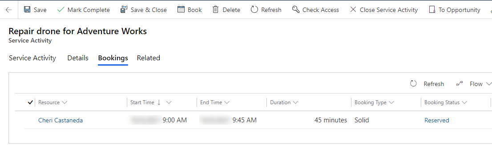

نشاط الخدمة هو نوع من سجل النشاط الذي يحدد العميل والموقع ونوع العمل الذي يريد العميل القيام به. الفائدة الرئيسية من استخدام الخدمات وأنشطة الخدمة هي أن تعقيد احتياجات الموارد متضمن في الخدمة ومجموعات متطلباتها. يحتاج المستخدم ببساطة إلى تحديد الخدمة والعميل.

ثم، يمكنك جدولة نشاط الخدمة والعثور على الأوقات التي تتوفر فيها الموارد لتقديم الخدمة.

> [!NOTE] 
> لا يمكنك إنشاء نشاط خدمة متكرر. يجب إنشاء أنشطة خدمة فردية حسب الحاجة.

## إنشاء نشاط الخدمة

يمكنك إنشاء أنشطة الخدمة من خلال الانتقال إلى **الجدولة > أنشطة الخدمة** في مركز خدمة العملاء.

سيؤدي تحديد الزر **أنشطة الخدمة** في شريط الأوامر إلى فتح نموذج **نشاط الخدمة الجديد**.

> [!div class="mx-imgBorder"]
> 

في علامة التبويب **نشاط الخدمة** في نموذج **نشاط الخدمة الجديد** تأكد مما يلي:

-   إدخال **موضوع** نشاط الخدمة.

-   تحديد **الخدمة** التي يطلبها العميل.

-   تحديد العميل الذي طلب النشاط.

-   تعيين الحقل **إظهار الوقت كـ** إلى **مطلوب** أو **مبدئي**.

-   اختيار **الوحدة المؤسسية** حيث سيتم تنفيذ الخدمة.

> [!NOTE] 
> يمكنك أيضاً إنشاء أنشطة الخدمة من **الأنشطة** ضمن **العمل الخاص بي** ومن الأنشطة ذات الصلة في سجلات العميل. لا يمكنك إنشاء نشاط الخدمة من عنصر تحكم المخطط الزمني ولا يظهر في المخطط الزمني افتراضياً. يمكنك تخصيص نموذج **الحساب** وتمكين أنشطة الخدمة في المخطط الزمني.

## حجز نشاط الخدمة من نشاط الخدمة

يمكنك جدولة نشاط الخدمة مباشرةً من سجل نشاط الخدمة من خلال تحديد الزر **حجز** في شريط الأوامر.

سيؤدي تحديد هذا الزر إلى تشغيل مساعد الجدولة في نافذة منبثقة، حيث يتم سرد الموارد المتاحة والفترات الزمنية الخاصة بها.

> [!div class="mx-imgBorder"]
> 

حدد مورد وفترة زمنية ثم حدد الزر **حجز وإغلاق** لحجز الخدمة.

يمكنك إنشاء حجز مورد قابل للحجز وعرضه في علامة التبويب **حجوزات**.

> [!div class="mx-imgBorder"]
> 

يتم أيضاً تحديث نشاط الخدمة بأوقات البدء والانتهاء الخاصة بالحجز.
