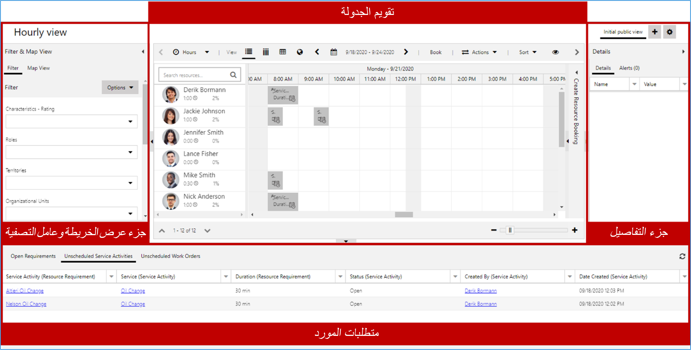
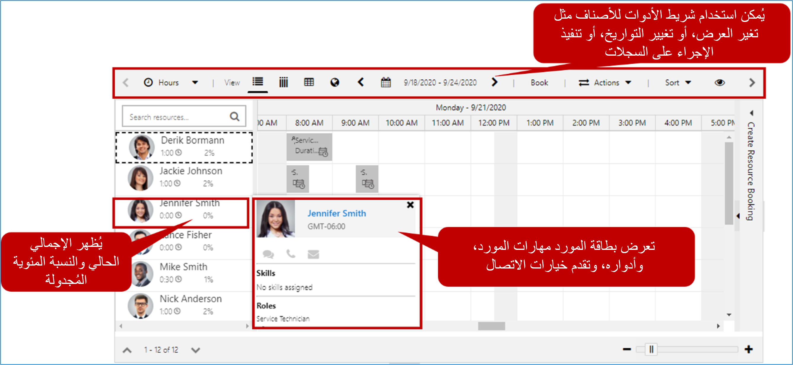
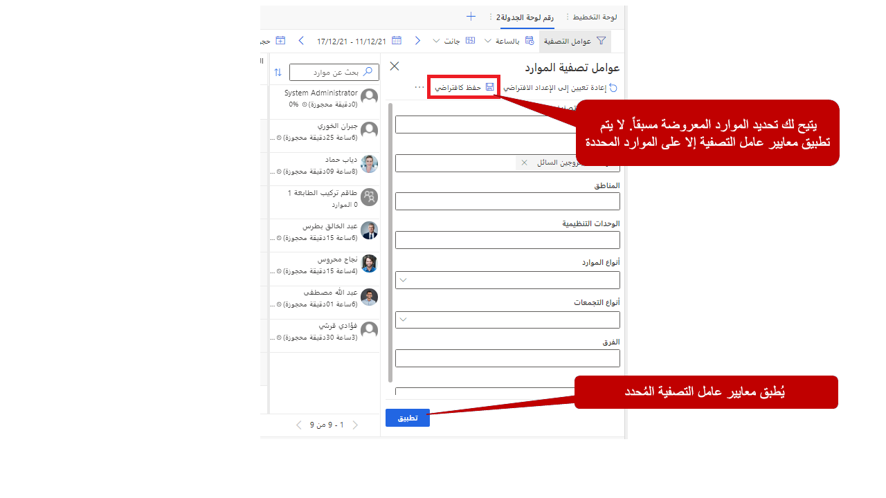
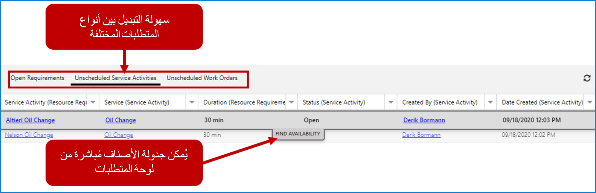
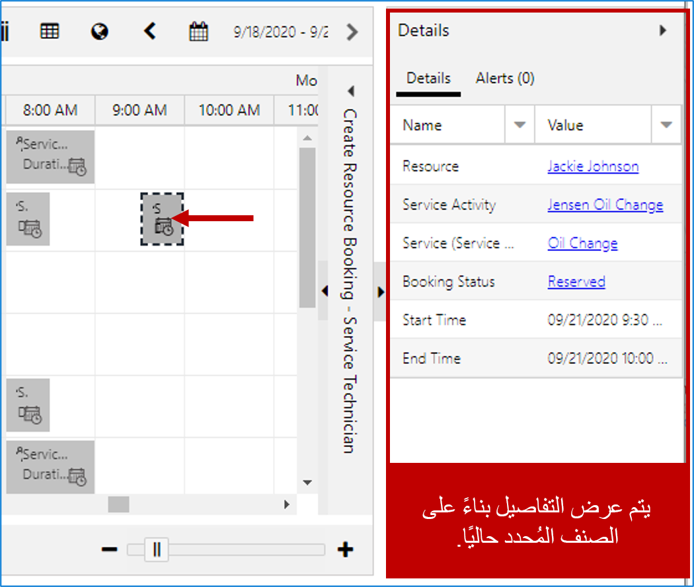
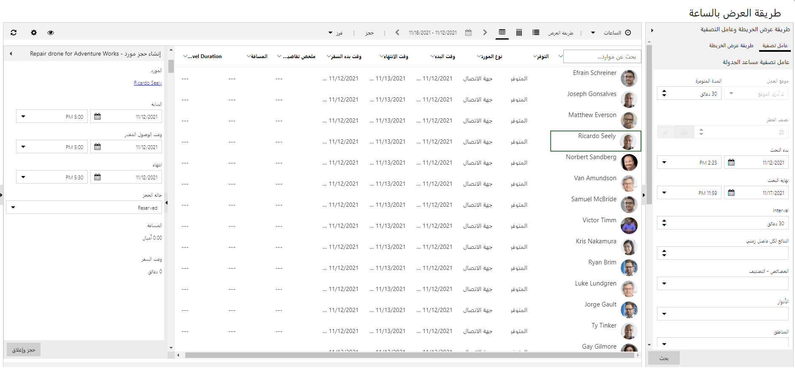

تساعد لوحة الجدولة هؤلاء الذين يقومون بحجز أنشطة الخدمة في أصناف الجدولة. تسهل لوحة الجدولة معرفة أنشطة الخدمة التي تعد أصنافًا غير مجدولة حاليًا، بالإضافة إلى توفر جميع الموارد (الأشخاص والمرافق والمعدات). يمكن جدولة الأصناف مباشرة من لوحة الجدولة، ما يسهل رؤية الشخص الذي يعمل وماذا يفعله بصريًا.

في لوحة الجدولة، يمكنك تنفيذ المهام الآتية:

-   عرض الجدول الخاص بأنشطة الخدمة اليومية والأسبوعية والشهرية الخاصة بمؤسستك.

-   عرض جداول العمل وجداول أنشطة الخدمة لمجموعة متنوعة من الموارد.

-   جدولة أنشطة الخدمة.

-   تغيير حالة نشاط خدمة موجود.

-   البحث عن التعارضات في الجدولة.

توفر لوحة الجدولة مكونات متعددة يمكن الاستفادة منها لجدولة الأصناف. يوجد أدناه نظرة عامة سريعة على اللوحات والأجزاء الأكثر استخداماً.

> [!div class="mx-imgBorder"]
> 

-   **متطلبات الموارد**: توفر قائمة بالمتطلبات النشطة مثل أنشطة الخدمة التي تجب جدولتها.

-   **لوحة التصفية ووضع الخرائط**: توفر الوصول إلى عوامل التصفية التفاعلية والخرائط التي يمكن الاستفادة منها للمساعدة على الجدولة.

-   **التفاصيل**: توفر تفاصيل إضافية للصنف المحدد حاليًا.

-   **تقويم الجدولة**: يعرض قائمة بالموارد والأصناف المجدولة حاليًا. يمكن استخدامها لجدولة أصناف جديدة، وكذلك التفاعل مع الأصناف المجدولة الحالية.

## الموارد الموجودة في لوحة الجدولة

تعرض لوحة الجدولة جميع الموارد المتاحة لجدولتها في التطبيق. في أثناء جدولة الموارد، سيتم عرض الوقت المجدول لهم والنسبة المئوية المجدولة لهم في سجل المورد الخاص بهم.
تستند النسبة المئوية المجدولة إلى سعة الموارد ونطاق التاريخ المستخدم على اللوحة. أثناء التمرير فوق أحد الموارد، يمكنك النقر بزر الماوس الأيمن فوقه لعرض بطاقة الموارد الخاصة به. تعرض بطاقة الموارد معلومات محددة عن المورد مثل المهارات التي يمتلكها وأدواره. يتم تزويدك أيضًا بخيارات اتصال متعددة للتفاعل مع المَورد.

> [!div class="mx-imgBorder"]
> 

يسهّل شريط أدوات لوحات الجدولة عرض المعلومات بناءً على احتياجات محددة والتفاعل مع اللوحة للقيام بأشياء مثل الحصول على الاتجاهات وحجز مَورد وفرز الأصناف الموجودة في اللوحة. تصف القائمة أدناه الخيارات المتاحة من شريط أدوات اللوحة.

-   **وضع العرض**: يحدد المقياس الذي سيتم استخدامه عند تقديم جداول الموارد على اللوحة. هناك أربعة خيارات للاختيار من بينها: الساعات والأيام والأسابيع والشهور.

-   **طريقة العرض**: تحدد كيف سيتم عرض الموارد على اللوحة. هناك أربعة خيارات للاختيار من بينها: أفقي، وعمودي، وقائمة، وخريطة.

-   **التواريخ**: تسمح لك بتحديد التاريخ (التواريخ) المحددة التي سيتم عرضها على اللوحة.

-   **الحجز**: يسمح لك بإنشاء حجز لمورد معين.

-   **الإجراءات**: توفر قائمة بالإجراءات التي يمكن تنفيذها على الأصناف الموجودة في لوحة الجدولة. تتضمن هذه الإجراءات:

    -   **الحصول على اتجاهات القيادة**: يسمح لك بالحصول على الاتجاهات من موقع إلى آخر. يمكن مشاركة الاتجاهات مع مورد بعدة طرق.

    -   **نقل الحجز إلى يوم مختلف**:يسمح لك بنقل الحجز إلى يوم مختلف. على سبيل المثال، إذا كان أحد الموارد يتأخر في يوم معين، فيمكن نقل هذه الحجوزات إلى الغد.

    -   **طباعة لوحة الجدولة**: تسمح لك بطباعة لوحة الجدولة بالكامل أو عناصر محددة فقط.

    -   **إنشاء تنبيه حجز**: يسمح لك بإنشاء تنبيه يتم تقديمه إلى المرسل في قسم التنبيهات باللوحة. يمكن استخدام التنبيهات لتوصيل معلومات مهمة أو فريدة إلى المرسل.
        على سبيل المثال، قد تستخدم تنبيه حجز إذا تعطلت إحدى المعدات ولا يجب جدولتها.

-   **الفرز**: يسمح لك بتحديد كيفية فرز الأصناف الموجودة في اللوحة. بشكلٍ افتراضي، يمكن فرزها حسب الاسم أو قيمة التصنيف.

## التعامل مع طريقة عرض عامل التصفية

يمكن الوصول إلى طريقة عرض عامل التصفية عن طريق توسيع عامل التصفية وطريقة عرض الخريطة. يتيح عامل التصفية للمرسلين تصفية الموارد المحددة المعروضة على اللوحة، بناءً على المعايير المحددة داخل عامل التصفية. يوفر عامل التصفية الخيارات التالية:

-   **تحديد معايير التصفية:** بشكلٍ افتراضي، يمكن تصفية الموارد المعروضة حسب الخصائص والأدوار والأقاليم والوحدات التنظيمية ونوع المورد ونوع التجمع والفرق ووحدات الأعمال. (يمكن إضافة معايير تصفية إضافية من خلال تخصيصات عامل التصفية.)

-   **تعديل طريقة فرز الموارد**: بشكلٍ افتراضي، يتم عرض الموارد التي تم إرجاعها بترتيب أبجدي. إذا رغبت في ذلك، يمكن فرزها حسب الاسم أو قيمة التصنيف.

على سبيل المثال، إذا كنت تقوم بتصفية الموارد حسب الخصائص، فقد ترغب في فرز اللوحة لعرض الموارد ذات الكفاءة الأعلى أولاً.
(يمكن استخدام خيارات فرز إضافية من خلال تخصيصات عامل التصفية.)

-   **عوامل التصفية الافتراضية**: يمكن تحديد عامل تصفية افتراضي سيتم تحميله عند تحميل علامة تبويب لوحة الجدولة. يمكن إعادة تطبيقها في أي وقت.

-   **تحديد الموارد**: باستخدام موارد التحديد، يمكنك تحديد الموارد التي تريد عرضها في علامة تبويب لوحة الجدولة. بمجرد تحديد هذه الموارد، يمكن تطبيق عوامل التصفية على تلك الموارد فقط.

بعد تحديد معايير التصفية، سيقوم زر البحث بتصفية الموارد المعروضة بناءً على المعايير المقدمة.

> [!div class="mx-imgBorder"]
> 

## لوحة المتطلبات

تسمح المتطلبات للمجدولين بمشاهدة قائمة بمتطلبات الموارد النشطة حالياً والتي تحتاج إلى جدولتها. في حالة جدولة Customer Service، ستمثل المتطلبات أنشطة الخدمة التي يجب جدولتها. سيعرض سجل المتطلبات أي تفضيلات تم تحديدها للصنف مثل الأولوية والمورد المفضل وهكذا.

تختلف علامات التبويب المعروضة في لوحة المتطلبات استنادًا إلى ما تتضمنه الحلول المثبتة. بالنسبة للمؤسسات التي تستخدم جدولة Customer Service، علامات التبويب ستتضمن:

-   **المتطلبات المفتوحة**: تعرض قائمة بجميع سجلات المتطلبات النشطة ذات الصلة بأي كيان ممكّن لـ URS.

-   **أنشطة الخدمة غير المجدولة**: تعرض قائمة بجميع سجلات المتطلبات النشطة المتعلقة بأنشطة الخدمة غير المجدولة.

يمكن إضافة علامات تبويب إضافية حسب الحاجة. على سبيل المثال، يمكنك تحديد علامة تبويب تعرض فقط متطلبات الموارد النشطة لأنشطة الخدمة غير المجدولة لموقع معين أو وحدة تنظيمية. يمكن جدولة أصناف لوحة المتطلبات عن طريق سحبها أو النقر فوق الزر "البحث عن التوفر".

> [!div class="mx-imgBorder"]
> 

## جزء "التفاصيل"

سيوفر جزء "التفاصيل" معلومات إضافية حول الصنف المحدد. على سبيل المثال، إذا تم تحديد أحد متطلبات أنشطة الخدمة، فسيعرض قسم التفاصيل معلومات حول المتطلبات. إذا تم تحديد نشاط خدمة مجدول مثل الحجز، فسيعرض معلومات حول الحجز. جزء التفاصيل هو أيضاً المكان الذي سيتم فيه عرض أي تنبيهات للحجز تم تحديدها.

> [!div class="mx-imgBorder"]
> 

## قم بالبحث عن التوفر لبدء مساعد الجدولة.

إن أسهل طريقة لجدولة صنف من لوحة الجدولة هي استخدام ميزة "البحث عن التوفر". عند تحديد أحد المتطلبات، اختر **البحث عن التوفر** لفتح مساعد الجدولة.

وعلى غرار وقت البدء من نشاط الخدمة نفسه، سيتم عرض أي موارد متاحة تفي بالمعايير المحددة في المتطلب.
سيتم عرض المعايير المستخدمة في طريقة عرض عامل التصفية. إذا كنت بحاجة إلى توسيع النتائج، فيمكن تعديل المعايير حسب الحاجة لهذا الطلب المحدد.

بالنسبة للموارد التي يتم إرجاعها بواسطة المساعد ، يتم عرض مجموعات من الوقت استنادًا إلى توفرها. يمكن للمُجدول تحديد أي وقت داخل تلك المجموعة لجدولة المورد للصنف. بمجرد تحديد الوقت، يتم عرض شاشة حجز الموارد حيث يمكن تعديل التفاصيل. بمجرد أن تكون جاهزاً لحجز الصنف، انقر فوق **حجز** أو زر **الحجز والخروج** لإنشاء الحجز.

## الجدولة مباشرة من نشاط خدمة

كما ذكرنا سابقًا، قد تجد أنه من السهل جدولة الصنف مباشرةً من نشاط الخدمة. ويتم إجراء ذلك بالنقر فوق زر "الحجز" مباشرة في نشاط الخدمة. عند تحميل مساعد الجدولة، سيُظهر الموارد المحتملة التي يمكن جدولتها. يمكن إرجاع مورد واحد عدة مرات حسب توفره خلال الفترة المحددة في عامل التصفية. كما ذكرنا سابقًا مع لوحة الجدولة، يمكن تعديل معايير عامل التصفية المستخدمة لتوسيع أو تقليل عدد النتائج التي تم إرجاعها.

> [!div class="mx-imgBorder"]
> 

هناك عدة أسباب لعدم عرض الموارد في "مساعد الجدولة". قد تحتاج إلى التحقق من القيم الموجودة في السجلات للتأكد من إمكانية إرجاعها بواسطة المساعد. الأشياء الأكثر شيوعاً التي يجب التحقق منها أولاً هي:

-   **لا توجد موارد تفي بالأدوار المحددة**: راجع معايير عامل التصفية التي يتم استخدامها. تأكد من أن لديك الموارد التي تلبي هذه المتطلبات.
    يمكنك إزالة المعايير لمعرفة ما إذا تم إرجاع النتائج. إذا كنت لا تزال لا ترى النتائج، فقد تكون مشكلة في العنوان.

-   **مواقع البدء والانتهاء المرتبطة بالموارد**: إذا تعذر تحديد موقع العنوان المرتبط بالمورد، فلن يتم إرجاع المورد. يتم تحديد مواقع البدء والانتهاء الخاصة بالمورد في سجل المورد. بالنسبة إلى جدولة الخدمات في العادة، يجب تعيين هذه على عنوان الوحدة التنظيمية. عند استخدام الوحدة التنظيمية، تأكد من أنها تحتوي على قيم خطوط طول وعرض صالحة.
