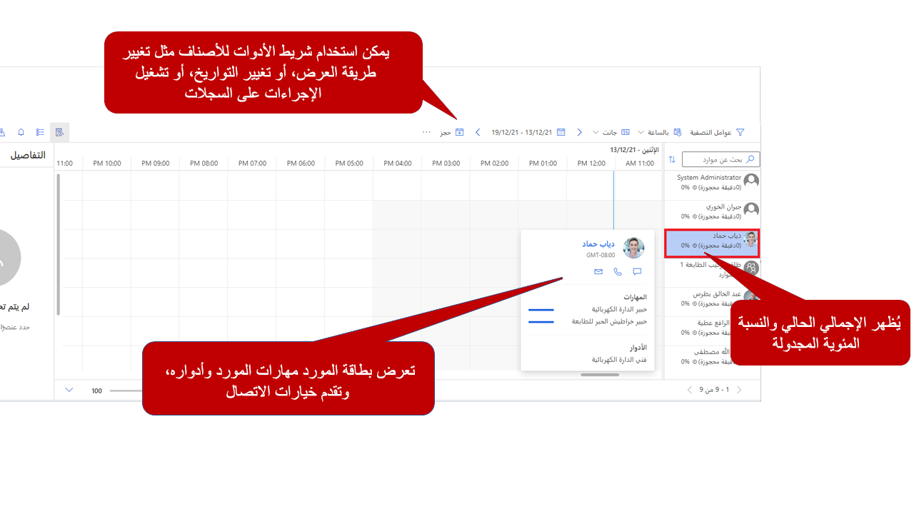

تساعد لوحة الجدولة هؤلاء الذين يقومون بحجز أنشطة الخدمة في أصناف الجدولة. تسهل لوحة الجدولة معرفة أنشطة الخدمة التي تعد أصنافاً غير مجدولة حالياً، بالإضافة إلى توفر جميع الموارد (الأشخاص والمرافق والمعدات). يمكنك جدولة الأصناف مباشرة من لوحة الجدولة، مما سيساعدك على التعرف بشكل أفضل على من يقوم بأي نشاط.

في لوحة الجدولة، يمكنك تنفيذ المهام الآتية:

-   عرض الجدول الخاص بأنشطة الخدمة اليومية والأسبوعية والشهرية الخاصة بمؤسستك.

-   عرض جداول العمل وجداول أنشطة الخدمة لمجموعة متنوعة من الموارد.

-   جدولة أنشطة الخدمة.

-   تغيير حالة نشاط خدمة موجود.

-   البحث عن التعارضات في الجدولة.

توفر لوحة الجدولة مكونات متعددة يمكنك استخدامها لجدولة الأصناف. يقدم القسم التالي نظرة عامة موجزة على اللوحات والأجزاء الأكثر استخداماً.

> [!div class="mx-imgBorder"]
> 

-   **متطلبات الموارد**‎ - توفر قائمة بالمتطلبات النشطة مثل أنشطة الخدمة التي تجب جدولتها.

-   **طريقة عرض عامل التصفية والخريطة**‎ - توفر الوصول إلى عوامل التصفية التفاعلية والخرائط التي يمكنك استخدامها للجدولة.

-   **التفاصيل**‎‎ - توفر تفاصيل إضافية للصنف المحدد حالياً.

-   **تقويم الجدولة**‎ - يعرض قائمة بالموارد والأصناف المجدولة حالياً. يمكنك استخدام هذا الخيار لجدولة أصناف جديدة والتفاعل مع الأصناف المجدولة الحالية.

## الموارد الموجودة في لوحة الجدولة

تعرض لوحة الجدولة جميع الموارد المتاحة لجدولتها في التطبيق. في أثناء جدولة الموارد، سيتم عرض الوقت المجدول لهم والنسبة المئوية المجدولة لهم في سجل المورد الخاص بهم.
تستند النسبة المئوية المجدولة إلى سعة الموارد ونطاق التاريخ المستخدم على اللوحة. قم بتمرير المؤشر فوق أحد الموارد وانقر بزر الماوس الأيمن فوقه لعرض بطاقة الموارد الخاصة به. تعرض بطاقة الموارد معلومات محددة عن المورد مثل المهارات والأدوار. يمكنك أيضاً الاختيار من خيارات اتصال متعددة للتفاعل مع المَورد.

> [!div class="mx-imgBorder"]
> 

يساعدك شريط أدوات لوحة الجدولة في عرض المعلومات بناءً على احتياجات محددة والتفاعل مع اللوحة لإكمال الإجراءات، مثل الحصول على الاتجاهات وحجز مورد وفرز العناصر على اللوحة. 

تتضمن الخيارات المتاحة من شريط أدوات لوحة الجدولة ما يلي:

-   **وضع العرض:** - تحديد المقياس الذي سيتم استخدامه عند تقديم جداول الموارد على اللوحة. توجد أربعة خيارات للاختيار من بينها: الساعات والأيام والأسابيع والشهور.

-   **طريقة العرض** - تحدد كيف سيتم عرض الموارد على اللوحة.
    توجد أربعة خيارات للاختيار من بينها: أفقي، وعمودي، وقائمة، وخريطة.

-   **التواريخ** - تسمح لك بتحديد التاريخ (التواريخ) المحددة التي سيتم عرضها على اللوحة.

-   **الحجز** - يسمح لك بإنشاء حجز لمورد معين.

-   **الإجراءات** - توفر قائمة بالإجراءات التي يمكن تشغيلها على الأصناف الموجودة في لوحة الجدولة. تتضمن هذه الإجراءات:

    -   **الحصول على اتجاهات القيادة** - يسمح لك بالحصول على الاتجاهات من موقع إلى آخر. يمكنك مشاركة الاتجاهات مع مورد بعدة طرق.

    -   **نقل الحجز إلى يوم مختلف** - يسمح لك بنقل الحجز إلى يوم مختلف. على سبيل المثال، إذا كان أحد الموارد يتأخر في يوم معين، فيمكن نقل هذه الحجوزات إلى الغد.

    -   **طباعة لوحة الجدولة** - تسمح لك بطباعة لوحة الجدولة بالكامل أو عناصر محددة فقط.

    -   **إنشاء تنبيه حجز** - يسمح لك بإنشاء تنبيه يتم تقديمه إلى المرسل في قسم التنبيهات باللوحة. يمكنك استخدام التنبيهات لتوصيل معلومات مهمة أو فريدة إلى المرسل.
        على سبيل المثال، قد تستخدم تنبيه حجز إذا تعطلت إحدى المعدات ولا يجب جدولتها.

-   **الفرز** - يسمح لك بتحديد كيفية فرز الأصناف الموجودة في اللوحة. بشكلٍ افتراضي، يمكن فرزها حسب الاسم أو قيمة التصنيف.

## التعامل مع طريقة عرض عامل التصفية

يمكنك الوصول إلى طريقة عرض عامل التصفية عن طريق توسيع عامل التصفية وطريقة عرض الخريطة. يتيح عامل التصفية للمرسلين تصفية الموارد المحددة المعروضة على اللوحة، بناءً على المعايير المحددة داخل عامل التصفية. 

يوفر عامل التصفية الخيارات التالية:

-   **تحديد معايير التصفية** - بشكلٍ افتراضي، يمكن تصفية الموارد المعروضة حسب الخصائص والأدوار والأقاليم والوحدات التنظيمية ونوع المورد ونوع التجمع والفرق ووحدات الأعمال. (يمكنك إضافة معايير تصفية إضافية من خلال تخصيصات عامل التصفية.)

-   **تعديل طريقة فرز الموارد** - بشكلٍ افتراضي، يتم عرض الموارد التي تم إرجاعها بترتيب أبجدي. يمكنك فرزها حسب الاسم أو قيمه التصنيف.

على سبيل المثال، إذا كنت تقوم بتصفية الموارد حسب الخصائص، فقد ترغب في فرز اللوحة لعرض الموارد ذات الكفاءة الأعلى أولاً.
(يمكنك استخدام خيارات فرز إضافية من خلال تخصيصات عامل التصفية.)

-   **عوامل التصفية الافتراضية** - يمكنك تحديد عامل تصفية افتراضي سيتم تحميله عند تحميل علامة تبويب **لوحة الجدولة**. يمكن إعادة تطبيقها في أي وقت.

-   **تحديد الموارد** - باستخدام تحديد الموارد، يمكنك تحديد الموارد التي تريد عرضها في علامة تبويب **لوحة الجدولة**. وبعد تحديد هذه الموارد، يمكنك تطبيق عوامل التصفية على تلك الموارد فقط.

بعد تحديد معايير التصفية، سيقوم زر **البحث** بتصفية الموارد المعروضة بناءً على المعايير المقدمة.

> [!div class="mx-imgBorder"]
> 

## لوحة المتطلبات

تسمح المتطلبات للمجدولين بعرض قائمة بمتطلبات الموارد النشطة حالياً والتي تحتاج إلى جدولتها. في حالة جدولة Customer Service، ستمثل المتطلبات أنشطة الخدمة التي يجب جدولتها. سيعرض سجل المتطلبات التفضيلات التي تم تحديدها للصنف مثل الأولوية والمورد المفضل وهكذا.

تختلف علامات التبويب المعروضة في لوحة المتطلبات استناداً إلى ما تتضمنه الحلول المثبتة. بالنسبة للمؤسسات التي تستخدم جدولة Dynamics 365 Customer Service، علامات التبويب ستتضمن:

-   **المتطلبات المفتوحة** - تعرض قائمة بجميع سجلات المتطلبات النشطة ذات الصلة بأي جدول ممكّن لـ Universal Resource Scheduling.

-   **أنشطة الخدمة غير المجدولة** - تعرض قائمة بجميع سجلات المتطلبات النشطة المتعلقة بأنشطة الخدمة غير المجدولة.

يمكنك إضافة المزيد من علامات التبويب حسب الحاجة. على سبيل المثال، يمكنك تحديد علامة تبويب تعرض فقط متطلبات الموارد النشطة لأنشطة الخدمة غير المجدولة لموقع معين أو وحدة تنظيمية. لجدولة الأصناف الخاصة بلوحة المتطلبات، اسحبها أو حدد الزر **البحث عن التوفر**.

> [!div class="mx-imgBorder"]
> 

## جزء "التفاصيل"

سيوفر جزء "التفاصيل" معلومات إضافية حول الصنف المحدد. على سبيل المثال، إذا تم تحديد أحد متطلبات نشاط الخدمة، فسيعرض قسم **التفاصيل** معلومات حول المتطلبات. إذا تم تحديد نشاط خدمة مجدول يُعرف باسم الحجز، فسيعرض معلومات حول الحجز. جزء **التفاصيل** يعرض أيضاً تنبيهات الحجز التي تم تحديدها.

> [!div class="mx-imgBorder"]
> 

## البحث عن التوفر باستخدام مساعد الجدولة

إن أسهل طريقة لجدولة صنف من لوحة الجدولة هي استخدام ميزة **البحث عن التوفر**. عند تحديدك أحد المتطلبات، اختر ميزة **البحث عن التوفر** لفتح مساعد الجدولة.

وعلى غرار وقت البدء من نشاط الخدمة، سيتم عرض أي موارد متاحة تفي بالمعايير المحددة في المتطلب.
سيتم عرض المعايير المستخدمة في طريقة عرض عامل التصفية. إذا كنت بحاجة إلى توسيع النتائج، يمكنك تعديل المعايير حسب الحاجة لهذا الطلب المحدد.

بالنسبة للموارد التي يتم إرجاعها بواسطة المساعد، يتم عرض مجموعات من الوقت استناداً إلى توفرها. يمكن للمُجدول تحديد أي وقت داخل تلك المجموعة لجدولة المورد للصنف. بعد قيامك بتحديد الوقت، ستظهر شاشة حجز الموارد، حيث يمكنك تعديل التفاصيل. عندما تكون جاهزاً لحجز الصنف، حدد الزر **حجز** أو **الحجز والخروج** لإنشاء الحجز.

## الجدولة مباشرة من نشاط خدمة

يمكن أن تكون جدولة الصنف مباشرة من نشاط الخدمة أسهل. يمكنك إكمال هذا الاجراء عن طريق تحديد الزر **حجز** في نشاط الخدمة. عند تحميل مساعد الجدولة، سيُظهر الموارد المحتملة التي يمكن جدولتها. يمكن إرجاع مورد واحد عدة مرات حسب توفره خلال الفترة المحددة في عامل التصفية. يمكنك تعديل عامل التصفية المستخدم لتوسيع عدد النتائج التي تم إرجاعها أو تقليلها.

> [!div class="mx-imgBorder"]
> 

قد لا يتم عرض الموارد في مساعد الجدولة لعدة أسباب.
قد تحتاج إلى التحقق من القيم الموجودة في السجلات للتأكد من إمكانية إرجاعها بواسطة المساعد. 

العوامل الأكثر شيوعاً التي يجب التحقق منها أولاً هي:

-   **لا توجد موارد تفي بالأدوار المحددة** - افحص معايير عامل التصفية التي يتم استخدامها. تأكد من أن لديك الموارد التي تلبي هذه المتطلبات.
    يمكنك إزالة المعايير لتحديد ما إذا تم إرجاع النتائج. إذا كنت لا تزال لا تتلقى النتائج، فقد تكون مشكلة في العنوان.

-   **مواقع البدء والانتهاء المرتبطة بالموارد**‎‎ - إذا تعذر تحديد موقع العنوان المرتبط بالمورد، فلن يتم إرجاع المورد. يتم تحديد مواقع البدء والانتهاء الخاصة بالمورد في سجل المورد. بالنسبة إلى جدولة الخدمات في العادة، يجب تعيين هذه المواقع على عنوان الوحدة التنظيمية. عند استخدام الوحدة التنظيمية، يجب التأكد من أنها تحتوي على قيم خطوط طول وعرض صالحة.
