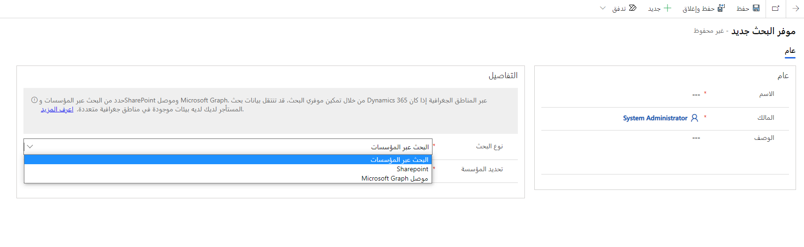
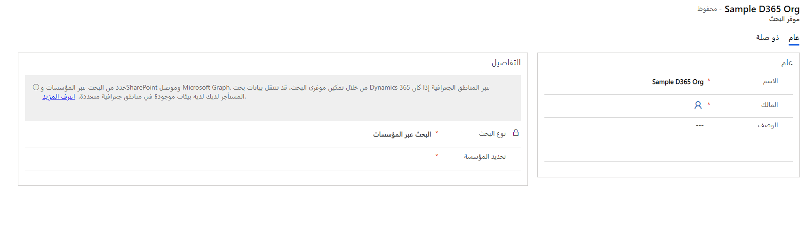
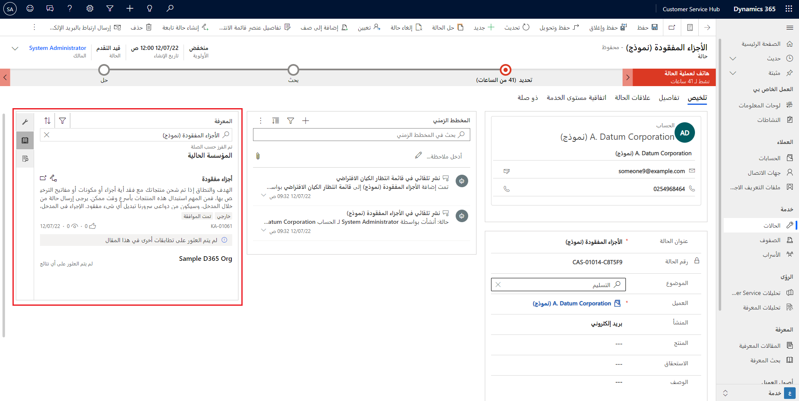

حتى الآن، كان التركيز على البحث والوصول إلى محتوى المعرفة الذي تم إنشاؤه وتخزينه في Dynamics 365 Customer Service. ومع ذلك، قد يكون لدى العديد من المؤسسات محتوى معرفي مخزن خارج مؤسسة Dynamics 365 الخاصة بها، مثل الملفات أو المستندات أو المقالات. على سبيل المثال، قد يتم تخزين خطوات استكشاف أخطاء أحد المعدات وإصلاحها في دليل استكشاف الأخطاء وإصلاحها الموجود على موقع SharePoint الخاص بمؤسستك. قد يكون توفير هذه المعلومات للمندوبين أثناء عملهم مع Dynamics 365 Customer Service أمراً لا يقدر بثمن.

لمساعدتك في تزويد الوكلاء بإمكانية الوصول إلى هذا المحتوى، يتضمن Dynamics 365 Customer Service القدرة على إضافة موفري البحث الذين يتصلون بالبيانات في مواقع أخرى. بعد إعداد موفري البحث، سيتم عرض النتائج جنباً إلى جنب مع نتائج البحث التي يتم توفيرها من خلال البحث في مقالة المعارف التقليدية.

يمكنك إعداد موفري البحث التاليين:

-   **البحث عبر المؤسسات** - يتيح لك البحث في المقالات المعرفية من مثيل Dynamics 365 مختلف.

-   **SharePoint** - يتيح لك البحث في المحتوى المخزن في موقع SharePoint في نفس المستأجر.

-   **موصل Microsoft Graph** - بالنسبة للمؤسسات التي تستخدم Microsoft Search بالفعل لفهرسة جميع البيانات الخارجية باستخدام Microsoft Graph.

يمكنك إعداد موفري البحث من خلال مركز مسؤولي Customer Service. للوصول إلى موفري البحث هؤلاء، حدد **معرفة** ضمن مجموعة 
**تجربة المندوب**، ثم حدد **إدارة** في قسم **موفري البحث**. حدد **جديد** لإضافة موفر بحث. ستحتاج إلى تحديد **الاسم** و **المالك** لكل موفر بحث.

> [!div class="mx-imgBorder"]
> 

> [!div class="mx-imgBorder"]
> 

في قسم **التفاصيل** ، حدد نوع مزود البحث الذي تريد استخدامه. بناءً على الموفر الذي تحدده، ستحتاج إلى تقديم مزيد من التفاصيل.

-   **البحث عبر المؤسسات** - ستحتاج إلى تحديد المؤسسة التي تريد تطبيقها. ستتم تعبئة قائمة المؤسسات المتاحة لتختار من بينها مسبقاً بناءً على المؤسسات المتوفرة في المستأجر الخاص بك.

-   **SharePoint** - يتطلب هذا الخيار منك إدخال **عنوان URL لـ SharePoint** الذي تريد الاتصال به. يجب أن يكون موقع SharePoint جزءاً من نفس المستأجر مثل مؤسسة Dynamics 365 التي تعمل بها حالياً.

-   **موصل Microsoft Graph** - تحتاج فقط إلى تحديد معرف الاتصال الفريد الذي تريد تطبيقه عند إنشاء الموصل. 
    لمزيد من المعلومات، راجع [نظرة عامة على موصلات Microsoft Graph للبحث في Microsoft](/microsoftsearch/connectors-overview/?azure-portal=true).

بعد قيامك بإعداد موفري البحث، يمكن للمندوب الذي يستخدم وظيفة البحث عرض الروابط في نتائج البحث الخاصة بهم لكل موفر بحث مضمن في مؤسسته الحالية.

> [!div class="mx-imgBorder"]
> 
