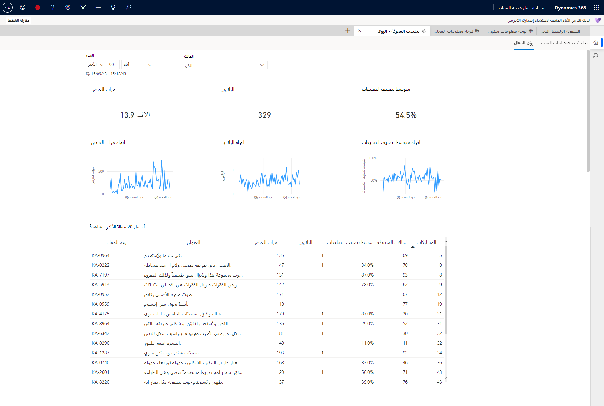
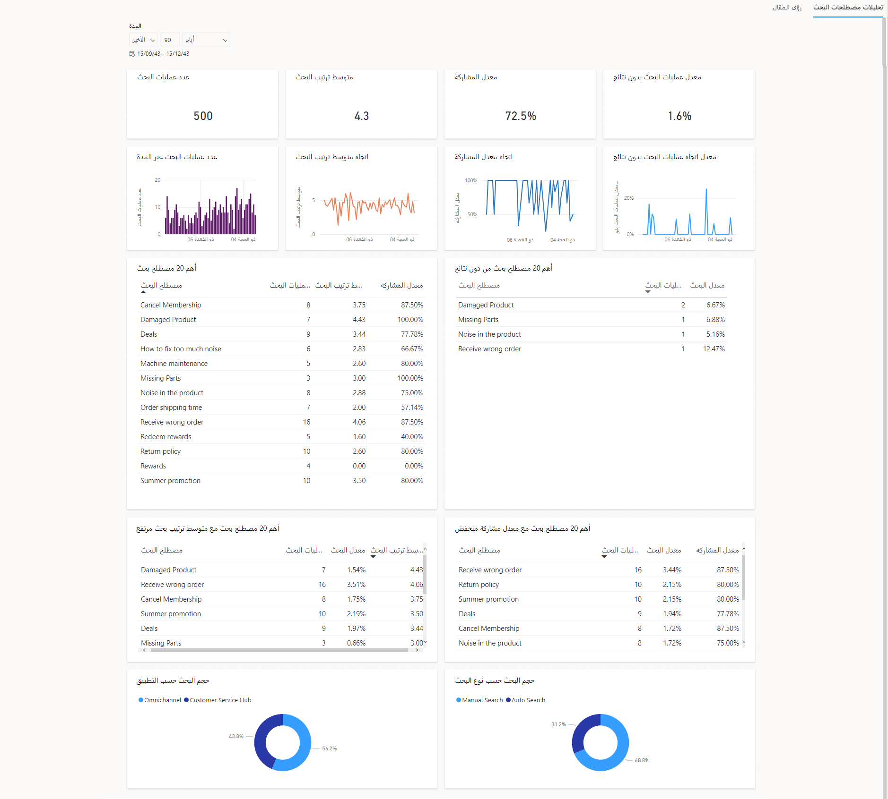
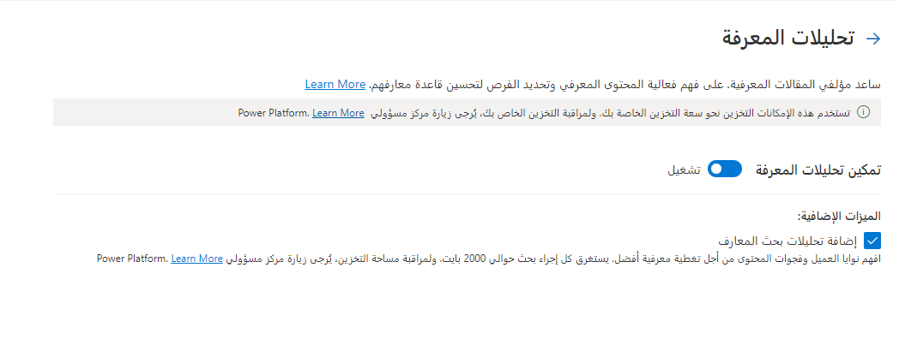

بإمكان المؤسسات أن تستثمر وقتاً طويلاً في بناء نظام إدارة المعرفة. تتضمن المهام الموجهة نحو الوقت لبناء النظام الوقت الذي يقضيه مؤلفو المحتوى في إنشاء المحتوى، والوقت المستثمر في التأكد من دقة هذا المحتوى ومن حصوله على الموافقة، والصيانة المعنية في إبقاء المحتوى حديثاً ووثيق الصلة. ومع كل الوقت المستثمر، من الأهمية بمكان أن يتم استهلاك المحتوى. بإمكان عناصر متعددة أن تؤثر في استهلاك المقالات، على سبيل المثال عندما لا تحتوي المقالات على محتوى وثيق الصلة، أو عندما لا يكون استهلاكها سهلاً، أو إذا كان العثور عليها صعباً.

تساعد تحليلات المعرفة المتوفرة في Dynamics 365 Customer Service على توفير رؤى مهمة حول كيفية استخدام المقالات المعرفية والبحث فيها. بإمكان المشرفين استخدام هذه الرؤى لتحسين نظام إدارة المعرفة لديهم. على سبيل المثال، عند تحليل مصطلحات البحث الفعلية الجاري استخدامها، قد تكتشف انخفاض العدد الفعلي للمقالات المقترحة. يمكنك إضافة كلمات أساسية أخرى أو مختلفة إلى مقالاتك للتأكد من أنه سيتم اقتراحها للمستخدمين أثناء بحثهم عن المحتوى.

تتضمن المقالات المعرفية الميزات التالية:

-   [رؤى المقال‬](/dynamics365/customer-service/knowledge-search-analytics-cs?azure-portal=true#article-insights) - تُظهر التأثير الذي تحدثه إدارة المعرفة.

-   [تحليلات مصطلحات البحث](/dynamics365/customer-service/knowledge-search-analytics-cs?azure-portal=true#search-term-analytics) - توفر رؤى مرتبطة بكيفية عثور المندوبين على المقالات المعرفية واستخدامها.

## رؤى المقال

بإمكان لوحة معلومات **رؤى المقال** مساعدة مؤلفي المحتوى المعرفي في مؤسستك على فهم التأثير الذي يمكن أن تحدثه إدارة المعرفة على تجربة الدعم الشاملة. وتتضمن لوحة المعلومات هذه أيضاً معلومات، مثل عدد مرات عرض المقال أو عدد مرات مشاركة المقال.

> [!div class="mx-imgBorder"]
> 

توفر لوحة معلومات **رؤى المقال** المقاييس التالية.

|     المقاييس أو المخطط        |     التعريف                                                                                                      |
|-----------------------------|---------------------------------------------------------------------------------------------------------------------|
|     طرق العرض                   |     العدد الإجمالي لمرات مشاهدة المقالات المعرفية.                                                          |
|     الزائرون                |     العدد الإجمالي للزائرين الفريدين الذين استعرضوا المقالات المعرفية.                                        |
|     تصنيف التعليقات         |     متوسط تصنيف التعليقات الذي يوفره مستهلكو المقالات المعرفية.                              |
|     المقالات الأكثر مشاهدةً    |     أفضل 20 مقالاً تم استخدامها، إلى جانب مقاييس الزائرين ومتوسط تصنيف التعليقات والحالات المرتبطة والمشاركات.    |
|     الحالات المرتبطة            |     العدد الإجمالي للحالات التي تم ربطها بالمقالات.                                                   |
|     المشاركات                  |     إجمالي عدد المرات التي قام فيها ممثل الدعم بمشاركة المقال.                               |
|     المالك (عامل التصفية)          |     مالك المقالة المعرفية.                                                                           |

## تحليلات مصطلحات البحث

يتولى مدراء المعرفة مسؤولية الحفاظ على عروض مقالات قاعدة المعارف الشاملة لمؤسستك وتحسينها. للمساعدة في هذه العملية، توفر لوحة معلومات **تحليلات مصطلحات بحث المعرفة** للمشرفين والعاملين في مجال المعرفة رؤى قيّمة حول كيفية عثور المندوبين على المقالات المعرفية واستخدامها. ومن خلال تحديد عمليات البحث ذات النتائج المنخفضة أو بدون نتائج، يمكنك تحديد الثغرات الموجودة في المحتوى وتعديل محتوى المقال لتحسين نتائج البحث وعرض المقالات الأكثر صلة.

> [!div class="mx-imgBorder"]
> 

تتضمن لوحة معلومات **تحليلات مصطلحات بحث المعرفة** المقاييس التالية.

|     مؤشرات الأداء الأساسية (KPI) أو المخطط                                       |     التعريف                                                                                                                                                    |
|---------------------------------------------------------|-------------------------------------------------------------------------------------------------------------------------------------------------------------------|
|     عدد عمليات البحث                                        |     إجمالي عدد عمليات البحث المستكملة خلال فترة معينة.                                                                                               |
|     عدد عمليات البحث خلال مدة معينة                          |     عدد عمليات البحث المستكملة خلال فترة زمنية معينة.                                                                                           |
|     اتجاه متوسط معدل البحث                            |     الاتجاه اليومي لمتوسط الموضع في القائمة للارتباط الذي حدده المستخدم عندما تم تقديمه مع نتائج البحث.                                      |
|     متوسط ترتيب البحث                                    |     متوسط موضع الارتباط الذي حدده المستخدم عندما تم تقديمه مع نتائج البحث.                                                                   |
|     معدل التفاعل                                     |     النسبة المئوية للأحداث التي تفاعل فيها المستخدم مع نتائج البحث مقارنة بأحداث البحث المقدمة مع النتائج.                            |
|     اتجاه معدل التفاعل                               |     الاتجاه اليومي للنسبة المئوية للأحداث التي تفاعل فيها المستخدم مع نتائج البحث مقارنة بأحداث البحث المقدمة مع النتائج.    |
|     معدل عمليات البحث بدون نتائج                        |     النسبة المئوية للمثيلات حيث لم يعرض المصطلح موضوع البحث أي نتائج.                                                                                       |
|     معدل اتجاه عمليات البحث بدون نتائج                    |     الاتجاه اليومي للنسبة المئوية لمثيلات البحث التي لم تعرض أي نتائج.                                                                     |
|     أهم 20 مصطلح بحث                                 |     أهم 20 مصطلحاً يتم البحث عنها، مع إظهار عدد مرات البحث ومتوسط معدل البحث ومعدل التفاعل.                                      |
|     أهم 20 مصطلح بحث بدون نتائج                 |     أهم 20 مصطلح بحث لم ينتج عنها نتائج عند البحث عنها.                                                                                             |
|     أهم 20 مصطلح بحث مع متوسط ترتيب بحث مرتفع    |     أهم 20 موضوع بحث حسب الحجم مع متوسط ​​موضع نقر أكبر من خمسة.                                                                     |
|     أهم 20 مصطلح بحث مع معدل مشاركة منخفض        |     أهم 20 موضوع بحث حسب الحجم مع معدل تفاعل أقل من 40 بالمائة.                                                                            |
|     حجم البحث حسب التطبيق                      |     النسبة المئوية لعمليات البحث في تطبيقات متعددة.                                                                                                    |
|     حجم البحث حسب نوع البحث                        |     النسبة المئوية لعمليات البحث استناداً إلى ما إذا كانت عمليات بحث يدوية أو تلقائية.                                                                         |

## تمكين تحليلات المعرفة

يمكنك تمكين لوحة معلومات **تحليلات بحث المعرفة‬** في مركز مسؤولي Customer Service‬. يمكنك الوصول إلى الصفحة **تحليلات المعرفة‬** عن طريق الانتقال إلى **العمليات** وتحديد **الرؤى**. بعد تشغيل مفتاح التبديل **تمكين تحليلات المعرفة**، يمكنك أيضاً تحديد الخيار **إضافة تحليلات بحث المعرفة**.

> [!div class="mx-imgBorder"]
> 

بعد تمكين تقارير تحليلات المعرفة، يمكنك الوصول اليها في واجهات مستخدم مركز خدمة العملاء وCustomer Service workspace.

-   **مركز خدمة العملاء** - انتقل إلى صفحة **الخدمة > الرؤى > تحليلات المعرفة**.  تظهر رؤى مصطلح البحث.

-   **Customer Service workspace** - على علامة تبويب **التطبيق**، حدد **تحليلات المعرفة**.
