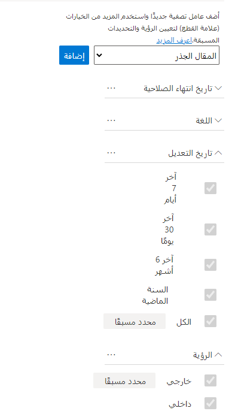
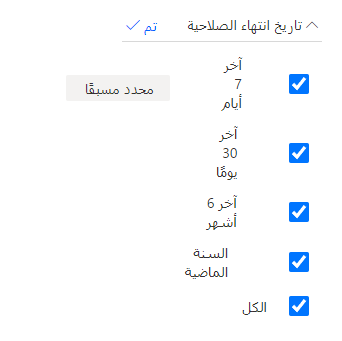
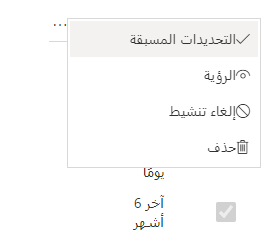
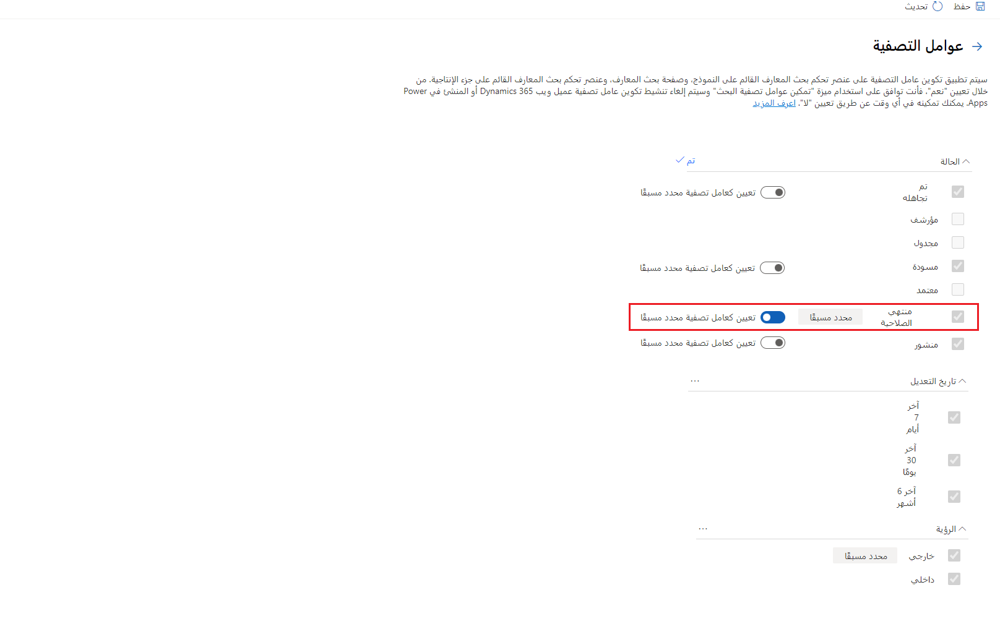
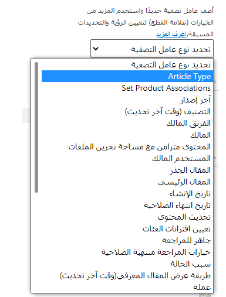

بينما يبحث المندوبون عن محتوى معرفي، سترغب في التأكد من قدرتك على تزويدهم بأبسط تجربة ممكنة. من شأن تمكين التصفية أن يؤدي إلى تحسين هذه العملية بشكل ملحوظ. على سبيل المثال، قد يرغب المندوبون في تصفية المقالات فقط لعرض المقالات بلغة معينة أو فقط لعرض المحتوى الذي تم تحديثه خلال الأيام الكثيرة الماضية.

في Dynamics 365 Customer Service، يمكنك تشغيل ميزة تصفية البحث لتزويد المندوبين بخيارات تصفية مختلفة. وبعد تمكين هذه الميزة، يمكنك تحديد تكوينات التصفية التي تريد استخدامها.

في مركز مسؤولي Microsoft Dynamics 365 Customer Service، يمكنك تمكين عوامل تصفية البحث من صفحة **عوامل التصفية**، والتي يمكنك الوصول إليها عن طريق تحديد **المعرفة** ضمن **تجارب المندوب**. الخياران اللذان يمكنك تشغيلهما هما:

-   **تمكين عوامل تصفية البحث‬** - يشغّل هذا الخيار القدرة على استخدام عوامل تصفية البحث في البيئة الحالية.

-   **السماح للمندوب بالتخصيص‬** - يقوم هذا الخيار بتشغيل قدرة المندوبين على تخصيص عوامل التصفية في مختلف واجهات مستخدم خدمة العملاء.

يمكنك استخدام الحقول الموجودة في جدول المقالات المعرفية كعامل تصفية بحث جاهز. على سبيل المثال، يمكنك إضافة الحقلين **تاريخ التعديل** أو **تاريخ الإنشاء**. سيتضمن كل حقل خيارات مختلفة سيتم تقديمها كخيارات تصفية، مثل **آخر 7 أيام** أو **آخر 30 يوماً** أو **آخر 6 أشهر** أو **السنة الماضية‬**، وسيكون المندوب قادراً على تحديدها عند تصفية المقالات.

علاوةً على ذلك، يمكنك تحديد عوامل التصفية على الحقول التي تحتوي على أنواع البيانات التالية:

-   مجموعة خيارات

-   مجموعة خيارات متعددة التحديدات

-   البحث

-   خياران

-   التاريخ والوقت

> [!div class="mx-imgBorder"]
> 

سيكون لكل عامل تصفية تحدده خيارات يمكنك تعديلها. وستؤثر هذه الخيارات على عوامل التصفية المتاحة للتفاعل معها والخيار المحدد بشكل افتراضي. للوصول إلى الخيارات الخاصة بكل عامل تصفية، حدد الزر **مزيد من الخيارات**.

بالاستناد إلى عنصر تحكم عامل التصفية الذي حددته، قد يظهر أي خيار من الخيارات التالية:

-   **التحديدات المسبقة‬** - يحدد الخيار من ضمن الخيارات المتوفرة لعامل التصفية هذا الذي سيتم تحديده بشكل افتراضي في تجربة المندوب. يمكنك الحصول على خيار واحد فقط محدد مسبقاً للتحكم.

-   **الرؤية** - يحدد الخيار من ضمن الخيارات المتوفرة لعامل التصفية الذي سيتم عرضه في تجربة المندوب.‬

-   **إلغاء التنشيط** - يلغي تنشيط عامل التصفية في تجربة المندوب.

-   **حذف** - يزيل عامل التصفية من قائمة عوامل التصفية المتوفرة.

تُظهر الصورة التالية مثالاً عن خيار الرؤية حيث يمكنك التحكم في اختيار عوامل تصفية البيانات التي سيتم استخدامها لعامل تصفية **تاريخ انتهاء الصلاحية** الذي تمت إضافته إلى العنصر.

> [!div class="mx-imgBorder"]
> 

لجعل قيمة عامل تصفية متوفرة بشكل افتراضي، حدد علامة الحذف (**...**) إلى جانب عنصر عامل التصفية، ثم حدد **التحديدات المسبقة‬**.

> [!div class="mx-imgBorder"]
> 

شغّل مفتاح التبديل **تعيين كعامل تصفية محدد مسبقاً** بحيث يظهر الخيار **محدد مسبقاً**  إلى جانب اسم عامل التصفية، ثم حدد **تم**. ستشارك القيم المعينة باعتبارها محددة مسبقاً في عملية التصفية بشكل تلقائي دون مطالبة المندوب بتحديدها يدوياً. يمكنك أن تحدد بشكل مسبق فقط القيم التي تم جعلها مرئية.

> [!div class="mx-imgBorder"]
> 

## تمكين الحقول المخصصة كعوامل تصفية البحث

في أحيان كثيرة، ستضيف المؤسسات حقولاً مخصصة إلى مقالاتها المعرفية. ويمكن استخدام هذه الحقول لتقديم المزيد من خيارات التصنيف أو لأسباب أخرى كثيرة. على سبيل المثال، قد تضيف حقلاً يسمى **نوع المقال** لمساعدتك في جمع معاً المقالات المتعلقة باستكشاف الأخطاء وإصلاحها، بدلاً من المقالات الإرشادية. في السيناريوهات التي تمت فيها إضافة حقول مخصصة إلى المقالات لدعم احتياجات المؤسسة، يمكنك استخدام هذه الحقول كعوامل تصفية بحث مخصص.

لإتاحة حقل كعامل تصفية بحث مخصص، ستحتاج إلى إضافته إلى طريقة عرض **البحث السريع عن المقالات المعرفية النشطة‬**. تساعد طريقة العرض هذه على جعل البحث عن السجلات أكثر سهولة. يمكنك تعديل طريقة عرض **البحث السريع** من [Microsoft Power Apps Maker Portal](https://make.powerapps.com/?azure-portal=true). في Power Apps Maker Portal، انتقل إلى **البيانات** (*قد يكون Dataverse*) > **الجداول > مقالة معرفية**.

> [!div class="mx-imgBorder"]
> 

حدد موقع طريقة العرض **البحث السريع عن المقالات المعرفية النشطة‬**، ثم أضف الحقل الذي تريد إضافته في طريقة العرض. تُظهر الصورة التالية أنه تمت إضافة حقل مخصص يسمى **نوع المقال** إلى طريقة العرض.

> [!div class="mx-imgBorder"]
> 

بعد أن تضيف الحقل المخصص إلى طريقة عرض البحث السريع، سيصبح متوفراً من قائمة أنواع عوامل التصفية عندما تقوم بإعداد عوامل التصفية.

> [!div class="mx-imgBorder"]
> 
