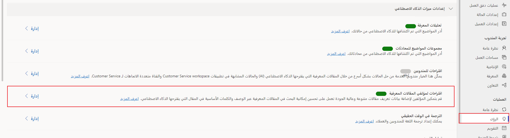
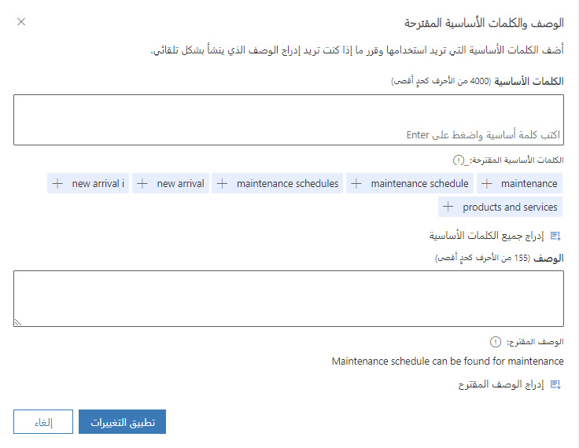

عندما يبحث المندوبون عن المقالات، سيبحث النظام عن عناوين المقالات، والكلمات الأساسية والأوصاف المحددة في المقالات، للعثور على أفضل المقالات لاقتراحها. وأثناء قيامك بإنشاء مقالات معرفية، تأكد من توفير الأوصاف والكلمات الأساسية الصحيحة والدقيقة للمساعدة في تسهيل تحديد موقع المقالات للمستخدمين الذين يبحثون عن المحتوى. على سبيل المثال، قد يبحث المستخدم عن المقالات عن طريق إدخال كلمة **طابعة** في مربع البحث. وبينما تكتب المحتوى، قد تجد صعوبة في التأكد من أن الأوصاف والكلمات الأساسية التي تحددها هي الأنسب، ومن أنها ستسمح للمستخدمين بتحديد موقع المقال بشكل فعال.

يتضمن Dynamics 365 Customer Service القدرة التي تسمح لك بتطبيق الذكاء الاصطناعي لتقديم اقتراحات للأوصاف والكلمات الأساسية في المقالات. بإمكان هذه الاقتراحات أن تساعد مؤلفي المحتوى في تحديد الأوصاف والكلمات الأساسية الصحيحة عند كتابة المحتوى، مما سيساعد في تحسين إنتاجيتهم.

تساعد ميزة اقتراح الذكاء الاصطناعي‬ في الأمور التالية:

-   مساعدة المؤلفين من خلال اقتراح الأوصاف والكلمات الأساسية استناداً إلى محتوى المقال المخزن في كيان المقالة المعرفية المضمّنة.

-   تمكين المسؤولين من تحديد حقول البيانات المصدر (نص فقط) التي سيستخدمها نموذج الذكاء الاصطناعي. الحقلان الافتراضيان هما **العنوان** بالإضافة إلى **المحتوى**.

بإمكان المؤسسات تمكين اقتراحات الذكاء الاصطناعي للأوصاف والكلمات الأساسية في مركز مسؤولي Customer Service. ويمكنك تمكين هذه الاقتراحات من مجموعة **العمليات** عن طريق الانتقال إلى **الرؤى** وتحديد **إدارة** إلى جانب **اقتراحات لمؤلفي المقالات المعرفية‬**.

> [!div class="mx-imgBorder"]
> 

يتم تقديم الاقتراحات بالاستناد إلى عنوان المقال ومحتواه. بشكل افتراضي، يتم تعيين هذين الحقلين إلى حقلي **العنوان** و **المحتوى** على المقال. إذا كنت بصدد استيعاب المقالات، فيمكنك التعيين إلى عنوان URL المستوعب للمقال لأي من الحقلين.

## اقتراحات الذكاء الاصطناعي للأوصاف والكلمات الأساسية في المقالات المعرفية

ستتوفر الاقتراحات للمؤلفين أثناء قيامهم بإنشاء مقالات معرفية، بعد تمكينها. يظهر مربع الحوار **عرض الوصف والكلمات الأساسية المقترحة‬**  عند تحديث حقل محتوى المقال وحفظ المقالة المعرفية. وعندما يحدد المؤلفون الزر **عرض**، سيظهر لهم مربع حوار يتضمن كلمات أساسية مقترحة ووصفاً.

> [!div class="mx-imgBorder"]
> 

بالاستناد إلى المحتوى الذي تم تحليله، سيظهر عدد كبير من اقتراحات الكلمات الأساسية. ويمكنك تحديد الكلمات الأساسية الفردية التي تريدها، أو يمكنك إدراج جميع الكلمات الأساسية المقترحة. يقتصر إجمالي عدد الأحرف في الكلمات الأساسية على 4,000 حرف. وسيتم تزويدك بوصف واحد مقترح. يمكنك تحرير الوصف قبل تطبيق التغييرات المقترحة. يقتصر إجمالي عدد الأحرف في الأوصاف على 155 حرفاً، بما في ذلك المسافات.

> [!IMPORTANT]
> يحتاج النموذج إلى أول 2,200 حرف لإنشاء الاقتراحات. للحصول على اقتراحات جيدة، ننصح المؤلفين بتقديم وصف للمشكلة التي يجب حلها في أول 2,200 حرف في مقالاتهم.

لمزيد من المعلومات، راجع [تكوين اقتراحات الذكاء الاصطناعي لوصف المقال وكلماته الأساسية](/dynamics365/customer-service/configure-ai-suggested-article-keywords-description?tabs=customerserviceadmincenter/?azure-portal=true).
