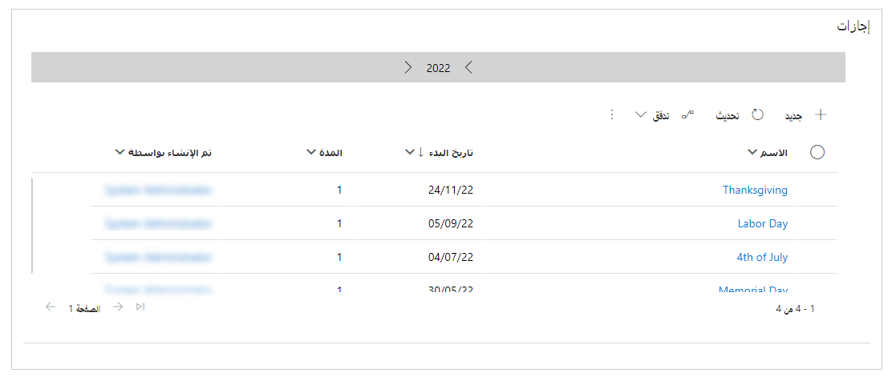
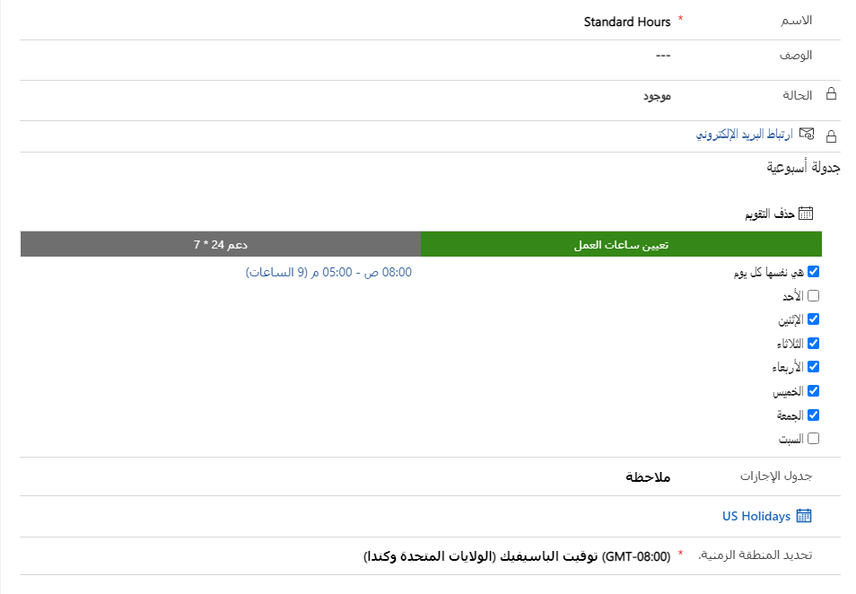

عندما تبدأ مؤسسة في تصميم اتفاقيات SLA لتفي بمتطلبات ‏‫مؤشر الأداء الأساسي (KPI)‬، يجب مراعاة الساعات التي تقدم فيها عادةً الدعم لعملائها. على سبيل المثال، فكر في مؤسسة مفتوحة من الاثنين إلى الجمعة، من 8:00 صباحاً إلى 5:00 مساءً.

- والساعات القياسية هي 8:00 صباحاً إلى 5:00 مساءً، حيث يمكن لمعظم العملاء الاتصال لتلقي الدعم.

- إذا قام العميل بشراء اتفاقية دعم، فقد يحق له الحصول على دعم يومي كامل.

عند فتح حالة، من المهم تحديد الساعات التي يجب أن تكون الحالة مرتبطة خلالها، وتطبيق اتفاقية SLA المناسبة. لإنجاز هذه المهمة، تأكد من تحديد جداول العمل المختلفة التي تتطلبها مؤسستك. مراعاة عوامل مثل متطلبات المنطقة الزمنية وأوقات إغلاق الأعمال لقضاء العطلات.

## تقويم الإجازة

يمكنك إنشاء تقويم الإجازة وإضافته إلى جدول الخدمة بحيث لا تؤثر عمليات إغلاق الاعمال المخططة على اتفاقيات SLA. في مركز مسؤولي Customer Service، يمكنك إعداد جداول الإجازات عن طريق الانتقال إلى **التقويم** وتحديد **تقويم الإجازة**. عندما تقوم بإنشاء تقويم إجازة لأول مرة، فتأكد من تعيين اسم له، مثل **إجازات الولايات المتحدة**. إذا كانت مؤسستك تدعم العملاء في بلدان متعددة، فقم بمراعاة الإجازات المختلفة في كل منها. يجب التأكد من إعداد جداول الإجازات الضرورية لكل بلد أو منطقة تدعمها.

بعد إنشاء تقويم الإجازة، يمكنك البدء في إضافة الإجازات إليه. في العادة، تتضمن الإجازة المعلومات الآتية:

- **الاسم** - اسم الإجازة

- **تاريخ البدء** - تاريخ بدء الإجازة

- **تاريخ الانتهاء** - تاريخ نهاية الإجازة

- **المدة** - المدة الإجمالية للإجازة

على سبيل المثال، إذا كانت مؤسستك ستغلق في عيد رأس السنة لعام 2023، فإليك كيفية إعداد الإجازة:

- **الاسم** - عيد رأس السنة لعام 2023

- **تاريخ البدء** - 1/1/2023

- **تاريخ الانتهاء** - 1/1/2023

- **المدة** - يوم واحد

ستحتاج لتحديد كل إجازة، لذلك في عيد رأس السنة الجديدة، يمكنك إضافة عيد رأس السنة كإجازة في عام 2023 و2024 و2025 وما إلى ذلك.

يمكنك إضافة أيام الإجازات الفردية، أو يمكنك إضافة أيام إجازات متعددة عن طريق استيرادها من ملف Microsoft Excel وإقرانها بتقويم الإجازة المناسب. بشكل عام، الإجازات هي الأيام الأولى التي تقوم بإعدادها.

> [!div class="mx-imgBorder"]
> 

لمزيد من المعلومات، راجع [إنشاء وإدارة جداول الإجازات](/dynamics365/customer-engagement/customer-service/set-up-holiday-schedule?azure-portal=true).

## تقويم "خدمة العملاء"

مهمتك التالية هي إعداد ساعات العمل المختلفة التي قد تستخدمها اتفاقيات SLA المحتملة. تقوم عادةً بتحديد هذه المعلمة بعد جداول الإجازات، لأنه يمكنك ربط تقويم الخدمة بتقويم الإجازات. في مركز مسؤولي Customer Service، يمكنك تحديد ساعات العمل عن طريق الانتقال إلى **التقويم** وتحديد **تقويم خدمة العملاء**.

عند تحديد ساعات العمل لتقويم خدمة العملاء، يمكنك تحديد الخيارات التالية:

- **هي نفسها لكل يوم** - حدد خانة الاختيار هذه لتعيين ساعات العمل لتكون نفسها لكل يوم. يتيح لك اختيار ساعات العمل تحديد ساعات العمل، بما في ذلك فترات الراحة.

  إذا لم تقم بتحديد **هي نفسها لكل يوم**، فستتمكن من تحديد الساعات لكل يوم على حدى.

- **جدول الإجازات** - حدد ما إذا كان تقويم الخدمة هذا يراعي تقويمات الإجازات. إذا قمت بتحديد مراعاة الإجازات، يمكنك تحديد جدول الإجازات لاستخدامه.

- **المنطقة الزمنية** - حدد المنطقة الزمنية لتقويم الخدمة.

> [!div class="mx-imgBorder"]
> 

من المحتمل أن يكون لمؤسستك عدة تقاويم لخدمة العملاء تم تحديدها بالفعل. السيناريو الشائع هو أن يكون للمؤسسة تقويمان على الأقل:

- **القياسي** - التقويم مع ساعات العمل المحددة من الاثنين إلى الجمعة من 8:00 صباحاً إلى 5:00 مساءً. يراعي هذا النوع من التقويم جدول الإجازات في الولايات المتحدة.

- **24/7** - التقويم مع ساعات العمل المحددة طوال اليوم، كل يوم ولا يراعي جداول الإجازات.

يمكنك كذلك الحصول على تقويمات تمثل مختلف البلدان التي تقدم الدعم فيها. على سبيل المثال، عادةً ما يكون أسبوع العمل في دبي من الأحد إلى الخميس. إذا كنت تدعم العملاء في دبي، فستحتاج إلى إعداد تقاويم خدمة أخرى لدبي مع أسابيع العمل من الأحد إلى الخميس أيضاً.

للمزيد من المعلومات، راجع [إنشاء جدول خدمة العملاء وتحديد ساعات العمل](/dynamics365/customer-engagement/customer-service/create-customer-service-schedule-define-work-hours?azure-portal=true).

بعد قيامك بإعداد جميع تقويمات الخدمة الضرورية لمؤسستك، يمكنك البدء في تحديد اتفاقيات مستوى الخدمة في التطبيق.
