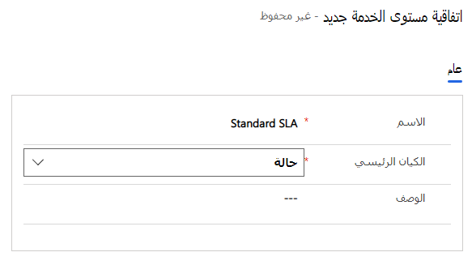

قبل أن تتمكن من إنشاء اتفاقية مستوى الخدمة (SLA)، ستحتاج إلى إنشاء مؤشرات الأداء الأساسية التي سيتم استخدامها في اتفاقية مستوى الخدمة. يمكنك استخدام مؤشرات الأداء الرئيسية لاتفاقية مستوى الخدمة لقياس عوامل، مثل مدى سرعة وصول المندوبين إلى العملاء أو مدى سرعة حل الحالات. على سبيل المثال، يمكنك استخدام **الاستجابة الأولى حسب** مؤشر الأداء الأساسي لقياس ما إذا كان المندوبون يستجيبون لطلبات خدمة العملاء في الوقت المناسب.

## إنشاء مؤشرات الأداء الأساسية لاتفاقيات مستوى الخدمة

بشكل افتراضي، لا يتم تحديد مؤشرات أداء أساسية لاتفاقيات مستوى الخدمة في التطبيق. ستحتاج إلى تحديد أي منها، مثل **الاستجابة الأولى** أو **الحل حسب**، الذي ترغب في تتبعه. وبعد تحديد مؤشرات الأداء الأساسية لاتفاقيات مستوى الخدمة، ستكون متاحة لتحديدك أثناء تحديد عناصر بنود SLA لاحقاً.

يمكنك إنشاء مؤشرات الأداء الأساسية لاتفاقيات مستوى الخدمة من مركز مسؤولي Customer Service بالانتقال إلى **شروط الخدمة** من مجموعة **العمليات** وتحديد **إدارة** في قسم **مؤشرات الأداء الأساسية لاتفاقيات مستوى الخدمة**.

عند تحديد مؤشر الأداء الأساسي لاتفاقية مستوى الخدمة، ستحتاج إلى تحديد التفاصيل التالية:

-   **الاسم** - يحدد اسم مؤشر الأداء الأساسي لاتفاقية مستوى الخدمة، الذي سيتم استخدامه لتحديد هذه الاتفاقية في التطبيق.

-   **المالك** - يحدد مالك العنصر. بشكل افتراضي، يتم تعيينه إلى الشخص الذي يقوم بإنشاء العنصر، ولكن يمكنك تغييره.

-   **اسم الكيان** - يحدد جدول Microsoft Dataverse الذي سيتم إقران مؤشر الأداء الأساسي به، مثل جدول الحالة.

-   **حقل مؤشر الأداء الأساسي** - يحدد حقل مؤشر الأداء الأساسي، الذي سيتم استخدامه لهذا العنصر. 
    على سبيل المثال، إذا كنت تنشئ مؤشر الأداء الأساسي لاتفاقية مستوى الخدمة لتحديد الوقت الذي يجب إرسال فيه الاستجابة الأولى إلى العميل، فحدد **FirstResponseByKPI** في القائمة. بشكل جاهز، يتضمن جدول الحالة خيارين يمكنك الاختيار من بينهما: **FirstREsponseByKPI** و **ResolveByKPI**.

-   **متاح من** - يحدد الحقل الذي سيتم استخدامه لقياس أوقات التحذير والفشل.

يمكنك تعيين حقل **متاح من** إلى أي حقل تاريخ مقترن بهذا الكيان، مثل **تاريخ الإنشاء** أو **تاريخ التعديل**. يحدد هذا الحقل متى يجب أن يبدأ حساب مؤشرات الأداء الأساسية لاتفاقيات مستوى الخدمة.

على سبيل المثال، ضع في اعتبارك سيناريو تريد فيه الحصول على اتفاقية مستوى الخدمة مع تحديد **الاستجابة الأولى حسب مؤشر الأداء الأساسي** لمدة أربع ساعات:

-   إذا قمت بتعيين حقل **متاح من** إلى **تاريخ الإنشاء**، سيكون لدى المندوب الذي يأخذ الحالة أربع ساعات من التاريخ والوقت الذي تم فيه إنشاء الحالة لإجراء استجابة أولى مع العميل.

-   إذا قمت بتعيين حقل **متاح من** إلى **تاريخ التعديل**، ثم كلما تم تحديث سجل الحالة، فسيُعاد تشغيل مؤقت **الاستجابة الأولى حسب مؤشر الأداء الأساسي**.

على الرغم من أن استخدام حقل **تاريخ التعديل** يمكن أن يكون مفيداً في بعض الحالات، إلا أنه ليس محفزاً مثالياً لتتبع مؤشر الأداء الأساسية للاستجابة الأولى. انتبه جيداً لما تقوم بتعيين حقل **متاح من** إليه لأنه يمكن أن يكون له تأثير كبير على كيفية حساب مؤشرات الأداء الأساسية.

> [!div class="mx-imgBorder"]
> 

بعد تحديد مؤشر الأداء الأساسي لاتفاقية مستوى الخدمة، ستحتاج إلى تنشيطه حتى يمكن استخدامه في اتفاقيات مستوى الخدمة.

## إنشاء اتفاقيات مستوى الخدمة

يمكنك إنشاء اتفاقيات مستوى الخدمة لتتبع وقياس مؤشرات أداء أساسية محددة بناءً على هوية العميل والتفاصيل الخاصة بالحالة. يتم إنشاء اتفاقيات مستوى الخدمة على مستوى المؤسسة وليست خاصة بالعميل الفردي. يمكنك تطبيق اتفاقيات مستوى الخدمة على حالات العملاء من خلال ربط الحالة يدوياً باتفاقية مستوى خدمة محددة أو عن طريق إرفاق الحالة باستحقاق له اتفاقية مستوى خدمة معينة مقترنة به. بشكل عام، ستحدد اتفاقية مستوى الخدمة الافتراضية لمؤسسة سيتم تطبيقها تلقائياً في الحالات، التي لم يتم فيها تحديد اتفاقية مستوى الخدمة للحالة.

بعد إنشاء تقويمات Customer Service ومؤشرات الأداء الأساسية لاتفاقيات مستوى الخدمة الضرورية، يمكنك البدء في إنشاء اتفاقيات مستوى الخدمة في مركز مسؤولي Customer Service عن طريق تحديد **إدارة** في قسم **اتفاقيات مستوى الخدمة (SLAs)** في **شروط الخدمة**.

تعمل اتفاقيات مستوى الخدمة كحاوية لعناصر اتفاقية مستوى الخدمة الفردية، التي ستحدد مؤشر الأداء الأساسي لاتفاقية مستوى الخدمة، الذي يتم استخدامه جنباً إلى جنب مع معايير النجاح. في البداية عند تحديد اتفاقية مستوى الخدمة، ستحتاج إلى تقديم التفاصيل التالية:

-   **الاسم** - يحدد اسم اتفاقية مستوى الخدمة.

-   **الكيان الأساسي** - يحدد جدول Dataverse، الذي ستنطبق اتفاقية مستوى الخدمة عليه.

> [!div class="mx-imgBorder"]
> 

بعد تحديد المعلومات السابقة، يمكنك حفظ اتفاقية مستوى الخدمة. عن طريق حفظ اتفاقية مستوى الخدمة، يمكنك إضافة عناصر اتفاقية مستوى الخدمة إليها. تناقش الوحدة التالية كيفية تحديد عناصر اتفاقية مستوى الخدمة (SLA).
