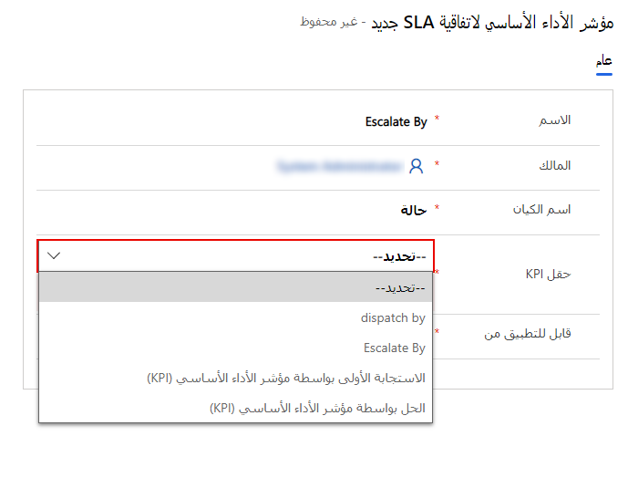

بينما يتم إعداد جدول الحالة عادةً للاستخدام مع اتفاقيات مستوى الخدمة بشكل افتراضي، يتيح لك Dynamics 365 استخدام وظيفة اتفاقية مستوى الخدمة مع أي جدول تختاره.

يمكنك تمكين اتفاقيات مستوى الخدمة لكيانات أخرى في Dynamics 365 لعدة أسباب مختلفة، مثل:

-   **العملاء المتوقعون** - تتبع مدى سرعة عودة المديرين التنفيذيين للحسابات إلى العملاء المتوقعين الجدد.

-   **أوامر العمل** - تتبع مدى سرعة جدولة أوامر العمل وإرسالها.

-   **الفرص** - تتبع مدى سرعة إغلاق أنواع معينة من الفرص.

بالإضافة إلى ذلك، يمكنك تحديد مؤشرات أداء رئيسية مخصصة لأي جدول تم تمكينه لاتفاقيات مستوى الخدمة. يمكنك تمكين الجداول لاتفاقيات مستوى الخدمة من خلال [Microsoft Power Apps ‏maker portal](https://make.powerapps.com/?azure-portal=true). في مدخل Power Apps، قم بتوسيع **البيانات** (*قل ربما Dataverse*)، ثم حدد الجدول الذي تريد تمكينه لاتفاقيات مستوى الخدمة. عندما تكون في الجدول، انتقل إلى **الإعدادات > الإعدادات المتقدمة > اجعل هذا الجدول خياراً عندما**. حدد مربع الاختيار **إعداد اتفاقيات مستوى الخدمة** لتمكينه. بعد تمكين الإعداد، احفظ التغييرات في الجدول.

> [!div class="mx-imgBorder"]
> 

لمزيد من المعلومات، راجع [تحديد اتفاقيات مستوى الخدمة](/dynamics365/customer-engagement/customer-service/define-service-level-agreements?azure-portal=true#entities-record-types-that-support-sla) و[إضافة مؤقت في النماذج لتتبع الوقت مقابل اتفاقيات مستوى الخدمة المحسّنة](/dynamics365/customer-engagement/customer-service/add-timer-forms-track-time-against-enhanced-sla?azure-portal=true).

## إنشاء مؤشرات أداء أساسية مخصصة

لقد تعلمت سابقاً كيفية إعداد مؤشرات الأداء الأساسية لاتفاقيات مستوى الخدمة لجدول الحالة باستخدام اثنين من مؤشرات الأداء الأساسية المتوفرة لجدول الحالة افتراضياً: **الاستجابة الأولى حسب مؤشر الأداء الأساسي** و **الحل بواسطة مؤشر الأداء الأساسي**.

ومع ذلك، قد تكتشف أن هناك حاجة إلى مزيد من مؤشرات الأداء الاساسية لجدول الحالة وأي جدول تم تمكينه لاتفاقيات مستوى الخدمة.

استناداً إلى الأمثلة المذكورة سابقاً، تتضمن بعض مؤشرات الأداء الأساسية المخصصة التي قد تقوم بإعدادها ما يلي:

-   **مؤشر الأداء الأساسي للاتصال الأولي بالعميل المتوقع** - مؤشر الأداء الاساسي لقياس الوقت الذي يقوم فيه مسؤول الحساب التنفيذي بإجراء أول اتصال أولي مع عميل متوقع.

-   **إرسال أوامر العمل حسب مؤشر الأداء الأساسي** - مؤشر الأداء الأساسي لقياس وقت وضع علامة على أمر العمل كمجدول.

-   **إغلاق الفرصة بواسطة مؤشر الأداء الأساسي** - مؤشر الأداء الأساسي لقياس وقت إغلاق فرصة.

يمكنك تحديد مؤشرات أداء أساسية مخصصة عن طريق إنشاء عمود بحث (علاقة 1:N) باستخدام جدول مثيل مؤشر الأداء الأساسي لاتفاقية مستوى الخدمة. يمكنك إنشاء هذه الحقول لجداول محددة من Power Apps ‏maker portal بالانتقال إلى الجدول الذي تريد تحديد مؤشر الأداء الأساسي له، ثم تحديد **الأعمدة**.

بعد ذلك، يمكنك إنشاء عمود بحث جديد لهذا الجدول وتعيين حقل البحث لاستخدام جدول مثيلات مؤشرات الأداء الأساسية لاتفاقيات مستويات الخدمة.

> [!div class="mx-imgBorder"]
> 

لمزيد من المعلومات، راجع [إنشاء حقول مؤشرات الأداء الأساسية لاتفاقيات مستوى الخدمة](/dynamics365/customer-engagement/customer-service/add-timer-forms-track-time-against-enhanced-sla?azure-portal=true#create-sla-kpi-fields) و[إنشاء نماذج طرق عرض سريعة لكيان مثيل مؤشر الأداء الأساسي لاتفاقية مستوى الخدمة](/dynamics365/customer-engagement/customer-service/add-timer-forms-track-time-against-enhanced-sla?azure-portal=true#create-quick-view-forms-for-the-sla-kpi-instance-entity).

بعد تحديد مؤشر الأداء الأساسي، سيكون متاحاً لك لتحديده كحقل مؤشر الأداء الأساسي عند إنشاء مؤشر أداء أساسي لاتفاقية مستوى الخدمة يكون جديداً ومرتبطاً بهذا الجدول.

> [!div class="mx-imgBorder"]
> 
