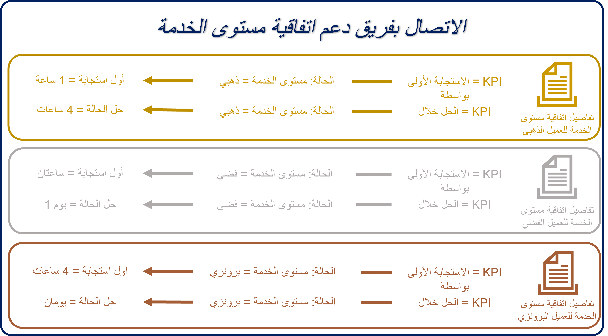

يمكنك استخدام عناصر اتفاقية مستوى الخدمة لتحديد مؤشرات الأداء الأساسية التي تريد قياسها ومتى يتم تطبيق مؤشر أداء أساسي لاتفاقية مستوى خدمة محدد. قد تحتوي اتفاقية مستوى الخدمة النموذجية على العديد من عناصر اتفاقية مستوى الخدمة المحددة لها.

على سبيل المثال، قد تحتوي اتفاقية مستوى الخدمة **لعميل عقد الدعم** على عناصر اتفاقية مستوى الخدمة التالية.

> [!div class="mx-imgBorder"]
> 

- **الاستجابة الأولى للعميل الذهبي حسب** - إذا كانت حالة **مستوى الخدمة** = 
  ***ذهبي**، فيجب أن تتم _ *الاستجابة الأولى** خلال **_ساعة واحدة_**.

- **حل العميل الذهبي حسب** - إذا كانت حالة **مستوى الخدمة** = **_ذهبي_**، فيجب أن يتم **حل الحالة** خلال **_أربع ساعات_**.

- **الاستجابة الأولى للعميل الفضي حسب** - إذا كانت حالة **مستوى الخدمة** = 
  ***فضي** _، فيجب أن تتم_ *الاستجابة الأولى** خلال **_ساعتين_**.

- **حل العميل الفضي حسب** - إذا كانت حالة **مستوى الخدمة** = **_فضي_**، فيجب أن يتم **حل الحالة** خلال **_يوم واحد_**.

- **الاستجابة الأولى للعميل البرونزي حسب** - إذا كانت حالة **مستوى الخدمة** = 
  ***برونزي** _، فيجب أن تتم_ *الاستجابة الأولى** خلال **_أربع ساعات_**.

- **حل العميل البرونزي حسب** - إذا كانت حالة **مستوى الخدمة** = **_برونزي_**، فيجب أن يتم **حل الحالة** خلال **_يومي عمل_**.

في المثال السابق، ستتم إضافة كل مؤشر أداء أساسي تريد تتبعه لكل طبقة مستوى خدمة إلى اتفاقية مستوى الخدمة كعنصر اتفاقية مستوى الخدمة الخاص بها. لتتبع الاستجابة وحل التقدم لعملاء المستوى **الذهبي**، يلزمك تحديد عنصرين تفصيليين منفصلين. في هذه الحالة، سيكون لاتفاقية مستوى الخدمة بأكملها ستة عناصر محددة لاتفاقية مستوى الخدمة.

بالنسبة لكل عنصر من عناصر اتفاقية مستوى الخدمة تضيفه إلى اتفاقية مستوى الخدمة، ستحتاج إلى توفير المعلومات التالية:

- **الاسم** - يحدد اسم عنصر اتفاقية مستوى الخدمة. *(هذا الحقل مطلوب.)*

- **مؤشر الأداء الأساسي** - يحدد مؤشر الأداء الأساسي لاتفاقية مستوى الخدمة الذي تقيسه. على سبيل المثال، يمكنك تحديد مؤشرات الأداء الأساسية لاتفاقيات مستوى خدمة **الاستجابة الأولى حسب** أو **الحل حسب** التي حددتها سابقاً.

- **السماح بالإيقاف المؤقت والاستئناف** - يحدد ما إذا كان يمكن إيقاف مؤقت اتفاقية مستوى الخدمة مؤقتاً واستئنافه. بعد استئناف المؤقت، لن يؤثر مقدار الوقت الذي تم إيقافه مؤقتاً من أجله على مؤقت اتفاقية مستوى الخدمة.

- **ساعات العمل** - يحدد ما إذا كان تقويم خدمة العملاء متاحاً لك لتطبيقه على عنصر اتفاقية مستوى الخدمة للتأثير على كيفية حساب العناصر.

- **متاح عند** - يحدد الشروط التي يجب أن تكون موجودة في السجل، الذي يتم تشغيل اتفاقية مستوى الخدمة مقابله أو سجل مرتبط لعنصر اتفاقية مستوى الخدمة المحدد ليتم تطبيقه على السجل (مثل تعيين حالة **مستوى الخدمة** إلى **ذهبي**).

  - كن على دراية باستخدام حقل يمكن أن يتغير بشكل متكرر عند تحديد شروط متاح **عند**، التي يمكن أن تؤثر على أداء النظام.

  - تتوفر فقط السجلات النشطة لك لتحديدها كوسيطات شروط أو وسيطات إجراءات.

- **شروط النجاح** - تحدد الشكل الذي يبدو عليه الحل الناجح لمؤشر الأداء الأساسي المحدد (مثل حقل معين في السجل الحالي أو ذي الصلة الذي يتم تحديثه).

> [!div class="mx-imgBorder"]
> 

## تحذيرات وحالات فشل اتفاقية مستوى الخدمة

بعد تحديد الشكل الذي يبدو عليه التنفيذ الناجح لعنصر اتفاقية مستوى الخدمة، ستحتاج إلى تحديد المدة التي يمكن خلالها عدم تلبية معايير النجاح قبل التحذير من الفشل المحتمل ومدة اعتبار العنصر فاشلاً. لإكمال هذه المهمة، ستحتاج إلى إعداد فشل عنصر اتفاقية مستوى الخدمة وتحذيرات عنصر اتفاقية مستوى الخدمة. كل تحذير له وقت مرتبط به ويعمل بشكل مستقل عن الآخر.

> [!div class="mx-imgBorder"]
> 

## الإجراءات

يمكنك استخدام الإجراءات لأداء مهمة محددة استجابة لمعايير النجاح أو لا. على سبيل المثال، إذا قمت بالرد على أحد العملاء خلال نافذة تحذير مدتها 30 دقيقة، فقد يتم تصعيد الحالة إلى قائمة انتظار مختلفة للتأكد من وصول شخص ما إلى العميل قبل انتهاء صلاحية النافذة. قبل أن تتمكن من تحديد الإجراءات، ستحتاج إلى حفظ عنصر التفاصيل. بعد حفظ عنصر التفاصيل، يمكنك تحديد الإجراءات من خلال تحديد الزر **تكوين الإجراءات**، الذي سيُفتح في Microsoft Power Automate. إجراءات عنصر اتفاقية مستوى الخدمة مدعومة بـ Power Automate.

في البداية، سيتضمن تدفق Power Automate خطوتين، سيتم تسمية كل منهما على أنهما **لا تحذف أو تحدث**. لا تقم بتعديل هذه الخطوات بأي طريقة لأنها ستقطع الوظيفة التي تربط تدفق Power Automate بعنصر اتفاقية مستوى الخدمة الصحيح.

> [!div class="mx-imgBorder"]
> 

ترتبط الخطوة الأولى بتعديل مثيل مؤشر الأداء الأساسي لاتفاقية مستوى الخدمة. سيتم تشغيل هذه الخطوة عند تعديل مثيل مؤشر الأداء الأساسي لاتفاقية مستوى الخدمة المرتبط بعنصر اتفاقية مستوى الخدمة هذا، مثل معايير النجاح التي تتم تلبيتها أو معايير الفشل أو التحذير التي يتم الوفاء بها. كما ذكرنا سابقاً، لا تفعل أي شيء بهذه الخطوة.

الخطوة الثانية هي خطوة تبديل تتضمن ثلاثة إجراءات. بينما لا يمكنك حذف أو تحديث خطوة التبديل مباشرةً، يمكنك تحرير خطوات التبديل الفردية ضمن التبديل الرئيسي. تمثل هذه الخطوات الإجراءات التي يمكنك إكمالها.

ثلاثة أنواع من الإجراءات يمكنك تحديدها:

- **على وشك عدم الامتثال** - يحدد الإجراء (الإجراءات) الذي يجب تنفيذه، إذا كانت معايير النجاح معرضة لخطر عدم الوفاء بها خلال وقت التحذير المحدد.

    > [!IMPORTANT]
    > إجراءات النجاح متاحة فقط لاتفاقيات مستوى الخدمة المحسّنة.

- **ناجح** - يحدد الإجراء (الإجراءات) الذي يجب القيام به، إذا تم الوفاء بمعايير النجاح.

- **غير متوافق** - يحدد الإجراء (الإجراءات) الذي يجب إكماله، إذا لم يتم الوفاء بمعايير النجاح خلال وقت الفشل المحدد.

يمكنك استخدام إجراءات Power Automate لتحديد ما يجب أن يحدث لكل خطوة. على سبيل المثال، في الصورة التالية، تكون الخطوة **غير متوافق** هي أولاً الحصول على تفاصيل سجل الحالة، الذي تم تشغيل عنصر اتفاقية مستوى الخدمة فيه، ثم سيتم تحديث التفاصيل في سجل الحالة.

> [!div class="mx-imgBorder"]
> 

في كثير من الأحيان، سيتم استخدام حقل معين في سجل الحالة، مثل حقل **تم إرسال الاستجابة الأولى**، كنجاح معايير لتحديد ما إذا كان عنصر اتفاقية مستوى الخدمة ناجحاً. لا يتم ملء الحقول تلقائياً بشكل افتراضي. يمكنك تشغيل تعبئة هذه الحقول تلقائياً باستخدام Power Automate. يجب عليك تحديد ما يعتبر استجابة أولى، مثل ما إذا كان البريد الإلكتروني للرد التلقائي الذي يؤكد أنه تم إنشاء حالة يمكن اعتباره استجابة أولى (عادةً، ليس كذلك). في هذه الحالة، تحتاج أيضاً إلى التفكير فيما إذا كان يلزم أن يكون بريداً إلكترونياً تم إنشاؤه يدوياً من الفني، الذي تم تعيينه للحالة أو ما إذا كان يمكن أن يكون مكالمة هاتفية أو أي شيء آخر. بعد تحديد المعلمات، يمكنك تصميم عمليات التشغيل التلقائي لملء الحقول الضرورية.

> [!NOTE]
> غالباً، يتم تحديد المؤقت الذي يحسب الوقت المتبقي تجاه مؤشر الأداء الأساسي **للاستجابة الأولى** بواسطة حقل **تم إرسال الاستجابة الأولى**. سيساعدك تحديد ما إذا كان هذا الحقل بحاجة إلى التحديث يدوياً أو تلقائياً على ضمان إيقاف المؤقت عندما يُفترض أن يكون كذلك.

لمزيد من المعلومات، راجع [تحديد اتفاقيات مستوى الخدمة](/dynamics365/customer-engagement/customer-service/define-service-level-agreements?azure-portal=true#create-an-enhanced-sla).

## التعامل مع عناصر اتفاقية مستوى خدمة متعددة

عندما تحتوي اتفاقية مستوى الخدمة على عدة عناصر لاتفاقية مستوى الخدمة محددة، يتم تقييم كل عنصر من عناصر اتفاقية مستوى الخدمة بالترتيب المدرج في الشبكة الفرعية لعناصر اتفاقية مستوى الخدمة. إذا كان لديك العديد من عناصر اتفاقية مستوى الخدمة التي تشير إلى نفس الحقل المرتبط في سجل معين، فسيتم تقييمها أيضاً بالترتيب المحدد. سيكون أول عنصر لاتفاقية مستوى الخدمة ينطبق على كل حقل ذي صلة هو العنصر المطبق.

> [!div class="mx-imgBorder"]
> 

يمكنك تعديل الترتيب الذي يتم به تقييم عناصر اتفاقية مستوى الخدمة باستخدام الأسهم في الشبكة الفرعية لعناصر اتفاقية مستوى الخدمة. إذا كانت بعض عناصر اتفاقية مستوى الخدمة الخاصة بك تحتوي على معايير أكثر تحديداً من غيرها، فيجب أن تحاول وضع العناصر الأكثر تحديداً في أعلى القائمة.
